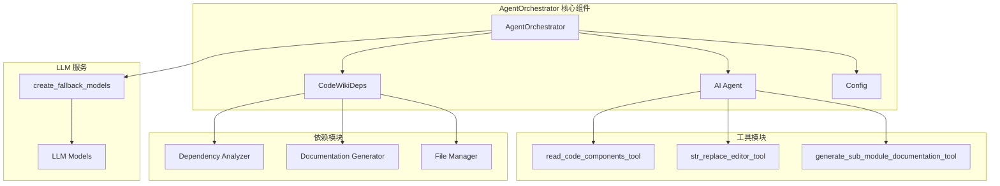
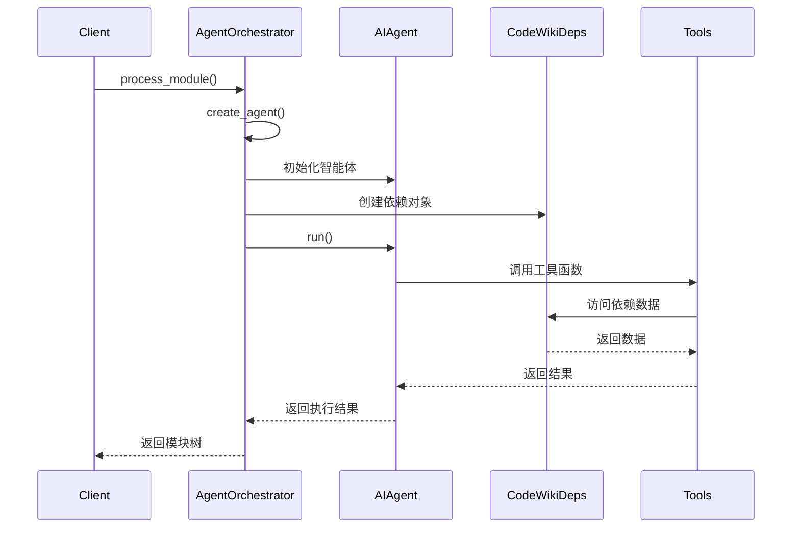
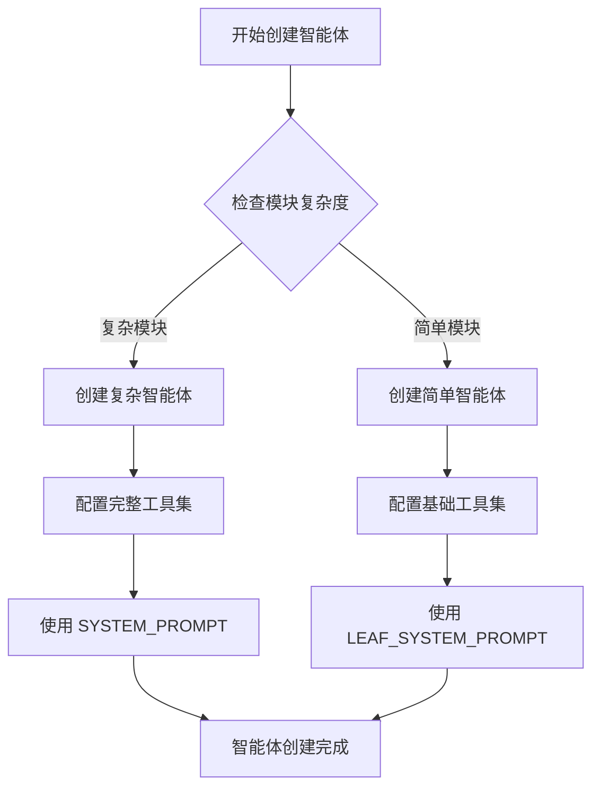

# AgentOrchestrator 模块文档

## 概述

AgentOrchestrator 是 CodeWiki 系统的核心模块，负责协调 AI 智能体进行代码文档的自动生成。该模块通过创建和管理 AI 智能体，分析代码结构，并生成相应的文档内容。

## 核心功能

- **智能体协调**: 根据模块复杂度创建不同类型的 AI 智能体
- **文档生成**: 自动化生成代码文档和模块概述
- **依赖管理**: 管理代码组件间的依赖关系
- **错误处理**: 提供完善的异常处理和日志记录

## 架构设计

### 组件关系图



### 数据流图



## 核心组件详解

### AgentOrchestrator 类

`AgentOrchestrator` 是模块的主要协调器，负责管理整个文档生成流程。

#### 主要方法

1. **__init__(self, config: Config)**
   - 初始化协调器
   - 配置回退模型

2. **create_agent(self, module_name: str, components: Dict[str, Any], core_component_ids: List[str])**
   - 根据模块复杂度创建相应的 AI 智能体
   - 复杂模块使用完整工具集
   - 简单模块使用基础工具集

3. **process_module(self, module_name: str, components: Dict[str, Node], core_component_ids: List[str], module_path: List[str], working_dir: str)**
   - 处理单个模块的文档生成
   - 管理模块树和依赖关系
   - 处理异常情况

### 智能体创建策略



## 依赖关系

### 内部依赖

- **CodeWikiDeps**: 提供智能体运行所需的依赖环境
- **LLM 服务**: 提供 AI 模型支持
- **工具模块**: 提供代码读取、编辑和文档生成功能

### 外部依赖

- **pydantic_ai**: AI 智能体框架
- **logging**: 日志记录系统
- **os**: 操作系统接口

## 配置管理

AgentOrchestrator 通过 Config 对象进行配置，包括：

- 仓库路径配置
- 最大深度限制
- LLM 模型配置
- 其他系统参数

## 错误处理

模块实现了完善的错误处理机制：

1. **异常捕获**: 捕获并记录所有异常
2. **日志记录**: 详细的错误日志和追踪信息
3. **优雅降级**: 在错误情况下提供回退方案

## 使用示例

```python
# 初始化协调器
config = Config(repo_path="/path/to/repo")
orchestrator = AgentOrchestrator(config)

# 处理模块
module_tree = await orchestrator.process_module(
    module_name="example_module",
    components=component_dict,
    core_component_ids=["component1", "component2"],
    module_path=["path", "to", "module"],
    working_dir="/path/to/docs"
)
```

## 相关模块

- [Config](Config.md): 配置管理模块
- [Dependency Analyzer](be_dependency_analyzer.md): 依赖分析模块
- [Agent Tools](be_agent_tools.md): 智能体工具模块
- [LLM Services](LLMServices.md): LLM 服务模块

## 性能考虑

- **异步处理**: 使用异步编程提高并发性能
- **缓存机制**: 避免重复处理已存在的文档
- **资源管理**: 合理管理 LLM 模型资源

## 扩展性

AgentOrchestrator 设计具有良好的扩展性：

- 支持新的工具模块添加
- 可扩展的智能体创建策略
- 灵活的配置选项
- 模块化的架构设计