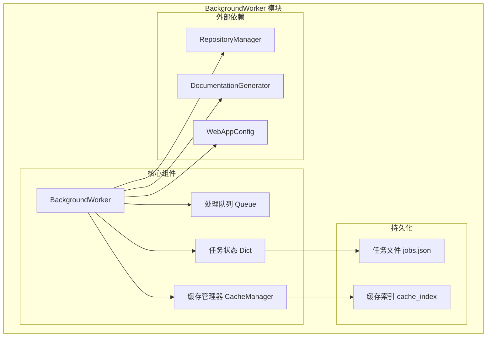
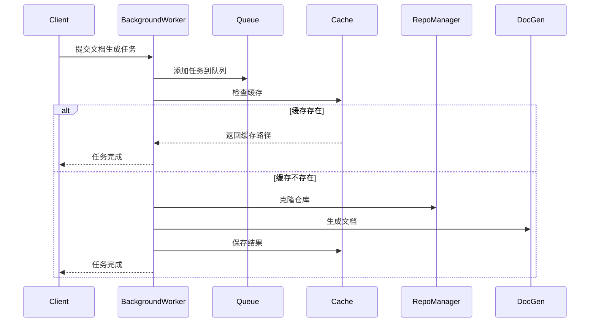
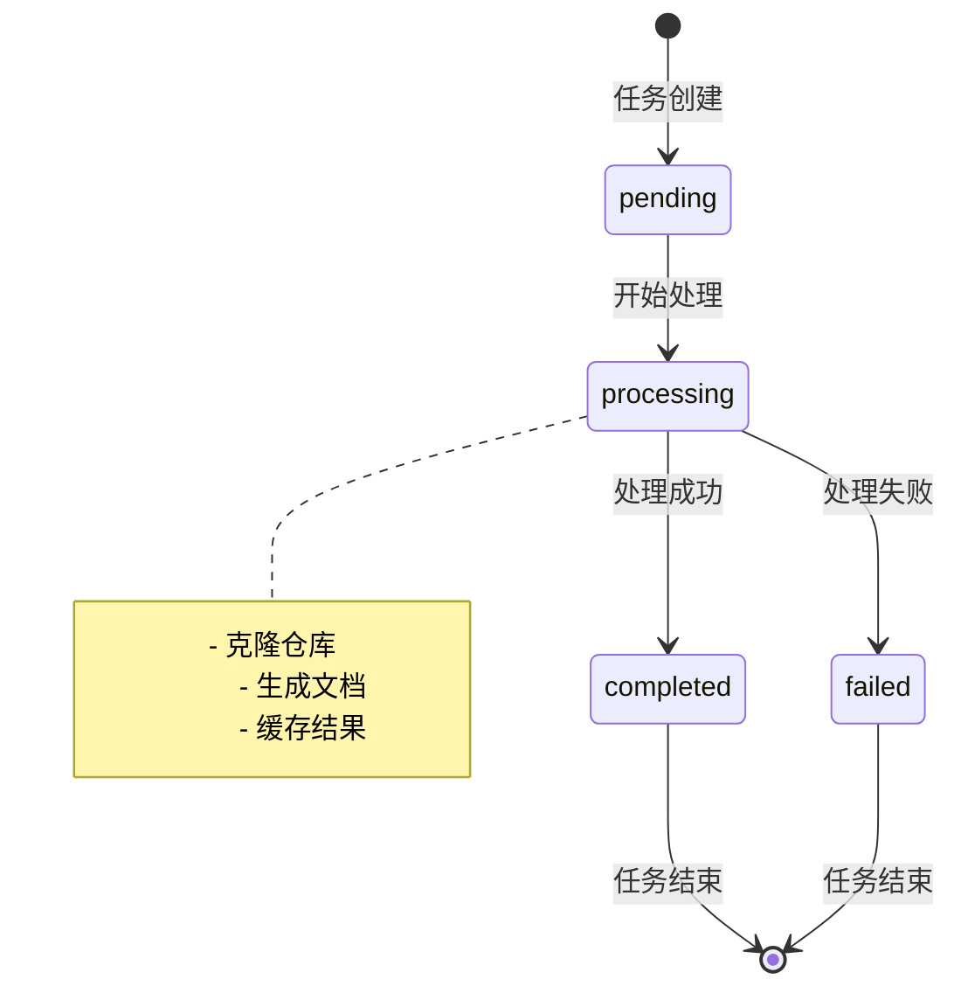
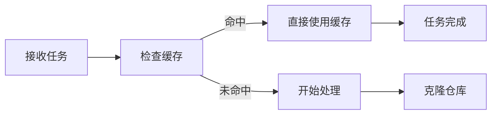
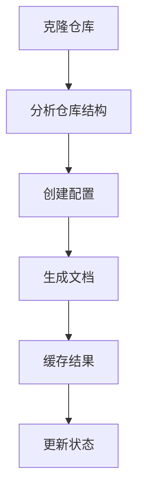
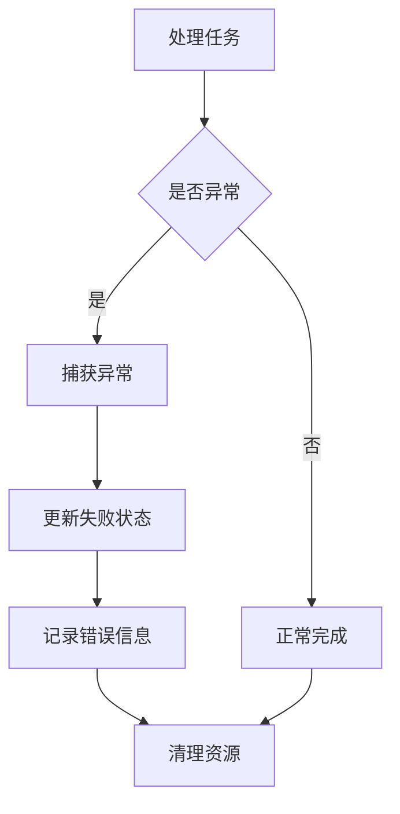

# BackgroundWorker 后台处理模块

## 概述

BackgroundWorker 后台处理模块是 CodeWiki 系统的前端核心组件，负责异步处理文档生成任务。该模块通过队列管理机制，实现了文档生成任务的调度、执行和状态跟踪，确保系统能够高效处理多个并发的文档生成请求。

## 核心功能

### 主要职责
- **任务队列管理**：维护文档生成任务的先进先出队列
- **异步任务处理**：在后台线程中执行文档生成任务
- **状态跟踪**：实时监控和记录任务执行状态
- **缓存集成**：与缓存系统协同，避免重复处理已生成文档
- **错误处理**：完善的异常捕获和错误报告机制
- **资源清理**：自动清理临时文件和目录

### 关键特性
- **线程安全**：使用线程队列确保并发安全
- **持久化存储**：任务状态保存到磁盘，支持系统重启恢复
- **进度反馈**：实时更新任务执行进度
- **智能缓存**：优先使用缓存结果，提升响应速度

## 架构设计

### 组件结构



### 数据流图



### 状态流转



## 核心组件详解

### BackgroundWorker 类

`BackgroundWorker` 是模块的核心类，负责任务调度和执行管理。

#### 主要属性
- `cache_manager`: 缓存管理器实例
- `temp_dir`: 临时文件目录
- `running`: 工作线程运行状态
- `processing_queue`: 任务处理队列
- `job_status`: 任务状态字典
- `jobs_file`: 任务状态持久化文件路径

#### 关键方法

##### 任务管理
```python
def add_job(self, job_id: str, job: JobStatus)
```
添加新任务到处理队列，并更新任务状态。

```python
def get_job_status(self, job_id: str) -> JobStatus
```
获取指定任务的状态信息。

```python
def get_all_jobs(self) -> Dict[str, JobStatus]
```
获取所有任务的状态信息。

##### 持久化操作
```python
def load_job_statuses(self)
```
从磁盘加载任务状态，支持从缓存重建历史任务。

```python
def save_job_statuses(self)
```
将当前任务状态保存到磁盘。

##### 工作线程
```python
def _worker_loop(self)
```
主工作循环，持续处理队列中的任务。

```python
def _process_job(self, job_id: str)
```
处理单个文档生成任务，包括缓存检查、仓库克隆、文档生成和结果缓存。

### 任务处理流程

#### 1. 任务初始化


#### 2. 文档生成


#### 3. 异常处理


## 依赖关系

### 内部依赖
- **[CacheManager 缓存系统](CacheManager 缓存系统.md)**: 文档缓存管理
- **[RepositoryManager 仓库处理器](RepositoryManager 仓库处理器.md)**: 仓库克隆和信息获取
- **[WebAppConfig 配置管理](WebAppConfig 配置管理.md)**: 系统配置参数

### 外部依赖
- **[DocumentationGenerator 文档生成器](DocumentationGenerator 文档生成器.md)**: 核心文档生成逻辑
- **[Config 配置管理](Config 配置管理.md)**: 后端配置管理
- **[FileManager 文件管理](FileManager 文件管理.md)**: 文件操作工具

### 数据模型依赖
- **JobStatus**: 任务状态模型
- **RepositorySubmission**: 仓库提交模型

## 配置参数

### 队列配置
- `QUEUE_SIZE`: 任务队列最大长度
- `TEMP_DIR`: 临时文件目录路径
- `CACHE_DIR`: 缓存文件目录路径

### 处理配置
- 支持自定义临时目录
- 可配置队列大小限制
- 支持任务状态持久化

## 使用示例

### 基本使用
```python
# 初始化后台工作器
cache_manager = CacheManager()
worker = BackgroundWorker(cache_manager)

# 启动工作线程
worker.start()

# 添加任务
job = JobStatus(
    job_id="example--repo",
    repo_url="https://github.com/example/repo",
    status="pending"
)
worker.add_job(job.job_id, job)

# 获取任务状态
status = worker.get_job_status(job.job_id)
```

### 状态监控
```python
# 获取所有任务
all_jobs = worker.get_all_jobs()

# 筛选特定状态的任务
completed_jobs = {k: v for k, v in all_jobs.items() if v.status == 'completed'}
failed_jobs = {k: v for k, v in all_jobs.items() if v.status == 'failed'}
```

## 性能优化

### 缓存策略
- **优先使用缓存**：处理前检查缓存，避免重复生成
- **缓存重建**：支持从缓存索引重建任务历史
- **智能更新**：仅在必要时更新缓存内容

### 资源管理
- **临时清理**：自动清理克隆的仓库目录
- **内存优化**：使用生成器模式处理大文件
- **线程池**：支持多线程并发处理

### 错误恢复
- **状态持久化**：定期保存任务状态
- **异常隔离**：单个任务失败不影响其他任务
- **重试机制**：支持失败任务的重试处理

## 监控与调试

### 日志记录
- 任务开始/完成日志
- 错误信息和堆栈跟踪
- 性能指标记录

### 状态监控
- 实时任务状态查询
- 队列长度监控
- 处理时间统计

### 调试工具
- 任务状态导出
- 缓存内容检查
- 临时文件清理

## 最佳实践

### 任务提交
1. **合理设置任务ID**：使用仓库全名作为任务ID
2. **状态初始化**：确保任务初始状态正确设置
3. **错误处理**：准备处理任务失败的情况

### 性能调优
1. **队列大小**：根据系统负载调整队列长度
2. **缓存策略**：合理配置缓存过期时间
3. **资源限制**：设置合适的临时目录大小限制

### 运维建议
1. **定期清理**：清理过期任务和缓存
2. **监控告警**：设置任务失败告警
3. **备份策略**：定期备份任务状态文件

## 常见问题

### Q: 任务长时间处于 processing 状态？
A: 检查后台工作线程是否正常运行，查看是否有异常日志。

### Q: 缓存未命中但文档已生成？
A: 检查缓存管理器配置，确认缓存路径和权限设置正确。

### Q: 临时文件占用过多磁盘空间？
A: 检查资源清理逻辑，确保异常情况下也能正确清理临时文件。

## 扩展开发

### 自定义处理器
可以通过继承 BackgroundWorker 类实现自定义的任务处理逻辑：

```python
class CustomBackgroundWorker(BackgroundWorker):
    def _process_job(self, job_id: str):
        # 自定义处理逻辑
        super()._process_job(job_id)
```

### 插件集成
支持集成第三方插件扩展功能：
- 自定义缓存后端
- 额外的任务状态跟踪
- 性能监控集成

---

*本文档基于 CodeWiki 系统的 BackgroundWorker 模块自动生成，用于帮助开发者理解和使用后台处理功能。*