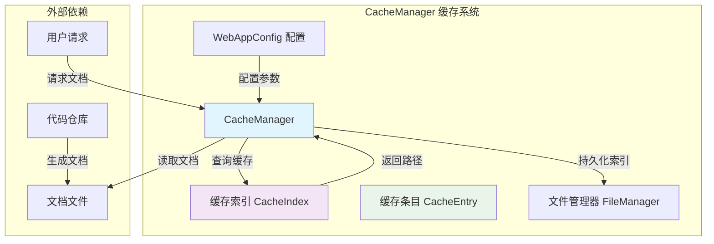
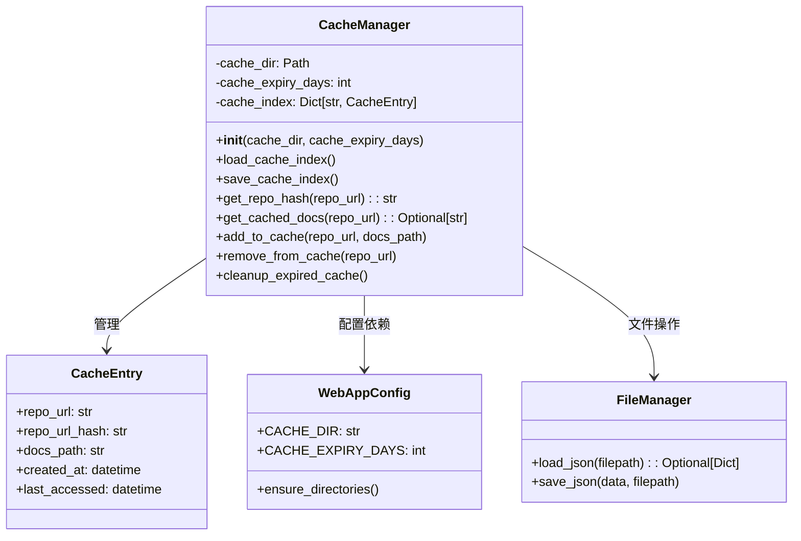
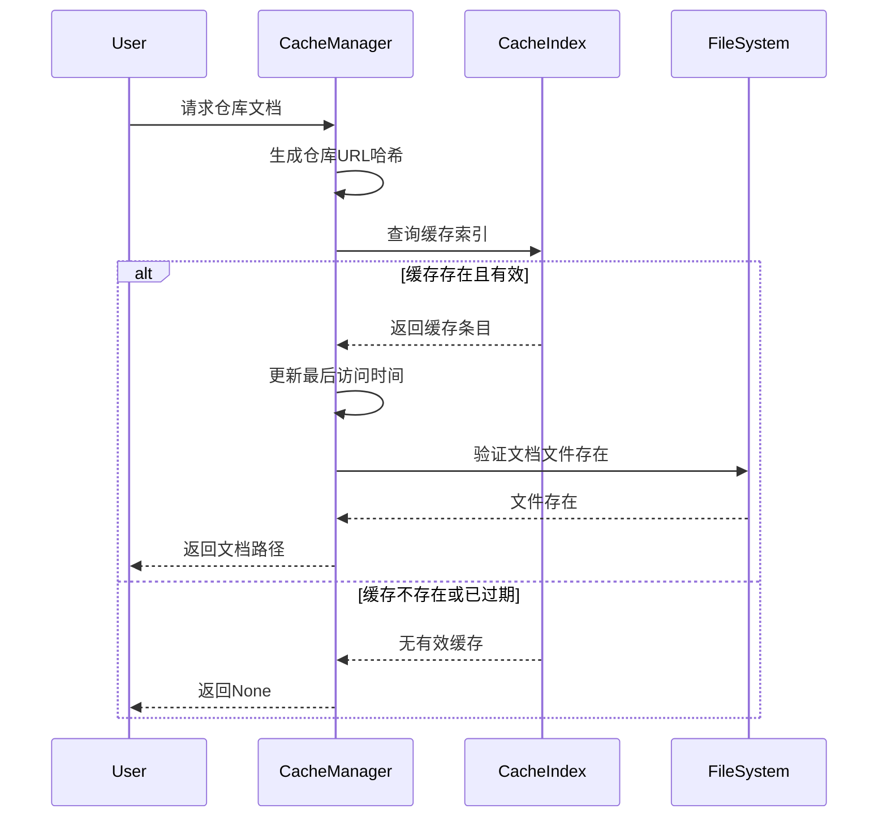
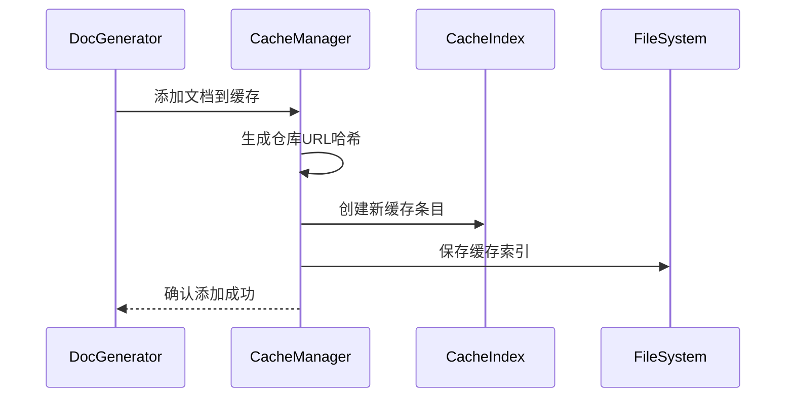

# CacheManager 缓存系统

## 概述

CacheManager 缓存系统是 CodeWiki 前端 Web 应用的核心组件，专门用于管理文档生成结果的缓存。该系统通过智能缓存机制显著提高文档生成效率，避免重复处理相同的代码仓库，从而优化系统性能和用户体验。

缓存系统采用基于仓库 URL 的哈希索引机制，支持缓存过期管理、自动清理和持久化存储，确保缓存数据的有效性和系统资源的合理利用。

## 核心功能

### 1. 智能缓存管理
- **URL 哈希索引**：基于仓库 URL 生成唯一哈希值作为缓存键
- **缓存过期控制**：支持可配置的缓存有效期（默认 365 天）
- **自动清理机制**：定期清理过期缓存条目
- **访问时间跟踪**：记录缓存项的创建和最后访问时间

### 2. 缓存持久化
- **索引文件存储**：将缓存索引保存为 JSON 文件
- **断电恢复**：系统重启后自动加载缓存索引
- **数据完整性**：确保缓存元数据的安全存储

### 3. 性能优化
- **内存索引**：在内存中维护缓存索引以提高查询速度
- **延迟加载**：仅在需要时加载缓存索引
- **批量操作**：支持批量缓存清理操作

## 架构设计

### 系统架构图



### 组件关系图



## 数据流设计

### 缓存查询流程



### 缓存添加流程



## 核心组件详解

### CacheManager 类

CacheManager 是整个缓存系统的核心管理器，负责缓存生命周期的所有操作。

#### 主要属性
- **cache_dir**: 缓存目录路径
- **cache_expiry_days**: 缓存有效期（天）
- **cache_index**: 内存中的缓存索引字典

#### 关键方法

##### 初始化与配置
```python
def __init__(self, cache_dir: str = None, cache_expiry_days: int = None):
    """初始化缓存管理器，设置缓存目录和过期时间。"""
```

##### 缓存查询
```python
def get_cached_docs(self, repo_url: str) -> Optional[str]:
    """根据仓库URL查询缓存的文档路径。
    
    返回：
        如果缓存存在且有效，返回文档路径；否则返回None
    """
```

##### 缓存管理
```python
def add_to_cache(self, repo_url: str, docs_path: str):
    """将生成的文档添加到缓存中。"""

def remove_from_cache(self, repo_url: str):
    """从缓存中移除指定仓库的文档。"""

def cleanup_expired_cache(self):
    """清理所有过期的缓存条目。"""
```

### CacheEntry 数据模型

CacheEntry 表示一个缓存条目，包含缓存的元数据信息。

```python
class CacheEntry:
    """表示缓存的文档结果。"""
    repo_url: str              # 仓库URL
    repo_url_hash: str         # URL哈希值
    docs_path: str             # 文档存储路径
    created_at: datetime      # 创建时间
    last_accessed: datetime    # 最后访问时间
```

## 缓存策略

### 1. 哈希索引策略
- 使用 SHA-256 算法生成仓库 URL 的哈希值
- 取哈希值前 16 个字符作为缓存键，平衡了唯一性和可读性
- 避免直接存储完整 URL，提高索引效率

### 2. 过期策略
- 基于创建时间的固定有效期策略
- 默认有效期为 365 天，可通过配置调整
- 访问缓存不会延长有效期，确保数据的时效性

### 3. 清理策略
- 惰性清理：在查询时检查缓存是否过期
- 主动清理：提供批量清理过期缓存的方法
- 索引维护：清理后自动更新缓存索引文件

## 配置管理

缓存系统通过 [WebAppConfig 配置管理](WebAppConfig 配置管理.md) 获取配置参数：

```python
# 缓存相关配置
CACHE_DIR = "./output/cache"      # 缓存目录
CACHE_EXPIRY_DAYS = 365           # 缓存有效期（天）
```

## 错误处理

### 异常情况处理
1. **索引文件损坏**：捕获异常并重新创建索引
2. **文件系统错误**：打印错误信息但不中断服务
3. **权限问题**：确保缓存目录有适当的写入权限

### 容错机制
- 索引加载失败时继续运行，只是缓存为空
- 索引保存失败时打印警告但不影响缓存操作
- 文件系统操作都有异常处理

## 性能优化

### 1. 内存优化
- 仅在需要时加载缓存索引
- 定期清理过期条目减少内存占用
- 使用字典结构提供 O(1) 的查询复杂度

### 2. I/O 优化
- 批量操作减少文件系统访问次数
- 索引文件采用 JSON 格式便于读写
- 延迟保存策略减少写入频率

### 3. 查询优化
- 内存索引避免每次都读取文件
- 哈希索引提供快速键值查找
- 缓存验证最小化文件系统检查

## 使用示例

### 基本使用
```python
# 创建缓存管理器
cache_manager = CacheManager()

# 查询缓存
cached_path = cache_manager.get_cached_docs("https://github.com/user/repo")
if cached_path:
    print(f"使用缓存文档: {cached_path}")
else:
    # 生成新文档
    docs_path = generate_docs(repo_url)
    cache_manager.add_to_cache(repo_url, docs_path)
```

### 缓存清理
```python
# 清理过期缓存
cache_manager.cleanup_expired_cache()

# 移除特定仓库缓存
cache_manager.remove_from_cache("https://github.com/user/repo")
```

## 集成关系

### 与前端系统的集成
缓存系统作为 [fe_web_core 前端核心](fe_web_core 前端核心.md) 模块的重要组成部分，为整个 Web 应用提供缓存服务。

### 与文档生成的集成
与 [cli_doc_pipeline 文档生成管道](cli_doc_pipeline 文档生成管道.md) 协同工作，缓存生成的文档结果，避免重复生成。

### 与仓库处理的集成
配合 [fe_repo_processors 仓库处理器](fe_repo_processors 仓库处理器.md) 使用，为不同来源的仓库提供统一的缓存管理。

## 扩展性考虑

### 1. 分布式缓存支持
当前设计支持单机缓存，未来可考虑：
- Redis 等分布式缓存支持
- 多级缓存架构
- 缓存同步机制

### 2. 缓存策略扩展
- 支持 LRU、LFU 等高级缓存策略
- 基于仓库大小的智能缓存
- 用户自定义缓存规则

### 3. 监控和统计
- 缓存命中率统计
- 缓存大小监控
- 性能指标收集

## 最佳实践

### 1. 配置建议
- 根据服务器存储容量设置合适的缓存目录
- 根据文档更新频率调整缓存有效期
- 定期执行缓存清理操作

### 2. 使用建议
- 总是先检查缓存再生成文档
- 合理设置缓存目录权限
- 监控缓存使用情况

### 3. 维护建议
- 定期备份重要缓存数据
- 监控磁盘空间使用情况
- 及时处理缓存相关错误日志