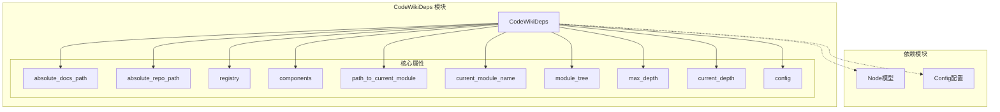
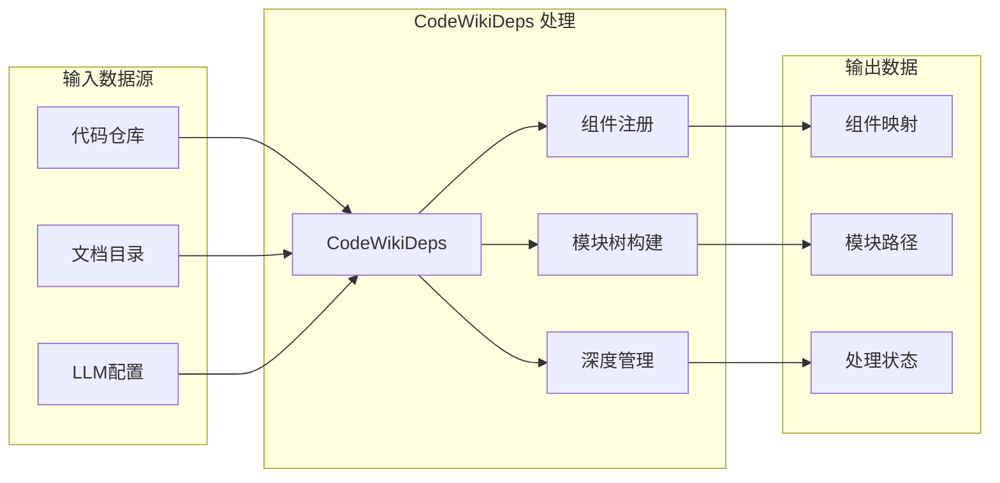
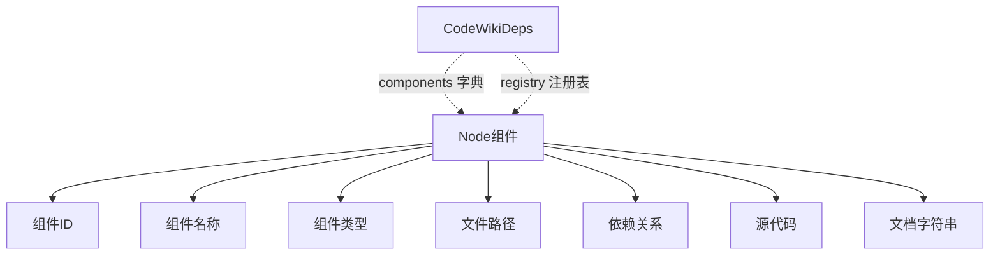
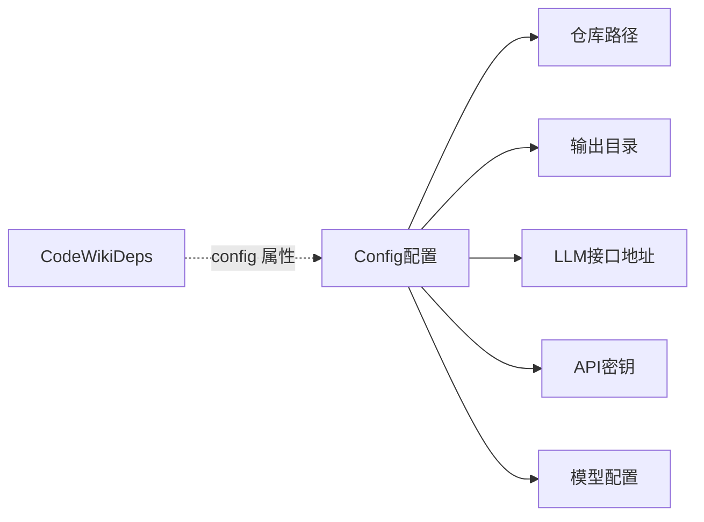
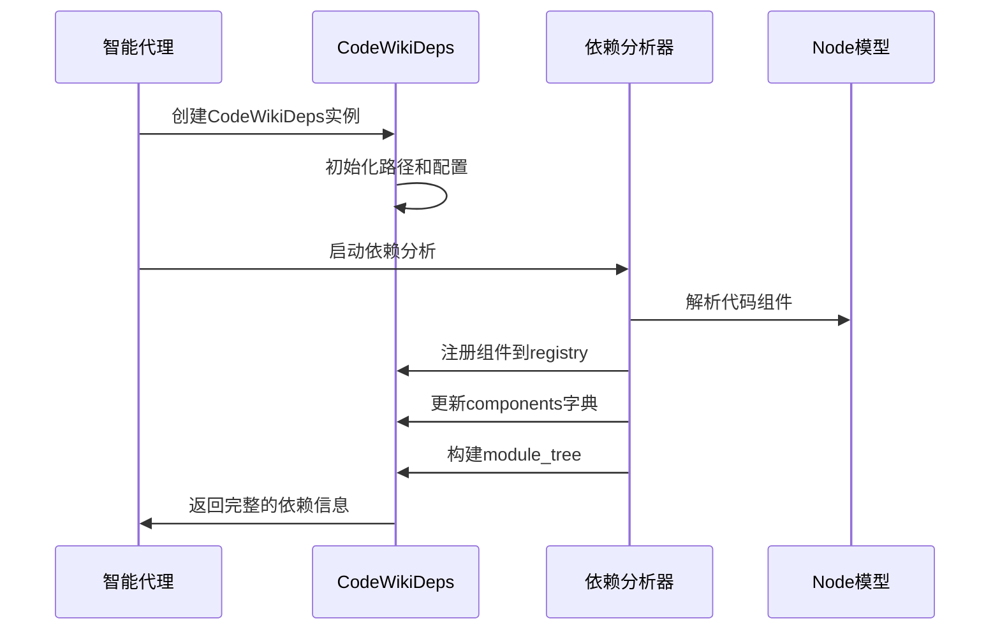
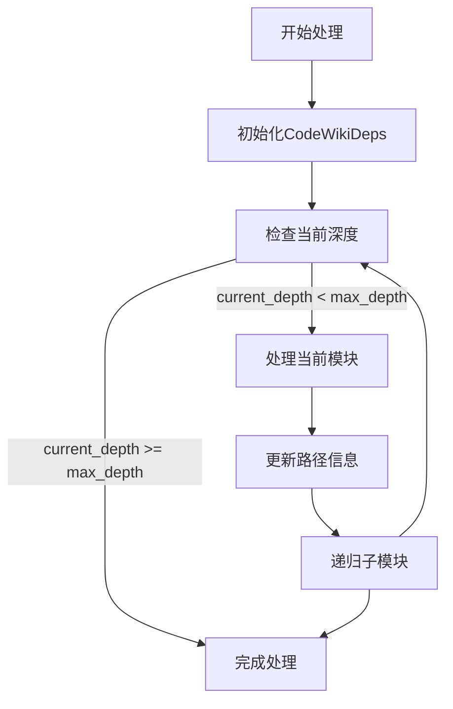

# CodeWikiDeps 模块文档

## 概述

CodeWikiDeps 是 CodeWiki 系统的核心依赖管理模块，负责在代码分析和文档生成过程中维护组件依赖关系、模块结构和处理状态。该模块为智能代理提供了访问代码库依赖信息、组件注册表和模块树的核心接口。

## 核心功能

### 1. 依赖关系管理
- 维护代码组件之间的依赖关系图
- 提供组件注册和查找机制
- 支持模块路径追踪和当前模块状态管理

### 2. 模块结构维护
- 构建和管理模块树结构
- 维护当前处理模块的上下文信息
- 支持深度控制和递归处理限制

### 3. 配置集成
- 集成 LLM 配置信息
- 管理文档和代码仓库路径
- 提供统一的配置访问接口

## 核心组件

### CodeWikiDeps 类

```python
@dataclass
class CodeWikiDeps:
    absolute_docs_path: str      # 绝对文档路径
    absolute_repo_path: str     # 绝对代码仓库路径
    registry: dict              # 组件注册表
    components: dict[str, Node] # 组件字典，键为组件ID，值为Node对象
    path_to_current_module: list[str]  # 当前模块路径
    current_module_name: str    # 当前模块名称
    module_tree: dict[str, any] # 模块树结构
    max_depth: int              # 最大处理深度
    current_depth: int          # 当前处理深度
    config: Config              # LLM配置对象
```

## 架构设计

### 模块架构图



### 数据流图



## 组件关系

### 与 Node 模型的关系
CodeWikiDeps 使用 Node 模型来表示代码组件，每个 Node 包含以下关键信息：



### 与 Config 配置的关系
CodeWikiDeps 集成 Config 对象以获取系统配置：



## 使用场景

### 1. 代码分析阶段
在依赖分析过程中，CodeWikiDeps 用于：
- 存储解析出的代码组件
- 维护组件间的依赖关系
- 跟踪当前分析的模块位置

### 2. 文档生成阶段
在文档生成过程中，CodeWikiDeps 提供：
- 组件查找和访问接口
- 模块结构信息
- 处理深度控制

### 3. 智能代理交互
智能代理通过 CodeWikiDeps：
- 获取当前处理的模块信息
- 查询组件依赖关系
- 访问配置参数

## 处理流程

### 依赖分析流程



### 模块遍历流程



## 相关模块

### 上游依赖
- [Node模型](be_dependency_analyzer.md)：代码组件的数据模型
- [Config配置](be_config.md)：系统配置管理

### 下游使用
- [AgentOrchestrator](be_agent_tools.md)：智能代理调度器
- [依赖分析器](be_dependency_analyzer.md)：代码依赖关系分析

## 最佳实践

### 1. 初始化建议
```python
# 创建配置对象
config = Config.from_cli(
    repo_path="/path/to/repo",
    output_dir="/path/to/output",
    llm_base_url="https://api.example.com",
    llm_api_key="your-api-key",
    main_model="gpt-4",
    cluster_model="text-embedding-3-small"
)

# 初始化CodeWikiDeps
deps = CodeWikiDeps(
    absolute_docs_path="/path/to/docs",
    absolute_repo_path="/path/to/repo",
    registry={},
    components={},
    path_to_current_module=[],
    current_module_name="root",
    module_tree={},
    max_depth=5,
    current_depth=0,
    config=config
)
```

### 2. 组件注册
```python
# 注册新组件
def register_component(deps: CodeWikiDeps, node: Node):
    deps.components[node.id] = node
    deps.registry[node.component_type] = deps.registry.get(node.component_type, [])
    deps.registry[node.component_type].append(node.id)
```

### 3. 路径管理
```python
# 进入子模块
def enter_module(deps: CodeWikiDeps, module_name: str):
    deps.path_to_current_module.append(module_name)
    deps.current_module_name = module_name
    deps.current_depth += 1

# 退出模块
def exit_module(deps: CodeWikiDeps):
    if deps.path_to_current_module:
        deps.path_to_current_module.pop()
        deps.current_module_name = deps.path_to_current_module[-1] if deps.path_to_current_module else "root"
        deps.current_depth -= 1
```

## 注意事项

1. **深度控制**：max_depth 参数用于防止无限递归，应根据代码库规模合理设置
2. **路径管理**：path_to_current_module 应准确反映当前处理的模块层次结构
3. **组件唯一性**：确保组件ID在全局范围内唯一，避免注册冲突
4. **配置一致性**：config 对象应与系统其他部分保持配置一致
5. **内存管理**：对于大型代码库，注意 components 字典的内存占用

## 扩展性

CodeWikiDeps 设计为可扩展的依赖管理框架，支持：
- 自定义组件类型注册
- 灵活的模块树结构
- 可配置的处理深度
- 多种依赖关系模型

通过合理的设计，可以适应不同规模和类型的代码库分析需求。