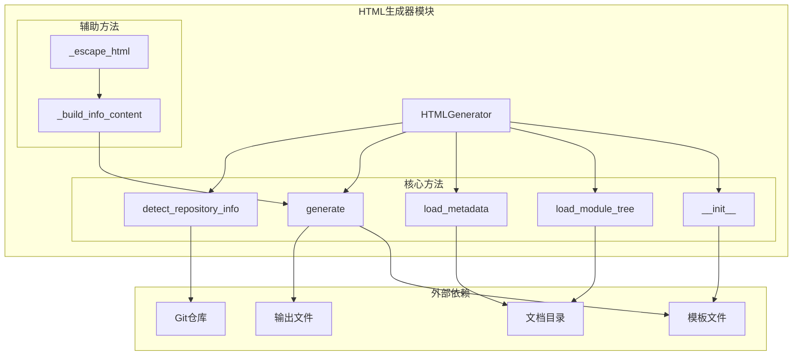
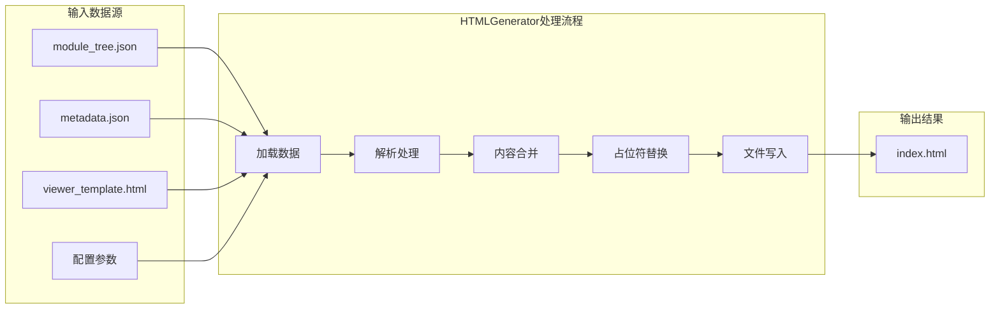
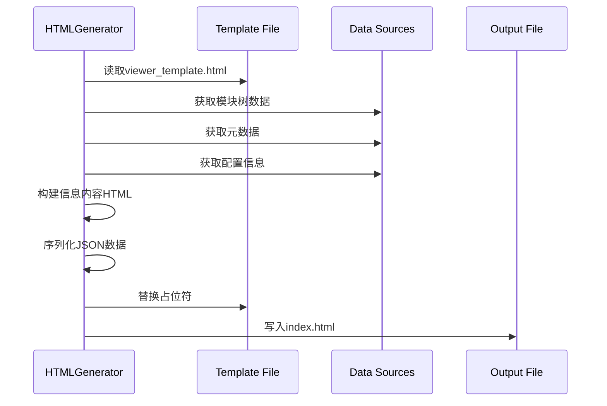
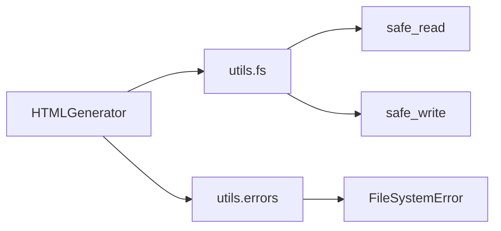

# HTML生成器模块文档

## 概述

HTML生成器模块是CodeWiki文档系统的核心组件之一，负责生成静态HTML文档查看器，用于在GitHub Pages上展示代码文档。该模块通过将模块树、元数据和配置信息嵌入到自包含的HTML文件中，创建了一个功能完整的客户端文档浏览器。

## 核心功能

### 主要特性
- **静态HTML生成**：创建自包含的index.html文件，包含嵌入式样式、脚本和配置
- **模块树集成**：自动加载和嵌入模块树结构，支持文档导航
- **元数据处理**：解析和展示文档生成元数据（模型信息、时间戳、统计信息等）
- **GitHub Pages优化**：针对GitHub Pages部署进行路径和链接优化
- **模板系统**：支持自定义HTML模板，提供灵活的输出格式

### 核心组件

#### HTMLGenerator类
```python
codewiki.cli.html_generator.HTMLGenerator
```

HTML生成器的主要类，负责协调整个HTML文档生成过程。

**主要职责：**
- 模板加载和管理
- 模块树和元数据解析
- HTML内容生成和占位符替换
- 输出文件写入

## 架构设计

### 系统架构图



### 数据流图



## 组件详解

### HTMLGenerator类

#### 初始化方法
```python
def __init__(self, template_dir: Optional[Path] = None)
```

**功能说明：**
初始化HTML生成器实例，设置模板目录路径。

**参数说明：**
- `template_dir`: 模板目录路径，默认为包内的templates/github_pages目录

#### 模块树加载方法
```python
def load_module_tree(self, docs_dir: Path) -> Dict[str, Any]
```

**功能说明：**
从文档目录加载模块树结构，支持文档的层级导航。

**处理逻辑：**
1. 检查module_tree.json文件是否存在
2. 如果文件不存在，返回默认的简单结构
3. 读取并解析JSON内容
4. 处理解析异常，抛出FileSystemError

#### 元数据加载方法
```python
def load_metadata(self, docs_dir: Path) -> Optional[Dict[str, Any]]
```

**功能说明：**
加载文档生成的元数据信息，用于展示在HTML页面中。

**元数据内容：**
- 生成模型信息（main_model）
- 时间戳（timestamp）
- 提交ID（commit_id）
- 统计信息（组件数量、最大深度等）

#### 主生成方法
```python
def generate(self, output_path: Path, title: str, ...)
```

**功能说明：**
生成完整的HTML文档查看器，是模块的核心方法。

**处理流程：**
1. **数据准备**：自动加载模块树和元数据（如果未提供）
2. **模板加载**：读取viewer_template.html模板文件
3. **内容构建**：生成信息展示内容和仓库链接
4. **路径计算**：确定文档基础路径，支持GitHub Pages部署
5. **数据序列化**：将配置、模块树、元数据转换为JSON格式
6. **占位符替换**：替换模板中的变量占位符
7. **文件输出**：写入最终的index.html文件

#### 仓库信息检测方法
```python
def detect_repository_info(self, repo_path: Path) -> Dict[str, Optional[str]]
```

**功能说明：**
通过Git仓库检测项目信息，用于自动生成仓库链接和GitHub Pages URL。

**检测内容：**
- 仓库名称（目录名）
- 远程仓库URL（支持GitHub SSH和HTTPS格式）
- GitHub Pages URL（基于GitHub仓库自动生成）

## 模板系统

### 模板结构

HTML生成器使用预定义的模板文件，位于`templates/github_pages/viewer_template.html`。模板包含以下占位符：

| 占位符 | 说明 | 示例 |
|--------|------|------|
| {{TITLE}} | 文档标题 | "My Project Documentation" |
| {{REPO_LINK}} | 仓库链接HTML | `<a href="...">🔗 View Repository</a>` |
| {{SHOW_INFO}} | 信息面板显示状态 | "block" 或 "none" |
| {{INFO_CONTENT}} | 信息面板内容 | 生成的统计信息HTML |
| {{CONFIG_JSON}} | 配置JSON数据 | 嵌入式JavaScript对象 |
| {{MODULE_TREE_JSON}} | 模块树JSON数据 | 层级结构数据 |
| {{METADATA_JSON}} | 元数据JSON | 生成信息统计 |
| {{DOCS_BASE_PATH}} | 文档基础路径 | "docs" 或 "." |

### 模板处理流程



## 配置与集成

### 基本使用示例

```python
from pathlib import Path
from codewiki.cli.html_generator import HTMLGenerator

# 创建生成器实例
generator = HTMLGenerator()

# 生成HTML文档
generator.generate(
    output_path=Path("docs/index.html"),
    title="My Project Documentation",
    docs_dir=Path("docs"),
    repository_url="https://github.com/user/repo"
)
```

### 高级配置

```python
# 自定义配置
config = {
    "theme": "dark",
    "navigation": {
        "collapsed": False,
        "search_enabled": True
    }
}

# 手动提供模块树和元数据
generator.generate(
    output_path=Path("output/index.html"),
    title="Custom Documentation",
    module_tree={"modules": {...}},
    metadata={"generation_info": {...}},
    config=config,
    github_pages_url="https://user.github.io/repo/"
)
```

## 错误处理

### 异常类型

HTML生成器模块定义了以下异常处理机制：

- **FileSystemError**: 文件系统操作失败时抛出
- **JSON解析异常**: 模块树或元数据文件格式错误时处理
- **模板文件缺失**: 模板文件不存在时抛出FileSystemError

### 容错机制

- **模块树缺失**: 使用默认的简单结构继续生成
- **元数据缺失**: 信息面板自动隐藏，不影响主要功能
- **Git仓库检测失败**: 返回默认信息，不影响HTML生成

## 依赖关系

### 内部依赖



### 外部依赖

- **Path**: Python pathlib模块，用于路径操作
- **json**: Python标准库，用于JSON序列化
- **git**: GitPython库（可选），用于仓库信息检测

## 性能优化

### 内存管理

- **流式处理**: 大文件使用流式读取，避免内存溢出
- **及时清理**: 处理完成后及时释放大字符串对象
- **JSON序列化优化**: 使用indent参数提高可读性

### 缓存策略

- **模板缓存**: 模板文件在初始化时加载，避免重复读取
- **数据复用**: 支持外部传入模块树和元数据，避免重复加载

## 扩展性

### 模板扩展

通过修改viewer_template.html模板文件，可以：
- 自定义页面样式和布局
- 添加新的功能模块
- 集成第三方JavaScript库

### 数据格式扩展

模块树和元数据结构支持自定义字段：
- 添加新的统计维度
- 扩展组件属性
- 自定义展示内容

## 相关模块

HTML生成器模块与以下模块紧密协作：

- **[文档生成适配器](文档生成适配器.md)**: 提供文档生成结果
- **[作业模型](作业模型.md)**: 提供生成配置和状态信息
- **[进度跟踪器](进度跟踪器.md)**: 监控生成进度

## 最佳实践

### 使用建议

1. **路径管理**: 使用绝对路径避免路径解析问题
2. **错误处理**: 捕获FileSystemError并记录详细日志
3. **模板备份**: 修改模板前创建备份，便于回滚
4. **性能监控**: 大项目生成时监控内存使用情况

### 部署建议

1. **GitHub Pages**: 确保仓库设置中启用了GitHub Pages功能
2. **路径配置**: 正确设置docs_base_path，确保资源加载
3. **缓存策略**: 利用浏览器缓存提高加载速度
4. **CDN加速**: 可考虑使用CDN加速静态资源访问