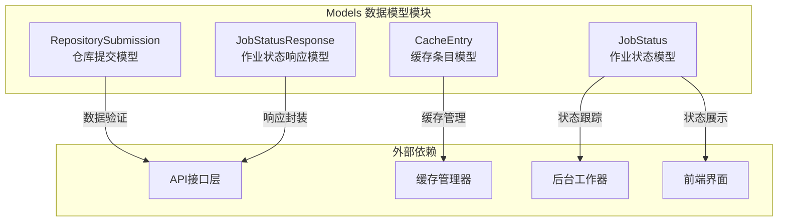
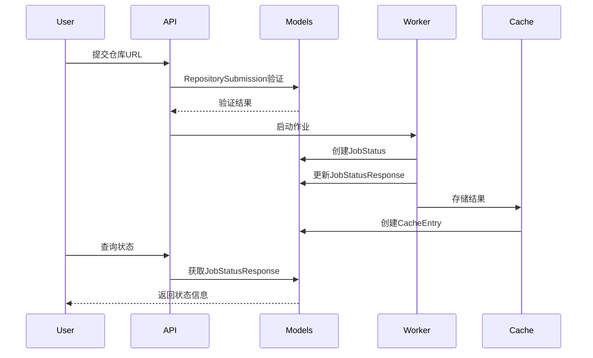
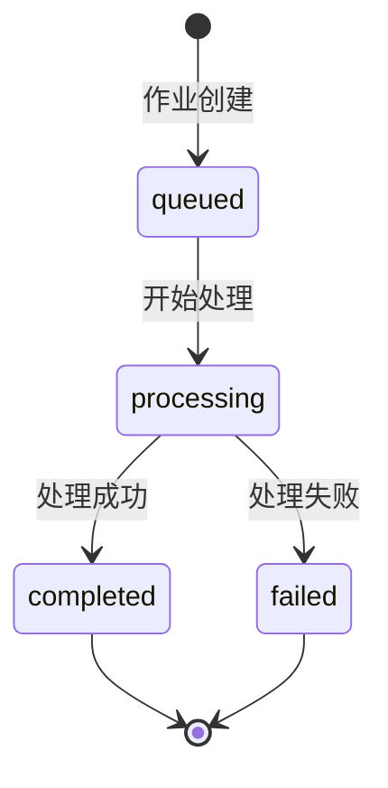
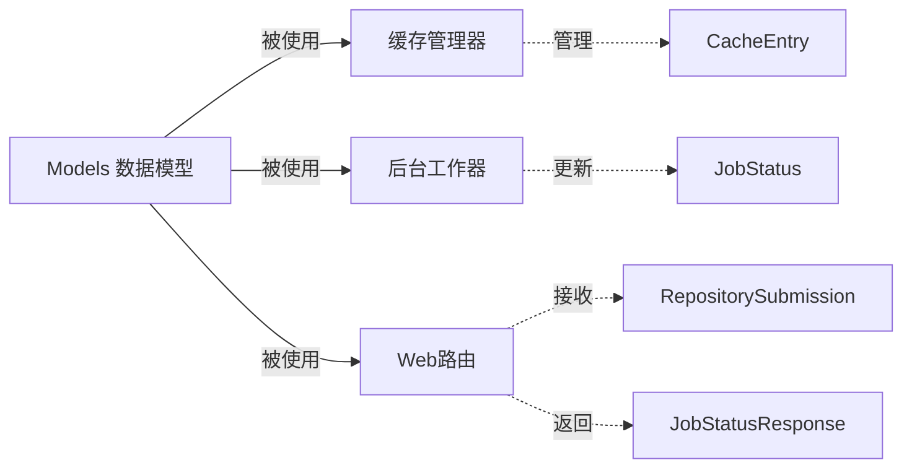

# Models 数据模型模块

## 概述

Models 数据模型模块是 CodeWiki 前端系统的核心组件之一，负责定义和管理整个系统中使用的数据结构。该模块提供了作业状态管理、缓存条目、仓库提交等关键数据模型，为前端应用的数据流转和业务逻辑提供基础支撑。

## 核心功能

- **作业状态管理**：跟踪文档生成作业的生命周期状态
- **缓存数据模型**：定义缓存条目的数据结构
- **仓库提交模型**：处理仓库URL提交的数据验证
- **API响应模型**：标准化API响应的数据格式

## 架构设计

### 组件架构图



### 数据流图



## 核心组件详解

### 1. RepositorySubmission 仓库提交模型

**功能描述**：用于验证和处理用户提交的仓库URL数据。

**属性说明**：
- `repo_url`: HttpUrl类型，自动验证URL格式的有效性

**使用场景**：
- 用户通过前端界面提交仓库URL时
- API接收仓库处理请求时

**代码示例**：
```python
# 使用示例
submission = RepositorySubmission(repo_url="https://github.com/user/repo")
# 自动验证URL格式，无效URL将抛出验证错误
```

### 2. JobStatusResponse 作业状态响应模型

**功能描述**：为API响应提供标准化的作业状态数据结构。

**属性说明**：
- `job_id`: 作业唯一标识符
- `repo_url`: 关联的仓库URL
- `status`: 作业状态（queued/processing/completed/failed）
- `created_at`: 作业创建时间
- `started_at`: 作业开始处理时间（可选）
- `completed_at`: 作业完成时间（可选）
- `error_message`: 错误信息（失败时）
- `progress`: 进度信息
- `docs_path`: 生成文档的路径
- `main_model`: 使用的主要模型
- `commit_id`: 关联的提交ID

**使用场景**：
- API返回作业状态查询结果
- 前端展示作业进度信息

### 3. JobStatus 作业状态模型

**功能描述**：在系统内部跟踪和管理文档生成作业的生命周期。

**设计特点**：
- 使用 `@dataclass` 装饰器，简化数据类定义
- 与 `JobStatusResponse` 保持属性一致性
- 支持状态流转的完整时间线记录

**状态流转**：


### 4. CacheEntry 缓存条目模型

**功能描述**：定义缓存系统中存储的文档生成结果的数据结构。

**属性说明**：
- `repo_url`: 原始仓库URL
- `repo_url_hash`: 仓库URL的哈希值，用于快速查找
- `docs_path`: 生成文档的存储路径
- `created_at`: 缓存创建时间
- `last_accessed`: 最后访问时间

**设计优势**：
- 通过哈希值实现快速缓存查找
- 记录访问时间支持缓存淘汰策略
- 分离URL和路径信息，提高安全性

## 模块依赖关系



## 使用示例

### 1. 作业状态管理

```python
from codewiki.src.fe.models import JobStatus
from datetime import datetime

# 创建新的作业状态
job = JobStatus(
    job_id="job_123",
    repo_url="https://github.com/user/repo",
    status="queued",
    created_at=datetime.now()
)

# 更新作业状态
job.status = "processing"
job.started_at = datetime.now()
```

### 2. 缓存条目管理

```python
from codewiki.src.fe.models import CacheEntry
import hashlib

# 创建缓存条目
cache_entry = CacheEntry(
    repo_url="https://github.com/user/repo",
    repo_url_hash=hashlib.md5("https://github.com/user/repo".encode()).hexdigest(),
    docs_path="/cache/docs/repo_123",
    created_at=datetime.now(),
    last_accessed=datetime.now()
)
```

### 3. API数据验证

```python
from codewiki.src.fe.models import RepositorySubmission, JobStatusResponse

# 验证仓库提交
try:
    submission = RepositorySubmission(repo_url=user_input_url)
    # 验证通过，继续处理
except ValidationError as e:
    # 处理验证错误
    return {"error": "Invalid URL format"}

# 构建响应
response = JobStatusResponse(
    job_id=job.job_id,
    repo_url=job.repo_url,
    status=job.status,
    created_at=job.created_at,
    # ... 其他字段
)
```

## 最佳实践

### 1. 数据验证
- 始终使用 Pydantic 模型进行输入验证
- 利用类型提示提高代码可读性和可维护性
- 对可选字段使用 `Optional` 类型注解

### 2. 状态管理
- 使用枚举类型定义状态值，避免硬编码字符串
- 记录完整的时间线信息，便于问题排查
- 及时更新状态，确保用户获得准确的进度信息

### 3. 缓存策略
- 合理设置缓存条目的生命周期
- 定期更新最后访问时间，支持LRU淘汰策略
- 使用哈希值作为缓存键，提高查找效率

## 扩展性考虑

### 1. 模型扩展
- 支持自定义字段扩展，满足不同业务需求
- 提供模型版本管理，支持平滑升级
- 考虑向后兼容性，避免破坏性变更

### 2. 性能优化
- 对频繁访问的模型考虑使用缓存
- 合理使用索引，提高查询效率
- 支持异步序列化，提高并发处理能力

## 相关模块

- [缓存管理器](CacheManager 缓存系统.md)：使用本模块定义的 CacheEntry 模型
- [后台工作器](BackgroundWorker 后台处理.md)：使用 JobStatus 跟踪作业状态
- [Web路由系统](WebRoutes 路由系统.md)：使用 RepositorySubmission 和 JobStatusResponse 处理API请求

## 总结

Models 数据模型模块作为 CodeWiki 前端系统的数据基础，通过清晰的数据结构定义和严格的类型验证，为整个系统提供了可靠的数据支撑。模块设计遵循单一职责原则，每个模型专注于特定的业务领域，同时保持适当的灵活性以支持未来的功能扩展。