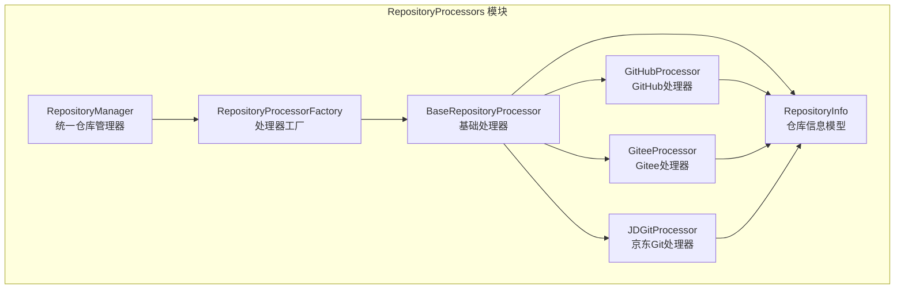
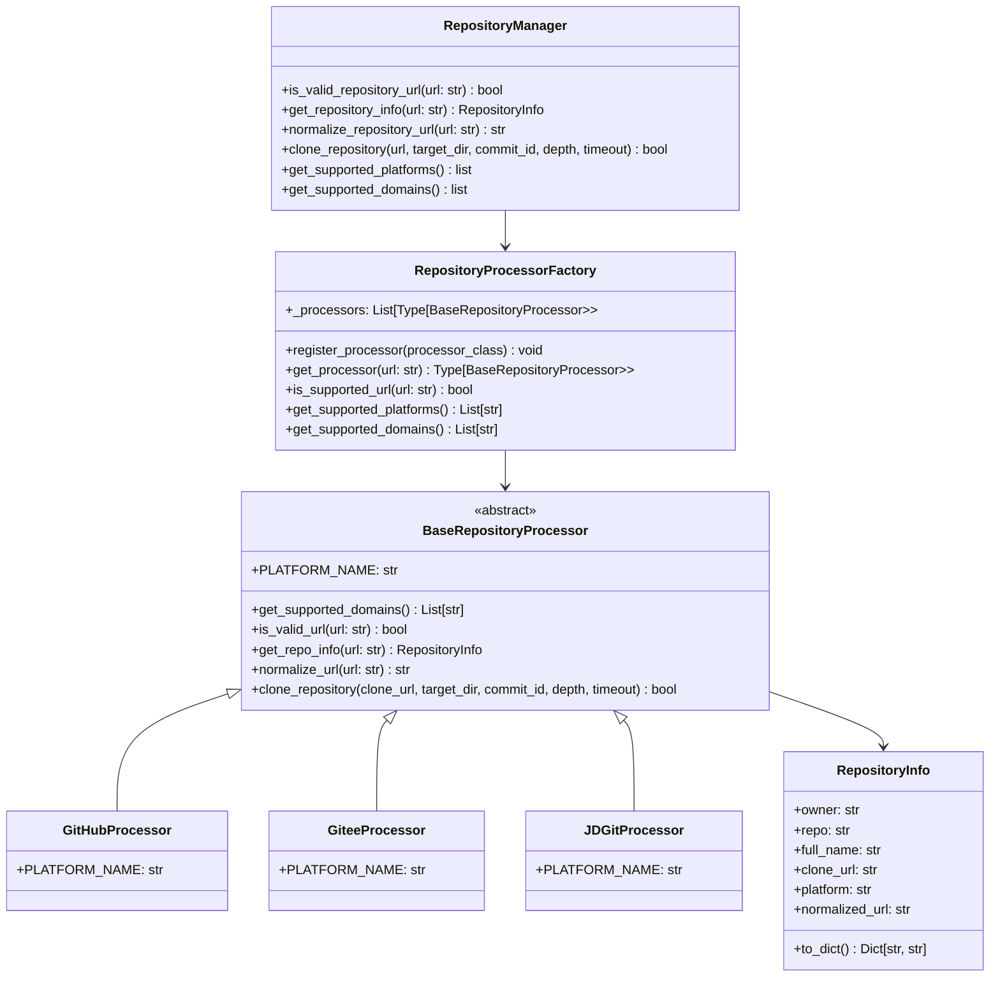
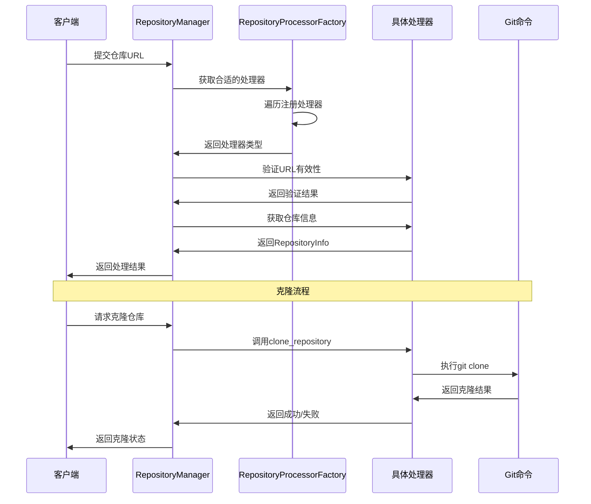
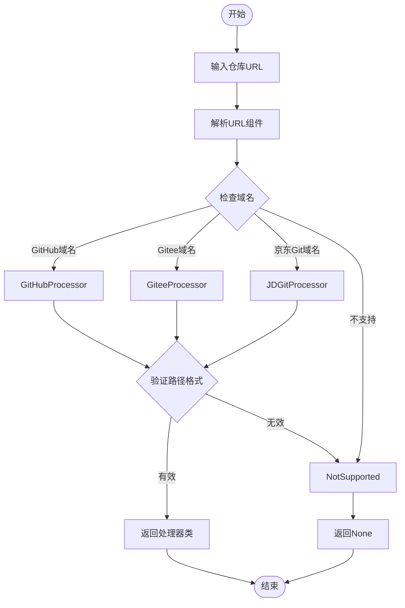

# RepositoryProcessors 仓库处理模块

## 概述

RepositoryProcessors 仓库处理模块是 CodeWiki 系统的前端核心组件，专门负责处理多平台代码仓库的 URL 解析、验证、克隆和管理操作。该模块采用工厂模式设计，支持 GitHub、Gitee、京东内部 Git 等多个代码托管平台，为系统提供了统一的仓库访问接口。

## 核心功能

### 主要能力
- **多平台支持**：支持 GitHub、Gitee、京东内部 Git 等主流代码托管平台
- **URL 智能解析**：自动识别和解析不同格式的仓库 URL
- **仓库克隆**：提供统一的仓库克隆接口，支持指定提交版本
- **URL 标准化**：将不同格式的 URL 转换为标准格式
- **平台自动识别**：根据 URL 自动选择合适的处理器

### 支持的 URL 格式
- **GitHub**：`https://github.com/owner/repo.git`
- **Gitee**：`https://gitee.com/owner/repo.git`
- **京东内部 Git**：
  - HTTP：`https://coding.jd.com/owner/repo.git`
  - SSH：`git@coding.jd.com:owner/repo.git`
  - 星云平台：`http://xingyun.jd.com/codingRoot/owner/repo`

## 架构设计

### 模块结构



### 核心组件关系



## 处理流程

### URL 处理流程



### 工厂模式工作流程



## 核心组件详解

### BaseRepositoryProcessor（基础处理器）

抽象基类，定义了所有处理器必须实现的接口：

- **URL验证**：`is_valid_url()` - 验证URL格式是否正确
- **信息提取**：`get_repo_info()` - 从URL中提取仓库信息
- **URL标准化**：`normalize_url()` - 将URL转换为标准格式
- **仓库克隆**：`clone_repository()` - 执行实际的git克隆操作

### RepositoryInfo（仓库信息模型）

数据类，封装了仓库的核心信息：

```python
class RepositoryInfo:
    owner: str          # 仓库所有者
    repo: str           # 仓库名称
    full_name: str      # 完整名称（owner/repo）
    clone_url: str      # 克隆URL
    platform: str       # 平台名称
    normalized_url: str # 标准化URL
```

### RepositoryProcessorFactory（处理器工厂）

负责管理和选择合适的处理器：

- **处理器注册**：维护支持的处理器列表
- **自动选择**：根据URL特征选择最合适的处理器
- **平台管理**：提供支持平台和域名的查询接口

### RepositoryManager（统一仓库管理器）

为上层应用提供统一的仓库操作接口：

- **URL验证**：检查URL是否受支持
- **信息获取**：获取标准化的仓库信息
- **仓库克隆**：执行克隆操作
- **向后兼容**：提供兼容旧版本的方法

## 平台特定实现

### GitHubProcessor

专门处理 GitHub 仓库：

- **支持域名**：github.com、www.github.com
- **URL格式**：`https://github.com/owner/repo`
- **克隆方式**：HTTPS协议，自动添加.git后缀

### GiteeProcessor

专门处理 Gitee 仓库：

- **支持域名**：gitee.com、www.gitee.com
- **URL格式**：`https://gitee.com/owner/repo`
- **克隆方式**：HTTPS协议，自动添加.git后缀

### JDGitProcessor

处理京东内部 Git 平台，支持多种格式：

- **支持域名**：
  - coding.jd.com
  - xingyun.jd.com
- **URL格式**：
  - HTTP：`https://coding.jd.com/owner/repo`
  - SSH：`git@coding.jd.com:owner/repo.git`
  - 星云：`http://xingyun.jd.com/codingRoot/owner/repo`

## 使用示例

### 基本使用

```python
from codewiki.src.fe.repository_processors.manager import RepositoryManager

# 验证仓库URL
url = "https://github.com/microsoft/vscode"
if RepositoryManager.is_valid_repository_url(url):
    # 获取仓库信息
    repo_info = RepositoryManager.get_repository_info(url)
    print(f"平台: {repo_info.platform}")
    print(f"仓库: {repo_info.full_name}")
    print(f"克隆URL: {repo_info.clone_url}")
    
    # 克隆仓库
    success = RepositoryManager.clone_repository(
        url=url,
        target_dir="/tmp/vscode",
        depth=1  # 浅克隆
    )
```

### 高级使用

```python
from codewiki.src.fe.repository_processors.factory import RepositoryProcessorFactory

# 获取特定平台的处理器
processor = RepositoryProcessorFactory.get_processor(url)
if processor:
    # 直接调用处理器方法
    repo_info = processor.get_repo_info(url)
    normalized_url = processor.normalize_url(url)
    
    # 克隆到指定目录
    success = processor.clone_repository(
        clone_url=repo_info.clone_url,
        target_dir="/tmp/repo",
        commit_id="abc123",  # 指定提交版本
        timeout=600  # 10分钟超时
    )
```

## 依赖关系

### 内部依赖
- **BaseRepositoryProcessor**：所有处理器的基础接口
- **RepositoryInfo**：仓库信息的数据模型
- **RepositoryProcessorFactory**：处理器选择和管理的工厂类

### 外部依赖
- **subprocess**：执行 git 命令
- **urllib.parse**：URL 解析和处理
- **os**：文件系统操作

## 错误处理

模块提供了完善的错误处理机制：

- **URL格式错误**：捕获并返回适当的错误信息
- **网络超时**：可配置的超时时间，防止长时间阻塞
- **Git操作失败**：详细的错误日志输出
- **路径验证**：确保仓库路径格式正确

## 扩展性

模块设计具有良好的扩展性：

- **新平台支持**：通过继承 BaseRepositoryProcessor 添加新平台
- **处理器注册**：通过工厂模式动态注册新处理器
- **配置化**：支持通过配置扩展支持的域名和格式

## 性能优化

- **浅克隆**：默认使用深度为1的浅克隆，节省时间和空间
- **缓存机制**：可扩展支持处理器实例缓存
- **并发支持**：克隆操作支持超时控制，避免阻塞

## 相关模块

- [CLI Core 配置管理](cli_core.md)：提供配置管理功能
- [前端核心模块](fe_web_core.md)：Web应用的核心功能
- [后台文档生成器](be_doc_generator.md)：文档生成功能

## 总结

RepositoryProcessors 模块通过统一的接口和工厂模式，为 CodeWiki 系统提供了强大的多平台仓库处理能力。其模块化的设计使得添加新平台支持变得简单，同时保持了良好的向后兼容性。该模块是整个系统处理代码仓库的基础，为后续的代码分析、文档生成等功能提供了可靠的仓库访问能力。