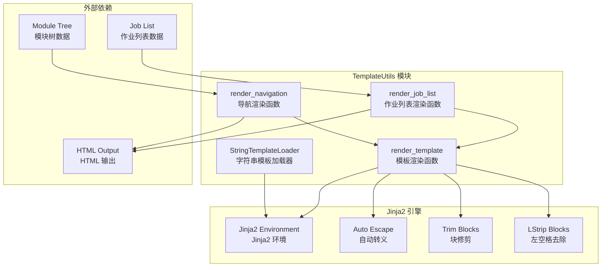
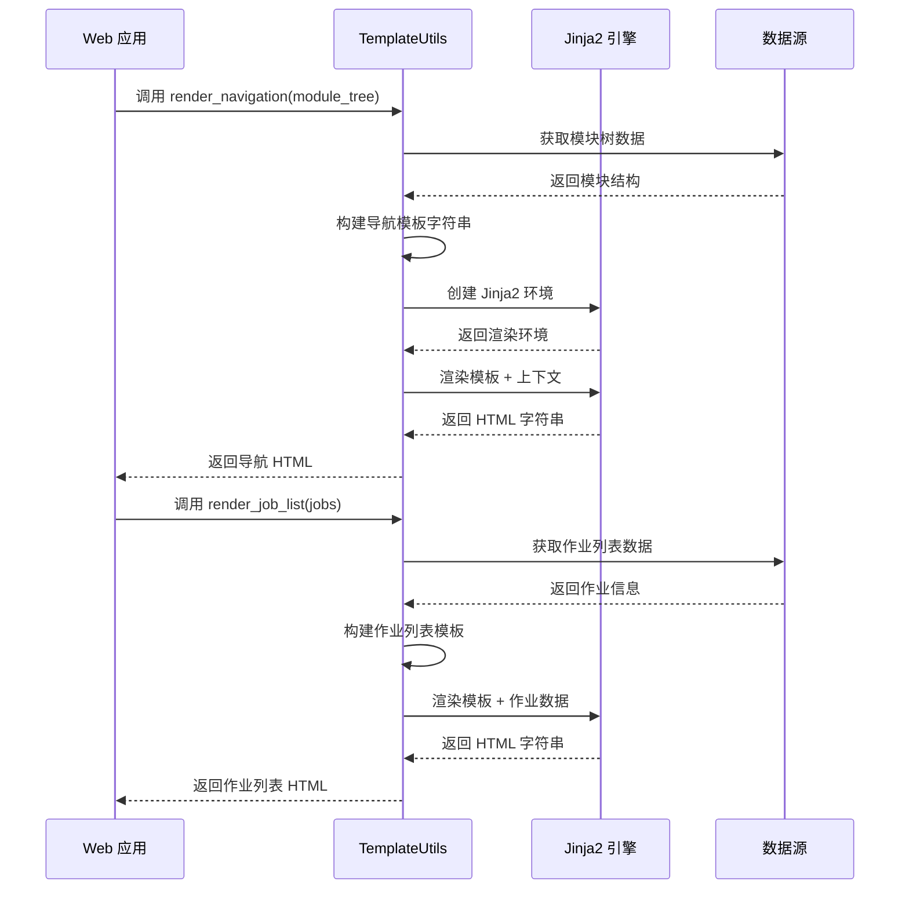
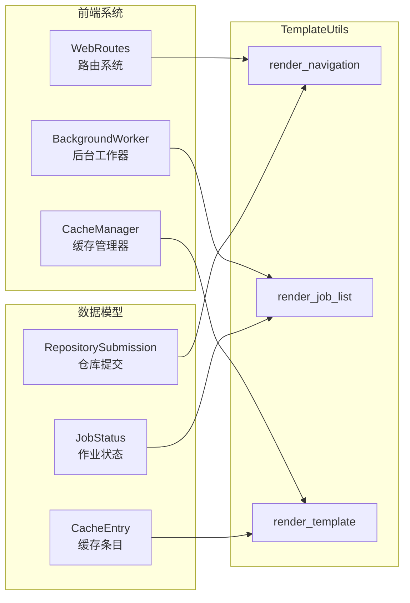

# TemplateUtils 模板工具

TemplateUtils 是 CodeWiki 前端系统的模板工具模块，提供基于 Jinja2 的模板渲染功能，专门用于生成动态 HTML 内容。该模块为 Web 应用提供了灵活的模板处理能力，支持导航菜单、作业列表等动态内容的渲染。

## 功能概述

TemplateUtils 模块主要提供以下核心功能：

- **字符串模板加载**：自定义 Jinja2 模板加载器，支持从字符串直接加载模板
- **模板渲染引擎**：基于 Jinja2 的模板渲染服务，支持 HTML 自动转义和语法优化
- **导航菜单生成**：根据模块树结构动态生成导航 HTML
- **作业列表渲染**：格式化显示作业状态和进度信息
- **上下文变量处理**：支持动态变量替换和条件渲染

## 架构设计

### 组件结构图



### 数据流图



## 核心组件

### StringTemplateLoader 类

`StringTemplateLoader` 是一个自定义的 Jinja2 模板加载器，继承自 `BaseLoader`，专门用于从字符串直接加载模板内容。

**主要特性：**
- 绕过文件系统，直接从内存中的字符串加载模板
- 支持模板缓存和源码获取
- 提供模板存在性检查机制

**使用场景：**
- 动态生成的模板内容
- 内嵌在代码中的小型模板
- 需要频繁变更的模板片段

### render_template 函数

通用的模板渲染函数，是整个模块的核心引擎。

**功能特点：**
- 自动 HTML/XML 转义，防止 XSS 攻击
- 智能块处理，自动去除多余空白
- 支持任意复杂的 Jinja2 语法
- 提供简洁的 API 接口

**配置选项：**
- `autoescape=select_autoescape(['html', 'xml'])`：自动转义 HTML/XML 内容
- `trim_blocks=True`：去除块标签后的换行符
- `lstrip_blocks=True`：去除块标签前的空白字符

### render_navigation 函数

专门用于根据模块树结构生成导航菜单的函数。

**处理逻辑：**
1. 遍历模块树的每个顶级部分
2. 将下划线转换为空格并首字母大写
3. 生成概览链接和子模块链接
4. 根据当前页面高亮活动项
5. 构建层级化的 HTML 结构

**模板特性：**
- 支持多级嵌套导航
- 动态活动状态标记
- 语义化的 CSS 类名
- 响应式布局支持

### render_job_list 函数

用于渲染作业列表的专用函数，支持显示作业状态、进度和操作按钮。

**显示内容：**
- 仓库 URL 信息
- 作业状态（等待中、处理中、已完成、失败等）
- 处理进度信息
- 文档查看链接（仅完成状态）

**状态样式：**
- 不同状态使用不同的 CSS 类名
- 支持状态标题化显示
- 条件渲染进度和操作元素

## 模块集成

### 与前端系统的集成



### 与 RepositoryProcessors 的协作

TemplateUtils 模块与 RepositoryProcessors 模块紧密协作，为不同代码托管平台提供统一的模板渲染服务。

**协作流程：**
1. RepositoryProcessors 处理仓库数据
2. 将处理结果传递给 TemplateUtils
3. TemplateUtils 根据数据类型选择合适的渲染函数
4. 生成最终的 HTML 输出供前端展示

## 使用示例

### 基本模板渲染

```python
from codewiki.src.fe.template_utils import render_template

# 定义模板字符串
template = """
<div class="user-profile">
    <h1>{{ user_name }}</h1>
    <p>Email: {{ user_email }}</p>
    
    <div class="bio">{{ user_bio }}</div>
    
</div>
"""

# 准备上下文数据
context = {
    'user_name': '张三',
    'user_email': 'zhangsan@example.com',
    'user_bio': '资深软件工程师，专注于 Web 开发'
}

# 渲染模板
html_output = render_template(template, context)
```

### 导航菜单生成

```python
from codewiki.src.fe.template_utils import render_navigation

# 模块树结构
module_tree = {
    'user_management': {
        'components': ['UserService', 'UserRepository'],
        'children': {
            'authentication': {
                'components': ['AuthService', 'TokenManager']
            },
            'authorization': {
                'components': ['RoleService', 'PermissionManager']
            }
        }
    },
    'data_processing': {
        'components': ['DataProcessor', 'DataValidator'],
        'children': {}
    }
}

# 生成导航 HTML
nav_html = render_navigation(module_tree, current_page='user_management.md')
```

### 作业列表渲染

```python
from codewiki.src.fe.template_utils import render_job_list

# 作业数据列表
jobs = [
    {
        'repo_url': 'https://github.com/example/web-app',
        'status': 'completed',
        'progress': '100%',
        'job_id': 'job_123',
        'docs_path': '/docs/job_123'
    },
    {
        'repo_url': 'https://github.com/example/api-service',
        'status': 'processing',
        'progress': '65%',
        'job_id': 'job_124',
        'docs_path': None
    },
    {
        'repo_url': 'https://github.com/example/mobile-app',
        'status': 'pending',
        'progress': None,
        'job_id': 'job_125',
        'docs_path': None
    }
]

# 渲染作业列表
jobs_html = render_job_list(jobs)
```

## 配置选项

### Jinja2 环境配置

TemplateUtils 使用以下 Jinja2 环境配置：

| 配置项 | 值 | 说明 |
|--------|----|------|
| loader | StringTemplateLoader | 自定义字符串加载器 |
| autoescape | select_autoescape(['html', 'xml']) | 自动转义 HTML/XML |
| trim_blocks | True | 去除块标签后的换行符 |
| lstrip_blocks | True | 去除块标签前的空白字符 |

### 模板语法支持

支持完整的 Jinja2 模板语法，包括：

- **变量替换**：`{{ variable_name }}`
- **条件语句**：`...`
- **循环语句**：`...`
- **过滤器**：`{{ value|filter_name }}`
- **宏定义**：`...`

## 错误处理

TemplateUtils 模块在模板渲染过程中可能会遇到以下错误：

### 常见错误类型

1. **模板语法错误**：Jinja2 语法不正确
2. **变量未定义**：上下文中缺少模板需要的变量
3. **过滤器错误**：使用了不存在的过滤器
4. **类型错误**：变量类型不符合预期

### 错误处理策略

- 模板语法错误会抛出 `TemplateSyntaxError`
- 变量未定义会抛出 `UndefinedError`
- 建议在调用层进行异常捕获和处理
- 提供默认值的变量使用 `default` 过滤器

## 性能优化

### 缓存策略

虽然 TemplateUtils 主要处理动态内容，但可以考虑以下优化：

1. **模板字符串缓存**：对重复使用的模板进行缓存
2. **渲染结果缓存**：对不频繁变化的内容进行缓存
3. **上下文数据缓存**：缓存计算成本高的上下文数据

### 最佳实践

1. **模板复用**：将常用模板片段定义为可复用的组件
2. **数据预处理**：在传递上下文前进行数据清洗和格式化
3. **条件渲染**：使用条件语句避免不必要的渲染
4. **过滤器使用**：合理使用过滤器减少模板复杂度

## 扩展功能

### 自定义过滤器

可以通过扩展 Jinja2 环境来添加自定义过滤器：

```python
from jinja2 import Environment

def datetime_format(value, format='%Y-%m-%d %H:%M:%S'):
    """格式化日期时间"""
    return value.strftime(format)

def file_size_format(value):
    """格式化文件大小"""
    for unit in ['B', 'KB', 'MB', 'GB']:
        if value < 1024.0:
            return f"{value:.1f} {unit}"
        value /= 1024.4
    return f"{value:.1f} TB"

# 在创建环境时注册过滤器
env = Environment(
    loader=StringTemplateLoader(template),
    autoescape=select_autoescape(['html', 'xml'])
)
env.filters['datetime'] = datetime_format
env.filters['filesize'] = file_size_format
```

### 自定义全局函数

可以添加全局函数供所有模板使用：

```python
def url_for(endpoint, **kwargs):
    """生成 URL"""
    # URL 生成逻辑
    pass

def static_url(filename):
    """生成静态文件 URL"""
    # 静态文件 URL 逻辑
    pass

# 注册全局函数
env.globals['url_for'] = url_for
env.globals['static_url'] = static_url
```

## 相关模块

- [WebRoutes 路由系统](fe_web_core.md)：使用 TemplateUtils 生成页面内容
- [BackgroundWorker 后台处理](fe_web_core.md)：提供作业数据给模板渲染
- [CacheManager 缓存系统](fe_web_core.md)：缓存模板渲染结果
- [RepositoryProcessors 仓库处理](fe_repo_processors.md)：提供仓库数据给模板使用

## 总结

TemplateUtils 模板工具模块为 CodeWiki 前端系统提供了强大而灵活的模板渲染能力。通过基于 Jinja2 的实现，它支持复杂的模板语法、安全的 HTML 渲染和高效的字符串处理。模块的设计遵循单一职责原则，每个函数专注于特定的渲染任务，使得代码易于维护和扩展。在与其他前端模块的协作中，TemplateUtils 起到了连接数据和展示的桥梁作用，为用户提供丰富、动态的 Web 界面体验。