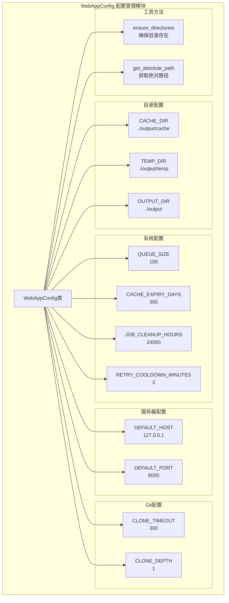
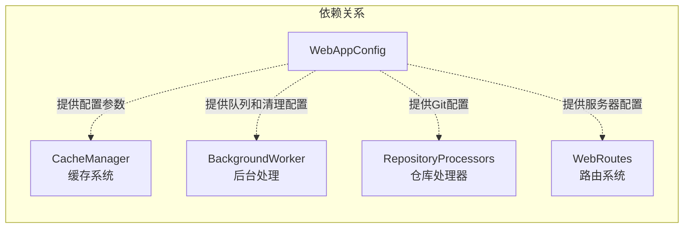
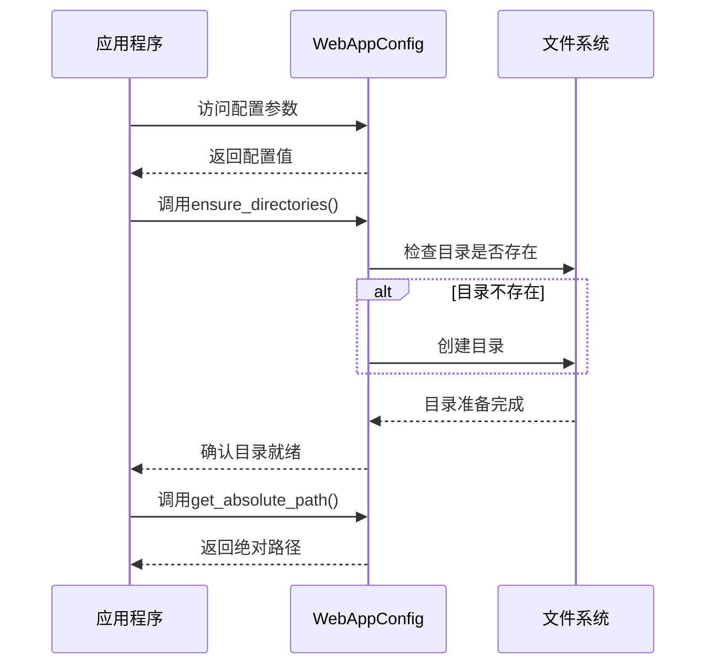

# WebAppConfig 配置管理模块

## 模块简介

WebAppConfig 配置管理模块是 CodeWiki 前端系统的核心配置组件，负责管理整个 Web 应用程序的配置参数和目录结构。该模块提供了统一的配置入口点，确保应用程序在不同环境下的一致性和可维护性。

## 核心功能

### 1. 目录配置管理
- 定义和管理应用程序的核心目录结构
- 自动创建所需的目录结构
- 提供路径转换和验证功能

### 2. 系统参数配置
- 队列大小限制配置
- 缓存过期策略设置
- 作业清理和重试机制配置
- 服务器默认参数配置

### 3. Git 操作配置
- 代码仓库克隆超时设置
- 克隆深度控制
- 版本管理相关参数

## 架构设计

### 模块架构图



### 与其他模块的依赖关系



## 核心组件详解

### WebAppConfig 类

`WebAppConfig` 是一个配置类，采用类变量的方式存储配置参数，提供了以下特性：

#### 配置分类

1. **目录配置**
   - `CACHE_DIR`: 缓存文件存储路径，默认为 `./output/cache`
   - `TEMP_DIR`: 临时文件存储路径，默认为 `./output/temp`
   - `OUTPUT_DIR`: 输出文件存储路径，默认为 `./output`

2. **队列和缓存配置**
   - `QUEUE_SIZE`: 队列大小限制，默认为 100
   - `CACHE_EXPIRY_DAYS`: 缓存过期天数，默认为 365 天

3. **作业管理配置**
   - `JOB_CLEANUP_HOURS`: 作业清理时间间隔，默认为 24000 小时
   - `RETRY_COOLDOWN_MINUTES`: 重试冷却时间，默认为 3 分钟

4. **服务器配置**
   - `DEFAULT_HOST`: 默认服务器地址，默认为 `127.0.0.1`
   - `DEFAULT_PORT`: 默认服务器端口，默认为 `8000`

5. **Git 配置**
   - `CLONE_TIMEOUT`: 克隆超时时间，默认为 300 秒
   - `CLONE_DEPTH`: 克隆深度，默认为 1（浅克隆）

#### 核心方法

##### ensure_directories()
确保所有必需的目录都存在，如果不存在则自动创建。

**使用场景**：
- 应用程序启动时
- 配置初始化时
- 目录结构检查

##### get_absolute_path(path: str)
将相对路径转换为绝对路径。

**参数**：
- `path`: 相对路径字符串

**返回值**：
- 绝对路径字符串

## 配置使用流程



## 最佳实践

### 1. 配置初始化
```python
# 在应用程序启动时初始化配置
from codewiki.src.fe.config import WebAppConfig

# 确保所有目录都存在
WebAppConfig.ensure_directories()

# 使用配置参数
cache_dir = WebAppConfig.CACHE_DIR
queue_size = WebAppConfig.QUEUE_SIZE
```

### 2. 路径处理
```python
# 获取绝对路径
relative_path = "./output/cache"
absolute_path = WebAppConfig.get_absolute_path(relative_path)
```

### 3. 配置扩展
如果需要修改配置，建议通过环境变量或配置文件进行，而不是直接修改类变量：

```python
import os
from codewiki.src.fe.config import WebAppConfig

# 通过环境变量覆盖默认配置
if os.getenv('CUSTOM_CACHE_DIR'):
    WebAppConfig.CACHE_DIR = os.getenv('CUSTOM_CACHE_DIR')
```

## 相关模块

- [CacheManager 缓存系统](CacheManager%20缓存系统.md): 使用 WebAppConfig 的缓存目录配置
- [BackgroundWorker 后台处理](BackgroundWorker%20后台处理.md): 使用 WebAppConfig 的队列和清理配置
- [RepositoryProcessors 仓库处理器](RepositoryProcessors%20仓库处理器.md): 使用 WebAppConfig 的 Git 配置
- [WebRoutes 路由系统](WebRoutes%20路由系统.md): 使用 WebAppConfig 的服务器配置

## 维护建议

1. **配置集中管理**：所有与应用程序运行相关的配置都应集中在 WebAppConfig 中
2. **默认值合理**：为每个配置参数提供合理的默认值
3. **文档完整**：为每个配置参数提供清晰的注释说明
4. **类型安全**：考虑为配置参数添加类型注解
5. **配置验证**：在 ensure_directories() 等方法中添加参数验证逻辑