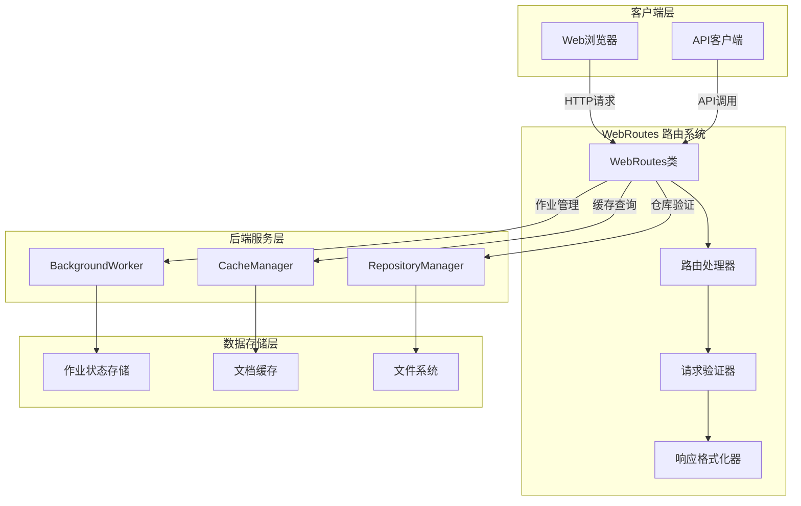
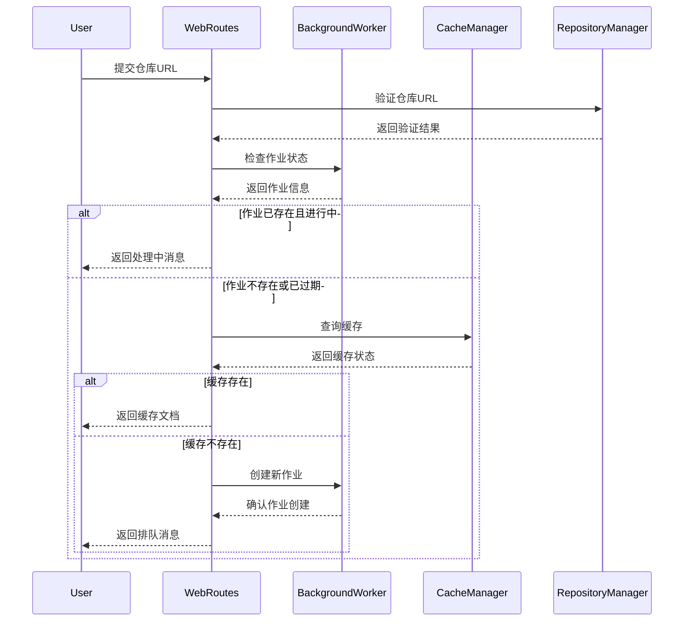
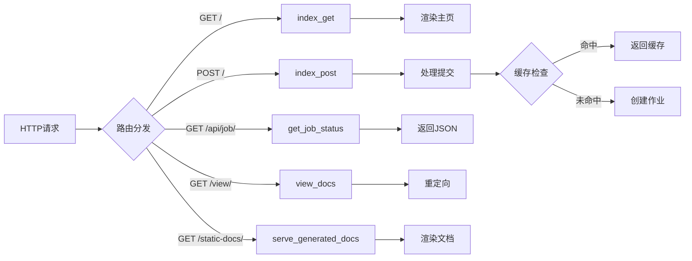
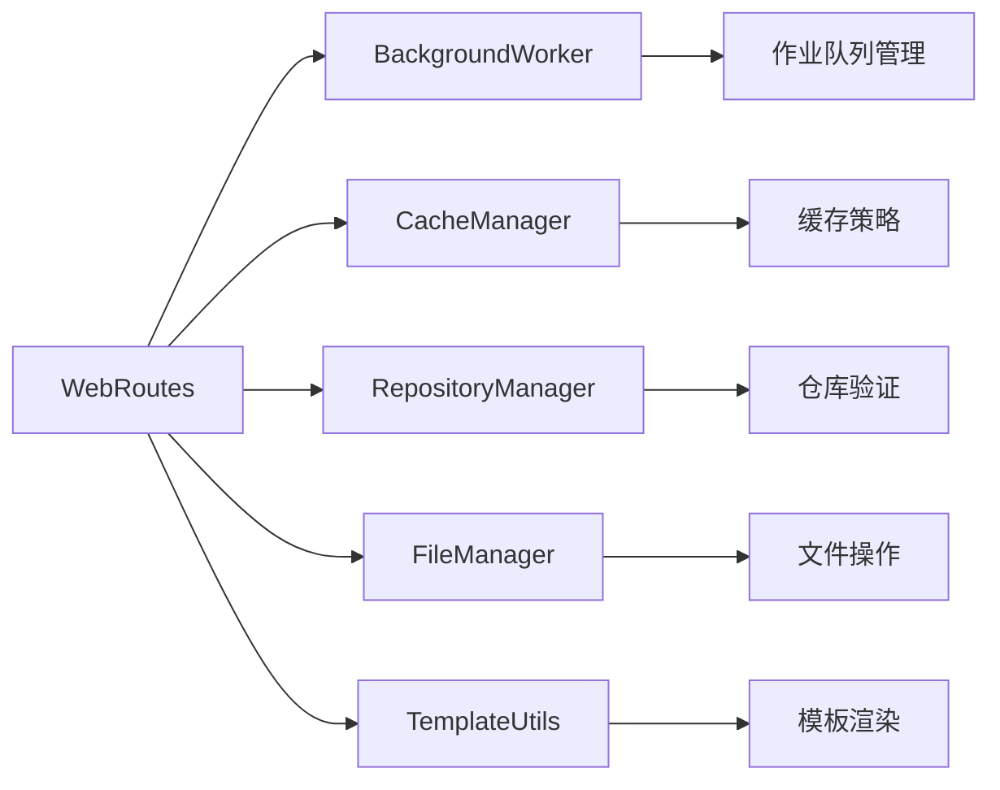

# WebRoutes 路由系统

## 概述

WebRoutes 路由系统是 CodeWiki Web 应用的核心组件，负责处理所有 HTTP 请求路由和响应。作为前端界面与后端服务之间的桥梁，它提供了仓库提交、作业状态查询、文档查看等关键功能的 RESTful API 接口。

该系统采用 FastAPI 框架构建，提供异步处理能力，确保高并发场景下的性能表现。通过集成后台工作器、缓存管理器和仓库处理器，实现了完整的文档生成工作流管理。

## 核心功能

### 1. 仓库提交与处理
- 接收并验证 Git 仓库 URL（支持 GitHub、Gitee、京东内部 Git）
- 检查作业队列状态，避免重复处理
- 实现智能缓存机制，优先返回已生成的文档
- 支持特定提交 ID 的文档生成

### 2. 作业状态管理
- 实时跟踪文档生成作业状态
- 提供作业进度查询 API
- 支持作业历史记录查看
- 实现失败作业的重试冷却机制

### 3. 文档服务
- 提供生成文档的 Web 访问接口
- 支持 Markdown 到 HTML 的实时转换
- 集成文档导航和模块树展示
- 提供文档元数据展示

## 架构设计

### 系统架构图



### 组件交互流程



## 核心组件详解

### WebRoutes 类

WebRoutes 类是整个路由系统的核心，封装了所有路由处理逻辑：

```python
class WebRoutes:
    """处理应用的所有 Web 路由。"""
    
    def __init__(self, background_worker: BackgroundWorker, cache_manager: CacheManager):
        self.background_worker = background_worker
        self.cache_manager = cache_manager
```

#### 主要方法

1. **index_get()** - 主页展示
   - 清理过期作业
   - 获取最近作业列表
   - 渲染主页模板

2. **index_post()** - 仓库提交处理
   - 验证仓库 URL 格式
   - 检查重复作业
   - 查询缓存状态
   - 创建新作业或返回缓存

3. **get_job_status()** - 作业状态查询
   - 提供 RESTful API 接口
   - 返回作业详细信息
   - 处理作业不存在异常

4. **view_docs()** - 文档查看重定向
   - 验证作业完成状态
   - 检查文档文件存在性
   - 重定向到文档服务

5. **serve_generated_docs()** - 文档内容服务
   - 加载模块树和元数据
   - 转换 Markdown 为 HTML
   - 构建文档导航界面

### 数据流处理



## 配置与依赖

### 配置参数

WebRoutes 系统依赖以下配置参数：

- **RETRY_COOLDOWN_MINUTES**: 失败作业重试冷却时间（默认 5 分钟）
- **JOB_CLEANUP_HOURS**: 作业清理时间间隔（默认 24 小时）

### 外部依赖



## 错误处理与日志

### 异常处理策略

1. **仓库验证失败**: 返回用户友好的错误消息
2. **作业不存在**: 返回 404 状态码
3. **文档文件缺失**: 提供详细的错误信息
4. **系统异常**: 记录完整异常栈用于调试

### 状态码映射

- **200**: 成功响应
- **302**: 文档重定向
- **404**: 资源未找到
- **500**: 服务器内部错误

## 性能优化

### 缓存策略

1. **文档缓存**: 避免重复生成相同仓库的文档
2. **作业状态缓存**: 减少数据库查询
3. **模板缓存**: 提高页面渲染速度

### 异步处理

所有路由处理器均采用异步实现，支持：
- 并发请求处理
- 非阻塞 I/O 操作
- 资源高效利用

## 安全考虑

### 输入验证

- URL 格式验证防止恶意输入
- 文件路径检查避免目录遍历攻击
- 作业 ID 格式规范化处理

### 访问控制

- 文档访问权限验证
- 作业状态查询的权限检查
- 缓存数据的安全访问

## 扩展性设计

### 模块化架构

WebRoutes 采用模块化设计，支持：
- 新路由的轻松添加
- 处理器逻辑的可插拔扩展
- 中间件的灵活配置

### 多仓库支持

通过 RepositoryManager 实现：
- GitHub 集成
- Gitee 支持
- 京东内部 Git 系统适配

## 相关模块

- [BackgroundWorker 后台处理](BackgroundWorker 后台处理.md) - 作业队列管理
- [CacheManager 缓存系统](CacheManager 缓存系统.md) - 文档缓存策略
- [RepositoryManager 仓库管理](RepositoryManager 仓库管理.md) - 仓库验证与处理
- [WebAppConfig 配置管理](WebAppConfig 配置管理.md) - 系统配置管理

## 使用示例

### 基本路由使用

```python
# 初始化 WebRoutes
web_routes = WebRoutes(background_worker, cache_manager)

# 注册路由
app.get("/", response_class=HTMLResponse)(web_routes.index_get)
app.post("/", response_class=HTMLResponse)(web_routes.index_post)
app.get("/api/job/{job_id}", response_model=JobStatusResponse)(web_routes.get_job_status)
```

### 仓库提交流程

```python
# 处理仓库提交
result = await web_routes.index_post(request, repo_url, commit_id)
# 自动处理验证、缓存检查、作业创建等流程
```

通过 WebRoutes 路由系统，CodeWiki 提供了稳定、高效、用户友好的 Web 界面，支持开发者轻松生成和查看代码文档。