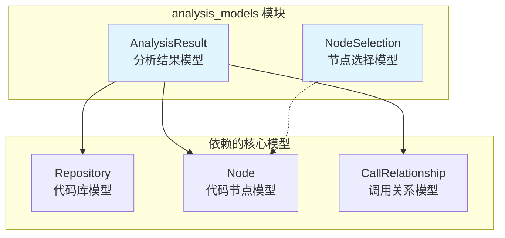
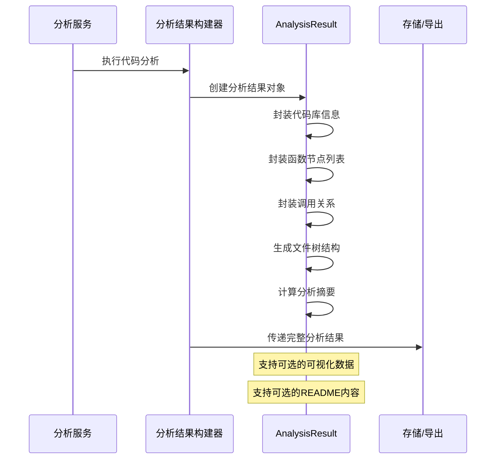

# analysis_models 模块文档

## 概述

analysis_models 模块是 be_dependency_analyzer 的核心子模块，专门负责定义代码分析过程中的数据模型。该模块提供了分析结果的统一数据结构，确保整个依赖分析系统能够标准化地处理和传递分析数据。

## 核心功能

analysis_models 模块主要提供以下功能：

1. **分析结果封装**：通过 `AnalysisResult` 类封装完整的代码库分析结果
2. **节点选择管理**：通过 `NodeSelection` 类支持部分导出和自定义节点选择
3. **数据标准化**：确保分析结果在不同组件间传递时保持一致性
4. **可视化支持**：为分析结果的可视化展示提供数据结构基础

## 架构设计

### 模块结构



### 数据流架构



## 核心组件详解

### AnalysisResult 类

`AnalysisResult` 是分析结果的核心载体，封装了代码库分析的完整信息。

#### 属性说明

| 属性名 | 类型 | 说明 |
|--------|------|------|
| repository | Repository | 代码库基本信息 |
| functions | List[Node] | 分析得到的函数/方法节点列表 |
| relationships | List[CallRelationship] | 函数间的调用关系列表 |
| file_tree | Dict[str, Any] | 文件树结构，用于展示代码组织结构 |
| summary | Dict[str, Any] | 分析摘要，包含统计信息和关键指标 |
| visualization | Dict[str, Any] | 可视化数据，可选，用于图表展示 |
| readme_content | Optional[str] | README文件内容，可选 |

#### 使用场景

- **完整分析结果存储**：保存对整个代码库的完整分析
- **分析结果传递**：在不同分析组件间传递结构化数据
- **可视化展示**：为前端展示提供数据源
- **报告生成**：支持生成详细的分析报告

### NodeSelection 类

`NodeSelection` 提供了灵活的节点选择机制，支持部分导出和自定义处理。

#### 属性说明

| 属性名 | 类型 | 默认值 | 说明 |
|--------|------|--------|------|
| selected_nodes | List[str] | [] | 选中的节点标识符列表 |
| include_relationships | bool | True | 是否包含相关的关系数据 |
| custom_names | Dict[str, str] | {} | 自定义节点名称映射 |

#### 使用场景

- **部分导出**：只导出感兴趣的代码节点
- **自定义命名**：为节点设置自定义显示名称
- **关系过滤**：控制是否导出相关的调用关系
- **报告定制**：生成针对特定节点的专项报告

## 依赖关系

### 内部依赖

analysis_models 模块依赖于 [core_models](core_models.md) 模块：

- **Repository**：代码库基础模型
- **Node**：代码节点模型（函数、类等）
- **CallRelationship**：调用关系模型

### 外部依赖

- **pydantic.BaseModel**：提供数据验证和序列化功能
- **typing**：类型注解支持

## 集成示例

### 创建分析结果

```python
from codewiki.src.be.dependency_analyzer.models.analysis import AnalysisResult
from codewiki.src.be.dependency_analyzer.models.core import Repository, Node, CallRelationship

# 创建分析结果
result = AnalysisResult(
    repository=repository,  # Repository 对象
    functions=function_nodes,  # List[Node]
    relationships=call_relationships,  # List[CallRelationship]
    file_tree=file_structure,  # Dict[str, Any]
    summary=analysis_summary,  # Dict[str, Any]
    visualization=chart_data,  # Dict[str, Any] (可选)
    readme_content=readme_text  # str (可选)
)
```

### 使用节点选择

```python
from codewiki.src.be.dependency_analyzer.models.analysis import NodeSelection

# 创建节点选择
selection = NodeSelection(
    selected_nodes=["main", "utils.helper", "core.processor"],
    include_relationships=True,
    custom_names={
        "main": "主函数",
        "utils.helper": "工具辅助函数"
    }
)

# 应用选择
filtered_data = apply_node_selection(analysis_result, selection)
```

## 设计原则

### 1. 数据完整性

- 所有核心分析数据都通过结构化模型封装
- 确保分析结果在不同组件间传递时不丢失信息
- 支持可选字段，提供灵活的数据扩展能力

### 2. 类型安全

- 使用 Pydantic 进行运行时类型验证
- 明确定义每个字段的数据类型
- 支持复杂嵌套结构的类型检查

### 3. 可扩展性

- 模型设计支持未来功能扩展
- 通过字典字段支持自定义数据
- 保持向后兼容性

### 4. 标准化

- 统一的分析结果格式
- 标准化的数据交换协议
- 一致的序列化/反序列化行为

## 最佳实践

### 1. 错误处理

```python
try:
    result = AnalysisResult(
        repository=repo,
        functions=functions,
        relationships=relationships,
        file_tree=file_tree,
        summary=summary
    )
except ValidationError as e:
    logger.error(f"分析结果验证失败: {e}")
    raise AnalysisException("分析结果格式错误")
```

### 2. 数据验证

```python
# 验证分析结果的完整性
if not result.functions:
    logger.warning("分析结果中未找到函数节点")

if not result.relationships:
    logger.info("未检测到函数调用关系")

# 验证文件树结构
if not isinstance(result.file_tree, dict):
    raise ValueError("文件树必须是字典类型")
```

### 3. 性能优化

```python
# 大量数据处理时的优化策略
class OptimizedAnalysisResult(AnalysisResult):
    """优化的分析结果模型，支持大数据集"""
    
    class Config:
        # 启用ORM模式，提高性能
        orm_mode = True
        # 允许字段赋值时的类型转换
        validate_assignment = True
```

## 相关模块

- [core_models](core_models.md)：基础数据模型定义
- [analysis_service](analysis_service.md)：分析服务实现
- [repo_analyzer](repo_analyzer.md)：代码库分析器
- [call_graph_analyzer](call_graph_analyzer.md)：调用图分析器

## 总结

analysis_models 模块作为依赖分析系统的数据核心，通过标准化的数据模型确保了分析结果的完整性和一致性。其设计充分考虑了扩展性和灵活性，为整个依赖分析流程提供了坚实的数据基础。通过合理使用该模块提供的模型类，开发者可以构建出高效、可靠的代码分析应用。