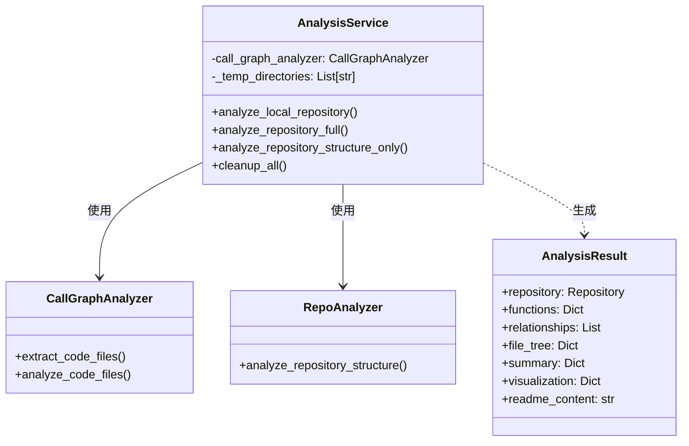
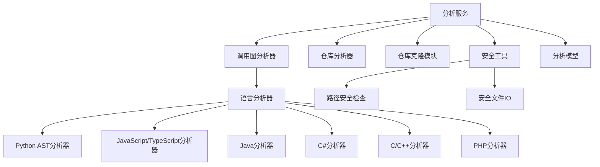
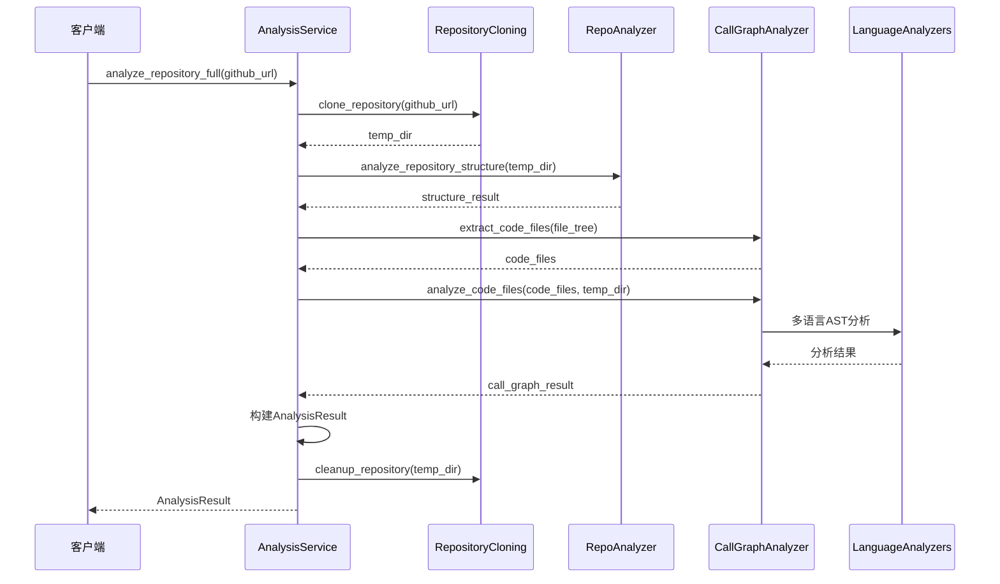
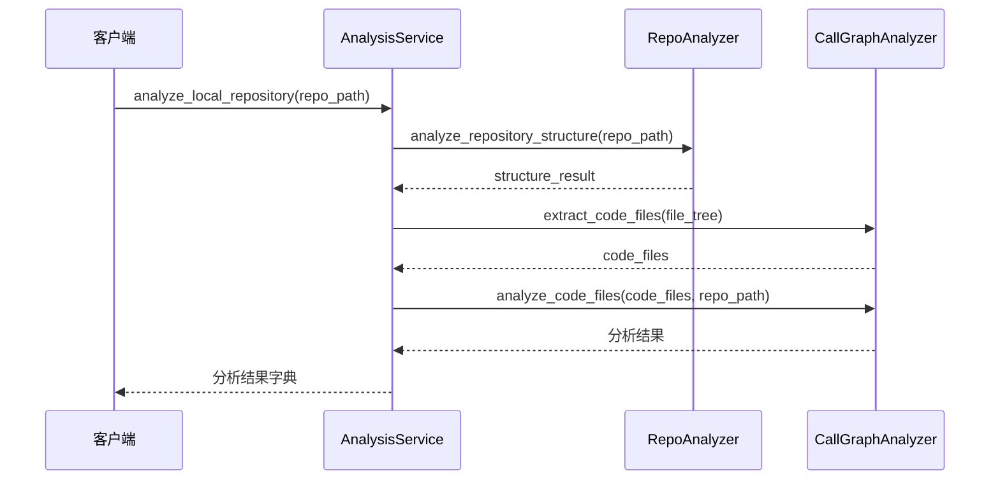

# Analysis Service 模块文档

## 概述

Analysis Service（分析服务）模块是 CodeWiki 系统中负责代码仓库分析的核心组件。该模块提供了集中化的仓库分析功能，支持多种编程语言，能够执行完整的代码结构分析和调用图生成。

## 核心功能

### 主要能力
- **多语言支持**：支持 Python、JavaScript、TypeScript、Java、C#、C、C++、PHP、Go、Rust 等多种编程语言
- **仓库克隆管理**：自动克隆 GitHub 仓库并进行安全管理
- **代码结构分析**：分析仓库文件结构，支持包含/排除模式过滤
- **调用图生成**：基于 AST（抽象语法树）解析生成函数调用关系图
- **本地仓库分析**：支持分析本地文件系统中的代码仓库
- **安全文件访问**：提供安全的文件读写操作，防止路径遍历攻击

### 分析模式
1. **完整分析模式**：执行完整的仓库分析，包括结构分析和调用图生成
2. **结构分析模式**：仅进行轻量级的文件结构分析，不生成调用图

## 架构设计

### 核心组件



### 依赖关系



## 数据流分析

### 完整分析流程



### 本地仓库分析流程



## API 接口

### AnalysisService 类

#### 主要方法

##### analyze_local_repository()
```python
def analyze_local_repository(
    self,
    repo_path: str,
    max_files: int = 100,
    languages: Optional[List[str]] = None
) -> Dict[str, Any]
```

**功能**：分析本地代码仓库

**参数**：
- `repo_path`: 本地仓库路径
- `max_files`: 最大分析文件数量（默认100）
- `languages`: 指定分析的语言列表（可选）

**返回**：包含节点、关系和摘要信息的字典

##### analyze_repository_full()
```python
def analyze_repository_full(
    self,
    github_url: str,
    include_patterns: Optional[List[str]] = None,
    exclude_patterns: Optional[List[str]] = None,
) -> AnalysisResult
```

**功能**：执行完整的GitHub仓库分析

**参数**：
- `github_url`: GitHub仓库URL
- `include_patterns`: 包含文件模式（如 ['*.py', '*.js']）
- `exclude_patterns`: 排除文件模式

**返回**：完整的AnalysisResult对象

**异常**：
- `ValueError`: GitHub URL无效
- `RuntimeError`: 分析失败

##### analyze_repository_structure_only()
```python
def analyze_repository_structure_only(
    self,
    github_url: str,
    include_patterns: Optional[List[str]] = None,
    exclude_patterns: Optional[List[str]] = None,
) -> Dict[str, Any]
```

**功能**：执行轻量级结构分析（不生成调用图）

**参数**：同 `analyze_repository_full()`

**返回**：仓库结构信息字典

### 向后兼容函数

##### analyze_repository()
```python
def analyze_repository(
    github_url: str, 
    include_patterns=None, 
    exclude_patterns=None
) -> tuple[AnalysisResult, None]
```

**说明**：向后兼容函数，内部使用AnalysisService

##### analyze_repository_structure_only()
```python
def analyze_repository_structure_only(
    github_url: str, 
    include_patterns=None, 
    exclude_patterns=None
) -> tuple[Dict, None]
```

**说明**：向后兼容函数，内部使用AnalysisService

## 支持的语言

当前支持以下编程语言：
- Python
- JavaScript
- TypeScript
- Java
- C#
- C
- C++
- PHP
- Go
- Rust

## 安全特性

### 路径安全检查
- 使用 `assert_safe_path()` 确保文件路径安全
- 防止路径遍历攻击
- 限制文件访问范围在仓库目录内

### 安全文件IO
- 使用 `safe_open_text()` 进行文件读取
- 自动处理编码问题
- 提供安全的文件访问接口

## 错误处理

### 异常类型
- `ValueError`: 输入参数验证失败
- `RuntimeError`: 分析过程失败
- `Exception`: 其他未预期的错误

### 日志记录
- 使用标准logging模块记录操作日志
- 错误信息包含详细堆栈跟踪
- 支持不同级别的日志输出

## 资源管理

### 临时目录管理
- 自动跟踪所有创建的临时目录
- 提供 `cleanup_all()` 方法清理所有资源
- 析构函数中自动清理

### 内存优化
- 限制最大分析文件数量
- 及时清理不再使用的资源
- 支持分批处理大型仓库

## 使用示例

### 基本使用
```python
from codewiki.src.be.dependency_analyzer.analysis.analysis_service import AnalysisService

# 创建分析服务
service = AnalysisService()

# 分析GitHub仓库
result = service.analyze_repository_full(
    "https://github.com/user/repo",
    include_patterns=["*.py", "*.js"]
)

# 分析本地仓库
local_result = service.analyze_local_repository(
    "/path/to/local/repo",
    max_files=50,
    languages=["python", "javascript"]
)

# 清理资源
service.cleanup_all()
```

### 错误处理
```python
try:
    result = service.analyze_repository_full("https://github.com/invalid/repo")
except ValueError as e:
    print(f"URL验证失败: {e}")
except RuntimeError as e:
    print(f"分析失败: {e}")
```

## 相关模块

- [call_graph_analyzer](call_graph_analyzer.md) - 调用图分析器
- [repo_analyzer](repo_analyzer.md) - 仓库结构分析器
- [dependency_graphs_builder](dependency_graphs_builder.md) - 依赖图构建器
- [ast_parser](ast_parser.md) - AST解析器
- [analysis_models](analysis_models.md) - 分析数据模型
- [core_models](core_models.md) - 核心数据模型

## 性能优化

### 文件过滤
- 支持基于模式的文件包含/排除
- 限制最大分析文件数量
- 按语言类型过滤文件

### 并发处理
- 支持多语言并发分析
- 优化大型仓库处理性能
- 提供进度跟踪功能

## 扩展性

### 新语言支持
- 易于添加新的语言分析器
- 统一的分析器接口
- 可插拔的语言支持架构

### 自定义分析
- 支持自定义文件过滤规则
- 可扩展的分析结果格式
- 灵活的配置选项