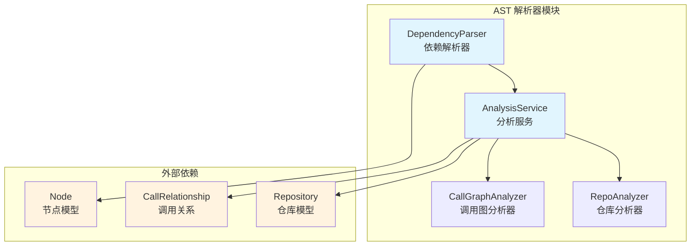
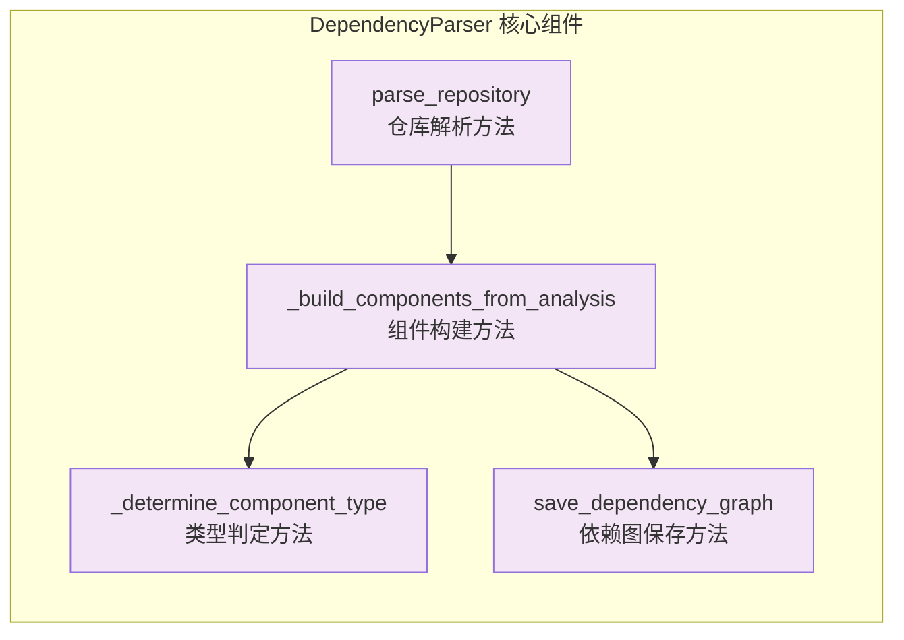
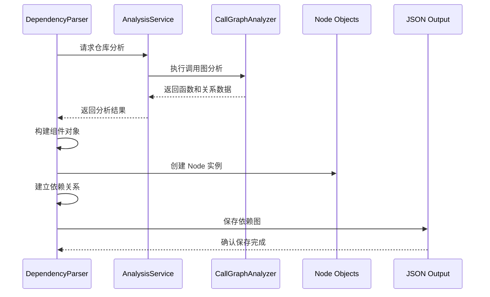
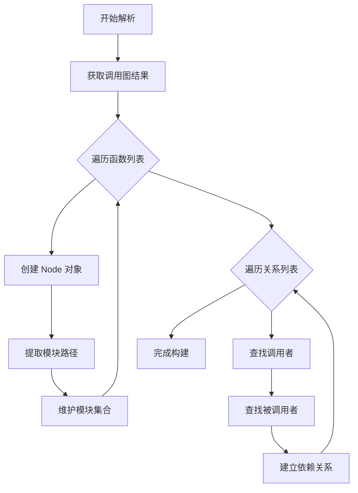
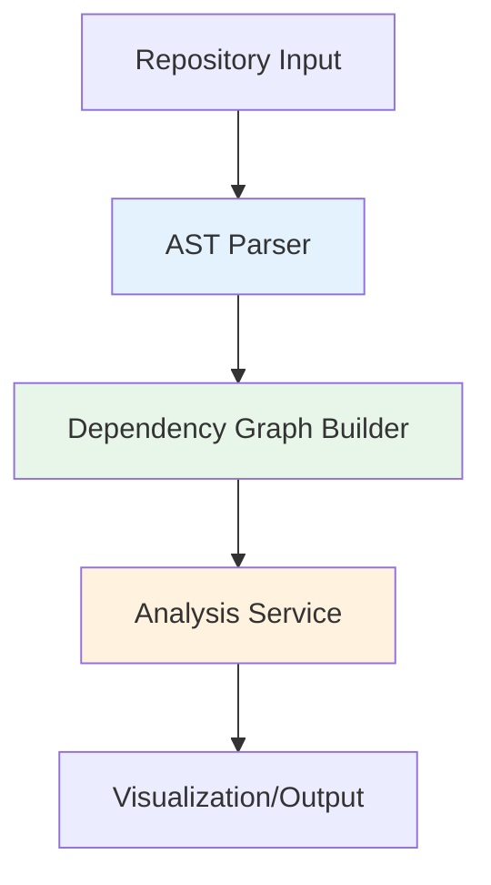

# AST 解析器模块文档

## 概述

AST 解析器模块（`ast_parser`）是 CodeWiki 依赖分析系统的核心组件之一，专门负责从多语言代码仓库中提取和解析代码组件。该模块通过抽象语法树（AST）分析技术，识别代码中的函数、类、方法等组件，并构建它们之间的依赖关系图。

## 核心功能

### 主要职责
- **多语言代码解析**：支持 Python、JavaScript、TypeScript、Java、C#、C、C++、PHP 等多种编程语言
- **组件提取**：从代码文件中提取函数、类、方法、接口等代码组件
- **依赖关系构建**：分析组件之间的调用关系，构建依赖图
- **代码元数据提取**：收集组件的文档字符串、参数信息、继承关系等元数据

### 关键特性
- 支持本地仓库和远程 GitHub 仓库分析
- 提供文件过滤和模式匹配功能
- 生成标准化的组件表示格式
- 与依赖图构建器紧密集成

## 架构设计

### 模块架构图



### 组件关系图



## 核心组件详解

### DependencyParser 类

`DependencyParser` 是 AST 解析器模块的主要入口点，负责协调整个解析流程。

#### 类定义
```python
class DependencyParser:
    """Parser for extracting code components from multi-language repositories."""
    
    def __init__(self, repo_path: str):
        self.repo_path = os.path.abspath(repo_path)
        self.components: Dict[str, Node] = {}
        self.modules: Set[str] = set()
        self.analysis_service = AnalysisService()
```

#### 核心方法

##### parse_repository()
```python
def parse_repository(self, filtered_folders: List[str] = None) -> Dict[str, Node]
```

**功能描述**：
解析指定仓库路径中的所有代码文件，提取组件并构建依赖关系。

**处理流程**：
1. 调用 `AnalysisService` 进行仓库结构分析
2. 执行调用图分析获取函数和关系数据
3. 构建标准化的组件表示
4. 建立组件间的依赖关系

**返回值**：
- `Dict[str, Node]`：组件 ID 到 Node 对象的映射字典

##### _build_components_from_analysis()
```python
def _build_components_from_analysis(self, call_graph_result: Dict)
```

**功能描述**：
从调用图分析结果构建标准化的组件对象。

**处理逻辑**：
1. **函数处理**：将每个函数转换为 Node 对象
2. **模块识别**：提取模块路径并维护模块集合
3. **关系映射**：建立调用者与被调用者的关联关系
4. **ID 标准化**：处理组件 ID 的多种表示形式

##### _determine_component_type()
```python
def _determine_component_type(self, func_dict: Dict) -> str
```

**功能描述**：
根据函数元数据确定组件的具体类型。

**类型判定规则**：
- `is_method=True` → `method`
- `node_type` 为类相关类型 → 返回具体类型（class、interface、struct 等）
- 默认 → `function`

##### save_dependency_graph()
```python
def save_dependency_graph(self, output_path: str)
```

**功能描述**：
将解析得到的依赖图保存为 JSON 文件。

**输出格式**：
- 包含所有组件的完整信息
- 依赖关系以列表形式存储
- 支持 UTF-8 编码和中文字符

## 数据流分析

### 解析流程图



### 组件构建流程



## 集成关系

### 与 AnalysisService 的协作

AST 解析器模块依赖于 [analysis_service](analysis_service.md) 提供的核心分析能力：

- **结构分析**：获取仓库的文件结构和代码文件列表
- **调用图分析**：提取函数定义和调用关系
- **多语言支持**：利用语言特定的分析器进行精确解析

### 与核心模型的关系

解析结果以 [core_models](core_models.md) 中定义的 `Node` 对象形式存储：

- **组件表示**：每个代码组件对应一个 Node 实例
- **依赖存储**：Node.depends_on 集合维护组件间的依赖关系
- **元数据保存**：Node 对象包含组件的完整元数据信息

### 在依赖分析链中的位置



## 使用示例

### 基本用法

```python
from codewiki.src.be.dependency_analyzer.ast_parser import DependencyParser

# 创建解析器实例
parser = DependencyParser("/path/to/repository")

# 解析仓库
components = parser.parse_repository()

# 保存依赖图
parser.save_dependency_graph("output/dependency_graph.json")

# 访问解析结果
for component_id, component in components.items():
    print(f"组件: {component.name}")
    print(f"类型: {component.component_type}")
    print(f"依赖: {len(component.depends_on)} 个组件")
```

### 高级配置

```python
# 带过滤条件的解析
filtered_components = parser.parse_repository(
    filtered_folders=["src", "lib"]  # 只分析指定文件夹
)

# 处理解析结果
modules = parser.modules  # 获取所有模块路径
component_count = len(components)  # 获取组件总数
```

## 错误处理

### 异常情况

- **路径错误**：仓库路径不存在或无法访问
- **分析失败**：代码文件格式不支持或语法错误
- **内存限制**：大型仓库可能导致内存不足
- **权限问题**：文件系统权限不足导致读取失败

### 日志记录

模块使用 Python 标准日志系统，提供详细的调试信息：

```python
import logging

# 配置日志级别
logging.getLogger("codewiki.src.be.dependency_analyzer.ast_parser").setLevel(logging.DEBUG)

# 查看解析进度
logger.debug(f"Parsing repository at {repo_path}")
logger.debug(f"Found {len(components)} components across {len(modules)} modules")
```

## 性能优化

### 处理策略

- **增量解析**：支持基于文件修改时间的增量更新
- **并行处理**：利用多核 CPU 并行分析多个文件
- **内存管理**：及时清理临时对象，避免内存泄漏
- **缓存机制**：缓存分析结果，避免重复计算

### 大仓库处理

- **文件限制**：可通过参数限制分析的文件数量
- **语言过滤**：指定需要分析的语言类型
- **分批处理**：将大仓库分解为多个批次进行处理

## 扩展性

### 新语言支持

要添加对新编程语言的支持，需要：

1. 在 [be_language_analyzers](be_language_analyzers.md) 中实现对应的分析器
2. 更新 `AnalysisService` 的支持语言列表
3. 确保分析器遵循统一的接口规范

### 自定义组件类型

可以通过扩展 `_determine_component_type()` 方法支持新的组件类型：

```python
def _determine_component_type(self, func_dict: Dict) -> str:
    # 添加自定义类型判定逻辑
    if func_dict.get("is_trait", False):
        return "trait"
    # ... 原有逻辑
```

## 相关模块

- [analysis_service](analysis_service.md) - 分析服务模块
- [dependency_graphs_builder](dependency_graphs_builder.md) - 依赖图构建器
- [core_models](core_models.md) - 核心数据模型
- [be_language_analyzers](be_language_analyzers.md) - 语言分析器集合

## 版本信息

- **当前版本**：v1.0.0
- **最后更新**：2024年
- **维护状态**：活跃开发中
- **兼容性**：Python 3.8+