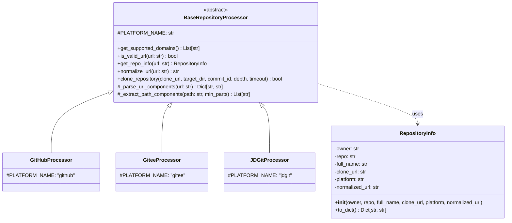
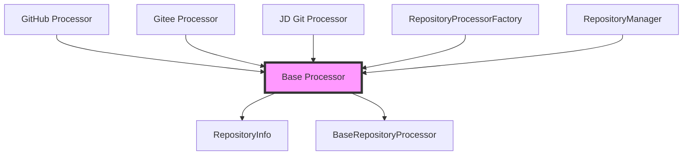
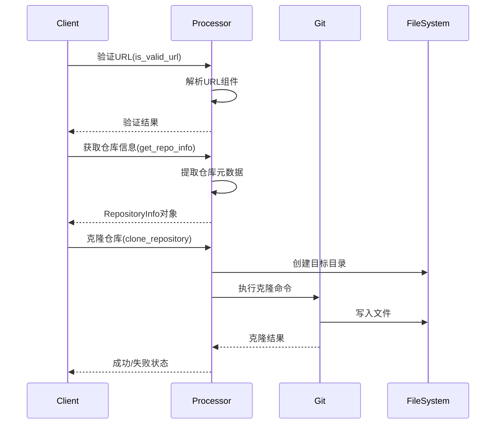

# Base Processor 模块文档

## 概述

Base Processor 模块是 CodeWiki 系统中前端仓库处理器的核心基础模块，提供了统一的仓库处理器接口和基础功能。该模块定义了所有仓库处理器必须遵循的抽象基类，确保不同平台（GitHub、Gitee、JD Git等）的仓库处理器具有一致的接口和行为。

## 核心功能

### 1. 仓库信息封装
- **RepositoryInfo 类**：封装仓库的基本信息，包括所有者、仓库名、完整名称、克隆地址、平台类型和标准化URL
- 提供向后兼容的字典转换功能

### 2. 统一处理器接口
- **BaseRepositoryProcessor 抽象类**：定义所有仓库处理器必须实现的抽象方法
- 提供通用的仓库克隆功能
- 包含URL解析和验证工具方法

## 架构设计

### 类结构图



### 模块依赖关系



### 数据处理流程



## 核心组件详解

### RepositoryInfo 类

仓库信息数据类，用于封装仓库的基本元数据：

```python
class RepositoryInfo:
    def __init__(self,
                 owner: str,           # 仓库所有者
                 repo: str,            # 仓库名称
                 full_name: str,       # 完整名称（owner/repo）
                 clone_url: str,       # 克隆URL
                 platform: str,        # 平台名称
                 normalized_url: str)  # 标准化URL
```

**主要特性：**
- 不可变数据封装
- 提供 `to_dict()` 方法用于向后兼容
- 支持所有主流Git平台的仓库信息表示

### BaseRepositoryProcessor 抽象类

所有仓库处理器的基类，定义了统一的接口规范：

#### 抽象方法（子类必须实现）

| 方法 | 描述 | 参数 | 返回值 |
|------|------|------|--------|
| `get_supported_domains()` | 获取支持的域名列表 | 无 | `List[str]` |
| `is_valid_url(url)` | 验证URL是否有效 | `url: str` | `bool` |
| `get_repo_info(url)` | 从URL提取仓库信息 | `url: str` | `RepositoryInfo` |
| `normalize_url(url)` | 标准化URL格式 | `url: str` | `str` |

#### 具体方法（子类可直接使用）

**clone_repository 方法**
```python
def clone_repository(cls,
                    clone_url: str,
                    target_dir: str,
                    commit_id: Optional[str] = None,
                    depth: int = 1,
                    timeout: int = 300) -> bool
```

功能特点：
- 支持浅克隆（默认深度为1）
- 支持指定特定commit检出
- 自动创建目标目录
- 提供超时控制（默认300秒）
- 完善的错误处理和日志输出

**URL工具方法**
- `_parse_url_components()`: 解析URL为组件字典
- `_extract_path_components()`: 提取并验证路径组件

## 使用示例

### 创建自定义处理器

```python
from codewiki.src.fe.repository_processors.base_processor import BaseRepositoryProcessor, RepositoryInfo

class CustomProcessor(BaseRepositoryProcessor):
    PLATFORM_NAME = "custom"
    
    @classmethod
    def get_supported_domains(cls) -> List[str]:
        return ["custom.com", "www.custom.com"]
    
    @classmethod
    def is_valid_url(cls, url: str) -> bool:
        # 自定义URL验证逻辑
        return "custom.com" in url
    
    @classmethod
    def get_repo_info(cls, url: str) -> RepositoryInfo:
        # 解析URL并提取仓库信息
        components = cls._parse_url_components(url)
        path_parts = cls._extract_path_components(components['path'])
        
        return RepositoryInfo(
            owner=path_parts[0],
            repo=path_parts[1],
            full_name=f"{path_parts[0]}/{path_parts[1]}",
            clone_url=url,
            platform=cls.PLATFORM_NAME,
            normalized_url=cls.normalize_url(url)
        )
    
    @classmethod
    def normalize_url(cls, url: str) -> str:
        # URL标准化逻辑
        return url.lower().rstrip('/')
```

### 使用仓库克隆功能

```python
# 克隆最新版本
success = BaseRepositoryProcessor.clone_repository(
    clone_url="https://github.com/user/repo.git",
    target_dir="/tmp/repo",
    depth=1
)

# 克隆特定commit
success = BaseRepositoryProcessor.clone_repository(
    clone_url="https://github.com/user/repo.git",
    target_dir="/tmp/repo",
    commit_id="abc123def456",
    timeout=600  # 10分钟超时
)
```

## 错误处理

### 克隆错误
- **网络错误**: 捕获连接超时、DNS解析失败等
- **权限错误**: 处理私有仓库访问权限问题
- **存储错误**: 处理磁盘空间不足等问题
- **Git错误**: 处理无效的仓库地址、分支不存在等

### URL验证错误
- **格式错误**: URL格式不符合预期
- **平台不匹配**: URL不属于当前处理器支持的平台
- **路径不完整**: 缺少必要的路径组件

## 性能优化

### 克隆优化
- **浅克隆**: 默认使用深度为1的浅克隆，显著减少下载时间和磁盘空间
- **超时控制**: 防止长时间阻塞的操作
- **并发控制**: 支持多个仓库的并发克隆

### 内存优化
- **流式处理**: 大文件使用流式读取
- **及时清理**: 操作完成后及时清理临时资源
- **对象复用**: 重用RepositoryInfo对象，减少内存分配

## 扩展性设计

### 新平台支持
通过继承BaseRepositoryProcessor，可以轻松添加对新Git平台的支持：

1. 创建新的处理器类继承自BaseRepositoryProcessor
2. 实现所有抽象方法
3. 在工厂类中注册新的处理器

### 功能扩展
- **认证支持**: 可以扩展支持私有仓库的认证机制
- **代理支持**: 支持通过代理服务器访问仓库
- **缓存机制**: 添加仓库信息缓存，提高性能

## 相关模块

- [RepositoryProcessorFactory](factory.md): 处理器工厂，负责创建合适的处理器实例
- [RepositoryManager](manager.md): 仓库管理器，协调多个处理器的使用
- [GitHubProcessor](github_processor.md): GitHub平台专用处理器
- [GiteeProcessor](gitee_processor.md): Gitee平台专用处理器
- [JDGitProcessor](jd_git_processor.md): JD Git平台专用处理器

## 最佳实践

### 1. URL验证
始终在使用URL之前进行验证，确保URL格式正确且属于支持的域名。

### 2. 错误处理
克隆操作可能失败，需要适当的错误处理和用户反馈。

### 3. 性能考虑
- 对于大型仓库，考虑使用浅克隆
- 设置合理的超时时间
- 避免重复克隆相同的仓库

### 4. 安全性
- 验证用户输入的URL
- 限制克隆目标路径，防止路径遍历攻击
- 对私有仓库使用适当的认证机制

## 总结

Base Processor 模块为 CodeWiki 系统提供了强大的仓库处理基础架构。通过统一的接口设计和完善的错误处理机制，确保了系统的稳定性和可扩展性。开发者可以基于这个模块轻松添加对新Git平台的支持，同时享受到统一的管理和优化。