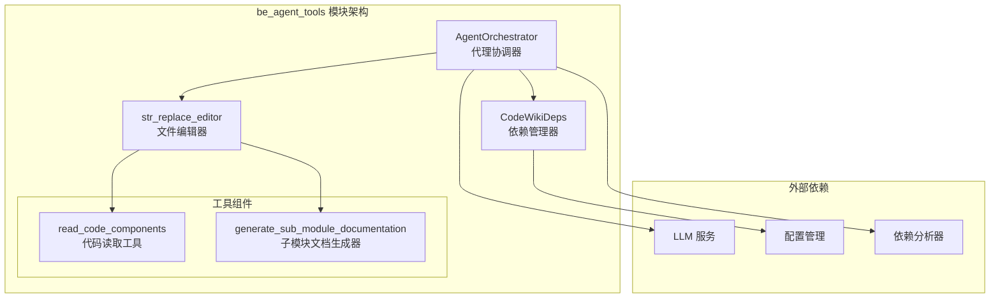
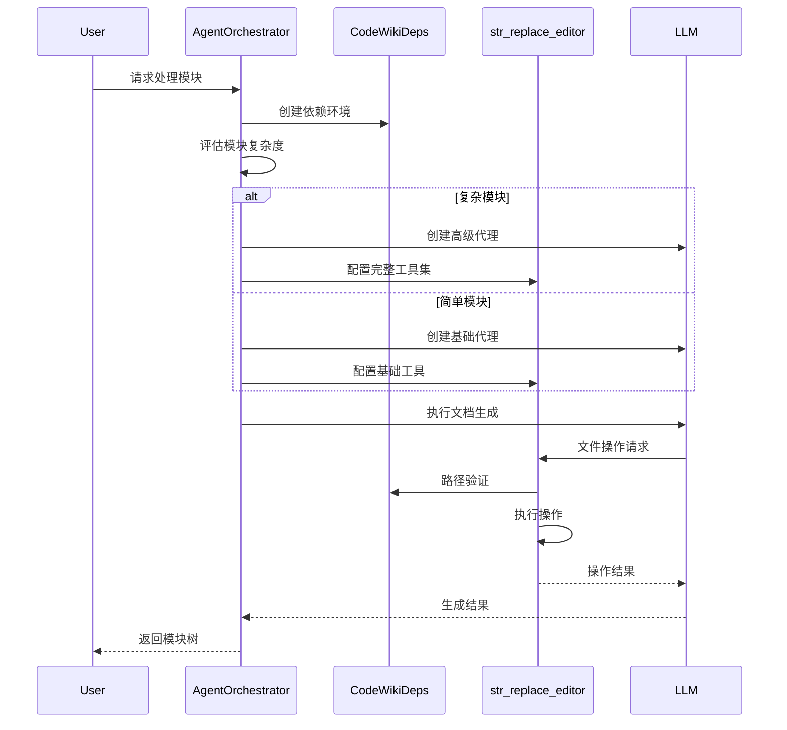
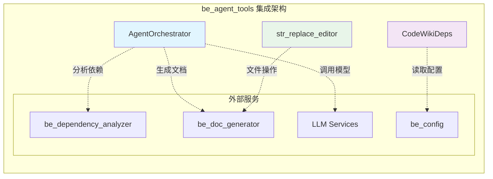
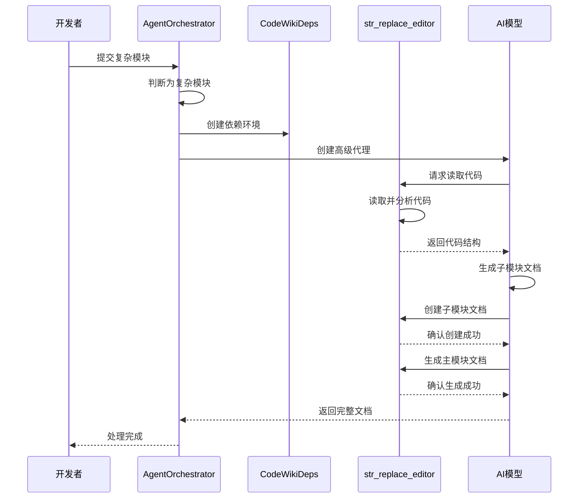
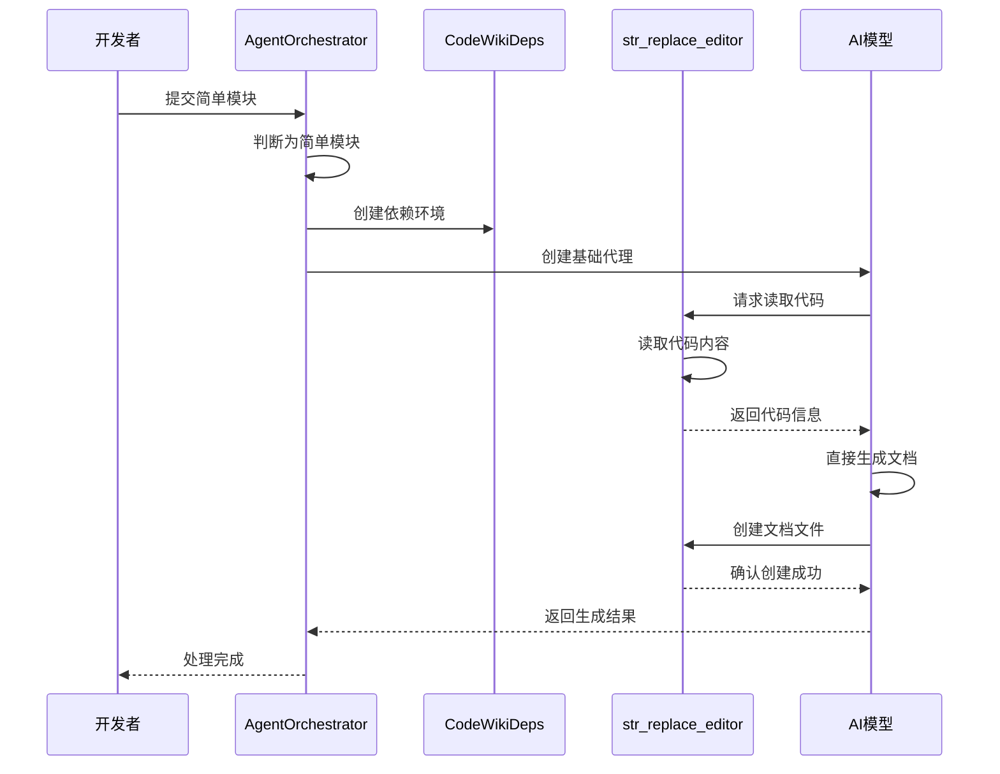

# be_agent_tools 模块文档

## 概述

be_agent_tools 模块是 CodeWiki 系统的核心智能代理工具集，专门用于自动化代码文档生成。该模块通过集成先进的 AI 代理技术，能够智能分析代码结构、理解代码逻辑，并生成高质量的文档内容。

## 架构概览



## 核心功能

### 1. 智能代理协调 (AgentOrchestrator)
- **模块复杂度评估**：自动判断模块是否需要拆分为子模块
- **代理创建与管理**：根据模块复杂度创建不同类型的 AI 代理
- **文档生成流程控制**：协调整个文档生成过程

### 2. 依赖管理 (CodeWikiDeps)
- **路径管理**：管理文档和代码仓库的绝对路径
- **组件注册**：维护代码组件的注册表
- **模块树管理**：处理模块层次结构和依赖关系
- **配置传递**：确保配置信息在代理间正确传递

### 3. 文件编辑工具 (str_replace_editor)
- **多模式文件操作**：支持查看、创建、替换、插入和撤销操作
- **智能窗口扩展**：自动扩展视图窗口以包含完整的函数或类
- **语法验证**：集成代码检查工具确保文档质量
- **Mermaid 图表验证**：自动验证文档中的图表语法

## 模块组件

### AgentOrchestrator
代理协调器是整个系统的核心，负责：
- 分析模块复杂度并选择合适的处理策略
- 创建和管理 AI 代理实例
- 协调文档生成流程
- 处理异常和错误恢复

详细文档：[AgentOrchestrator 组件文档](AgentOrchestrator.md)

### CodeWikiDeps
依赖管理器提供：
- 路径和文件系统抽象
- 组件生命周期管理
- 模块树状态维护
- 配置信息封装

详细文档：[CodeWikiDeps 组件文档](CodeWikiDeps.md)

### str_replace_editor
文件编辑器工具包含：
- **EditTool**: 主要的文件操作实现
- **Filemap**: 文件结构分析和映射
- **WindowExpander**: 智能视图窗口扩展

详细文档：[str_replace_editor 工具文档](str_replace_editor.md)

## 数据流图



## 工具集成

be_agent_tools 模块与系统的其他组件紧密集成，形成完整的文档生成工作流：



### 集成点说明

1. **与依赖分析器集成**
   - AgentOrchestrator 使用依赖分析结果判断模块复杂度
   - CodeWikiDeps 管理分析后的组件依赖关系
   - 通过模块树结构理解代码组织方式

2. **与文档生成器集成**
   - str_replace_editor 直接操作生成的文档文件
   - 支持 Markdown 格式和 Mermaid 图表验证
   - 提供版本控制和历史记录功能

3. **与 LLM 服务集成**
   - 支持多种 LLM 模型作为后备方案
   - 通过配置管理模型选择和参数
   - 实现智能重试和错误恢复机制

4. **与配置系统集成**
   - 统一的配置管理接口
   - 支持环境变量和配置文件
   - 动态配置更新和验证

## 使用场景

### 场景 1：复杂模块处理


### 场景 2：简单模块处理


## 最佳实践

### 1. 模块复杂度判断
- **复杂模块特征**：包含多个子模块、深度嵌套的组件、复杂的依赖关系
- **简单模块特征**：单一文件、少量组件、线性依赖结构
- **混合策略**：对于边界情况，可以先尝试简单处理，必要时升级为复杂处理

### 2. 文件操作优化
- **批量操作**：尽量合并多个小的编辑操作为单次操作
- **窗口扩展**：利用智能窗口扩展功能减少文件读取次数
- **历史管理**：合理使用撤销功能，避免频繁的文件系统回滚

### 3. 错误处理策略
- **预防性检查**：在执行操作前进行路径和权限验证
- **增量验证**：对大型文档采用分段验证和保存策略
- **回滚机制**：确保关键操作有可用的回滚点

### 4. 性能调优
- **缓存策略**：充分利用模块树缓存避免重复分析
- **并发控制**：合理控制并发代理数量避免资源竞争
- **内存管理**：及时清理大型文件的内存占用

## 故障排除

### 常见问题

#### 1. 文件路径错误
**症状**：`The path /path/to/file is not an absolute path`
**解决**：确保所有路径都是绝对路径，使用 `Path.cwd() / relative_path` 转换

#### 2. 模块复杂度判断错误
**症状**：简单模块被错误分类为复杂模块或反之
**解决**：检查 `is_complex_module` 函数的实现，调整判断阈值

#### 3. Mermaid 图表验证失败
**症状**：文档生成成功但图表显示异常
**解决**：检查图表语法，确保使用支持的 Mermaid 语法版本

#### 4. 内存使用过高
**症状**：处理大型模块时内存占用持续增长
**解决**：
- 降低 `MAX_RESPONSE_LEN` 限制
- 启用文件映射功能 `USE_FILEMAP = True`
- 分批处理大型文件

#### 5. 代理创建失败
**症状**：`Failed to create fallback models`
**解决**：
- 检查 LLM 服务配置
- 验证 API 密钥和访问权限
- 确认网络连接状态

### 调试技巧

1. **启用详细日志**：设置日志级别为 DEBUG 获取详细执行信息
2. **分步执行**：将复杂操作分解为多个简单步骤进行调试
3. **状态检查**：定期检查 `CodeWikiDeps` 中的状态信息
4. **工具验证**：单独测试每个工具函数的正确性

### 性能监控

```python
# 性能监控示例
import time
import logging

logger = logging.getLogger(__name__)

async def monitor_performance():
    start_time = time.time()
    
    # 执行文档生成
    result = await orchestrator.process_module(...)
    
    elapsed_time = time.time() - start_time
    logger.info(f"文档生成耗时: {elapsed_time:.2f}秒")
    
    # 监控内存使用
    import psutil
    process = psutil.Process()
    memory_info = process.memory_info()
    logger.info(f"内存使用: {memory_info.rss / 1024 / 1024:.2f}MB")
```

## 版本兼容性

### Python 版本
- **支持版本**：Python 3.8+
- **推荐版本**：Python 3.10+
- **测试版本**：Python 3.8, 3.9, 3.10, 3.11

### 依赖库版本
- **pydantic-ai**: >= 0.1.0
- **tree-sitter**: >= 0.20.0
- **pydantic**: >= 2.0.0

### 向后兼容性
- 保持 API 接口稳定
- 新版本添加功能时提供兼容性开关
- 废弃功能提供迁移指南

## 安全考虑

### 1. 路径安全
- 验证所有文件路径防止目录遍历攻击
- 限制可访问的文件系统范围
- 对上传的文件进行类型和大小检查

### 2. 代码执行安全
- 避免直接执行用户提供的代码
- 使用沙箱环境处理不受信任的代码
- 限制系统命令的执行权限

### 3. 数据安全
- 敏感信息（如 API 密钥）使用环境变量存储
- 实现数据脱敏机制
- 定期清理临时文件和缓存

## 扩展开发

### 自定义代理策略
```python
from codewiki.src.be.agent_orchestrator import AgentOrchestrator

class CustomAgentOrchestrator(AgentOrchestrator):
    def create_agent(self, module_name: str, components: Dict[str, Any], 
                    core_component_ids: List[str]) -> Agent:
        # 自定义代理创建逻辑
        # 可以基于模块类型、大小、复杂度等因素
        return super().create_agent(module_name, components, core_component_ids)
```

### 扩展文件操作
```python
# 在 str_replace_editor 中添加新命令
class CustomEditTool(EditTool):
    def custom_command(self, path: Path, params: Dict[str, Any]):
        # 实现自定义文件操作
        pass
```

### 集成新的 LLM 服务
```python
# 在 llm_services 模块中添加新的模型提供者
def create_custom_model(config: Config):
    # 实现自定义模型创建逻辑
    pass
```

## 环境配置

模块支持通过环境变量进行配置：
- `LOGFIRE_TOKEN`: Logfire 监控服务令牌
- `LOGFIRE_PROJECT_NAME`: 项目名称
- `LOGFIRE_SERVICE_NAME`: 服务名称

### 扩展点
- **自定义代理策略**：通过继承 AgentOrchestrator 实现
- **文件操作扩展**：在 str_replace_editor 中添加新命令
- **依赖管理扩展**：扩展 CodeWikiDeps 以支持新类型的依赖

## 错误处理

模块实现了完善的错误处理机制：
- **文件操作错误**：路径验证、权限检查、格式验证
- **代理执行错误**：异常捕获、日志记录、错误恢复
- **依赖错误**：循环依赖检测、缺失依赖处理

## 性能优化

- **智能缓存**：避免重复的文件系统操作
- **窗口扩展**：减少不必要的文件内容加载
- **异步处理**：支持并发文档生成任务
- **增量更新**：只处理发生变化的模块

## 相关模块

- [be_dependency_analyzer](be_dependency_analyzer.md): 依赖分析模块
- [be_doc_generator](be_doc_generator.md): 文档生成核心模块
- [be_config](be_config.md): 配置管理模块
- [shared_utils](shared_utils.md): 共享工具模块

## 使用示例

```python
from codewiki.src.be.agent_orchestrator import AgentOrchestrator
from codewiki.src.config import Config

# 创建配置
config = Config(repo_path="/path/to/repo", max_depth=3)

# 初始化协调器
orchestrator = AgentOrchestrator(config)

# 处理模块
result = await orchestrator.process_module(
    module_name="example_module",
    components=component_dict,
    core_component_ids=["component1", "component2"],
    module_path=["parent", "child"],
    working_dir="/path/to/docs"
)
```