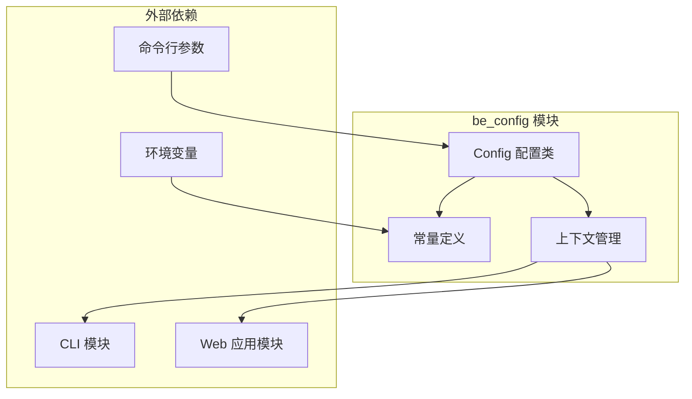
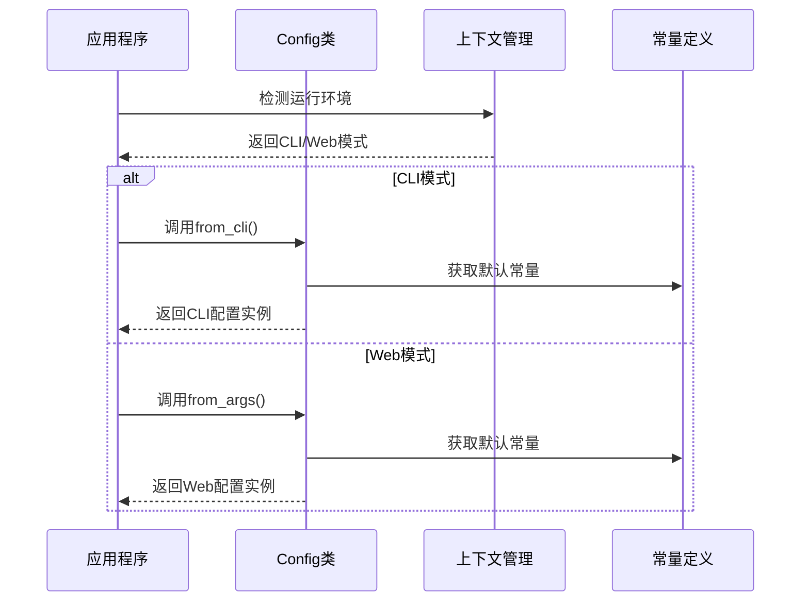

# be_config 模块文档

## 简介

be_config 模块是 CodeWiki 系统的核心配置管理模块，负责统一管理整个系统的配置参数。该模块提供了灵活的配置机制，支持 CLI 和 Web 应用两种运行模式，确保系统在不同环境下都能正确运行。

## 核心功能

### 1. 配置管理
- 统一管理系统的所有配置参数
- 支持环境变量和配置文件双重配置方式
- 提供 CLI 和 Web 应用两种配置模式
- 自动处理路径和文件名的规范化

### 2. 上下文检测
- 智能识别当前运行环境（CLI 或 Web 应用）
- 根据上下文自动选择合适的配置策略
- 提供上下文切换功能

### 3. 常量定义
- 定义系统使用的各种常量
- 包括目录结构、文件命名规范、深度限制等
- 提供 LLM 服务的默认配置

## 架构设计

### 模块架构图



### 配置流程图



## 核心组件

### Config 类

`Config` 类是配置模块的核心，负责存储和管理所有配置参数。

#### 主要属性
- `repo_path`: 代码仓库路径
- `output_dir`: 输出目录
- `dependency_graph_dir`: 依赖图输出目录
- `docs_dir`: 文档输出目录
- `max_depth`: 最大分析深度
- `llm_base_url`: LLM API 基础 URL
- `llm_api_key`: LLM API 密钥
- `main_model`: 主模型名称
- `cluster_model`: 聚类模型名称
- `fallback_model`: 备用模型名称

#### 主要方法

##### from_args 方法
从命令行参数创建配置实例，主要用于 Web 应用模式。

```python
@classmethod
def from_args(cls, args: argparse.Namespace) -> 'Config':
    """从解析的参数创建配置。"""
    # 实现代码...
```

##### from_cli 方法
从 CLI 参数创建配置实例，主要用于 CLI 模式。

```python
@classmethod
def from_cli(
    cls,
    repo_path: str,
    output_dir: str,
    llm_base_url: str,
    llm_api_key: str,
    main_model: str,
    cluster_model: str,
    fallback_model: str = FALLBACK_MODEL_1
) -> 'Config':
    """
    为 CLI 上下文创建配置。
    
    参数:
        repo_path: 仓库路径
        output_dir: 生成文档的输出目录
        llm_base_url: LLM API 基础 URL
        llm_api_key: LLM API 密钥
        main_model: 主模型
        cluster_model: 聚类模型
        fallback_model: 备用模型
        
    返回:
        Config 实例
    """
    # 实现代码...
```

### 常量定义

模块定义了以下重要常量：

- `OUTPUT_BASE_DIR`: 基础输出目录（'output'）
- `DEPENDENCY_GRAPHS_DIR`: 依赖图目录（'dependency_graphs'）
- `DOCS_DIR`: 文档目录（'docs'）
- `FIRST_MODULE_TREE_FILENAME`: 初始模块树文件名
- `MODULE_TREE_FILENAME`: 模块树文件名
- `OVERVIEW_FILENAME`: 概览文档文件名
- `MAX_DEPTH`: 最大分析深度（2）
- `MAX_TOKEN_PER_MODULE`: 每个模块的最大 token 数（36,369）
- `MAX_TOKEN_PER_LEAF_MODULE`: 每个叶子模块的最大 token 数（16,000）

### 上下文管理

提供上下文检测和管理功能：

- `set_cli_context()`: 设置 CLI 上下文
- `is_cli_context()`: 检查是否处于 CLI 上下文

## 配置策略

### CLI 模式配置
在 CLI 模式下，配置主要来源于：
1. 命令行参数
2. 配置文件（~/.codewiki/config.json）
3. 密钥环（keyring）

### Web 应用模式配置
在 Web 应用模式下，配置主要来源于：
1. 环境变量
2. 默认常量值

## 依赖关系

### 内部依赖
- 使用 Python 标准库：`dataclasses`, `argparse`, `os`, `sys`
- 使用第三方库：`python-dotenv` 用于环境变量加载

### 外部依赖
be_config 模块被以下模块依赖：
- [cli_core](cli_core.md): CLI 核心功能
- [cli_doc_pipeline](cli_doc_pipeline.md): 文档生成管道
- [be_dependency_analyzer](be_dependency_analyzer.md): 依赖分析器
- [be_doc_generator](be_doc_generator.md): 文档生成器
- [be_agent_tools](be_agent_tools.md): 代理工具
- [fe_web_core](fe_web_core.md): Web 应用核心
- [fe_repo_processors](fe_repo_processors.md): 仓库处理器

## 使用示例

### CLI 模式使用

```python
from codewiki.src.config import Config

# 创建 CLI 配置
config = Config.from_cli(
    repo_path="/path/to/repo",
    output_dir="/path/to/output",
    llm_base_url="http://localhost:4000/",
    llm_api_key="your-api-key",
    main_model="claude-sonnet-4",
    cluster_model="claude-sonnet-4"
)
```

### Web 应用模式使用

```python
import argparse
from codewiki.src.config import Config

# 创建参数解析器
parser = argparse.ArgumentParser()
parser.add_argument("--repo_path", required=True)
args = parser.parse_args()

# 创建 Web 应用配置
config = Config.from_args(args)
```

## 最佳实践

1. **环境变量管理**: 在 Web 应用模式下，使用环境变量管理敏感信息
2. **路径规范化**: 自动处理仓库名称的规范化，避免文件系统问题
3. **上下文一致性**: 确保在整个应用生命周期内保持上下文一致
4. **配置验证**: 在实际使用前验证配置参数的有效性

## 注意事项

1. **路径分隔符**: 在不同操作系统上正确处理路径分隔符
2. **权限管理**: 确保输出目录具有适当的写入权限
3. **配置冲突**: 避免环境变量和配置文件之间的冲突
4. **内存管理**: 配置对象在应用生命周期内保持单例模式