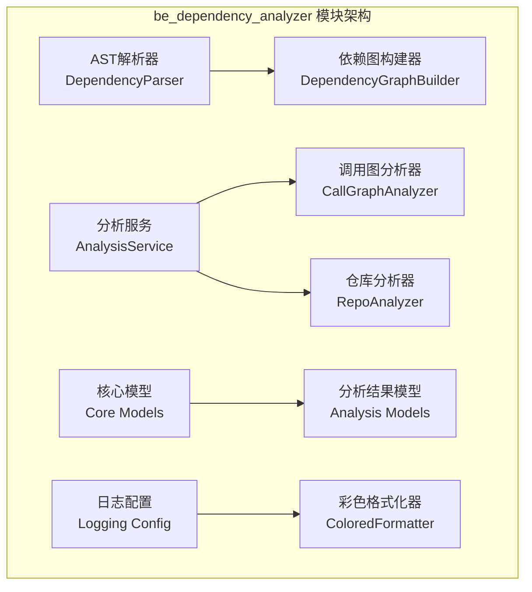
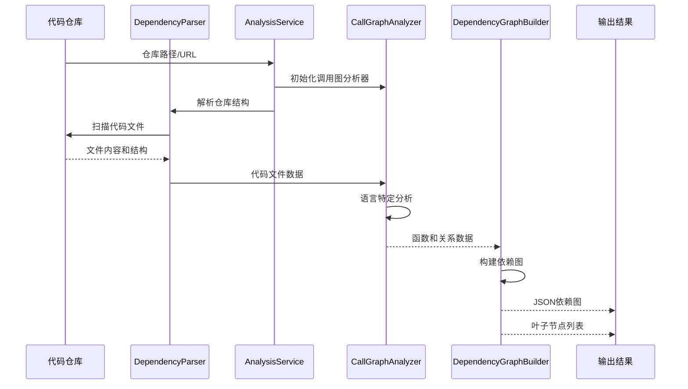

# be_dependency_analyzer 模块文档

## 概述

`be_dependency_analyzer` 是 CodeWiki 系统的核心依赖分析模块，专门用于分析代码仓库中的依赖关系、调用图和代码结构。该模块支持多种编程语言，能够生成详细的代码组件关系图，为代码理解和文档生成提供基础数据。

## 核心功能

- **多语言支持**：支持 Python、JavaScript、TypeScript、Java、C#、C/C++、PHP 等多种编程语言
- **依赖关系分析**：构建代码组件之间的依赖关系图
- **调用图生成**：分析函数/方法之间的调用关系
- **代码结构解析**：提取代码文件结构和组件信息
- **可视化数据生成**：为前端提供图形化展示所需的数据

## 架构概览



## 子模块结构

### 1. AST解析器 (ast_parser)
负责解析代码仓库，提取代码组件和依赖关系。

**核心组件**：
- `DependencyParser`：主要的AST解析器类

**功能特点**：
- 支持多语言代码解析
- 提取函数、类、方法等代码组件
- 构建组件间的依赖关系映射
- 生成标准化的组件数据结构

详细文档：[AST解析器文档](ast_parser.md)

### 2. 依赖图构建器 (dependency_graphs_builder)
协调整个依赖分析流程，生成最终的依赖图数据。

**核心组件**：
- `DependencyGraphBuilder`：依赖图构建器类

**功能特点**：
- 整合AST解析结果
- 构建拓扑排序的依赖图
- 识别叶子节点（无依赖的组件）
- 生成JSON格式的依赖图文件

详细文档：[依赖图构建器文档](dependency_graphs_builder.md)

### 3. 分析服务 (analysis)
提供完整的仓库分析服务，包括结构分析和调用图分析。

**子模块**：
- **analysis_service**：核心分析服务
- **call_graph_analyzer**：调用图分析器
- **repo_analyzer**：仓库结构分析器

**功能特点**：
- 支持本地和远程仓库分析
- 多语言代码文件处理
- 调用关系解析和去重
- 生成可视化数据

详细文档：
- [分析服务文档](analysis_service.md)
- [调用图分析器文档](call_graph_analyzer.md)
- [仓库分析器文档](repo_analyzer.md)

### 4. 核心模型 (models)
定义依赖分析过程中使用的数据模型。

**子模块**：
- **core**：核心数据模型（Node、CallRelationship、Repository）
- **analysis**：分析结果模型（AnalysisResult、NodeSelection）

详细文档：
- [核心模型文档](core_models.md)
- [分析模型文档](analysis_models.md)

### 5. 工具模块 (utils)
提供日志配置和格式化功能。

**核心组件**：
- `ColoredFormatter`：彩色日志格式化器

详细文档：[日志配置文档](logging_config.md)

## 数据流图



## 语言支持

当前支持以下编程语言：

| 语言 | 文件扩展名 | 分析器类型 |
|------|-----------|-----------|
| Python | .py | AST分析器 |
| JavaScript | .js | Tree-sitter分析器 |
| TypeScript | .ts | Tree-sitter分析器 |
| Java | .java | Tree-sitter分析器 |
| C# | .cs | Tree-sitter分析器 |
| C | .c, .h | Tree-sitter分析器 |
| C++ | .cpp, .cc, .cxx, .hpp | Tree-sitter分析器 |
| PHP | .php, .phtml, .inc | Tree-sitter分析器 |

## 使用示例

### 基本用法

```python
from codewiki.src.be.dependency_analyzer.ast_parser import DependencyParser

# 创建解析器
parser = DependencyParser("/path/to/repository")

# 解析仓库
components = parser.parse_repository()

# 保存依赖图
parser.save_dependency_graph("output/dependency_graph.json")
```

### 使用分析服务

```python
from codewiki.src.be.dependency_analyzer.analysis.analysis_service import AnalysisService

# 创建分析服务
service = AnalysisService()

# 分析GitHub仓库
result = service.analyze_repository_full(
    "https://github.com/user/repo",
    include_patterns=["*.py", "*.js"],
    exclude_patterns=["test_*", "*_test.py"]
)

# 获取分析结果
print(f"发现函数数量: {result.summary['total_functions']}")
print(f"发现关系数量: {result.summary['total_relationships']}")
```

## 相关模块

- [be_language_analyzers](be_language_analyzers.md)：语言特定的代码分析器
- [shared_utils](shared_utils.md)：共享工具函数
- [be_config](be_config.md)：系统配置管理

## 性能优化

1. **增量分析**：支持基于缓存的增量分析
2. **并行处理**：多线程处理大文件和复杂仓库
3. **内存管理**：及时清理临时数据和大型对象
4. **文件过滤**：通过模式匹配减少不必要的文件分析

## 错误处理

模块包含完善的错误处理机制：

- **文件访问错误**：安全的文件路径验证和访问
- **解析错误**：语言特定的错误处理和回退机制
- **内存错误**：大文件的流式处理和内存限制
- **网络错误**：仓库克隆和远程访问的重试机制

## 扩展性

模块设计支持轻松扩展：

- **新语言支持**：通过添加新的语言分析器
- **自定义过滤器**：支持用户定义的文件过滤规则
- **输出格式**：支持多种输出格式（JSON、GraphML等）
- **分析算法**：可插拔的分析算法和启发式规则