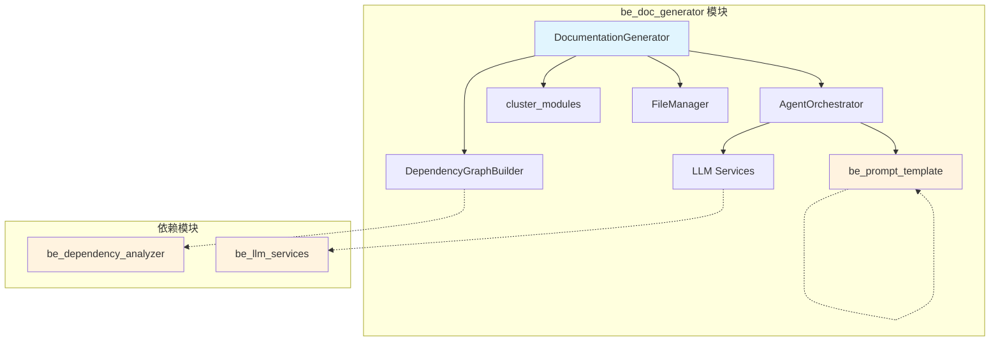
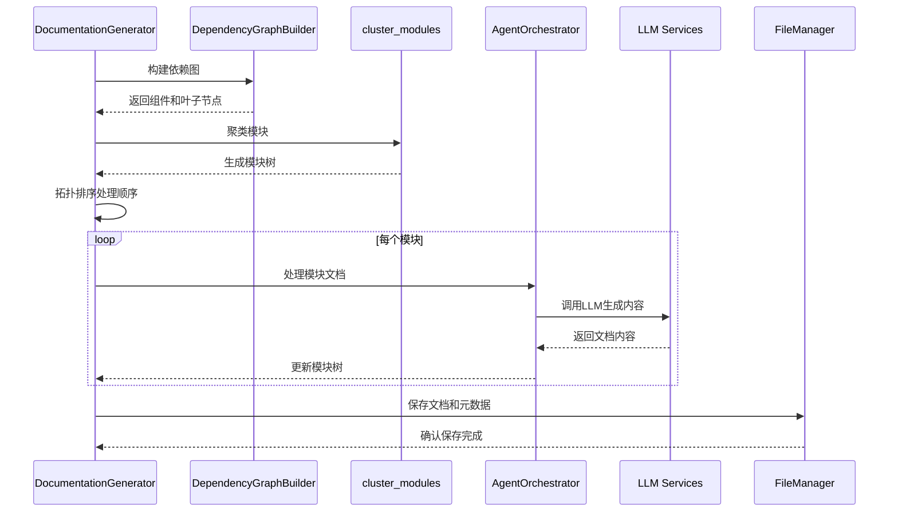
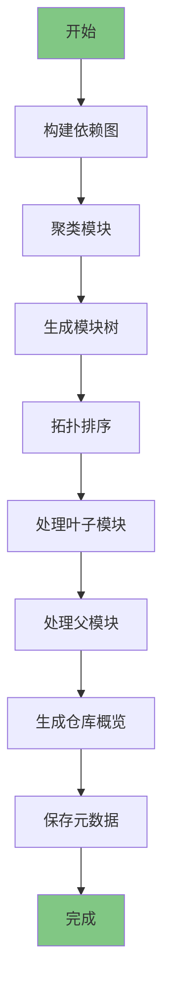

# be_doc_generator 模块文档

## 概述

`be_doc_generator` 模块是 CodeWiki 系统的核心文档生成引擎，负责将代码库分析结果转换为结构化的文档。该模块采用动态规划方法，通过自底向上的方式处理模块依赖关系，确保文档生成的完整性和一致性。

## 核心功能

### 1. 文档生成协调
- **DocumentationGenerator**: 主要的文档生成协调器，负责整个文档生成流程的编排
- 支持增量式文档生成和完整的重新生成
- 提供详细的元数据记录和统计信息

### 2. 动态规划处理
- 采用自底向上的处理策略，先处理叶子模块，再处理父模块
- 通过拓扑排序确保依赖关系的正确处理顺序
- 支持复杂模块层次结构的文档生成

### 3. 智能内容组织
- 根据模块依赖关系自动组织文档结构
- 支持模块聚类和分层处理
- 提供仓库概览和模块详细文档的生成

## 架构设计

### 组件关系图



### 数据流图



## 核心组件详解

### DocumentationGenerator

`DocumentationGenerator` 是模块的核心类，提供以下主要功能：

#### 初始化配置
```python
def __init__(self, config: Config, commit_id: str = None):
    self.config = config
    self.commit_id = commit_id
    self.graph_builder = DependencyGraphBuilder(config)
    self.agent_orchestrator = AgentOrchestrator(config)
```

#### 主要方法

1. **run()**: 执行完整的文档生成流程
2. **generate_module_documentation()**: 生成模块文档
3. **generate_parent_module_docs()**: 生成父模块文档
4. **get_processing_order()**: 获取拓扑排序的处理顺序
5. **create_documentation_metadata()**: 创建文档元数据

#### 处理流程



## 关键特性

### 1. 智能模块处理
- **叶子模块优先**: 确保依赖关系正确处理
- **动态规划**: 避免重复计算，提高效率
- **错误处理**: 支持部分失败，继续处理其他模块

### 2. 文档结构管理
- **层次化组织**: 支持多级模块结构
- **内容聚合**: 自动聚合子模块内容到父模块
- **交叉引用**: 支持模块间的引用关系

### 3. 元数据追踪
- **生成统计**: 记录处理的组件数量和类型
- **版本信息**: 追踪代码版本和生成时间
- **配置记录**: 保存生成时的配置参数

## 配置参数

### 主要配置项
- `main_model`: 使用的主模型类型
- `repo_path`: 代码库路径
- `docs_dir`: 文档输出目录
- `max_depth`: 最大处理深度

### 文件命名
- `MODULE_TREE_FILENAME`: 模块树文件名 (module_tree.json)
- `FIRST_MODULE_TREE_FILENAME`: 初始模块树文件名 (first_module_tree.json)
- `OVERVIEW_FILENAME`: 仓库概览文件名 (overview.md)

## 错误处理

### 异常处理策略
1. **模块级错误**: 单个模块失败不影响其他模块处理
2. **日志记录**: 详细的错误日志和堆栈跟踪
3. **恢复机制**: 支持从中间状态重新开始

### 常见问题
- **模块文档缺失**: 自动创建空文档
- **依赖循环**: 通过拓扑排序避免
- **内存限制**: 支持分批处理大代码库

## 性能优化

### 优化策略
1. **动态规划**: 避免重复处理相同模块
2. **批量处理**: 支持并行处理独立模块
3. **缓存机制**: 重用已生成的模块文档

### 扩展性考虑
- 支持插件式文档生成器
- 可配置的处理策略
- 支持自定义模板和提示

## 相关模块

### 依赖模块
- [be_dependency_analyzer](be_dependency_analyzer.md): 提供代码依赖分析
- [be_llm_services](be_llm_services.md): 提供LLM调用服务
- [be_prompt_template](be_prompt_template.md): 提供提示模板
- [be_agent_orchestrator](be_agent_orchestrator.md): 提供智能体协调

### 被依赖模块
- [cli_doc_pipeline](cli_doc_pipeline.md): CLI文档生成管道
- [fe_web_core](fe_web_core.md): Web前端核心功能

## 使用示例

### 基本使用
```python
from codewiki.src.be.documentation_generator import DocumentationGenerator
from codewiki.src.config import Config

# 创建配置
config = Config(
    repo_path="/path/to/repo",
    docs_dir="/path/to/docs",
    main_model="gpt-4"
)

# 创建生成器
generator = DocumentationGenerator(config)

# 运行文档生成
await generator.run()
```

### 自定义处理
```python
# 获取处理顺序
processing_order = generator.get_processing_order(module_tree)

# 生成特定模块文档
await generator.generate_parent_module_docs(["module", "submodule"], working_dir)
```

## 最佳实践

### 1. 配置优化
- 根据代码库大小调整 `max_depth` 参数
- 选择合适的模型平衡质量和成本
- 配置合适的输出目录结构

### 2. 监控和调试
- 启用详细日志记录
- 定期检查生成的元数据
- 监控处理时间和资源使用

### 3. 维护策略
- 定期更新依赖分析结果
- 保持提示模板的时效性
- 建立文档质量检查流程

## 总结

`be_doc_generator` 模块通过其智能的文档生成策略和动态规划方法，为 CodeWiki 系统提供了强大的文档自动化能力。它不仅能够处理复杂的代码库结构，还能确保生成文档的完整性和一致性，是整个系统的核心组件之一。