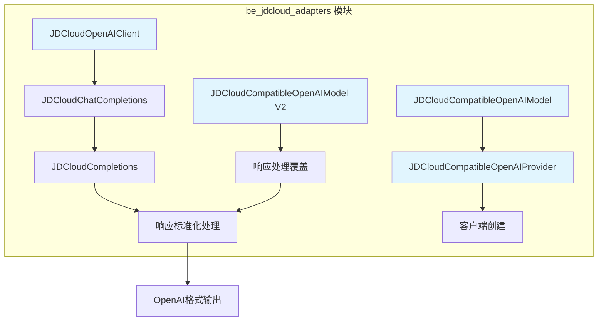
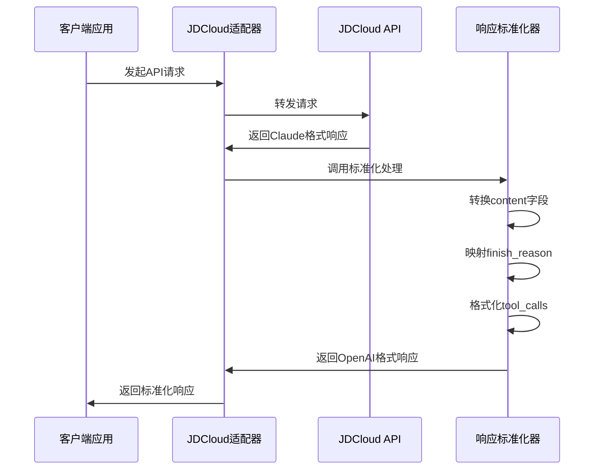
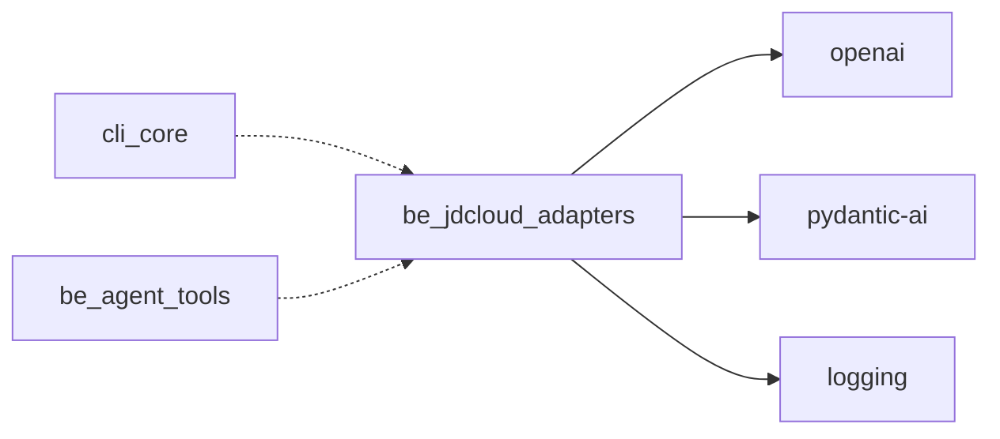

# be_jdcloud_adapters 模块文档

## 概述

be_jdcloud_adapters 模块是 CodeWiki 系统中专门用于适配京东云（JDCloud）Claude API 的适配器模块。该模块的主要目的是将京东云 Claude API 的响应格式转换为与 OpenAI API 兼容的格式，以便与 pydantic-ai 框架无缝集成。

## 模块架构



## 核心功能

### 1. 响应格式标准化

模块的核心功能是将京东云 Claude API 的非标准响应格式转换为 OpenAI 兼容格式：

- **内容字段处理**：将列表格式的 `content` 字段转换为字符串格式
- **完成原因映射**：将 JDCloud 特有的完成原因（如 `end_turn`）映射到 OpenAI 标准（如 `stop`）
- **工具调用格式转换**：将 JDCloud 的工具调用格式转换为 OpenAI 的 function calling 格式

### 2. 多层适配架构

模块提供了三种不同层次的适配方案：

#### 方案一：客户端包装器（jdcloud_adapter.py）
- 通过包装 OpenAI 客户端实现响应标准化
- 在 API 调用层面进行格式转换
- 适用于直接使用 OpenAI 客户端的场景

#### 方案二：Provider 级别适配（jdcloud_pydantic_ai.py）
- 自定义 OpenAI Provider 实现
- 在客户端创建阶段注入响应处理逻辑
- 与 pydantic-ai 框架深度集成

#### 方案三：模型级别适配（jdcloud_pydantic_ai_v2.py）
- 直接覆盖模型的响应处理方法
- 在最低级别进行格式标准化
- 提供最彻底的兼容性保障

## 核心组件

### JDCloudOpenAIClient
- **职责**：OpenAI 客户端的包装器，提供 JDCloud 响应标准化功能
- **关键方法**：`chat.completions.create()` - 创建聊天完成并标准化响应
- **详细文档**：[jdcloud_adapter.md](./jdcloud_adapter.md)

### JDCloudCompatibleOpenAIProvider
- **职责**：创建兼容 JDCloud 的 OpenAI 客户端提供者
- **特点**：自动检测 JDCloud API 并应用相应的响应处理
- **详细文档**：[jdcloud_pydantic_ai.md](./jdcloud_pydantic_ai.md)

### JDCloudCompatibleOpenAIModel
- **职责**：提供 JDCloud 兼容的 OpenAI 模型实现
- **功能**：支持主备模型配置和回退机制
- **详细文档**：[jdcloud_pydantic_ai_v2.md](./jdcloud_pydantic_ai_v2.md)

## 数据流处理



## 使用场景

### 场景1：直接客户端使用
```python
from codewiki.src.be.jdcloud_adapter import JDCloudOpenAIClient

# 包装现有的OpenAI客户端
client = JDCloudOpenAIClient(openai_client)
response = client.chat.completions.create(
    model="claude-3-sonnet",
    messages=[{"role": "user", "content": "Hello"}]
)
```

### 场景2：pydantic-ai 集成
```python
from codewiki.src.be.jdcloud_pydantic_ai import create_jdcloud_compatible_model

# 创建兼容的模型
model = create_jdcloud_compatible_model(
    model_name="claude-3-sonnet",
    base_url="https://ai-api.jdcloud.com",
    api_key="your-api-key"
)
```

### 场景3：主备模型配置
```python
from codewiki.src.be.jdcloud_pydantic_ai import create_jdcloud_compatible_fallback_models

# 创建主备模型配置
fallback_models = create_jdcloud_compatible_fallback_models(
    main_model="claude-3-sonnet",
    fallback_model="claude-3-haiku",
    base_url="https://ai-api.jdcloud.com",
    api_key="your-api-key"
)
```

## 错误处理

模块实现了完善的错误处理机制：

1. **API 调用错误**：捕获并记录 HTTP 错误详情
2. **响应标准化失败**：回退到原始响应格式
3. **网络异常**：提供详细的错误诊断信息
4. **格式转换错误**：记录转换过程中的异常

## 配置选项

### 模型设置
- `temperature`: 控制生成随机性（默认 0.0）
- `max_tokens`: 最大生成令牌数（默认 32768）
- `model_name`: 指定使用的模型名称

### 连接配置
- `base_url`: JDCloud API 基础地址
- `api_key`: API 访问密钥
- `timeout`: 请求超时时间

## 依赖关系



## 最佳实践

### 1. 自动检测
使用 `is_jdcloud_api()` 函数自动检测 API 类型，确保正确的适配逻辑。

### 2. 日志记录
启用调试日志以跟踪响应标准化过程：
```python
import logging
logging.getLogger('codewiki.src.be.jdcloud_adapter').setLevel(logging.DEBUG)
```

### 3. 错误恢复
在响应标准化失败时，模块会自动回退到原始响应，确保系统稳定性。

### 4. 性能优化
- 缓存标准化结果以避免重复处理
- 使用异步客户端提高并发性能
- 合理设置超时时间

## 相关文档

- [OpenAI API 文档](https://platform.openai.com/docs)
- [pydantic-ai 文档](./be_agent_tools.md)
- [代理工具模块](./be_agent_tools.md)
- [配置管理](./be_config.md)