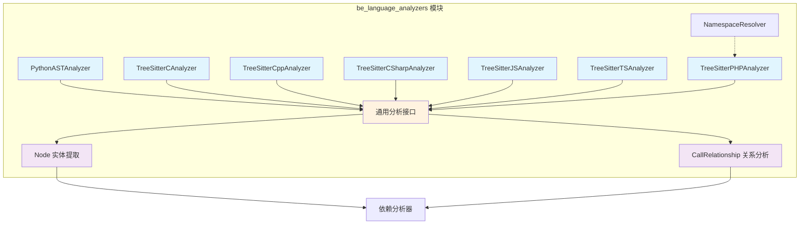
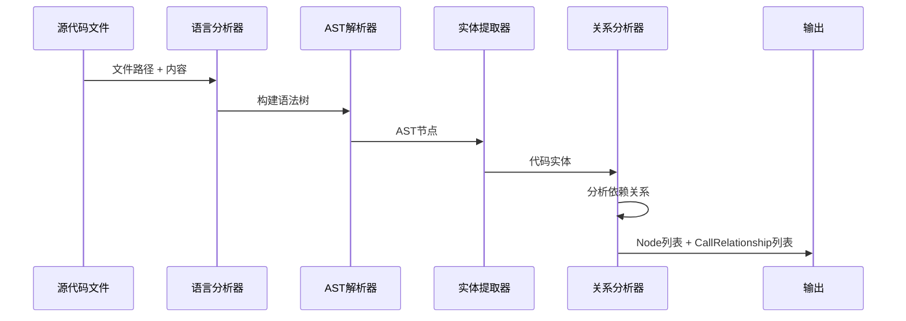
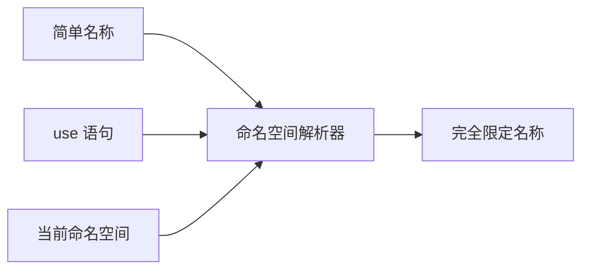
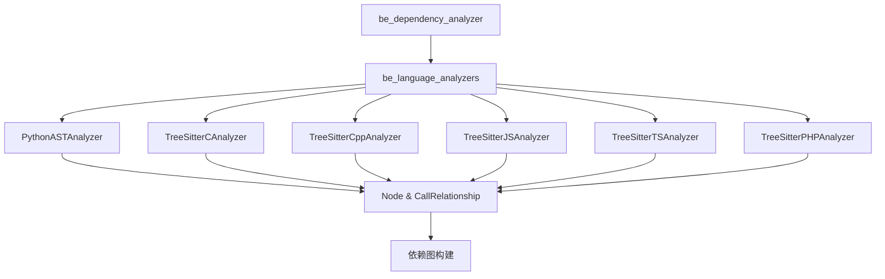
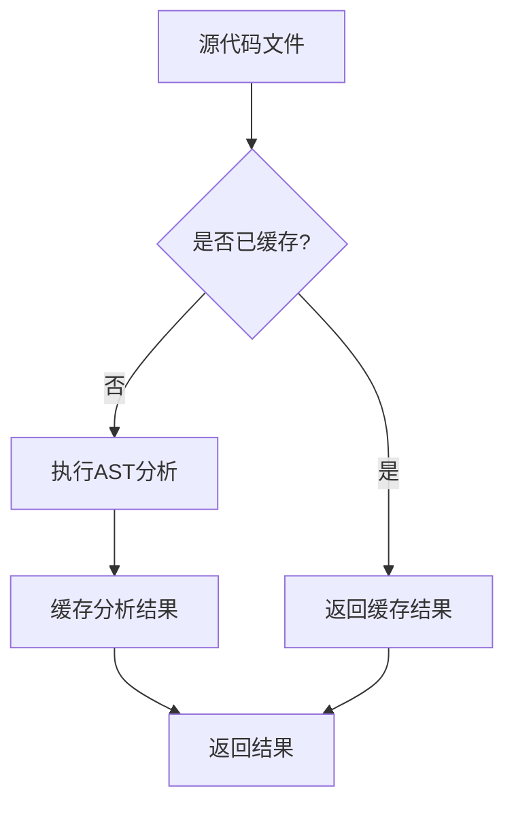

# be_language_analyzers 模块文档

## 概述

`be_language_analyzers` 模块是 CodeWiki 系统的核心组件之一，专门负责多编程语言的代码分析。该模块通过抽象语法树（AST）解析技术，从源代码中提取类、函数、方法等代码实体，并分析它们之间的依赖关系，为整个系统的代码理解和文档生成提供基础数据支持。

## 架构设计

### 核心架构图



### 数据处理流程



## 支持的编程语言

| 语言 | 分析器类 | 文件扩展名 | 主要特性 |
|------|----------|------------|----------|
| Python | PythonASTAnalyzer | .py, .pyx | 基于 AST 模块，支持类继承、函数调用 |
| C | TreeSitterCAnalyzer | .c, .h | 基于 Tree-sitter，支持函数、结构体 |
| C++ | TreeSitterCppAnalyzer | .cpp, .cc, .cxx, .hpp, .h | 支持类、方法、继承、命名空间 |
| C# | TreeSitterCSharpAnalyzer | .cs | 支持类、接口、委托、属性 |
| JavaScript | TreeSitterJSAnalyzer | .js, .jsx, .mjs, .cjs | 支持 ES6+、类、箭头函数、异步函数 |
| TypeScript | TreeSitterTSAnalyzer | .ts, .tsx | 支持类型系统、接口、泛型 |
| PHP | TreeSitterPHPAnalyzer | .php, .phtml, .inc | 支持命名空间、trait、接口、枚举 |

## 核心功能

### 1. 代码实体提取

每个语言分析器都能提取以下类型的代码实体：

- **类（Class）**：包括普通类、抽象类、静态类
- **接口（Interface）**：各种语言的接口定义
- **函数（Function）**：顶层函数定义
- **方法（Method）**：类中的方法，包括静态方法、异步方法
- **结构体（Struct）**：C/C++ 中的结构体定义
- **枚举（Enum）**：各种语言的枚举类型
- **变量（Variable）**：全局变量和常量

### 2. 依赖关系分析

分析器能够识别多种类型的依赖关系：

- **函数调用**：函数之间的调用关系
- **类继承**：子类与父类的继承关系
- **接口实现**：类对接口的实现
- **对象创建**：使用 `new` 关键字创建对象
- **静态调用**：静态方法和属性的调用
- **类型使用**：变量声明中的类型依赖
- **命名空间使用**：PHP 中的 use 语句

### 3. 命名空间解析

对于支持命名空间的语言（如 C++、C#、PHP），分析器提供完整的命名空间解析功能：



## 模块集成

### 与依赖分析器的交互

`be_language_analyzers` 模块作为 [be_dependency_analyzer](be_dependency_analyzer.md) 的子模块，为其提供基础的代码分析能力：



### 数据输出格式

所有分析器都统一输出以下数据结构：

#### Node 实体
```python
{
    "id": "完全限定标识符",
    "name": "实体名称",
    "component_type": "实体类型",
    "file_path": "文件路径",
    "relative_path": "相对路径",
    "source_code": "源代码片段",
    "start_line": "开始行号",
    "end_line": "结束行号",
    "has_docstring": "是否有文档字符串",
    "docstring": "文档内容",
    "parameters": "参数列表",
    "base_classes": "基类列表",
    "class_name": "所属类名"
}
```

#### CallRelationship 关系
```python
{
    "caller": "调用方ID",
    "callee": "被调用方ID", 
    "call_line": "调用发生行号",
    "is_resolved": "是否已解析",
    "relationship_type": "关系类型"
}
```

## 使用示例

### Python 代码分析

```python
from codewiki.src.be.dependency_analyzer.analyzers.python import analyze_python_file

# 分析Python文件
nodes, relationships = analyze_python_file(
    file_path="example.py",
    content=python_source_code,
    repo_path="/project/root"
)
```

### JavaScript 代码分析

```javascript
from codewiki.src.be.dependency_analyzer.analyzers.javascript import analyze_javascript_file_treesitter

// 分析JavaScript文件
nodes, relationships = analyze_javascript_file_treesitter(
    file_path="app.js", 
    content=js_source_code,
    repo_path="/project/root"
)
```

### PHP 代码分析（含命名空间）

```php
from codewiki.src.be.dependency_analyzer.analyzers.php import analyze_php_file

// 分析PHP文件，自动处理命名空间
nodes, relationships = analyze_php_file(
    file_path="UserController.php",
    content=php_source_code,
    repo_path="/project/root"
)
```

## 技术特点

### 1. 多语言统一接口

所有语言分析器都遵循统一的接口设计，便于扩展和维护：

- 一致的初始化参数：`file_path`, `content`, `repo_path`
- 统一的返回格式：`List[Node]`, `List[CallRelationship]`
- 标准化的实体标识符生成规则

### 2. 高性能AST解析

- **Python**: 使用内置 `ast` 模块，性能优异
- **其他语言**: 采用 Tree-sitter 解析器，支持增量解析和错误恢复
- **并行处理**: 支持多文件并行分析

### 3. 智能依赖解析

- **跨文件引用**: 能够解析跨文件的函数调用和类引用
- **命名空间处理**: 完整支持命名空间解析和别名处理
- **内置函数过滤**: 自动过滤语言内置函数和类型

### 4. 错误处理和容错性

- **语法错误容忍**: 即使代码存在语法错误，也能提取有效信息
- **递归深度限制**: 防止栈溢出，处理复杂嵌套代码
- **异常日志记录**: 详细的错误日志便于调试

## 性能优化

### 1. 缓存机制



### 2. 增量分析

- 只分析修改过的文件
- 复用未修改部分的分析结果
- 支持文件级别的变更检测

### 3. 内存管理

- 及时释放大型AST对象
- 使用生成器处理大文件
- 限制同时处理的文件数量

## 扩展指南

### 添加新语言支持

要为新语言添加分析器，需要：

1. **选择解析器**: 选择合适的AST解析库（如 Tree-sitter）
2. **实现分析器类**: 继承统一接口，实现实体提取逻辑
3. **定义实体类型**: 确定该语言的代码实体类型映射
4. **处理依赖关系**: 实现函数调用、类继承等关系提取
5. **编写测试用例**: 覆盖各种语法结构和边界情况

### 扩展现有语言

扩展现有分析器的功能：

1. **添加新实体类型**: 在 `_extract_nodes` 方法中添加新的实体识别逻辑
2. **增强关系分析**: 在 `_extract_relationships` 中添加新的依赖类型
3. **优化性能**: 改进AST遍历算法，减少不必要的递归
4. **改进错误处理**: 增强对语法错误的容错能力

## 子模块详细文档

### 语言分析器子模块

- [Python 分析器](python_analyzer.md) - 基于AST的Python代码分析
- [C 语言分析器](c_analyzer.md) - 基于Tree-sitter的C代码分析
- [C++ 分析器](cpp_analyzer.md) - 支持面向对象特性的C++代码分析
- [C# 分析器](csharp_analyzer.md) - 支持.NET特性的C#代码分析
- [JavaScript 分析器](javascript_analyzer.md) - 支持ES6+的现代JavaScript分析
- [TypeScript 分析器](typescript_analyzer.md) - 支持类型系统的TypeScript分析
- [PHP 分析器](php_analyzer.md) - 支持命名空间的PHP代码分析

## 相关文档

- [be_dependency_analyzer 模块](be_dependency_analyzer.md) - 依赖分析器主模块
- [be_doc_generator 模块](be_doc_generator.md) - 文档生成器
- [cli_doc_pipeline 模块](cli_doc_pipeline.md) - CLI文档处理管道

## 总结

`be_language_analyzers` 模块是 CodeWiki 系统的语言理解核心，通过统一的接口支持多种编程语言的代码分析。它不仅能够准确提取代码实体，还能深入分析复杂的依赖关系，为代码理解、文档生成和依赖分析提供了坚实的基础。模块的高性能、可扩展性和容错性设计使其能够处理各种规模的真实项目代码。