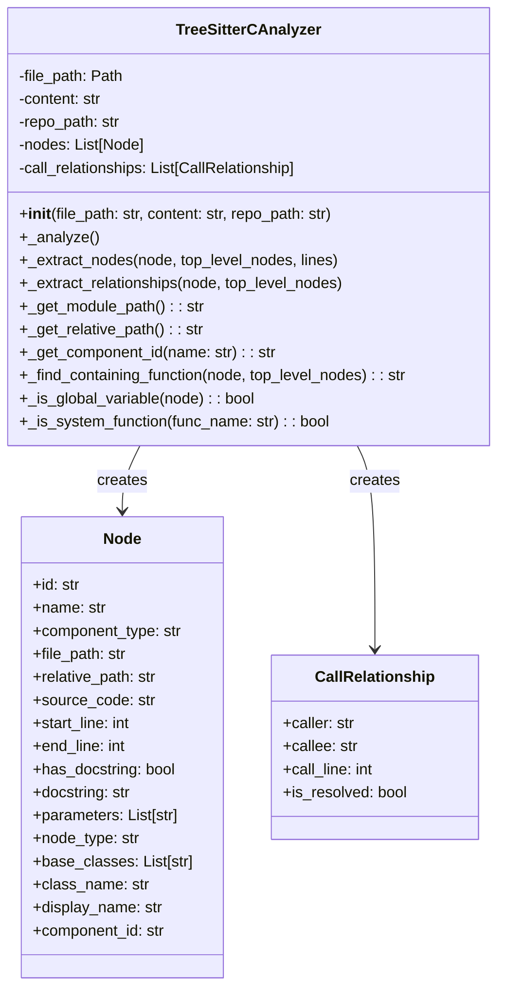
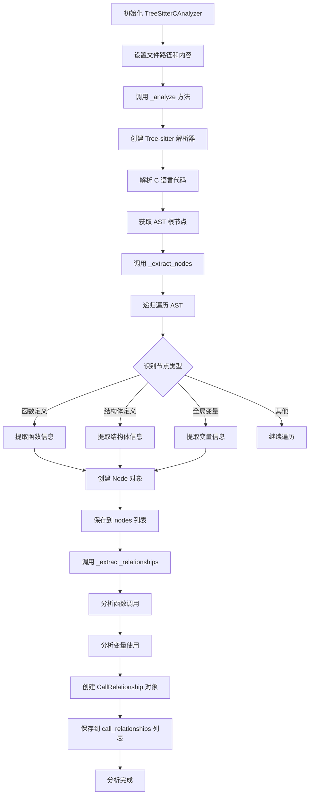
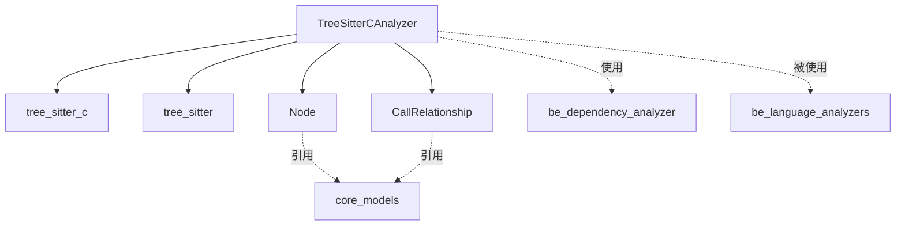

# C 语言分析器模块 (c_analyzer)

## 概述

C 语言分析器模块 (`codewiki.src.be.dependency_analyzer.analyzers.c`) 是 CodeWiki 依赖分析系统中的一个重要组成部分，专门用于解析 C 语言源代码文件，提取代码结构信息，并构建函数调用关系图。该模块基于 Tree-sitter 解析器技术，能够准确识别 C 语言中的函数、结构体、全局变量等元素，并分析它们之间的依赖关系。

## 核心功能

### 1. 代码结构解析
- **函数定义识别**：准确识别 C 语言中的函数定义，包括函数名、参数列表和函数体
- **结构体解析**：识别结构体定义，包括普通结构体和 typedef 定义的结构体
- **全局变量检测**：识别文件级别的全局变量声明
- **代码位置追踪**：记录每个元素在源代码中的精确位置（行号范围）

### 2. 依赖关系分析
- **函数调用关系**：分析函数之间的调用关系，构建调用图
- **变量使用追踪**：跟踪函数对全局变量的使用情况
- **跨文件引用**：支持跨文件的函数和变量引用解析
- **系统函数过滤**：智能识别并过滤标准库函数调用

### 3. 代码元数据提取
- **组件标识生成**：为每个代码元素生成唯一的组件标识符
- **模块路径计算**：基于文件路径计算模块的相对路径和命名空间
- **源代码片段提取**：保存每个元素的原始源代码片段
- **显示名称构建**：为不同类型的代码元素生成友好的显示名称

## 架构设计

### 类结构图



### 处理流程图



### 依赖关系图



## 核心组件详解

### TreeSitterCAnalyzer 类

`TreeSitterCAnalyzer` 是模块的核心类，负责执行 C 语言代码的完整分析流程。

#### 主要属性

| 属性名 | 类型 | 说明 |
|--------|------|------|
| `file_path` | `Path` | 正在分析的 C 文件路径 |
| `content` | `str` | 文件内容 |
| `repo_path` | `str` | 仓库根路径（可选） |
| `nodes` | `List[Node]` | 提取的代码节点列表 |
| `call_relationships` | `List[CallRelationship]` | 调用关系列表 |

#### 关键方法

##### `_analyze()`
执行完整的分析流程，包括：
1. 初始化 Tree-sitter 解析器
2. 解析源代码生成 AST
3. 提取代码节点
4. 分析依赖关系

##### `_extract_nodes()`
递归遍历 AST，识别并提取以下类型的代码元素：
- **函数定义** (`function_definition`)：提取函数名和位置信息
- **结构体定义** (`struct_specifier`)：提取结构体名称
- **类型定义** (`type_definition`)：处理 typedef 定义的结构体
- **全局变量** (`declaration`)：识别文件级别的变量声明

##### `_extract_relationships()`
分析代码元素之间的依赖关系：
- **函数调用关系**：识别函数体内的函数调用表达式
- **变量使用关系**：跟踪函数对全局变量的使用
- **系统函数过滤**：排除标准库函数和常见系统函数

### 辅助方法

#### 路径处理方法

- **`_get_module_path()`**：将文件路径转换为模块命名空间
- **`_get_relative_path()`**：计算相对于仓库根目录的相对路径
- **`_get_component_id()`**：生成唯一的组件标识符

#### 工具方法

- **`_find_containing_function()`**：查找包含指定节点的函数
- **`_is_global_variable()`**：判断变量是否为全局变量
- **`_is_system_function()`**：判断函数是否为系统库函数

## 支持的 C 语言特性

### 函数分析
```c
// 支持的函数定义格式
int add(int a, int b) {
    return a + b;
}

static void helper_function(void) {
    // 静态函数
}

// 包括函数指针
int (*func_ptr)(int, int) = add;
```

### 结构体解析
```c
// 普通结构体定义
struct Point {
    int x;
    int y;
};

// typedef 结构体
typedef struct {
    int width;
    int height;
} Size;
```

### 全局变量识别
```c
// 全局变量
int global_counter = 0;
char* program_name;

// 全局常量
const int MAX_SIZE = 100;
```

### 函数调用分析
```c
void process_data() {
    // 这些调用会被识别并记录
    int result = calculate_sum(10, 20);
    print_result(result);
    
    // 系统函数调用会被过滤
    printf("Result: %d\n", result);
}
```

## 使用示例

### 基本用法

```python
from codewiki.src.be.dependency_analyzer.analyzers.c import TreeSitterCAnalyzer

# 读取 C 文件内容
with open('example.c', 'r') as f:
    content = f.read()

# 创建分析器
analyzer = TreeSitterCAnalyzer('example.c', content, '/path/to/repo')

# 获取分析结果
nodes = analyzer.nodes  # 代码节点列表
relationships = analyzer.call_relationships  # 调用关系列表

# 遍历函数节点
for node in nodes:
    if node.component_type == 'function':
        print(f"函数: {node.name}, 位置: {node.start_line}-{node.end_line}")

# 查看调用关系
for rel in relationships:
    print(f"{rel.caller} -> {rel.callee} (行号: {rel.call_line})")
```

### 函数调用图构建

```python
# 分析多个 C 文件并构建完整的调用图
import os
from pathlib import Path

def analyze_c_project(project_path):
    all_nodes = []
    all_relationships = []
    
    # 遍历所有 C 文件
    for c_file in Path(project_path).rglob('*.c'):
        with open(c_file, 'r') as f:
            content = f.read()
        
        analyzer = TreeSitterCAnalyzer(str(c_file), content, project_path)
        all_nodes.extend(analyzer.nodes)
        all_relationships.extend(analyzer.call_relationships)
    
    return all_nodes, all_relationships

# 使用示例
nodes, relationships = analyze_c_project('/path/to/c/project')
```

## 集成与扩展

### 在依赖分析系统中的作用

C 语言分析器是 [be_dependency_analyzer](be_dependency_analyzer.md) 模块的重要组成部分，它为整个依赖分析系统提供 C 语言特定的解析能力。分析结果被用于：

1. **构建依赖图**：为 [dependency_graphs_builder](be_dependency_analyzer.md#dependency_graphs_builder) 提供节点和关系数据
2. **调用图分析**：支持 [call_graph_analyzer](be_dependency_analyzer.md#call_graph_analyzer) 进行跨文件的调用关系解析
3. **仓库分析**：协助 [repo_analyzer](be_dependency_analyzer.md#repo_analyzer) 进行整体代码结构分析

### 与其他语言分析器的协作

C 语言分析器与其他语言分析器（如 [python_analyzer](python_analyzer.md)、[cpp_analyzer](cpp_analyzer.md) 等）共同构成 [be_language_analyzers](be_language_analyzers.md) 模块，提供多语言的统一分析接口。

### 扩展性

该模块基于 Tree-sitter 技术，具有良好的扩展性：
- **新语言支持**：可以通过类似的方式添加对其他语言的支持
- **新特性识别**：可以轻松扩展以支持更多的 C 语言特性
- **自定义规则**：可以添加项目特定的分析规则

## 性能优化

### 解析性能
- 使用高效的 Tree-sitter 解析器
- 单次遍历完成节点提取和关系分析
- 智能缓存机制避免重复解析

### 内存管理
- 及时释放大型 AST 结构
- 使用生成器模式处理大文件
- 按需加载和解析文件

## 错误处理

### 异常情况
- **文件读取错误**：处理文件不存在或权限问题
- **语法错误**：处理不合法的 C 代码
- **编码问题**：处理不同编码格式的文件

### 容错机制
- 部分语法错误不影响整体分析
- 跳过无法识别的代码结构
- 记录警告信息供后续处理

## 最佳实践

### 使用建议
1. **批量处理**：对于大型项目，建议批量处理文件以提高效率
2. **缓存结果**：分析结果可以缓存以避免重复计算
3. **增量分析**：支持只分析修改过的文件
4. **配置系统函数**：根据项目需要调整系统函数列表

### 注意事项
1. **预处理指令**：当前不处理宏定义和条件编译
2. **复杂类型**：某些复杂的类型定义可能无法完全识别
3. **函数指针**：函数指针的调用关系需要额外处理
4. **跨平台路径**：注意不同操作系统的路径分隔符差异

## 相关文档

- [be_dependency_analyzer](be_dependency_analyzer.md) - 依赖分析器主模块
- [be_language_analyzers](be_language_analyzers.md) - 语言分析器集合
- [core_models](be_dependency_analyzer.md#core_models) - 核心数据模型
- [python_analyzer](python_analyzer.md) - Python 语言分析器
- [cpp_analyzer](cpp_analyzer.md) - C++ 语言分析器