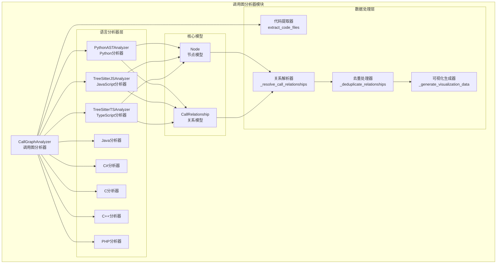
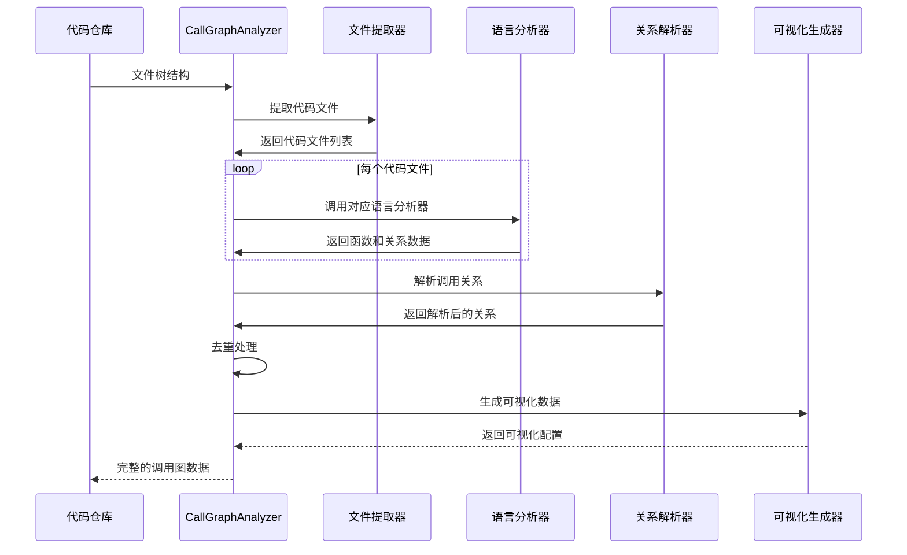
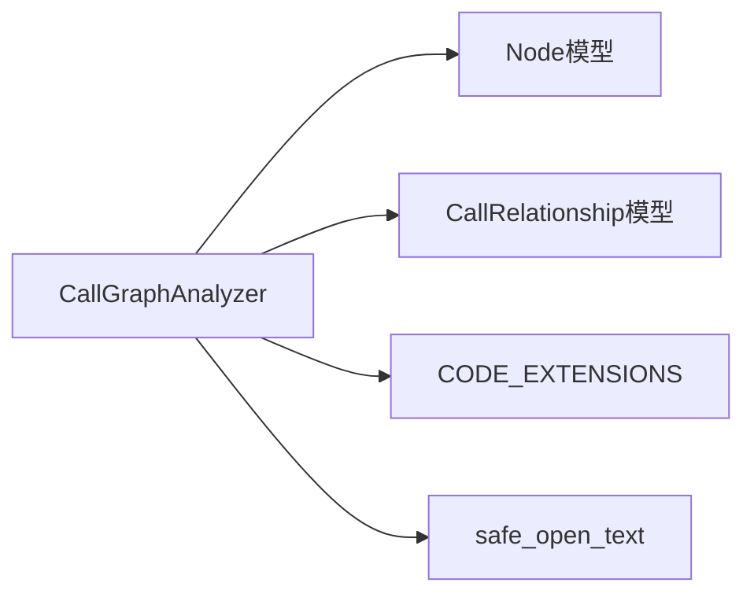

# 调用图分析器模块文档

## 概述

调用图分析器（Call Graph Analyzer）是 CodeWiki 依赖分析系统的核心模块，负责多语言代码的调用关系分析。该模块通过协调不同语言的专用分析器，构建跨语言的完整调用图，帮助开发者理解代码间的复杂依赖关系。

## 核心功能

### 主要能力
- **多语言支持**：支持 Python、JavaScript、TypeScript、Java、C#、C/C++、PHP 等主流编程语言
- **调用关系提取**：自动识别函数/方法间的调用关系
- **跨语言分析**：处理不同语言间的调用关系解析
- **可视化生成**：生成 Cytoscape.js 兼容的可视化数据
- **智能去重**：自动去除重复的调用关系
- **LLM 优化格式**：为大型语言模型提供优化的数据格式

### 分析流程
1. **代码文件提取**：从文件树中筛选支持的代码文件
2. **语言识别**：根据文件扩展名确定编程语言
3. **AST 分析**：调用对应语言的 AST 分析器
4. **关系解析**：匹配函数调用与实际定义
5. **数据整合**：生成统一的调用图数据结构
6. **可视化输出**：创建图形化展示数据

## 架构设计

### 模块架构图



### 数据流图



## 核心组件详解

### CallGraphAnalyzer 类

`CallGraphAnalyzer` 是模块的核心类，负责协调整个调用图分析流程。

#### 主要属性
- `functions`: 字典，存储所有分析的函数节点（键为函数ID，值为Node对象）
- `call_relationships`: 列表，存储所有调用关系（CallRelationship对象）

#### 核心方法

##### analyze_code_files()
完整分析方法，处理所有代码文件并构建完整的调用图。

```python
def analyze_code_files(self, code_files: List[Dict], base_dir: str) -> Dict:
    # 1. 初始化数据存储
    # 2. 遍历分析每个代码文件
    # 3. 解析调用关系
    # 4. 去重处理
    # 5. 生成可视化数据
    # 6. 返回完整分析结果
```

**返回数据结构**：
```json
{
    "call_graph": {
        "total_functions": 150,
        "total_calls": 320,
        "languages_found": ["python", "javascript"],
        "files_analyzed": 25,
        "analysis_approach": "complete_unlimited"
    },
    "functions": [...],
    "relationships": [...],
    "visualization": {...}
}
```

##### extract_code_files()
从文件树中提取支持的代码文件。

**过滤规则**：
- 基于文件扩展名（支持 `.py`, `.js`, `.ts`, `.java`, `.cs`, `.c`, `.cpp`, `.php` 等）
- 排除测试和配置文件（可配置）

##### _analyze_code_file()
根据文件语言路由到对应的分析器。

**支持的语言和处理方式**：
- **Python**: 使用 Python AST 分析器
- **JavaScript/TypeScript**: 使用 Tree-sitter 分析器
- **Java**: 使用 Tree-sitter 分析器
- **C#**: 使用 Tree-sitter 分析器
- **C/C++**: 使用 Tree-sitter 分析器
- **PHP**: 使用 Tree-sitter 分析器

### 关系解析机制

#### _resolve_call_relationships()
解析函数调用关系，将调用者与实际的函数定义进行匹配。

**解析策略**：
1. **精确匹配**：函数ID完全匹配
2. **名称匹配**：仅函数名匹配
3. **组件ID匹配**：使用组件标识符匹配
4. **方法名匹配**：处理类方法调用

**匹配优先级**：
```
func_lookup = {
    "完整函数ID": "目标函数ID",
    "函数名": "目标函数ID", 
    "组件ID": "目标函数ID",
    "方法名": "目标函数ID"
}
```

#### _deduplicate_relationships()
基于调用者-被调用者对去除重复的调用关系。

**去重规则**：
- 使用 `(caller, callee)` 元组作为唯一标识
- 保留第一个出现的关系
- 移除后续重复项

### 可视化数据生成

#### _generate_visualization_data()
生成 Cytoscape.js 兼容的可视化数据。

**节点样式类**：
- `node-method`: 方法节点
- `node-function`: 函数节点
- `lang-python`: Python 语言
- `lang-javascript`: JavaScript 语言
- `lang-typescript`: TypeScript 语言
- `lang-c`: C 语言
- `lang-cpp`: C++ 语言
- `lang-php`: PHP 语言

**边样式类**：
- `edge-call`: 调用关系边

## 依赖关系

### 内部依赖



### 外部依赖

#### 语言分析器模块
- [Python 分析器](be_language_analyzers.md#pythonastanalyzer)
- [JavaScript 分析器](be_language_analyzers.md#treesitterjsanalyzer)
- [TypeScript 分析器](be_language_analyzers.md#treesitttsanalyzer)
- [C/C++ 分析器](be_language_analyzers.md#treesittercanalyzer)
- [C# 分析器](be_language_analyzers.md#treesittercsharpanalyzer)
- [PHP 分析器](be_language_analyzers.md#treesitterphpanalyzer)

#### 核心模型
- [Node 模型](be_dependency_analyzer.md#node模型)
- [CallRelationship 模型](be_dependency_analyzer.md#callrelationship模型)

#### 工具模块
- [CODE_EXTENSIONS 常量](be_dependency_analyzer.md#工具常量)
- [safe_open_text 安全文件读取](be_dependency_analyzer.md#安全工具)

## 使用示例

### 基本使用

```python
from codewiki.src.be.dependency_analyzer.analysis.call_graph_analyzer import CallGraphAnalyzer

# 创建分析器实例
analyzer = CallGraphAnalyzer()

# 准备代码文件列表
code_files = [
    {
        "path": "src/main.py",
        "name": "main.py", 
        "extension": ".py",
        "language": "python"
    },
    {
        "path": "src/utils.js",
        "name": "utils.js",
        "extension": ".js", 
        "language": "javascript"
    }
]

# 执行分析
result = analyzer.analyze_code_files(code_files, "/path/to/repo")

# 访问分析结果
print(f"发现函数: {result['call_graph']['total_functions']}")
print(f"调用关系: {result['call_graph']['total_calls']}")
print(f"支持语言: {result['call_graph']['languages_found']}")
```

### 生成 LLM 格式数据

```python
# 获取适合 LLM 的格式
llm_data = analyzer.generate_llm_format()

# 输出函数信息
for func in llm_data["functions"]:
    print(f"函数: {func['name']}")
    print(f"  文件: {func['file']}")
    print(f"  用途: {func['purpose']}")
    print(f"  递归: {func['is_recursive']}")

# 输出调用关系
for func_name, relations in llm_data["relationships"].items():
    print(f"\n{func_name}:")
    print(f"  调用: {relations['calls']}")
    print(f"  被调用: {relations['called_by']}")
```

## 错误处理

### 异常处理策略

1. **文件读取错误**：使用 `safe_open_text` 安全读取，捕获权限和路径问题
2. **语言分析错误**：每个语言分析器独立异常处理，不影响其他文件
3. **关系解析错误**：记录警告但继续处理，确保分析完整性

### 日志记录

```python
import logging

# 配置日志
logger = logging.getLogger(__name__)

# 错误日志示例
logger.error(f"⚠️ 分析文件错误 {file_path}: {str(e)}")
logger.error(f"堆栈跟踪: {traceback.format_exc()}")
```

## 性能优化

### 内存管理
- 使用字典存储函数节点，避免重复创建
- 按需导入语言分析器，减少内存占用
- 及时清理临时数据

### 处理优化
- 并行处理不同语言的文件（未来扩展）
- 增量分析支持（基于文件修改时间）
- 选择性节点加载（通过 `_select_most_connected_nodes`）

## 扩展指南

### 添加新语言支持

1. **创建语言分析器**：在 `be_language_analyzers` 模块中实现
2. **注册文件扩展名**：更新 `CODE_EXTENSIONS` 常量
3. **添加分析方法**：在 `CallGraphAnalyzer` 中添加 `_analyze_<language>_file` 方法

```python
def _analyze_rust_file(self, file_path: str, content: str, repo_dir: str):
    """分析 Rust 文件"""
    from codewiki.src.be.dependency_analyzer.analyzers.rust import analyze_rust_file
    
    functions, relationships = analyze_rust_file(file_path, content, repo_path=repo_dir)
    
    for func in functions:
        func_id = func.id if func.id else f"{file_path}:{func.name}"
        self.functions[func_id] = func
    
    self.call_relationships.extend(relationships)
```

### 自定义可视化样式

修改 `_generate_visualization_data` 方法中的节点和边样式类：

```python
# 添加自定义样式
node_classes.append("custom-style")
cytoscape_elements.append({
    "data": {
        "id": func_id,
        "label": func_info.name,
        "custom_property": "value"  # 添加自定义属性
    },
    "classes": " ".join(node_classes),
})
```

## 最佳实践

### 1. 文件路径处理
- 始终使用相对路径进行内部处理
- 基础目录用于安全文件读取
- 保持跨平台兼容性

### 2. 错误恢复
- 单个文件分析失败不应影响整体分析
- 记录详细错误信息便于调试
- 提供部分结果而非完全失败

### 3. 性能考虑
- 大型仓库考虑分批处理
- 合理使用内存，避免一次性加载所有数据
- 考虑增量分析减少重复工作

### 4. 数据一致性
- 确保函数ID的唯一性
- 维护调用关系的完整性
- 验证可视化数据的正确性

## 相关文档

- [依赖分析器总览](be_dependency_analyzer.md)
- [语言分析器模块](be_language_analyzers.md)
- [核心数据模型](be_dependency_analyzer.md#核心模型)
- [分析服务](be_dependency_analyzer.md#analysis-service)