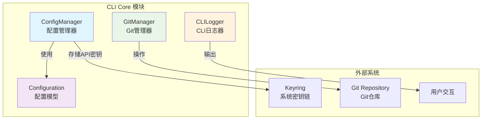
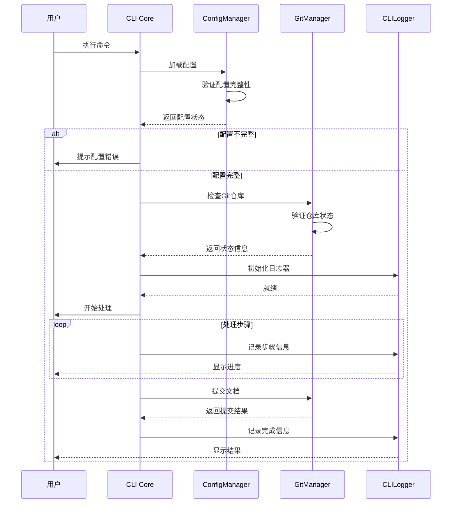
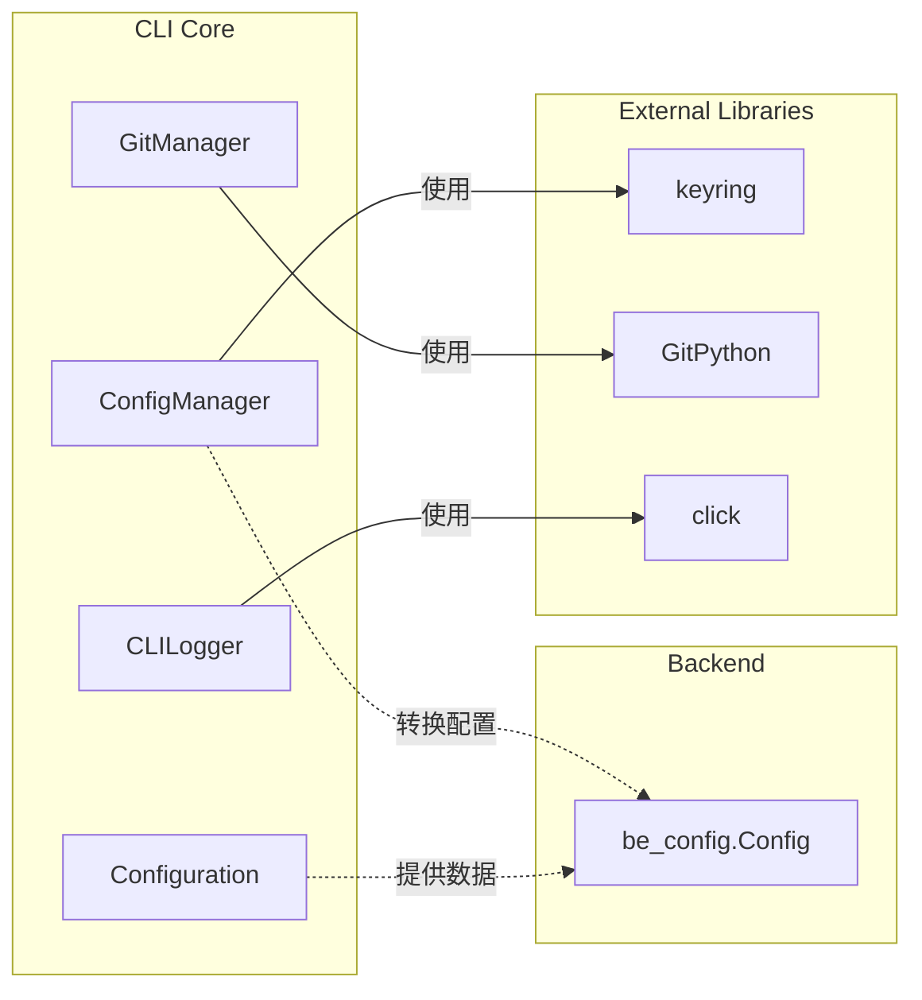

# CLI Core 模块文档

## 概述

CLI Core 模块是 CodeWiki 系统的命令行界面核心，负责管理用户配置、Git 操作和日志记录。该模块为用户提供了与 CodeWiki 系统交互的主要入口点，处理配置管理、安全凭据存储、版本控制集成以及用户友好的日志输出。

## 架构概览



## 核心功能

### 1. 配置管理 (ConfigManager)
负责管理用户配置和安全凭据存储：
- 使用系统密钥链安全存储 API 密钥
- 管理配置文件（~/.codewiki/config.json）
- 提供配置的加载、保存和验证功能
- 支持跨平台凭据存储（macOS Keychain、Windows Credential Manager、Linux Secret Service）

详细文档：[配置管理器](config_manager.md)

### 2. Git 管理 (GitManager)
处理与 Git 仓库的交互操作：
- 检查工作目录状态
- 创建文档分支（带时间戳）
- 提交生成的文档
- 获取远程仓库信息
- 生成 GitHub PR URL

详细文档：[Git管理器](git_manager.md)

### 3. 日志系统 (CLILogger)
提供用户友好的日志输出：
- 支持详细模式和普通模式
- 彩色输出（成功、警告、错误）
- 步骤跟踪和进度显示
- 时间统计功能

详细文档：[CLI日志系统](cli_logging.md)

### 4. 配置模型 (Configuration)
定义配置数据结构：
- LLM API 基础 URL
- 主要模型和聚类模型配置
- 回退模型设置
- 默认输出目录

详细文档：[配置模型](configuration_model.md)

## 数据流图



## 模块依赖关系

CLI Core 模块与其他模块的依赖关系：



## 使用场景

### 1. 首次配置
用户首次使用 CodeWiki 时，需要配置 API 密钥和模型设置：
```bash
codewiki config set --api-key YOUR_API_KEY --base-url https://api.example.com
```

### 2. 文档生成
在 Git 仓库中生成文档：
```bash
codewiki generate --repo /path/to/repo --output docs
```

### 3. 分支管理
创建专门的文档分支：
```bash
codewiki generate --create-branch
```

## 安全特性

1. **API 密钥安全存储**：使用系统密钥链，避免明文存储
2. **配置文件权限**：确保配置文件具有适当的文件权限
3. **验证机制**：对所有配置项进行验证
4. **错误处理**：安全的错误处理和用户提示

## 扩展性

CLI Core 模块设计考虑了扩展性：
- 支持新的配置项和验证规则
- 可扩展的日志格式和输出目标
- 支持多种 Git 托管平台
- 模块化的架构便于添加新功能

## 相关文档

### CLI Core 子模块文档
- [配置管理器详细文档](config_manager.md) - 详细介绍配置管理功能和安全凭据存储
- [Git管理器详细文档](git_manager.md) - 详细介绍Git操作和分支管理功能
- [CLI日志系统详细文档](cli_logging.md) - 详细介绍日志输出和进度显示功能
- [配置模型详细文档](configuration_model.md) - 详细介绍配置数据结构和验证机制

### 相关模块文档
- [CLI文档管道模块](cli_doc_pipeline.md) - 文档生成管道，使用CLI Core的配置管理
- [后端配置模块](be_config.md) - 后端配置系统，接收CLI配置转换
- [前端Web核心模块](fe_web_core.md) - Web界面核心功能
- [共享工具模块](shared_utils.md) - 通用工具函数