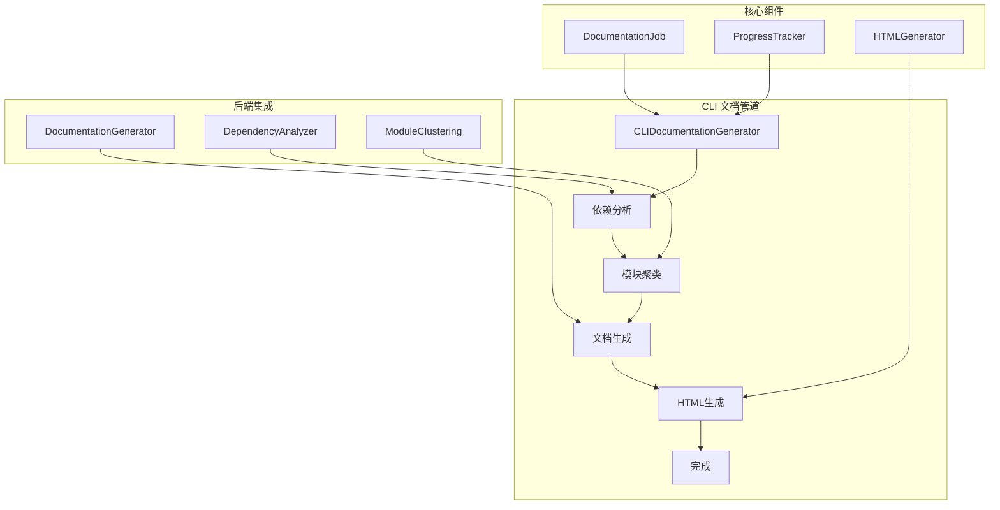
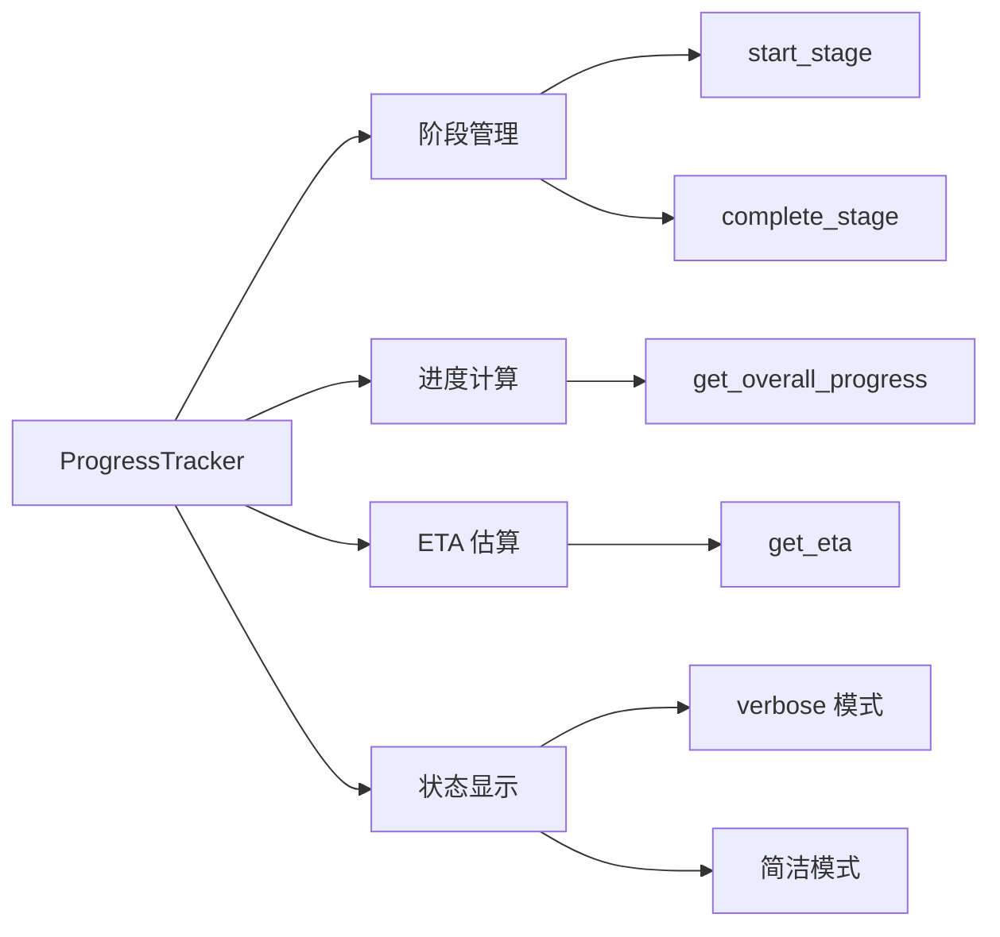
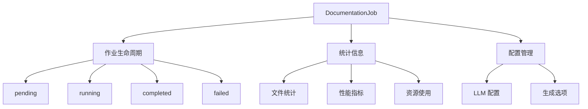
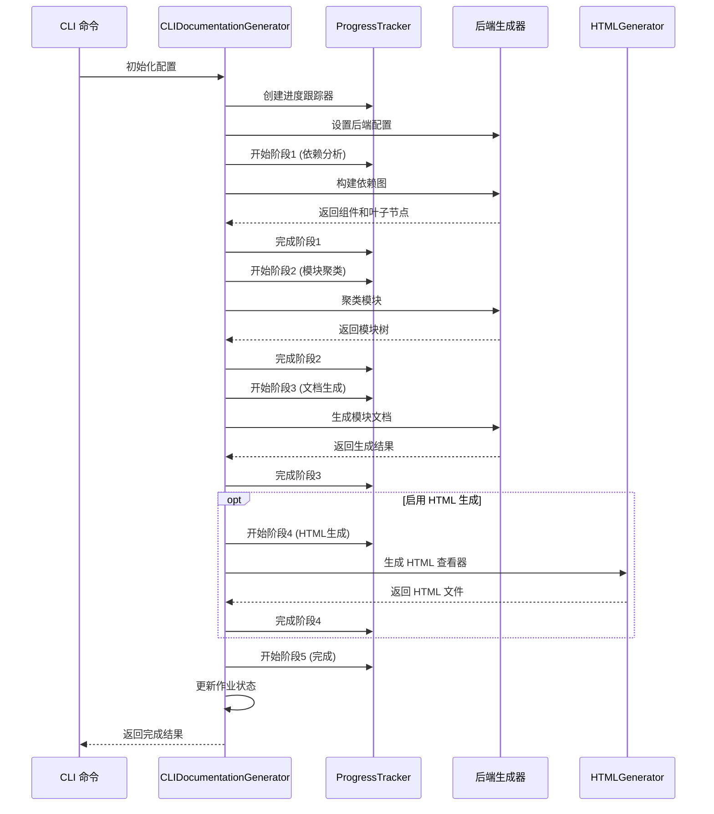

# CLI 文档管道模块

## 概述

CLI 文档管道模块是 CodeWiki 系统的核心组件，负责将代码仓库自动转换为结构化的文档网站。该模块通过命令行界面提供完整的文档生成流程，包括依赖分析、模块聚类、文档生成和 HTML 查看器创建。

## 架构概览



## 核心功能

### 1. 文档生成流程

CLI 文档管道采用五阶段处理流程：

1. **依赖分析阶段** (40% 时间权重)
   - 解析源代码文件
   - 构建依赖关系图
   - 识别叶子节点和组件

2. **模块聚类阶段** (20% 时间权重)
   - 使用 LLM 对模块进行智能聚类
   - 生成模块树结构
   - 创建模块层次关系

3. **文档生成阶段** (30% 时间权重)
   - 为每个模块生成详细文档
   - 创建仓库概览
   - 生成元数据文件

4. **HTML 生成阶段** (5% 时间权重，可选)
   - 生成静态 HTML 查看器
   - 嵌入样式和脚本
   - 支持 GitHub Pages 部署

5. **完成阶段** (5% 时间权重)
   - 更新作业状态
   - 生成统计信息
   - 保存元数据

### 2. 进度跟踪系统



### 3. 作业管理系统



## 核心组件

### CLIDocumentationGenerator

主要的文档生成器类，负责协调整个文档生成流程。

**主要职责：**
- 初始化后端配置
- 管理进度跟踪
- 处理错误和异常
- 生成最终报告

**关键方法：**
- `generate()`: 启动文档生成流程
- `_run_backend_generation()`: 执行后端生成逻辑
- `_run_html_generation()`: 生成 HTML 查看器

详细文档请参考：[文档生成适配器](文档生成适配器.md)

### HTMLGenerator

静态 HTML 文档查看器生成器。

**主要职责：**
- 生成自包含的 HTML 文件
- 支持 GitHub Pages 部署
- 嵌入模块树和元数据
- 提供客户端渲染功能

**关键方法：**
- `generate()`: 生成 HTML 文件
- `load_module_tree()`: 加载模块树结构
- `load_metadata()`: 加载元数据
- `detect_repository_info()`: 检测仓库信息

详细文档请参考：[HTML 生成器](HTML 生成器.md)

### ProgressTracker

多阶段进度跟踪器，提供详细的进度信息和 ETA 估算。

**主要特性：**
- 支持 5 个预定义阶段
- 动态权重计算
- 实时 ETA 估算
- 多种输出模式

详细文档请参考：[进度跟踪器](进度跟踪器.md)

### DocumentationJob

文档生成作业的数据模型，记录完整的作业生命周期。

**核心属性：**
- 作业状态和错误信息
- 文件生成列表
- 统计信息和性能指标
- LLM 配置和生成选项

详细文档请参考：[作业模型](作业模型.md)

## 数据流图



## 配置和集成

### 后端集成

CLI 文档管道通过适配器模式与后端系统集成：

1. **配置适配**: 将 CLI 配置转换为后端配置格式
2. **日志适配**: 统一日志格式和级别
3. **进度适配**: 将后端进度映射到 CLI 进度阶段
4. **错误处理**: 统一错误处理和报告机制

### LLM 配置

支持多种 LLM 配置选项：

- **主模型**: 用于文档生成的主要模型
- **聚类模型**: 用于模块聚类的专用模型
- **基础 URL**: LLM API 端点地址
- **API 密钥**: 访问凭证管理

### 输出格式

生成的文档包含：

- **模块文档**: 每个模块的详细说明文档
- **模块树**: 层次化的模块结构
- **元数据**: 生成过程和统计信息
- **HTML 查看器**: 可选的网页浏览界面

## 相关模块

- [cli_core](cli_core.md): CLI 核心功能模块
- [be_dependency_analyzer](be_dependency_analyzer.md): 后端依赖分析器
- [be_doc_generator](be_doc_generator.md): 后端文档生成器
- [be_language_analyzers](be_language_analyzers.md): 多语言分析器

## 使用示例

```python
# 基本使用
from codewiki.cli.adapters.doc_generator import CLIDocumentationGenerator

generator = CLIDocumentationGenerator(
    repo_path=Path("/path/to/repo"),
    output_dir=Path("./docs"),
    config={
        "main_model": "gpt-4",
        "cluster_model": "gpt-3.5-turbo",
        "base_url": "https://api.openai.com/v1",
        "api_key": "your-api-key"
    },
    verbose=True,
    generate_html=True
)

job = generator.generate()
print(f"生成完成: {job.status}")
print(f"生成文件: {len(job.files_generated)} 个")
```

## 错误处理

CLI 文档管道实现了完善的错误处理机制：

- **API 错误**: LLM API 调用失败的特殊处理
- **文件系统错误**: 读写操作的异常处理
- **配置错误**: 参数验证和错误报告
- **后端错误**: 后端系统异常的转发和处理

所有错误都会记录在作业对象中，便于调试和问题追踪。