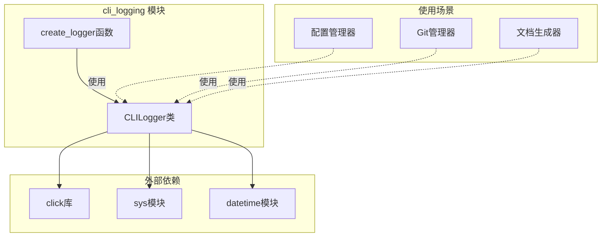
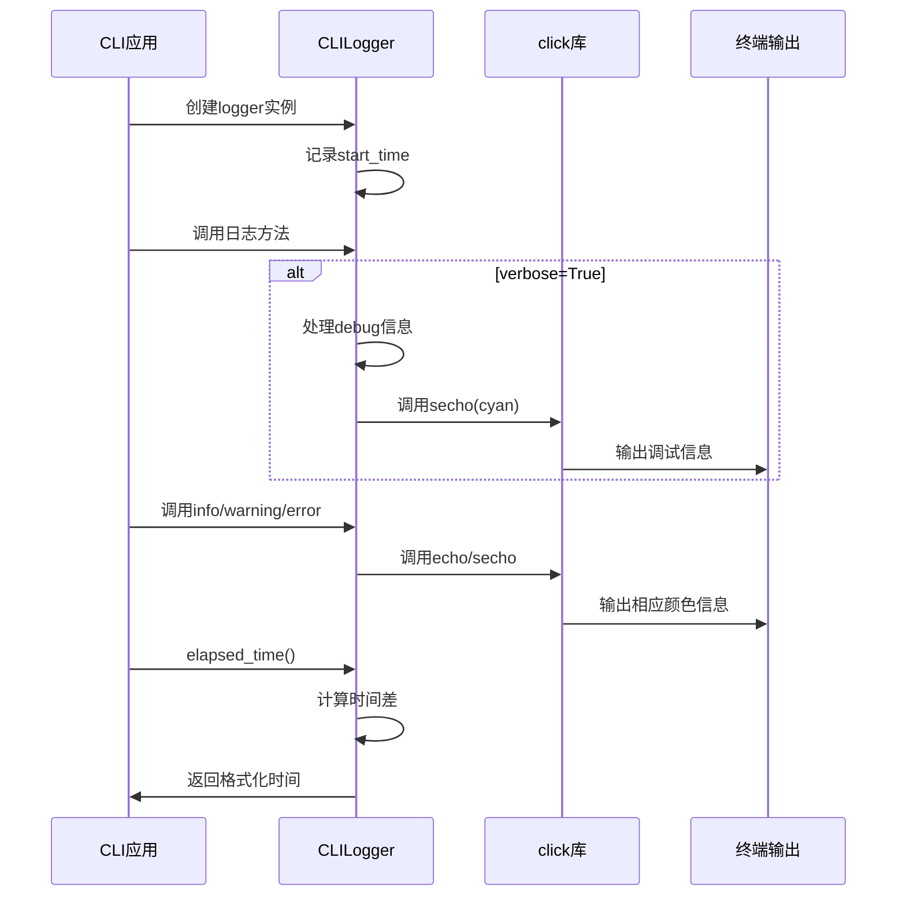

# CLI 日志记录模块文档

## 概述

CLI 日志记录模块（`cli_logging`）是 CodeWiki CLI 系统的核心日志组件，专门设计用于命令行界面的日志输出。该模块提供了带有颜色支持的日志功能，能够根据不同的日志级别显示不同颜色的输出，并支持详细模式和时间跟踪功能。

## 模块定位

在 CodeWiki CLI 系统中，`cli_logging` 模块属于 `cli_core` 父模块，与 [config_manager](config_manager.md)、[git_manager](git_manager.md) 和 [configuration_model](configuration_model.md) 等模块并列，共同构成 CLI 工具的核心功能。

## 核心组件

### CLILogger 类

`CLILogger` 是该模块的核心类，提供了完整的 CLI 日志功能。

#### 主要特性

- **颜色化输出**：使用 `click` 库实现不同级别的彩色日志输出
- **详细模式支持**：可通过 `verbose` 参数控制是否显示调试信息
- **时间跟踪**：自动记录日志器创建时间，可计算运行耗时
- **多种日志级别**：支持 debug、info、success、warning、error 等级别
- **步骤跟踪**：支持带步骤编号的处理流程日志

#### 方法说明

| 方法 | 描述 | 输出颜色 | 使用条件 |
|------|------|----------|----------|
| `debug()` | 调试信息 | 青色（dim） | 仅在 verbose 模式下显示 |
| `info()` | 普通信息 | 默认颜色 | 始终显示 |
| `success()` | 成功信息 | 绿色 | 始终显示 |
| `warning()` | 警告信息 | 黄色 | 始终显示 |
| `error()` | 错误信息 | 红色 | 始终显示，输出到 stderr |
| `step()` | 处理步骤 | 蓝色（bold） | 始终显示 |
| `elapsed_time()` | 获取运行时间 | - | 返回格式化的时间字符串 |

### create_logger() 函数

工厂函数，用于创建 `CLILogger` 实例。

```python
def create_logger(verbose: bool = False) -> CLILogger:
```

## 架构设计

### 模块架构图



### 数据流图



## 使用示例

### 基本使用

```python
from codewiki.cli.utils.logging import create_logger

# 创建普通日志器
logger = create_logger()

# 创建详细日志器
verbose_logger = create_logger(verbose=True)

# 记录不同类型的日志
logger.info("开始处理仓库...")
logger.step("正在分析依赖关系", step=1, total=5)
logger.success("依赖分析完成")
logger.warning("发现潜在的性能问题")
logger.error("无法连接到Git仓库")

# 记录运行时间
print(f"总运行时间: {logger.elapsed_time()}")
```

### 在详细模式下的输出示例

```
[14:32:15] 初始化配置管理器
→ [1/5] 正在加载配置文件
✓ 配置文件加载成功
⚠️  发现过期的配置项
✗ 无法连接到远程仓库
```

## 依赖关系

### 内部依赖

该模块是独立的工具模块，不依赖于 CodeWiki 的其他业务逻辑模块。

### 外部依赖

- **click**: 提供命令行界面的颜色输出功能
- **datetime**: 用于时间戳和运行时间计算
- **sys**: 用于错误输出到 stderr
- **typing**: 提供类型注解支持

### 被依赖关系

`cli_logging` 模块被以下模块使用：

- [config_manager](config_manager.md): 配置管理过程中的日志输出
- [git_manager](git_manager.md): Git 操作的日志记录
- [cli_doc_pipeline](cli_doc_pipeline.md): 文档生成过程的进度跟踪
- 其他 CLI 相关模块

## 设计特点

### 1. 简洁性

模块设计遵循单一职责原则，专注于 CLI 日志功能，不包含复杂的业务逻辑。

### 2. 可配置性

通过 `verbose` 参数控制日志详细程度，适应不同的使用场景。

### 3. 用户体验

使用颜色和图标（✓、⚠️、✗、→）增强可读性，提供良好的命令行交互体验。

### 4. 时间跟踪

内置时间跟踪功能，方便性能监控和调试。

## 扩展性

该模块设计为可扩展的，未来可以考虑添加：

1. **日志持久化**: 支持将日志写入文件
2. **日志格式化**: 支持自定义日志格式
3. **多语言支持**: 支持国际化日志输出
4. **结构化日志**: 支持 JSON 格式的结构化日志

## 最佳实践

1. **统一日志风格**: 在整个 CLI 工具中使用统一的日志风格
2. **合理使用级别**: 根据信息的重要性选择合适的日志级别
3. **步骤跟踪**: 对于长时间运行的任务，使用 `step()` 方法提供进度反馈
4. **错误处理**: 使用 `error()` 方法记录错误信息，便于用户识别问题

## 相关文档

- [config_manager 文档](config_manager.md) - 配置管理模块
- [git_manager 文档](git_manager.md) - Git 管理模块
- [cli_doc_pipeline 文档](cli_doc_pipeline.md) - CLI 文档管道模块