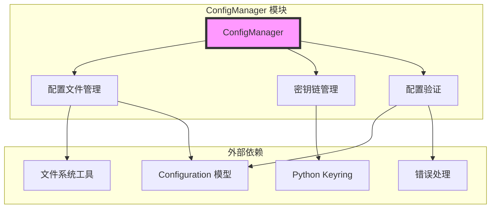
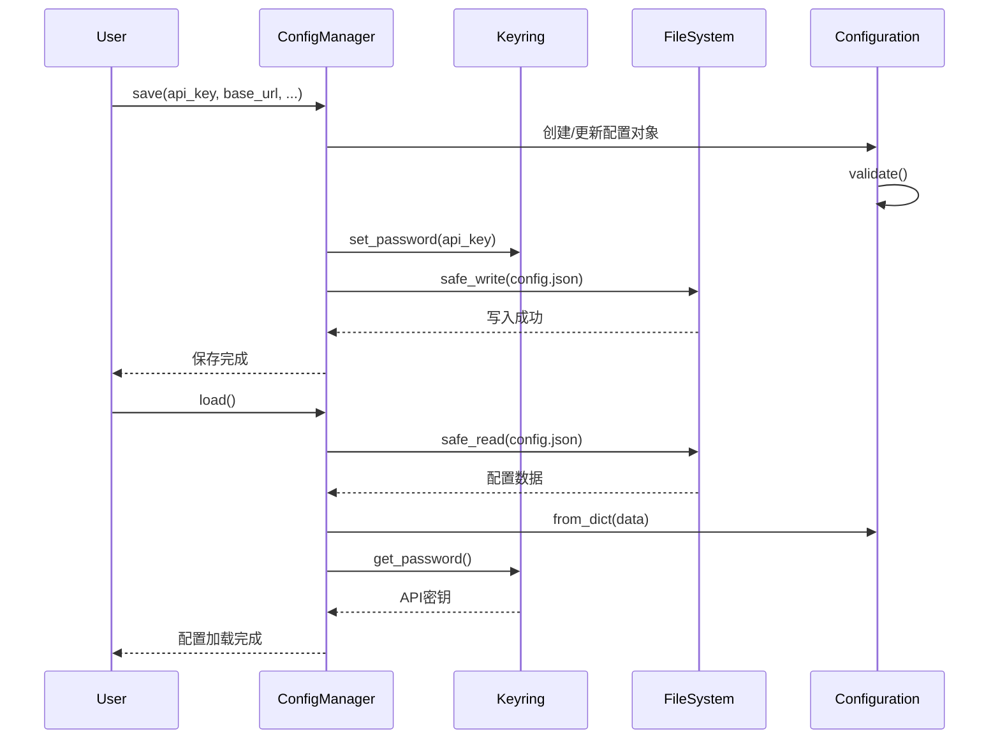
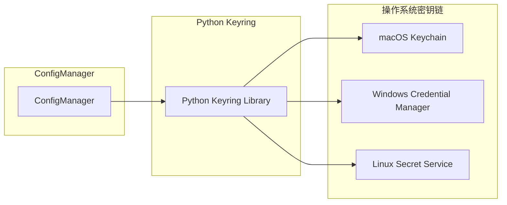
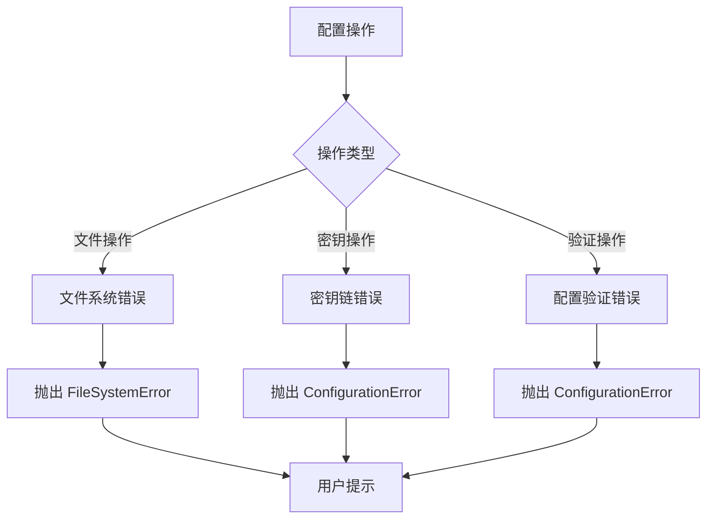
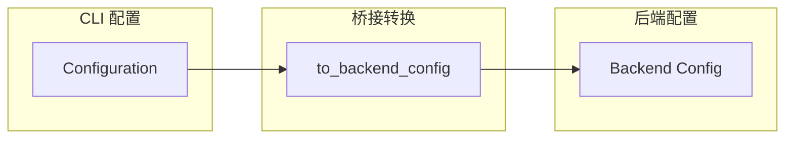

# ConfigManager 模块文档

## 概述

ConfigManager 模块是 CodeWiki CLI 系统的核心配置管理组件，负责管理应用程序的配置设置和安全凭据存储。该模块通过结合本地 JSON 配置文件和系统密钥链（Keychain）服务，提供了一种既方便又安全的配置管理方式。

## 核心功能

### 1. 配置持久化
- 将非敏感配置信息存储在本地 JSON 文件中（`~/.codewiki/config.json`）
- 支持配置版本管理和迁移
- 提供原子性文件写入操作，确保数据完整性

### 2. 安全凭据管理
- 利用系统密钥链服务安全存储 API 密钥
- 支持 macOS Keychain、Windows Credential Manager、Linux Secret Service
- 提供密钥的增删改查操作
- 自动检测密钥链服务可用性

### 3. 配置验证
- 验证配置字段的完整性和有效性
- 提供配置完成状态检查
- 支持与后端配置的桥接转换

## 架构设计

### 组件结构



### 数据流图



## 核心组件详解

### ConfigManager 类

ConfigManager 是模块的核心类，提供了配置管理的所有主要功能：

#### 主要属性
- `_api_key`: 缓存的 API 密钥
- `_config`: Configuration 对象实例
- `_keyring_available`: 密钥链服务可用性状态

#### 关键方法

##### 配置加载与保存
```python
def load(self) -> bool
```
从配置文件和密钥链加载配置信息。返回布尔值表示配置是否存在。

```python
def save(self, api_key: Optional[str] = None, ...)
```
保存配置到文件和密钥链。支持部分更新，只保存提供的参数。

##### 密钥管理
```python
def get_api_key(self) -> Optional[str]
```
从密钥链获取 API 密钥，支持缓存机制。

```python
def delete_api_key(self)
```
从密钥链中删除 API 密钥。

##### 配置状态检查
```python
def is_configured(self) -> bool
```
检查配置是否完整且有效，包括 API 密钥的存在性检查。

### 安全存储机制

#### 密钥链集成
ConfigManager 使用 Python 的 keyring 库与系统密钥链服务集成：



#### 存储位置
- **配置文件**: `~/.codewiki/config.json`
- **API 密钥**: 系统密钥链中的 "codewiki" 服务下

## 使用示例

### 基本配置流程

```python
from codewiki.cli.config_manager import ConfigManager

# 初始化配置管理器
config_manager = ConfigManager()

# 保存配置
config_manager.save(
    api_key="your-api-key-here",
    base_url="https://api.openai.com/v1",
    main_model="gpt-4",
    cluster_model="gpt-3.5-turbo",
    default_output="./docs"
)

# 加载配置
if config_manager.load():
    api_key = config_manager.get_api_key()
    config = config_manager.get_config()
    print(f"已配置模型: {config.main_model}")
```

### 配置验证

```python
# 检查配置完整性
if config_manager.is_configured():
    print("配置已完成")
else:
    print("配置不完整，请检查 API 密钥和必要字段")
```

## 错误处理

ConfigManager 模块定义了专门的错误处理机制：

### ConfigurationError
当配置操作失败时抛出，包括：
- 配置文件读写失败
- 密钥链服务不可用
- 配置验证失败
- 权限问题

### 错误处理流程



## 依赖关系

### 内部依赖
- **[Configuration 模型](configuration_model.md)**: 配置数据结构定义
- **[文件系统工具](cli_core.md)**: 安全的文件读写操作
- **[错误处理](cli_core.md)**: 统一的错误处理机制

### 外部依赖
- **keyring**: Python 密钥链操作库
- **pathlib**: 文件路径操作
- **json**: JSON 数据序列化

## 配置模型转换

ConfigManager 支持与后端配置模型的桥接转换：



这种设计使得用户配置可以无缝转换为后端文档生成所需的配置格式。

## 最佳实践

### 1. 配置初始化
- 在应用程序启动时检查配置状态
- 提供友好的配置引导流程
- 处理密钥链不可用的情况

### 2. 安全配置
- 始终使用系统密钥链存储敏感信息
- 定期验证配置完整性
- 提供配置备份和恢复机制

### 3. 错误处理
- 捕获并适当处理配置相关错误
- 向用户提供清晰的错误信息
- 实现优雅的错误恢复机制

## 扩展性

ConfigManager 模块设计具有良好的扩展性：

### 配置版本管理
- 支持配置文件版本控制
- 可实现配置迁移逻辑
- 向后兼容性保证

### 多环境支持
- 可扩展支持多环境配置
- 支持配置文件的动态切换
- 环境特定的配置验证

### 自定义存储后端
- 支持自定义配置存储后端
- 可集成云配置服务
- 支持配置加密存储

通过合理的设计和实现，ConfigManager 模块为 CodeWiki CLI 系统提供了可靠、安全、易用的配置管理功能，是整个系统稳定运行的重要基础。