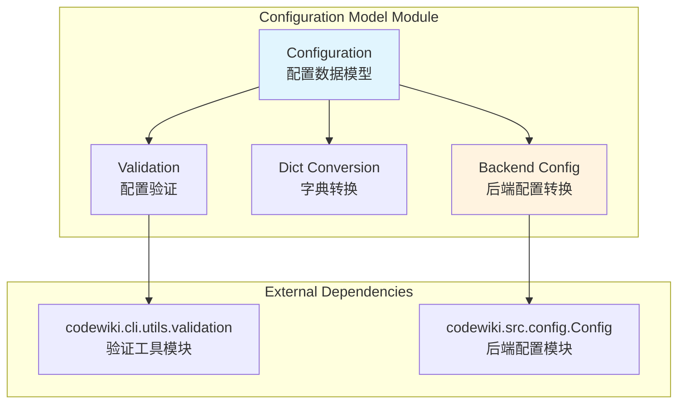
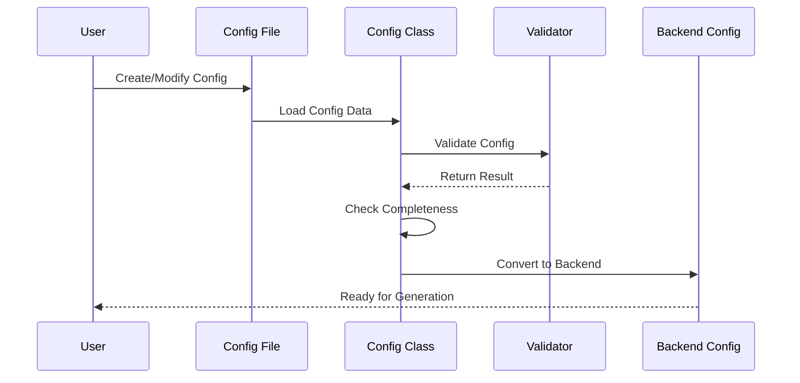
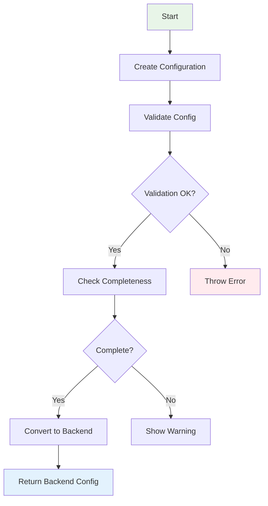

# Configuration Model 模块文档

## 简介

Configuration Model 模块是 CodeWiki CLI 系统的核心配置管理组件，负责定义和管理用户持久化配置数据模型。该模块提供了 Configuration 类，用于表示存储在用户主目录下的配置文件（~/.codewiki/config.json），并在文档生成过程中将 CLI 配置转换为后端配置。

## 核心功能

### 主要特性
- **配置数据模型定义**：定义了 CodeWiki 系统的配置数据结构
- **配置验证**：提供配置字段的验证机制，确保配置的有效性
- **配置持久化**：支持与 JSON 格式的相互转换，便于配置的存储和读取
- **配置转换**：实现 CLI 配置到后端配置的桥接转换
- **完整性检查**：验证必需配置项是否完整

### 配置字段说明

| 字段名 | 类型 | 默认值 | 说明 |
|--------|------|--------|------|
| base_url | string | - | LLM API 基础 URL |
| main_model | string | - | 文档生成的主模型 |
| cluster_model | string | - | 模块聚类使用的模型 |
| fallback_model | string | "glm-4p5" | 文档生成的回退模型 |
| default_output | string | "docs" | 默认输出目录 |

## 架构设计

### 模块依赖关系



### 配置数据流



### 组件交互流程



## 核心组件详解

### Configuration 类

Configuration 类是模块的核心，使用 Python 的 dataclass 装饰器实现，提供了类型安全和自动生成的特殊方法。

#### 主要方法

1. **validate()** - 配置验证
   ```python
   def validate(self):
       """
       验证所有配置字段。
       
       验证内容包括：
       - base_url: URL 格式有效性
       - main_model: 模型名称合法性
       - cluster_model: 模型名称合法性
       - fallback_model: 模型名称合法性
       
       异常：
           ConfigurationError: 验证失败时抛出
       """
   ```

2. **to_dict() / from_dict()** - 字典转换
   ```python
   def to_dict(self) -> dict:
       """将配置对象转换为字典，便于 JSON 序列化"""
   
   @classmethod
   def from_dict(cls, data: dict) -> 'Configuration':
       """从字典创建配置对象，支持默认值处理"""
   ```

3. **is_complete()** - 完整性检查
   ```python
   def is_complete(self) -> bool:
       """
       检查所有必需字段是否已设置。
       必需字段：base_url、main_model、cluster_model、fallback_model
       """
   ```

4. **to_backend_config()** - 后端配置转换
   ```python
   def to_backend_config(self, repo_path: str, output_dir: str, api_key: str):
       """
       将 CLI 配置转换为后端配置，实现配置桥接。
       
       这是连接用户持久化设置和运行时作业配置的关键方法。
       """
   ```

## 使用示例

### 基本使用流程

```python
from codewiki.cli.models.config import Configuration

# 1. 创建配置实例
config = Configuration(
    base_url="https://api.openai.com/v1",
    main_model="gpt-4",
    cluster_model="gpt-3.5-turbo",
    fallback_model="gpt-3.5-turbo",
    default_output="my_docs"
)

# 2. 验证配置
try:
    config.validate()
    print("配置验证通过")
except ConfigurationError as e:
    print(f"配置验证失败: {e}")

# 3. 检查配置完整性
if config.is_complete():
    print("配置完整，可以使用")
else:
    print("配置不完整，需要补充")

# 4. 转换为后端配置
backend_config = config.to_backend_config(
    repo_path="/path/to/repo",
    output_dir="/path/to/output",
    api_key="your-api-key"
)
```

### 配置文件读写

```python
import json
from pathlib import Path

# 保存配置到文件
config_data = config.to_dict()
config_file = Path.home() / ".codewiki" / "config.json"
config_file.parent.mkdir(exist_ok=True)

with open(config_file, 'w', encoding='utf-8') as f:
    json.dump(config_data, f, indent=2, ensure_ascii=False)

# 从文件加载配置
with open(config_file, 'r', encoding='utf-8') as f:
    loaded_data = json.load(f)
    
loaded_config = Configuration.from_dict(loaded_data)
```

## 错误处理

### 配置验证错误

当配置验证失败时，会抛出 `ConfigurationError` 异常，包含具体的错误信息：

```python
from codewiki.cli.utils.validation import ConfigurationError

try:
    config.validate()
except ConfigurationError as e:
    # 处理验证错误
    print(f"配置错误: {e}")
    # 根据错误类型提供相应的修复建议
```

### 常见错误场景

1. **URL 格式错误**：base_url 不符合标准 URL 格式
2. **模型名称无效**：模型名称包含非法字符或不在支持列表中
3. **API 密钥格式错误**：API 密钥不符合预期格式
4. **配置不完整**：必需字段为空或缺失

## 集成与扩展

### 与 ConfigManager 集成

Configuration Model 模块与 [ConfigManager](config_manager.md) 紧密集成，ConfigManager 负责：
- 配置文件的读写管理
- 配置的持久化存储
- 用户交互式的配置更新

### 与后端系统连接

通过 `to_backend_config()` 方法，Configuration 可以无缝转换为后端系统所需的配置格式，实现：
- CLI 配置到后端配置的桥接
- 运行时配置的动态生成
- 多环境配置的支持

## 最佳实践

### 配置管理建议

1. **配置验证时机**：在保存配置前进行验证，确保配置的有效性
2. **默认值处理**：合理使用默认值，简化用户配置过程
3. **错误处理**：提供清晰的错误信息和修复建议
4. **配置备份**：在修改配置前创建备份，便于回滚

### 安全性考虑

1. **敏感信息保护**：API 密钥等敏感信息不应存储在配置文件中
2. **配置加密**：考虑对敏感配置进行加密存储
3. **访问控制**：确保配置文件的访问权限设置正确

## 相关模块

- [ConfigManager](config_manager.md) - 配置文件管理器
- [Backend Config](../be_config.md) - 后端配置模块
- [Validation Utils](../cli_logging.md) - 验证工具模块

## 更新日志

### 当前版本
- 支持基本的配置字段验证
- 提供配置完整性检查
- 实现 CLI 到后端配置的转换
- 支持配置的 JSON 序列化/反序列化

### 未来规划
- 支持配置版本管理
- 提供配置模板功能
- 增强配置验证规则
- 支持多环境配置管理