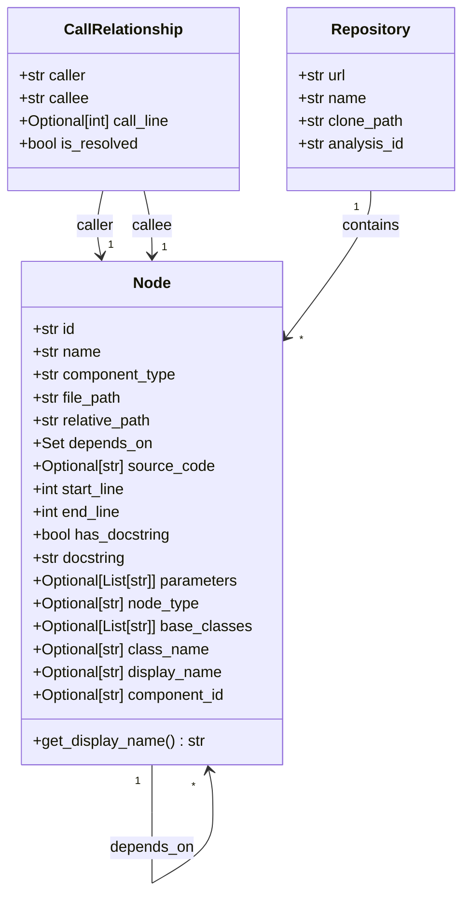
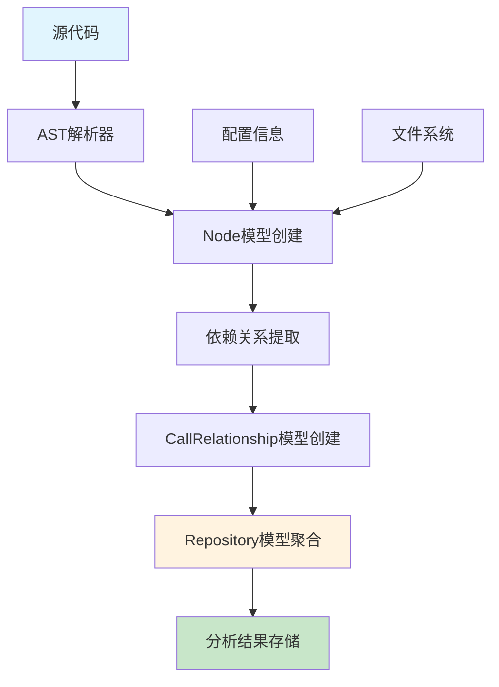
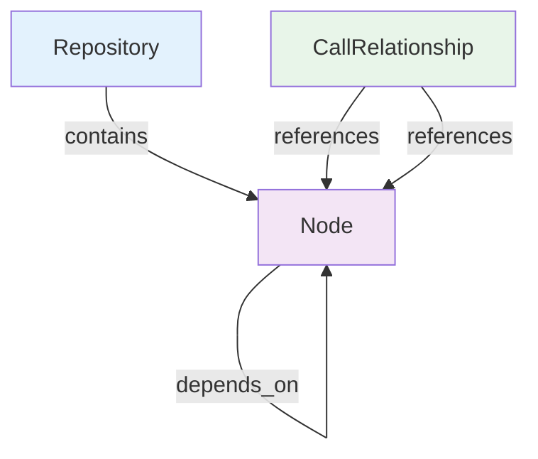
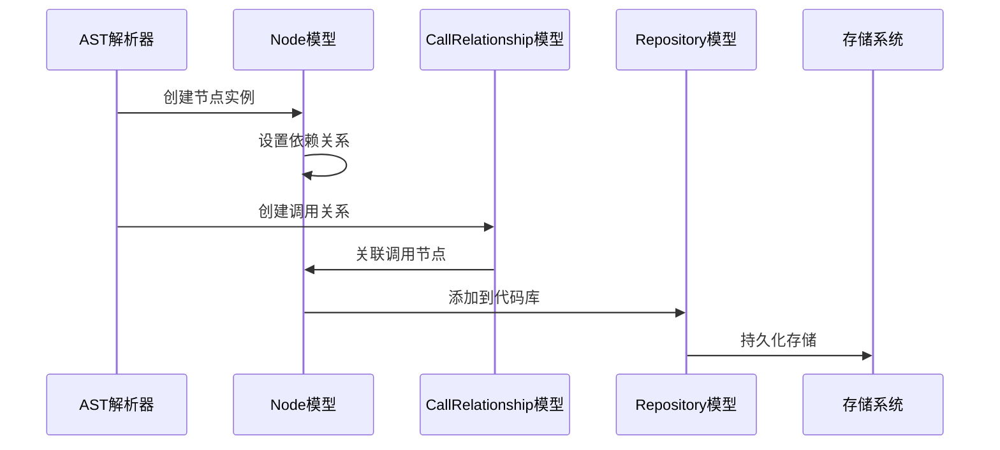

# Core Models 模块文档

## 概述

Core Models 模块是依赖分析器的核心基础模块，定义了代码库分析过程中使用的基本数据模型。该模块提供了表示代码库、代码节点和调用关系的标准化数据结构，为整个依赖分析系统提供了统一的数据抽象层。

## 核心功能

### 1. 代码节点建模 (Node)
- 表示代码库中的各种组件（类、函数、方法等）
- 包含组件的元数据信息（名称、类型、位置等）
- 维护组件间的依赖关系
- 支持源代码和文档字符串的存储

### 2. 调用关系建模 (CallRelationship)
- 表示代码组件之间的调用关系
- 记录调用发生的具体位置
- 支持调用关系的解析状态跟踪

### 3. 代码库建模 (Repository)
- 表示被分析的代码库
- 包含代码库的基本信息和分析标识

## 架构设计

### 核心模型架构图



### 数据流架构



## 组件详细说明

### Node 模型

Node 模型是整个系统的核心数据结构，用于表示代码库中的各种组件。它具有以下特点：

**核心属性：**
- `id`: 唯一标识符，用于在整个系统中引用该节点
- `name`: 组件名称（函数名、类名等）
- `component_type`: 组件类型（如 "function", "class", "method" 等）
- `file_path`: 绝对文件路径
- `relative_path`: 相对路径，便于跨平台使用
- `depends_on`: 依赖的其他组件ID集合

**代码位置信息：**
- `start_line`: 组件在文件中的起始行号
- `end_line`: 组件在文件中的结束行号
- `source_code`: 可选的源代码内容

**文档信息：**
- `has_docstring`: 是否包含文档字符串
- `docstring`: 文档字符串内容

**扩展属性：**
- `parameters`: 函数/方法的参数列表
- `node_type`: 节点类型细分
- `base_classes`: 继承的基类列表
- `class_name`: 所属类名（对方法而言）
- `display_name`: 显示名称，用于界面展示
- `component_id`: 组件ID，用于特定分析场景

### CallRelationship 模型

表示代码组件之间的调用关系，是构建调用图的基础：

**核心属性：**
- `caller`: 调用者节点ID
- `callee`: 被调用者节点ID
- `call_line`: 调用发生的行号
- `is_resolved`: 调用关系是否已解析（用于处理动态调用或间接调用）

### Repository 模型

表示被分析的代码库：

**属性：**
- `url`: 代码库URL（如Git仓库地址）
- `name`: 代码库名称
- `clone_path`: 本地克隆路径
- `analysis_id`: 分析会话的唯一标识

## 依赖关系

### 内部依赖



### 外部依赖

Core Models 模块主要依赖以下外部库：

- **pydantic**: 提供数据验证和序列化功能
- **typing**: Python类型提示支持
- **datetime**: 时间戳处理

## 使用场景

### 1. 代码分析流程



### 2. 依赖图构建

在依赖图构建过程中，Node 和 CallRelationship 模型协同工作：

1. **节点发现**: 通过AST解析识别代码组件，创建Node实例
2. **关系提取**: 分析代码中的调用关系，创建CallRelationship实例
3. **图构建**: 基于节点和关系构建完整的依赖图
4. **分析优化**: 利用is_resolved等属性处理复杂的调用场景

## 集成模块

Core Models 作为基础模块，被以下模块广泛使用：

- [AST解析器](be_dependency_analyzer.md#ast_parser): 使用Node模型表示解析结果
- [依赖图构建器](be_dependency_analyzer.md#dependency_graphs_builder): 基于CallRelationship构建调用图
- [分析服务](be_dependency_analyzer.md#analysis_service): 使用所有核心模型进行分析计算
- [调用图分析器](be_dependency_analyzer.md#call_graph_analyzer): 分析调用关系模式

## 扩展性设计

### 模型扩展

Core Models 采用 Pydantic BaseModel 作为基类，支持：
- **字段扩展**: 可通过继承添加新的模型字段
- **验证规则**: 可自定义字段验证逻辑
- **序列化**: 支持JSON等多种格式的序列化

### 类型安全

通过 Python 类型提示确保：
- 编译时类型检查
- IDE智能提示
- 运行时类型验证

## 最佳实践

### 1. 节点创建

```python
# 创建函数节点
function_node = Node(
    id="math_utils.calculate_sum",
    name="calculate_sum",
    component_type="function",
    file_path="/repo/src/math/utils.py",
    relative_path="src/math/utils.py",
    start_line=10,
    end_line=25,
    has_docstring=True,
    docstring="计算数字列表的总和"
)
```

### 2. 关系建立

```python
# 创建调用关系
call_rel = CallRelationship(
    caller="main.process_data",
    callee="math_utils.calculate_sum",
    call_line=42,
    is_resolved=True
)
```

### 3. 代码库建模

```python
# 创建代码库实例
repository = Repository(
    url="https://github.com/example/repo.git",
    name="example-repo",
    clone_path="/tmp/repo_analysis",
    analysis_id="analysis_123"
)
```

## 性能考虑

### 内存优化
- 使用 `Set` 类型存储依赖关系，提高查找效率
- 源代码可选存储，减少内存占用
- 相对路径使用，避免重复存储绝对路径

### 查询优化
- 节点ID作为唯一标识，支持快速查找
- 依赖关系集合化，便于遍历和查询
- 支持索引和缓存机制

## 错误处理

模型设计考虑了以下错误场景：
- **无效路径**: 通过路径验证确保文件路径有效性
- **循环依赖**: 依赖关系集合防止重复依赖
- **缺失节点**: 调用关系中的节点引用验证
- **类型不匹配**: 通过类型提示和Pydantic验证确保数据一致性