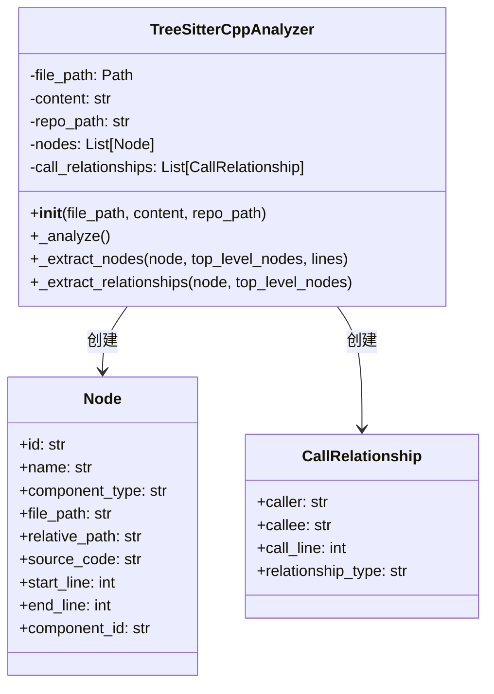
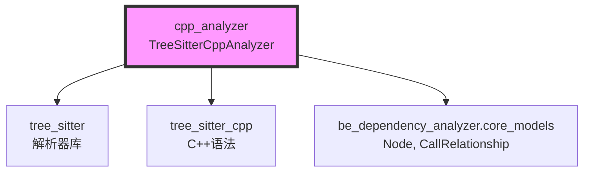
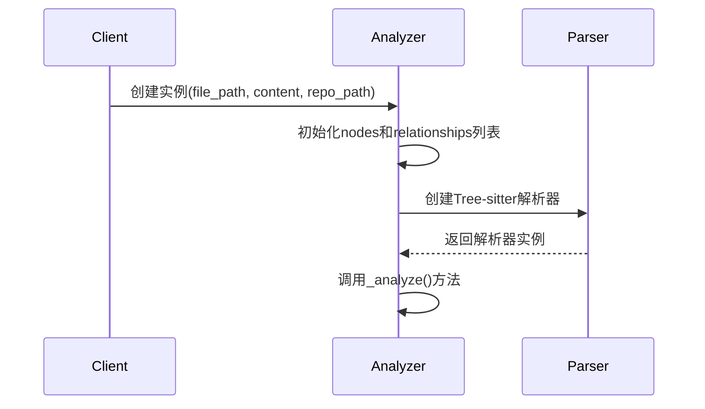
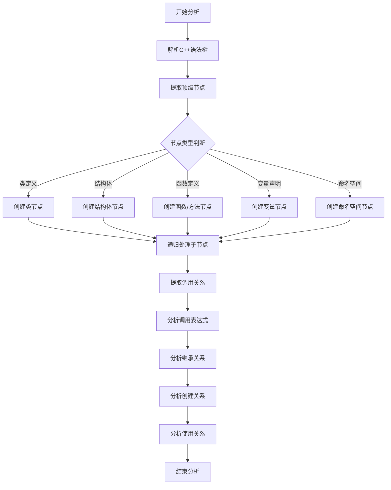
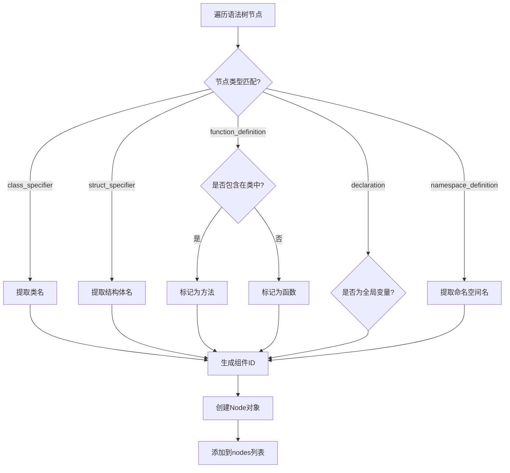

# C++ 分析器模块文档

## 概述

C++ 分析器模块（`cpp_analyzer`）是 CodeWiki 依赖分析系统中的一个重要组成部分，专门用于解析和分析 C++ 源代码文件。该模块基于 Tree-sitter 解析器技术，能够提取 C++ 代码中的各种组件（类、函数、方法、变量等）并构建它们之间的调用关系图。

## 核心功能

### 1. 代码解析
- 使用 Tree-sitter C++ 语法解析器对源代码进行语法分析
- 支持多种 C++ 文件扩展名（.cpp, .cc, .cxx, .hpp, .h）
- 提取代码中的各种组件类型：
  - 类（class）
  - 结构体（struct）
  - 函数（function）
  - 方法（method）
  - 全局变量（variable）
  - 命名空间（namespace）

### 2. 关系分析
- 识别和提取组件之间的调用关系
- 支持多种关系类型：
  - 调用关系（calls）：函数/方法之间的调用
  - 继承关系（inherits）：类之间的继承
  - 创建关系（creates）：对象的实例化
  - 使用关系（uses）：对变量的使用

### 3. 组件标识
- 为每个组件生成唯一的组件ID
- 支持模块路径和类层次结构的标识
- 处理相对路径和绝对路径的转换

## 架构设计

### 核心组件



### 模块依赖关系



## 处理流程

### 1. 初始化阶段


### 2. 分析阶段


### 3. 节点提取流程


## 关键特性

### 1. 智能组件识别
- **类和方法关联**：自动识别类中的方法，生成正确的组件ID（如：`module.ClassName.methodName`）
- **命名空间处理**：支持嵌套命名空间的解析
- **模板支持**：能够处理C++模板类和函数

### 2. 关系类型丰富
- **调用关系**：识别函数调用、方法调用
- **继承关系**：解析类的基类继承
- **创建关系**：跟踪对象的实例化（new表达式）
- **使用关系**：监控变量的使用情况

### 3. 系统函数过滤
- 内置常见系统函数列表（printf、malloc、cout等）
- 自动过滤系统/库函数调用，专注于业务逻辑分析

### 4. 错误处理
- 优雅处理路径解析错误
- 支持相对路径和绝对路径的混合使用
- 异常情况下的安全降级

## 使用示例

```python
from codewiki.src.be.dependency_analyzer.analyzers.cpp import analyze_cpp_file

# 分析C++文件
file_path = "example.cpp"
content = """
class Calculator {
public:
    int add(int a, int b) {
        return a + b;
    }
};

int main() {
    Calculator calc;
    int result = calc.add(5, 3);
    return 0;
}
"""

# 执行分析
nodes, relationships = analyze_cpp_file(file_path, content)

# 输出结果
for node in nodes:
    print(f"组件: {node.name} ({node.component_type})")
    
for rel in relationships:
    print(f"关系: {rel.caller} -> {rel.callee} ({rel.relationship_type})")
```

## 与其他模块的集成

### 1. 依赖分析服务
该模块作为 [be_dependency_analyzer](be_dependency_analyzer.md) 的子模块，为整体的依赖分析提供C++语言特定的解析能力。

### 2. 核心模型
使用 [be_dependency_analyzer.core_models](be_dependency_analyzer.md#核心模型) 中定义的 `Node` 和 `CallRelationship` 模型，确保数据格式的一致性。

### 3. 语言分析器家族
作为 [be_language_analyzers](be_language_analyzers.md) 模块的一部分，与其他语言分析器（Python、JavaScript、TypeScript等）共同构成多语言代码分析能力。

## 性能优化

### 1. 解析效率
- 使用高效的 Tree-sitter 解析器
- 单次遍历完成节点提取和关系分析
- 避免重复的树遍历操作

### 2. 内存管理
- 及时清理临时数据
- 使用生成器模式处理大型文件
- 智能缓存机制

### 3. 扩展性设计
- 模块化的关系提取逻辑
- 易于添加新的关系类型
- 支持自定义组件类型

## 错误处理与调试

### 1. 日志记录
- 使用 Python logging 模块记录分析过程
- 支持不同级别的日志输出
- 详细的错误信息和堆栈跟踪

### 2. 异常处理
- 语法错误的安全处理
- 文件路径异常的降级处理
- 解析失败时的优雅退出

### 3. 调试支持
- 提供详细的调试信息
- 支持分析过程的可视化
- 性能分析工具集成

## 未来发展

### 1. 功能增强
- 支持更多C++11/14/17/20特性
- 模板实例化分析
- 宏定义和预处理指令处理

### 2. 性能优化
- 并行处理多个文件
- 增量分析支持
- 更高效的内存使用

### 3. 集成扩展
- 与IDE插件集成
- 支持更多代码托管平台
- 云端分析服务

## 总结

C++ 分析器模块为 CodeWiki 系统提供了强大的 C++ 代码分析能力，通过 Tree-sitter 技术实现了准确、高效的代码解析和关系提取。该模块不仅能够识别 C++ 代码中的各种组件，还能深入分析它们之间的复杂关系，为代码理解、重构和维护提供了重要的数据基础。

作为多语言分析生态系统的一部分，C++ 分析器与其他语言分析器协同工作，为开发者提供全面的代码分析解决方案。