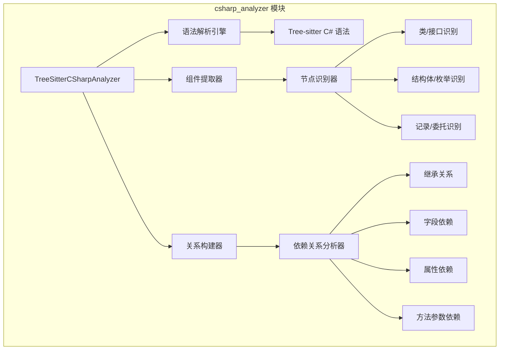
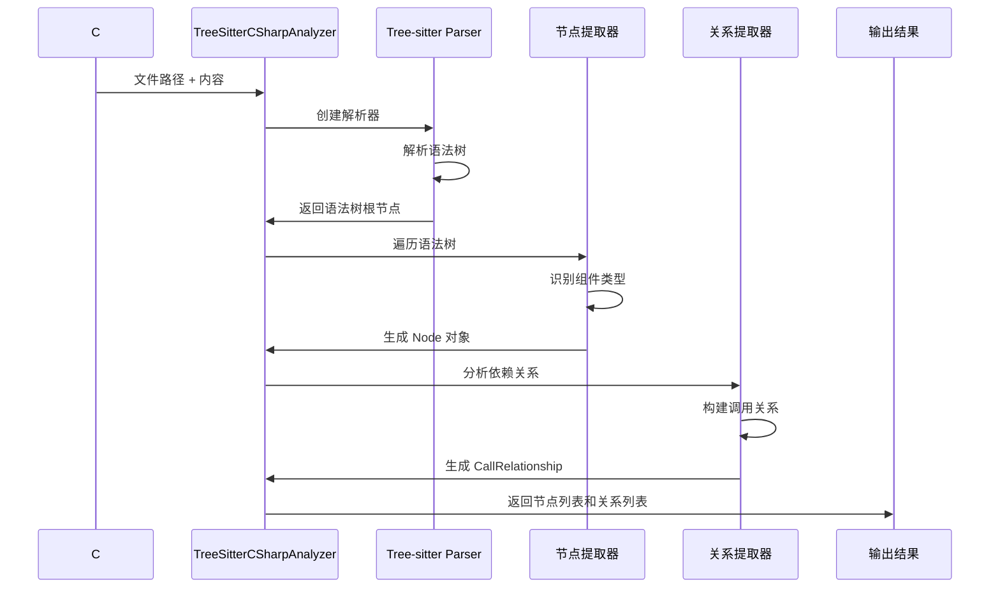
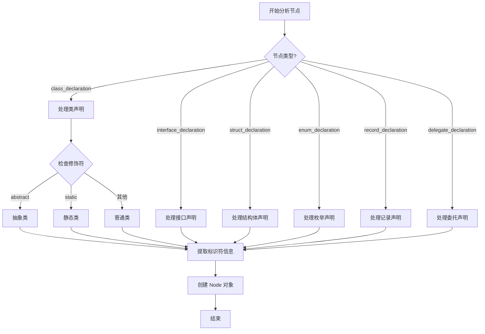
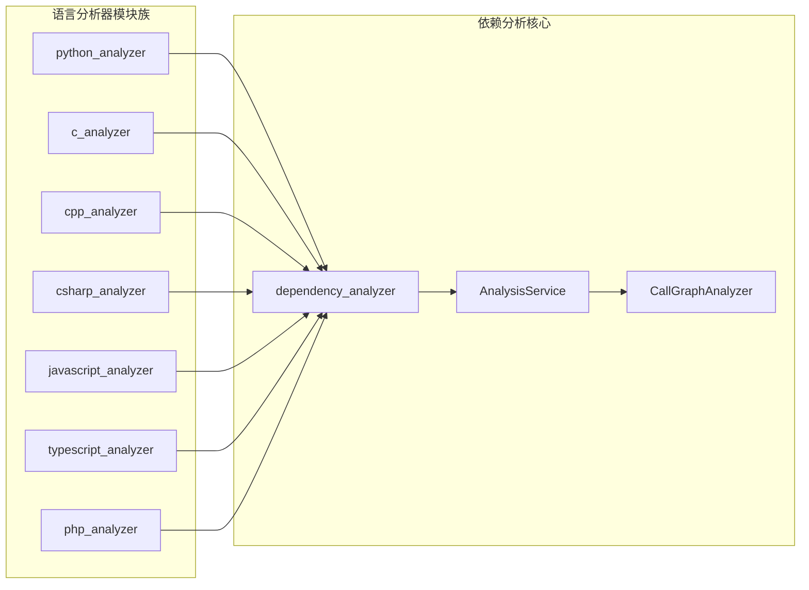
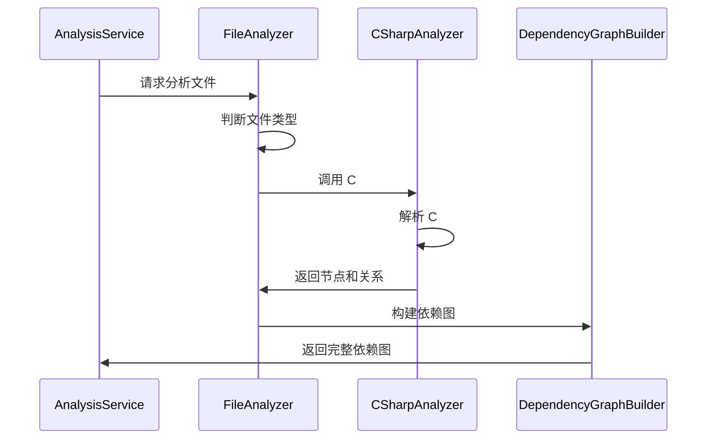

# C# 分析器模块文档

## 概述

C# 分析器模块（`csharp_analyzer`）是 CodeWiki 系统中专门用于分析 C# 源代码的组件。该模块基于 Tree-sitter 解析器构建，能够深入解析 C# 代码结构，提取代码组件信息，并构建组件间的依赖关系图谱。

## 核心功能

### 主要能力
- **语法解析**：使用 Tree-sitter C# 语法解析器精确解析 C# 源代码
- **组件识别**：自动识别类、接口、结构体、枚举、记录和委托等 C# 组件
- **依赖分析**：提取组件之间的继承、实现、字段、属性和方法参数依赖关系
- **类型系统支持**：支持泛型、命名空间、访问修饰符等 C# 特有语法特性
- **代码结构提取**：获取组件的源代码片段、位置信息和元数据

### 支持的 C# 组件类型
- 类（Class）- 包括抽象类、静态类
- 接口（Interface）
- 结构体（Struct）
- 枚举（Enum）
- 记录（Record）
- 委托（Delegate）

## 架构设计

### 模块结构



### 数据流图



## 核心组件详解

### TreeSitterCSharpAnalyzer 类

这是模块的核心类，负责协调整个分析过程：

#### 初始化参数
- `file_path`: 分析的 C# 文件路径
- `content`: 文件内容字符串
- `repo_path`: 可选的仓库根路径，用于计算相对路径

#### 主要方法

##### `_analyze()`
执行完整的分析流程：
1. 初始化 Tree-sitter 解析器和 C# 语言支持
2. 解析源代码生成语法树
3. 提取所有代码组件节点
4. 分析组件间的依赖关系

##### `_extract_nodes()`
递归遍历语法树，识别并提取 C# 组件：
- 根据节点类型判断组件类别
- 提取组件名称、位置、源代码等信息
- 创建 Node 对象并存储

##### `_extract_relationships()`
分析组件间的依赖关系：
- 继承关系（类继承、接口实现）
- 字段类型依赖
- 属性类型依赖
- 方法参数类型依赖

### 组件识别逻辑



## 依赖关系分析

### 支持的依赖类型

#### 1. 继承依赖
```csharp
// 类继承
public class ChildClass : ParentClass { }

// 接口实现
public class MyClass : IInterface { }
```

#### 2. 字段依赖
```csharp
public class MyClass {
    private OtherClass field;  // 依赖 OtherClass
}
```

#### 3. 属性依赖
```csharp
public class MyClass {
    public OtherClass Property { get; set; }  // 依赖 OtherClass
}
```

#### 4. 方法参数依赖
```csharp
public class MyClass {
    public void Method(OtherClass param) { }  // 依赖 OtherClass
}
```

### 类型过滤机制

分析器会过滤掉 C# 的基本类型和常见内置类型，避免产生无意义的依赖关系：

#### 基本类型
- `bool`, `byte`, `char`, `decimal`, `double`, `float`
- `int`, `uint`, `long`, `ulong`, `short`, `ushort`
- `string`, `object`, `void`

#### .NET 内置类型
- `List<T>`, `Dictionary<K,V>`, `IList`, `IDictionary`
- `Task`, `DateTime`, `Guid`, `TimeSpan`

## 集成与使用

### 在系统中的位置

C# 分析器是 `be_language_analyzers` 模块的一部分，与其他语言分析器并列：



### 使用方式

#### 直接调用
```python
from codewiki.src.be.dependency_analyzer.analyzers.csharp import analyze_csharp_file

# 分析 C# 文件
nodes, relationships = analyze_csharp_file(
    file_path="/path/to/file.cs",
    content=cs_source_code,
    repo_path="/path/to/repo"
)
```

#### 在依赖分析服务中使用
C# 分析器被 `AnalysisService` 调用，作为代码分析流程的一部分：



## 数据模型

### Node 对象结构

分析器生成的 Node 对象包含以下信息：

```python
Node(
    id="模块路径.组件名",           # 唯一标识符
    name="组件名称",               # 组件名
    component_type="class|interface|struct|enum|record|delegate",
    file_path="绝对文件路径",       # 文件位置
    relative_path="相对仓库路径",   # 相对路径
    source_code="源代码片段",       # 代码内容
    start_line=起始行号,           # 开始行
    end_line=结束行号,             # 结束行
    has_docstring=False,           # 是否有文档注释
    docstring="",                  # 文档注释内容
    parameters=None,               # 参数信息
    node_type="组件类型",          # 节点类型
    base_classes=None,             # 基类信息
    class_name=None,               # 类名
    display_name="显示名称",        # 显示用名称
    component_id="组件ID"          # 组件标识
)
```

### CallRelationship 对象结构

```python
CallRelationship(
    caller="调用方ID",              # 调用者
    callee="被调用方ID",            # 被调用者
    call_line=调用行号,            # 代码行号
    is_resolved=True/False         # 是否已解析
)
```

## 错误处理与日志

分析器使用 Python 标准日志模块记录分析过程中的重要信息和错误：

```python
import logging
logger = logging.getLogger(__name__)

# 在关键步骤记录日志
logger.info(f"开始分析 C# 文件: {file_path}")
logger.debug(f"识别到组件: {node_name} ({node_type})")
logger.warning(f"无法解析的类型引用: {type_name}")
```

## 性能优化

### 解析性能
- 使用 Tree-sitter 的增量解析能力
- 缓存解析结果避免重复分析
- 并行处理多个文件

### 内存优化
- 流式处理大文件
- 及时释放语法树内存
- 按需提取代码片段

## 扩展性

### 支持新的 C# 特性
分析器设计考虑了 C# 语言的发展，可以轻松添加对新特性的支持：

```python
def _extract_nodes(self, node, top_level_nodes, lines):
    # 添加新的节点类型处理
    if node.type == "new_csharp_feature":
        # 处理新特性
        pass
```

### 自定义依赖规则
可以通过扩展 `_extract_relationships` 方法添加新的依赖关系类型：

```python
def _extract_relationships(self, node, top_level_nodes):
    # 添加自定义依赖分析
    if node.type == "custom_dependency":
        # 分析自定义依赖
        pass
```

## 相关模块

- [依赖分析器核心模块](be_dependency_analyzer.md) - 包含分析服务和依赖图构建器
- [语言分析器族](be_language_analyzers.md) - 其他编程语言的分析器
- [核心模型](be_dependency_analyzer_models.md) - Node 和 CallRelationship 数据模型定义

## 总结

C# 分析器模块为 CodeWiki 系统提供了强大的 C# 代码分析能力。通过 Tree-sitter 解析器和精心设计的分析算法，它能够准确识别 C# 代码结构，提取组件信息，并构建详细的依赖关系图谱。这为代码理解、文档生成、依赖分析等高级功能奠定了坚实基础。