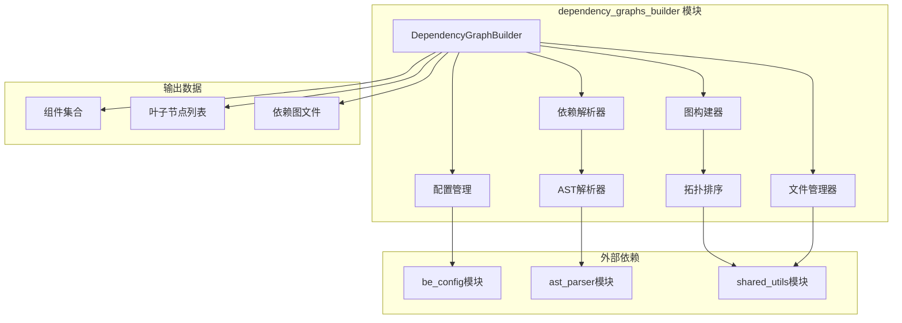
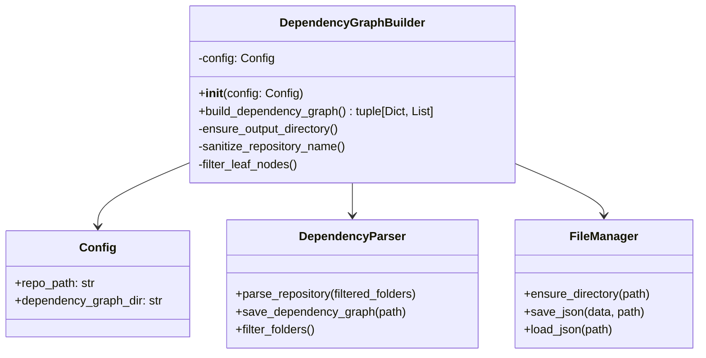
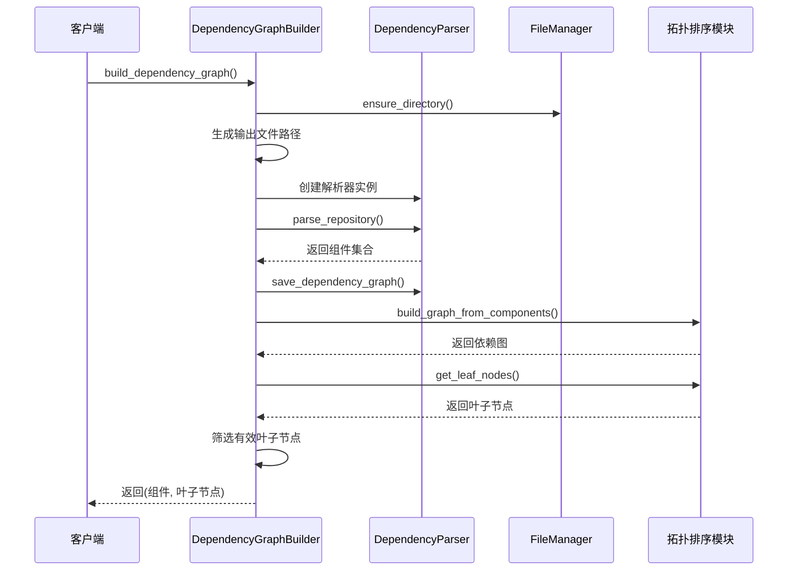
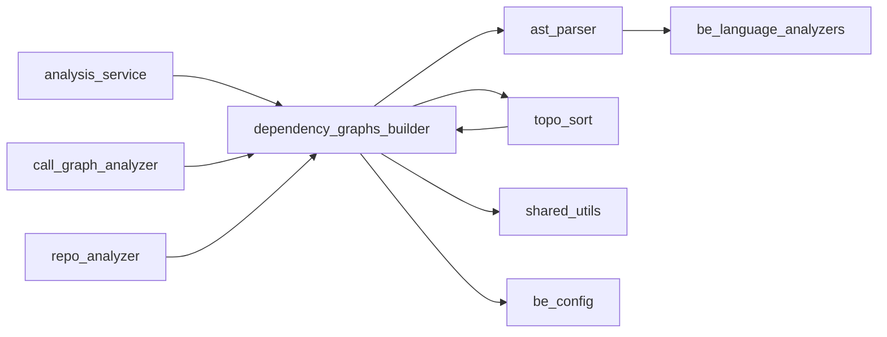

# dependency_graphs_builder 模块文档

## 概述

dependency_graphs_builder 模块是 CodeWiki 依赖分析系统的核心组件，负责构建和管理代码仓库的依赖关系图。该模块通过解析源代码文件，提取组件间的依赖关系，并生成结构化的依赖图，为后续的代码分析和文档生成提供基础数据支持。

## 核心功能

### 1. 依赖图构建
- 解析代码仓库中的所有源代码文件
- 提取类、接口、函数等代码组件
- 分析组件间的依赖关系
- 生成结构化的依赖关系图

### 2. 组件过滤与优化
- 智能识别和过滤无关文件夹
- 根据组件类型筛选有效节点
- 支持多种编程语言的组件识别

### 3. 叶子节点分析
- 自动识别依赖图中的叶子节点
- 根据项目类型智能筛选有效叶子节点
- 为后续分析提供入口点

## 架构设计

### 模块架构图



### 核心组件结构



## 核心组件详解

### DependencyGraphBuilder 类

`DependencyGraphBuilder` 是模块的核心类，负责协调整个依赖图构建流程。

#### 主要属性
- `config`: 系统配置对象，包含仓库路径和输出目录等配置信息

#### 核心方法

##### build_dependency_graph()
构建依赖图的主要方法，执行完整的分析流程：

1. **输出目录准备**: 确保依赖图输出目录存在
2. **仓库名称处理**: 清理仓库名称，生成有效的文件名
3. **依赖解析**: 调用 DependencyParser 解析仓库代码
4. **图构建**: 使用拓扑排序构建依赖关系图
5. **叶子节点筛选**: 识别并筛选有效的叶子节点

**返回值**:
- `components`: 字典，包含所有解析到的代码组件
- `leaf_nodes`: 列表，包含筛选后的叶子节点标识符

**叶子节点筛选逻辑**:
- 自动检测项目类型（基于可用组件类型）
- 对于面向对象项目：只保留类、接口、结构体
- 对于函数式/C语言项目：包含函数作为有效节点
- 过滤无效标识符和错误节点

## 数据流分析

### 依赖图构建流程



### 文件输出结构

依赖图构建完成后，会在配置的输出目录中生成以下文件：

```
dependency_graphs/
├── {repository_name}_dependency_graph.json  # 依赖关系图数据
└── {repository_name}_filtered_folders.json  # 过滤的文件夹列表（可选）
```

## 依赖关系

### 内部依赖
- **ast_parser 模块**: 提供代码解析功能
- **topo_sort 模块**: 提供图构建和拓扑排序功能
- **shared_utils 模块**: 提供文件管理工具

### 外部依赖
- **be_config 模块**: 系统配置管理
- **logging 模块**: 日志记录功能

### 模块间交互



## 使用示例

### 基本使用

```python
from codewiki.src.be.dependency_analyzer.dependency_graphs_builder import DependencyGraphBuilder
from codewiki.src.config import Config

# 创建配置
config = Config()
config.repo_path = "/path/to/repository"
config.dependency_graph_dir = "/path/to/output"

# 构建依赖图
builder = DependencyGraphBuilder(config)
components, leaf_nodes = builder.build_dependency_graph()

# 使用结果
print(f"解析到 {len(components)} 个组件")
print(f"识别到 {len(leaf_nodes)} 个叶子节点")
```

### 结果处理

```python
# 遍历所有组件
for component_id, component in components.items():
    print(f"组件: {component.name}")
    print(f"类型: {component.component_type}")
    print(f"依赖: {component.dependencies}")

# 分析叶子节点
for leaf_node in leaf_nodes:
    component = components[leaf_node]
    print(f"叶子节点: {component.name}")
```

## 配置参数

### 必需配置
- `repo_path`: 代码仓库路径
- `dependency_graph_dir`: 依赖图输出目录

### 可选配置
- 其他配置项通过 Config 对象传递

## 错误处理

### 异常情况
1. **路径错误**: 仓库路径不存在或无访问权限
2. **解析错误**: 代码文件格式不支持或语法错误
3. **内存限制**: 大型项目可能导致内存不足

### 日志记录
- 使用标准 logging 模块记录操作过程
- 警告信息用于标识潜在问题
- 调试信息用于详细跟踪执行过程

## 性能优化

### 内存管理
- 流式处理大文件，避免一次性加载
- 及时释放不再使用的对象
- 使用生成器处理大型组件集合

### 缓存策略
- 支持过滤文件夹缓存（可选功能）
- 避免重复解析未变更的文件
- 增量更新依赖图

## 扩展性

### 支持新语言
通过扩展 ast_parser 模块来支持新的编程语言：

1. 实现新的语言分析器
2. 注册到 DependencyParser
3. 更新组件类型识别逻辑

### 自定义过滤规则
可以通过继承 DependencyGraphBuilder 类来添加自定义过滤逻辑：

```python
class CustomDependencyGraphBuilder(DependencyGraphBuilder):
    def filter_leaf_nodes(self, components, leaf_nodes):
        # 自定义筛选逻辑
        return super().filter_leaf_nodes(components, leaf_nodes)
```

## 相关模块

- [ast_parser 模块文档](ast_parser.md): 代码解析功能
- [analysis_service 模块文档](analysis_service.md): 分析服务
- [be_config 模块文档](be_config.md): 系统配置
- [shared_utils 模块文档](shared_utils.md): 工具函数

## 更新日志

### 当前版本
- 支持多种编程语言的依赖分析
- 智能叶子节点筛选
- 灵活的配置管理
- 完善的错误处理

### 计划功能
- 增量更新支持
- 并行处理优化
- 更丰富的依赖关系类型
- 可视化依赖图生成