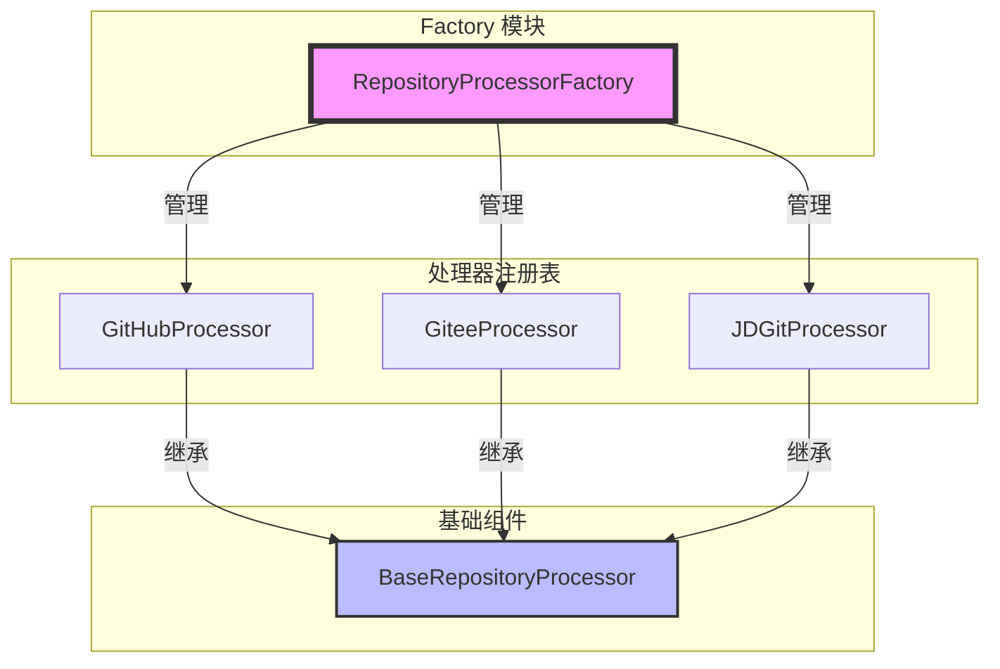
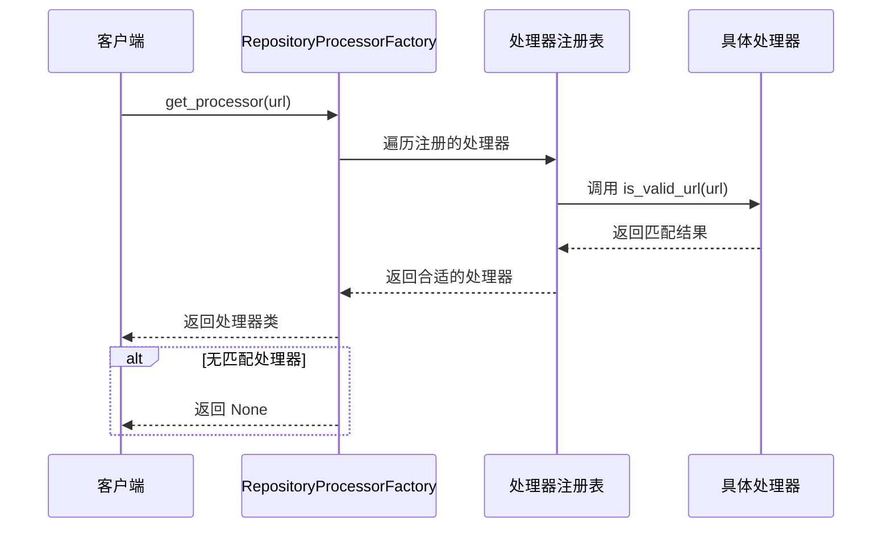
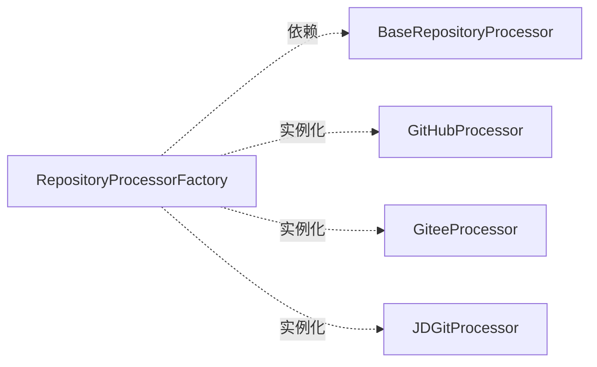

# Factory 模块文档

## 概述

Factory 模块是 CodeWiki 前端仓库处理器系统的核心组件，负责自动选择和创建适合的仓库处理器实例。该模块通过工厂模式实现了对不同代码托管平台（GitHub、Gitee、京东 Git 等）的统一处理接口。

## 核心功能

- **自动处理器选择**：根据仓库 URL 自动识别并选择合适的处理器
- **处理器注册机制**：支持动态注册新的处理器类型
- **平台支持检测**：提供平台支持检测和查询功能
- **统一接口**：为不同类型的仓库提供统一的处理接口

## 架构设计

### 组件结构图



### 工厂模式工作流程



## 核心组件

### RepositoryProcessorFactory

`RepositoryProcessorFactory` 是工厂模式的核心实现类，提供了以下主要功能：

#### 类属性

- `_processors`: 存储所有注册的处理器类列表

#### 类方法

| 方法 | 描述 | 参数 | 返回值 |
|------|------|------|--------|
| `register_processor()` | 注册新的处理器 | `processor_class`: 处理器类 | 无 |
| `get_processor()` | 根据 URL 获取合适的处理器 | `url`: 仓库 URL | 处理器类或 None |
| `is_supported_url()` | 检查 URL 是否受支持 | `url`: 仓库 URL | 布尔值 |
| `get_supported_platforms()` | 获取支持的平台列表 | 无 | 平台名称列表 |
| `get_supported_domains()` | 获取支持的域名列表 | 无 | 域名列表 |
| `get_processor_by_platform()` | 根据平台名称获取处理器 | `platform_name`: 平台名称 | 处理器类或 None |

## 依赖关系

### 内部依赖



### 相关模块

- [base_processor](base_processor.md): 提供基础处理器接口
- [github_processor](github_processor.md): GitHub 平台处理器实现
- [gitee_processor](gitee_processor.md): Gitee 平台处理器实现
- [jd_git_processor](jd_git_processor.md): 京东 Git 平台处理器实现

## 使用示例

### 基本使用

```python
from codewiki.src.fe.repository_processors.factory import RepositoryProcessorFactory

# 获取合适的处理器
url = "https://github.com/user/repo"
processor_class = RepositoryProcessorFactory.get_processor(url)

if processor_class:
    # 创建处理器实例
    processor = processor_class()
    # 使用处理器处理仓库
    result = processor.process(url)
else:
    print("不支持的仓库类型")
```

### 检查平台支持

```python
# 检查 URL 是否受支持
if RepositoryProcessorFactory.is_supported_url(url):
    print("支持的仓库类型")

# 获取所有支持的平台
platforms = RepositoryProcessorFactory.get_supported_platforms()
print(f"支持的平台: {platforms}")

# 根据平台名称获取处理器
processor = RepositoryProcessorFactory.get_processor_by_platform("github")
```

### 注册自定义处理器

```python
from codewiki.src.fe.repository_processors.base_processor import BaseRepositoryProcessor

class CustomProcessor(BaseRepositoryProcessor):
    PLATFORM_NAME = "custom"
    
    @classmethod
    def is_valid_url(cls, url: str) -> bool:
        return "custom.com" in url

# 注册自定义处理器
RepositoryProcessorFactory.register_processor(CustomProcessor)
```

## 扩展性设计

### 处理器注册机制

工厂类采用类级别的处理器注册表，支持运行时动态注册新的处理器类型。这种设计使得系统能够轻松扩展支持新的代码托管平台。

### 自动发现机制

通过遍历注册表中的处理器并调用其 `is_valid_url()` 方法，实现自动的处理器选择，无需手动指定平台类型。

### 统一接口

所有处理器都继承自 `BaseRepositoryProcessor`，确保了一致的接口和行为，便于工厂类进行统一管理和调用。

## 错误处理

- 当 URL 不受任何处理器支持时，`get_processor()` 方法返回 `None`
- 当根据平台名称找不到处理器时，`get_processor_by_platform()` 方法返回 `None`
- 注册重复处理器时不会报错，但也不会重复添加

## 性能考虑

- 处理器注册表使用列表存储，查找操作的时间复杂度为 O(n)，其中 n 为处理器数量
- 由于处理器数量通常较少（3-5个），这种设计在性能上是可接受的
- 支持通过平台名称直接获取处理器，提供 O(1) 的查找性能

## 最佳实践

1. **处理器实现**：新的处理器必须正确实现 `is_valid_url()` 类方法和 `PLATFORM_NAME` 类属性
2. **错误处理**：使用工厂方法时始终检查返回值是否为 None
3. **扩展注册**：在应用启动时注册自定义处理器
4. **平台命名**：使用清晰、唯一的平台名称避免冲突