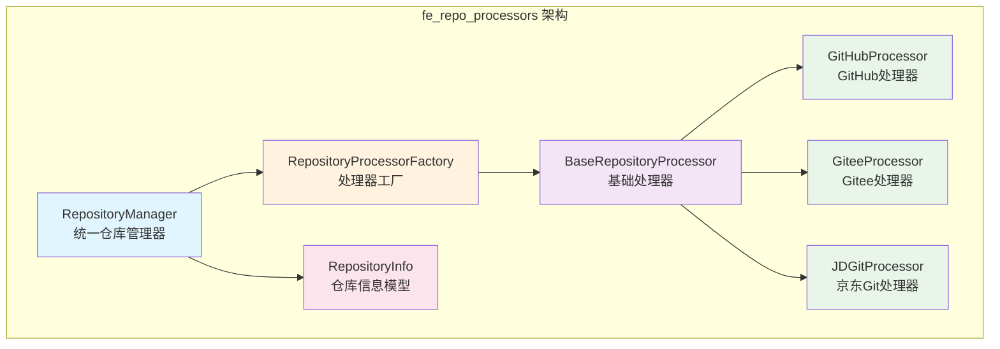
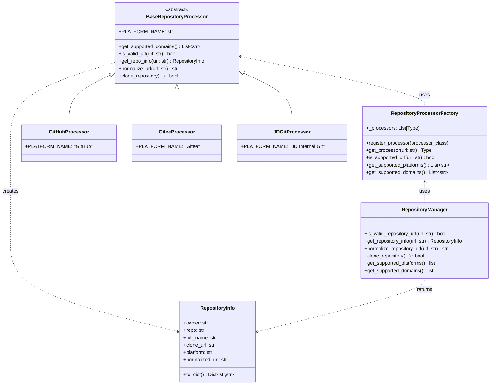
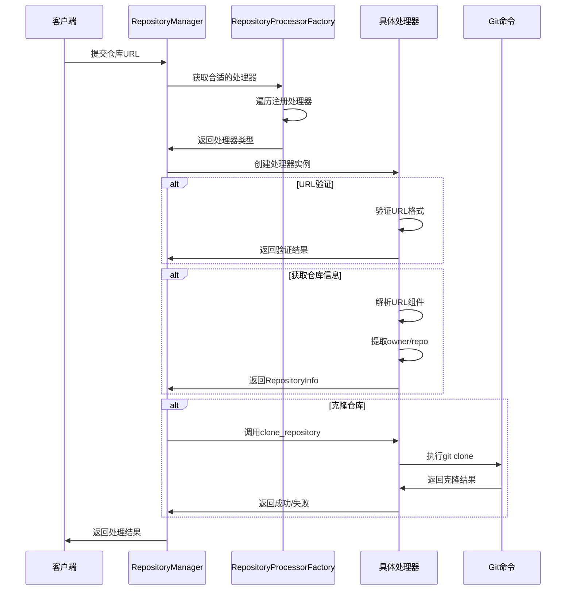

# fe_repo_processors 模块文档

## 模块简介

`fe_repo_processors` 是 CodeWiki 系统的前端仓库处理器模块，专门用于处理来自不同代码托管平台的仓库链接。该模块提供了统一的接口来解析、验证和克隆来自 GitHub、Gitee、京东内部 Git 等多个平台的代码仓库。

## 核心功能

- **多平台支持**：支持 GitHub、Gitee、京东内部 Git 等主流代码托管平台
- **URL 解析与验证**：智能识别和验证各种格式的仓库链接
- **统一接口**：提供一致的 API 处理不同平台的仓库
- **仓库克隆**：支持深度克隆和浅克隆，可指定特定提交版本
- **格式标准化**：将不同平台的仓库链接转换为标准格式

## 架构概览



## 组件关系



## 处理流程



## 子模块文档

### [基础处理器 - base_processor](base_processor.md)
包含 `BaseRepositoryProcessor` 抽象基类和 `RepositoryInfo` 数据模型，定义了所有处理器必须实现的接口和通用的仓库克隆功能。

### [处理器工厂 - factory](factory.md)
`RepositoryProcessorFactory` 类负责管理和选择合适的处理器，支持动态注册新的处理器类型。

### [仓库管理器 - manager](manager.md)
`RepositoryManager` 提供统一的对外接口，封装了工厂模式的使用，简化了客户端代码。

### [GitHub处理器 - github_processor](github_processor.md)
专门处理 GitHub 平台的仓库链接，支持多种 URL 格式的解析和标准化。

### [Gitee处理器 - gitee_processor](gitee_processor.md)
专门处理 Gitee 平台的仓库链接，提供与 GitHub 处理器类似的功能。

### [京东Git处理器 - jd_git_processor](jd_git_processor.md)
处理京东内部 Git 平台的仓库链接，支持 SSH 和 HTTP/HTTPS 多种协议格式。

## 使用示例

### 基本使用

```python
from codewiki.src.fe.repository_processors.manager import RepositoryManager

# 验证仓库URL
url = "https://github.com/owner/repo"
if RepositoryManager.is_valid_repository_url(url):
    # 获取仓库信息
    repo_info = RepositoryManager.get_repository_info(url)
    print(f"平台: {repo_info.platform}")
    print(f"仓库: {repo_info.full_name}")
    
    # 克隆仓库
    success = RepositoryManager.clone_repository(url, "/tmp/repo")
    if success:
        print("仓库克隆成功")
```

### 获取支持的平台

```python
# 获取所有支持的平台
platforms = RepositoryManager.get_supported_platforms()
print("支持的平台:", platforms)  # ['GitHub', 'Gitee', 'JD Internal Git']

# 获取所有支持的域名
domains = RepositoryManager.get_supported_domains()
print("支持的域名:", domains)
```

## 扩展性

该模块设计具有良好的扩展性，可以通过以下方式添加新的平台支持：

1. 创建新的处理器类继承 `BaseRepositoryProcessor`
2. 实现必要的抽象方法
3. 通过 `RepositoryProcessorFactory.register_processor()` 注册新处理器

## 错误处理

模块提供了完善的错误处理机制：

- URL 格式验证失败时返回 `False` 或 `None`
- 克隆失败时返回 `False` 并记录错误信息
- 支持超时设置，防止长时间阻塞
- 提供详细的错误信息用于调试

## 性能优化

- 支持浅克隆（`depth=1`）以节省带宽和时间
- 可配置克隆超时时间
- 支持指定特定提交版本进行克隆
- 缓存处理器实例避免重复创建

## 相关模块

- [fe_web_core](fe_web_core.md) - 前端 Web 核心模块，使用本模块处理仓库相关操作
- [be_dependency_analyzer](be_dependency_analyzer.md) - 后端依赖分析模块，分析克隆的仓库代码
- [cli_core](cli_core.md) - CLI 核心模块，命令行工具也使用类似的仓库处理功能