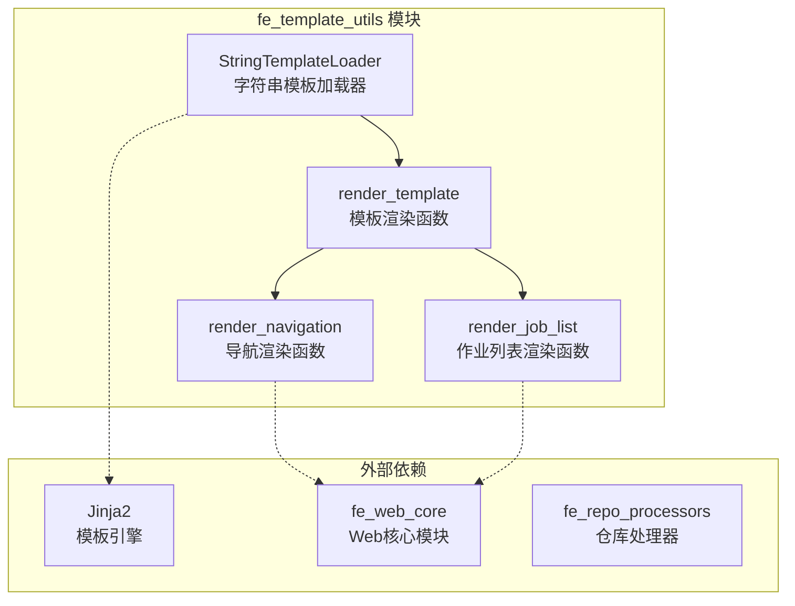
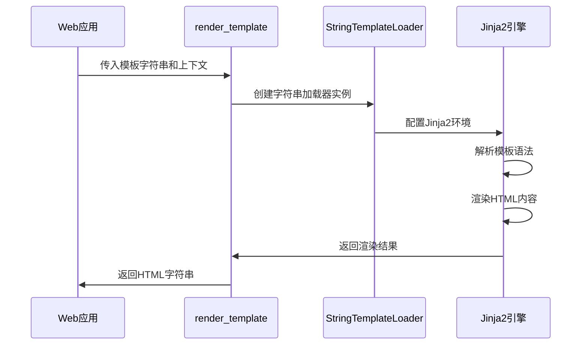
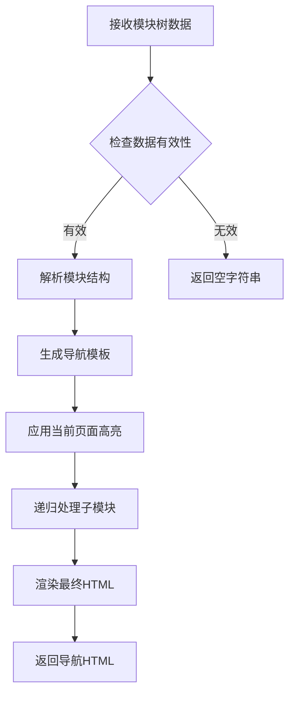

# fe_template_utils 模块文档

## 概述

fe_template_utils 模块是 CodeWiki 前端系统的模板工具模块，专门用于处理 Jinja2 模板渲染和 HTML 生成。该模块为 Web 应用提供了灵活的模板渲染功能，支持字符串模板加载、导航渲染和作业列表渲染等核心功能。

## 核心功能

### 1. 字符串模板加载
- **StringTemplateLoader**: 自定义 Jinja2 加载器，支持直接从字符串加载模板
- 提供安全的 HTML 自动转义功能
- 支持模板语法验证和错误处理

### 2. 模板渲染引擎
- **render_template**: 通用模板渲染函数
- 支持上下文变量替换
- 自动 HTML 转义确保安全性
- 优化的模板缓存机制

### 3. 导航组件渲染
- **render_navigation**: 基于模块树结构生成导航 HTML
- 支持当前页面高亮显示
- 递归处理嵌套的模块结构
- 响应式设计支持

### 4. 作业列表渲染
- **render_job_list**: 动态生成作业列表 HTML
- 支持不同状态的视觉区分
- 提供操作按钮和进度显示
- 空状态处理

## 架构设计

### 组件关系图



### 数据流图



### 导航渲染流程



## 核心组件详解

### StringTemplateLoader 类

```python
class StringTemplateLoader(BaseLoader):
    """自定义 Jinja2 加载器，用于从字符串加载模板"""
    
    def __init__(self, template_string: str):
        self.template_string = template_string
    
    def get_source(self, environment, template):
        return self.template_string, None, lambda: True
```

**功能特点：**
- 继承自 Jinja2 的 BaseLoader
- 支持直接从字符串加载模板内容
- 提供模板源信息的完整封装
- 支持模板更新检测

### render_template 函数

```python
def render_template(template: str, context: Dict[str, Any]) -> str:
    """使用 Jinja2 渲染模板"""
    # 创建带有字符串模板的 Jinja2 环境
    env = Environment(
        loader=StringTemplateLoader(template),
        autoescape=select_autoescape(['html', 'xml']),
        trim_blocks=True,
        lstrip_blocks=True
    )
    
    # 获取模板并渲染
    jinja_template = env.get_template('')
    return jinja_template.render(**context)
```

**配置参数：**
- **autoescape**: 自动 HTML 转义，防止 XSS 攻击
- **trim_blocks**: 移除块后的空白字符
- **lstrip_blocks**: 移除块前的空白字符

### render_navigation 函数

**模板特性：**
- 支持多级嵌套的模块结构
- 动态生成导航链接
- 当前页面高亮显示
- 响应式 CSS 类名

**生成的 HTML 结构：**
```html
<div class="nav-section">
    <h3>模块名称</h3>
    <a href="/module.md" class="nav-item active">概览</a>
    <div class="nav-subsection">
        <a href="/submodule.md" class="nav-item">子模块</a>
    </div>
</div>
```

### render_job_list 函数

**支持的作业状态：**
- **pending**: 等待中
- **running**: 运行中
- **completed**: 已完成
- **failed**: 失败

**功能特性：**
- 状态视觉区分（不同颜色）
- 进度条显示
- 操作按钮（查看文档）
- 仓库 URL 显示

## 使用示例

### 基本模板渲染

```python
from codewiki.src.fe.template_utils import render_template

# 定义模板
template = """
<h1>{{ title }}</h1>
<p>欢迎使用 {{ app_name }}</p>
"""

# 渲染模板
html = render_template(template, {
    'title': 'CodeWiki',
    'app_name': '文档生成系统'
})
```

### 导航渲染

```python
from codewiki.src.fe.template_utils import render_navigation

# 模块树结构
module_tree = {
    'be_doc_generator': {
        'components': ['DocumentationGenerator'],
        'children': {}
    },
    'fe_template_utils': {
        'components': ['StringTemplateLoader'],
        'children': {}
    }
}

# 生成导航
nav_html = render_navigation(module_tree, current_page="fe_template_utils.md")
```

### 作业列表渲染

```python
from codewiki.src.fe.template_utils import render_job_list

# 作业数据
jobs = [
    {
        'repo_url': 'https://github.com/example/repo',
        'status': 'completed',
        'progress': '100%',
        'job_id': 'job_123',
        'docs_path': '/docs/job_123'
    },
    {
        'repo_url': 'https://github.com/example/repo2',
        'status': 'running',
        'progress': '60%',
        'job_id': 'job_124'
    }
]

# 渲染作业列表
jobs_html = render_job_list(jobs)
```

## 模块集成

### 与 fe_web_core 的集成

fe_template_utils 模块为 fe_web_core 提供模板渲染支持：

- **WebRoutes**: 使用模板工具生成动态页面内容
- **BackgroundWorker**: 渲染作业状态和进度信息
- **CacheManager**: 生成缓存条目的 HTML 表示

### 与 fe_repo_processors 的集成

- **RepositoryManager**: 渲染仓库处理状态
- **GitHubProcessor**: 生成 GitHub 仓库的文档页面
- **RepositorySubmission**: 渲染提交表单和结果页面

## 性能优化

### 模板缓存
- Jinja2 环境级别的模板缓存
- 字符串模板的哈希索引
- 避免重复编译相同模板

### 渲染优化
- 异步渲染支持（通过调用方实现）
- 模板预编译选项
- 内存使用优化

### 安全特性
- 自动 HTML 转义
- 模板语法验证
- 上下文变量过滤

## 错误处理

### 常见错误类型
- **TemplateSyntaxError**: 模板语法错误
- **UndefinedError**: 未定义的模板变量
- **TemplateNotFound**: 模板未找到（对于文件加载器）

### 错误处理策略
- 提供详细的错误信息
- 优雅降级（返回空字符串）
- 日志记录和监控

## 扩展性

### 自定义过滤器
可以通过扩展 Jinja2 环境来添加自定义过滤器：

```python
def custom_filter(value):
    return value.upper()

env = Environment(
    loader=StringTemplateLoader(template),
    autoescape=select_autoescape(['html', 'xml'])
)
env.filters['custom'] = custom_filter
```

### 模板继承
支持 Jinja2 的模板继承机制，可以创建基础模板和子模板。

## 相关模块

- [fe_web_core](fe_web_core.md): Web 应用核心功能
- [fe_repo_processors](fe_repo_processors.md): 仓库处理器模块
- [cli_doc_pipeline](cli_doc_pipeline.md): 文档生成管道

## 总结

fe_template_utils 模块为 CodeWiki 前端系统提供了强大而灵活的模板渲染能力。通过 StringTemplateLoader 和一系列渲染函数，该模块支持动态内容生成、导航构建和作业状态显示等核心功能。其简洁的 API 设计和完善的错误处理机制使其成为前端开发的重要工具。