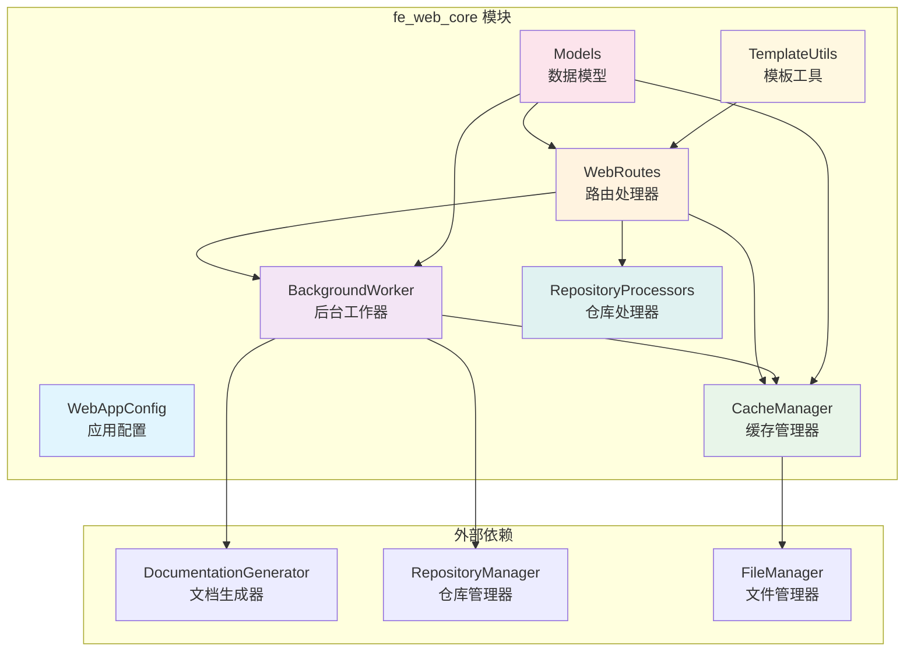
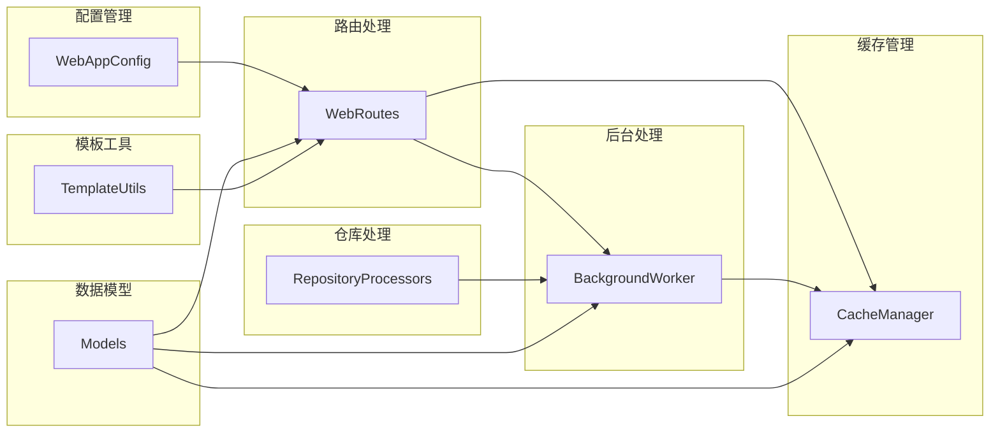
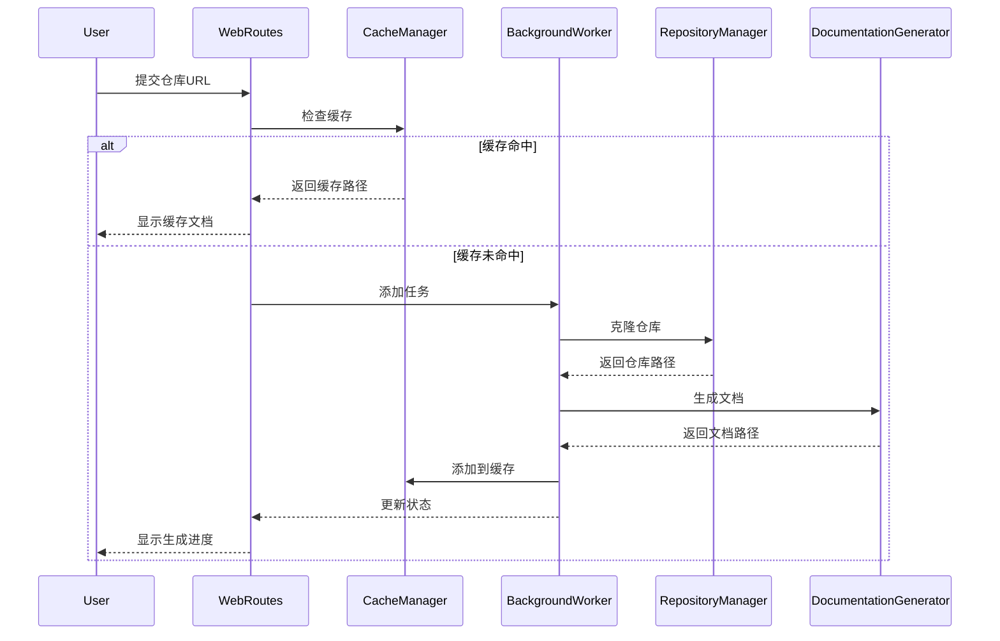

# fe_web_core 模块文档

## 概述

fe_web_core 模块是 CodeWiki 系统的前端 Web 应用核心模块，负责提供用户界面和处理文档生成请求的 Web 服务。该模块基于 FastAPI 框架构建，提供了完整的 Web 界面用于代码仓库文档的生成、管理和展示。

## 架构概览



## 核心功能

### 1. Web 界面服务
- 提供用户友好的 Web 界面用于提交代码仓库
- 支持 GitHub、Gitee 和京东内部 Git 仓库
- 实时显示文档生成进度和状态
- 支持文档在线查看和导航

### 2. 后台任务处理
- 异步处理文档生成任务
- 支持任务队列管理和并发控制
- 提供任务状态跟踪和错误处理
- 自动清理过期任务

### 3. 智能缓存系统
- 基于仓库 URL 的文档缓存
- 支持缓存过期管理
- 提供缓存命中率优化
- 支持缓存索引持久化

### 4. 多平台仓库支持
- 统一处理不同 Git 平台的仓库
- 支持仓库 URL 标准化
- 提供仓库信息提取和验证

## 子模块架构



## 核心组件详解

### WebAppConfig - 应用配置
负责管理 Web 应用的全局配置，包括：
- 目录路径配置（缓存、临时文件、输出目录）
- 队列和缓存设置
- 服务器配置（主机、端口）
- Git 相关配置（克隆超时、深度等）

详细文档：[WebAppConfig 配置管理](WebAppConfig 配置管理.md)

### WebRoutes - 路由处理器
处理所有 Web 请求的核心组件，提供：
- 主页展示和表单处理
- 仓库提交验证和处理
- 任务状态查询 API
- 文档查看和导航
- 缓存检查和重定向

详细文档：[WebRoutes 路由系统](WebRoutes 路由系统.md)

### BackgroundWorker - 后台工作器
异步处理文档生成任务，支持：
- 任务队列管理
- 文档生成流程控制
- 状态更新和持久化
- 错误处理和重试机制
- 临时文件清理

详细文档：[BackgroundWorker 后台处理](BackgroundWorker 后台处理.md)

### CacheManager - 缓存管理器
智能缓存系统的核心，提供：
- 基于 URL 哈希的缓存索引
- 缓存过期管理
- 缓存命中率优化
- 索引持久化和恢复

详细文档：[CacheManager 缓存系统](CacheManager 缓存系统.md)

### Models - 数据模型
定义系统中使用的数据结构：
- JobStatus: 任务状态跟踪
- JobStatusResponse: API 响应模型
- CacheEntry: 缓存条目模型
- RepositorySubmission: 仓库提交模型

详细文档：[Models 数据模型](Models 数据模型.md)

### RepositoryProcessors - 仓库处理器
统一处理不同平台的 Git 仓库：
- GitHub 仓库处理
- Gitee 仓库处理
- 京东内部 Git 处理
- URL 标准化和验证

详细文档：[RepositoryProcessors 仓库处理](RepositoryProcessors.md)

### TemplateUtils - 模板工具
提供模板渲染和界面生成支持。

详细文档：[TemplateUtils 模板工具](TemplateUtils 模板工具.md)

## 数据流图



## 配置参数

### 缓存配置
- `CACHE_EXPIRY_DAYS`: 365 天（默认缓存过期时间）
- `CACHE_DIR`: "./output/cache"（缓存目录）

### 队列配置
- `QUEUE_SIZE`: 100（最大队列长度）
- `JOB_CLEANUP_HOURS`: 24000 小时（任务清理时间）
- `RETRY_COOLDOWN_MINUTES`: 3 分钟（重试冷却时间）

### 服务器配置
- `DEFAULT_HOST`: "127.0.0.1"（默认主机地址）
- `DEFAULT_PORT`: 8000（默认端口）

### Git 配置
- `CLONE_TIMEOUT`: 300 秒（克隆超时时间）
- `CLONE_DEPTH`: 1（克隆深度）

## 错误处理

系统实现了完善的错误处理机制：
- 仓库 URL 验证错误
- 网络连接错误
- Git 克隆错误
- 文档生成错误
- 文件系统错误

所有错误都会被记录并显示给用户，同时支持重试机制。

## 性能优化

### 缓存策略
- 基于仓库 URL 哈希的智能缓存
- 支持缓存预热和预加载
- 自动清理过期缓存

### 并发控制
- 限制同时处理的任务数量
- 异步处理避免阻塞
- 队列管理确保系统稳定

### 资源管理
- 临时文件自动清理
- 内存使用优化
- 磁盘空间管理

## 相关模块

- [cli_core](../cli_core.md): 命令行接口模块
- [be_doc_generator](../be_doc_generator.md): 后端文档生成器
- [be_dependency_analyzer](../be_dependency_analyzer.md): 依赖分析模块
- [shared_utils](../shared_utils.md): 共享工具模块

## 使用示例

### 启动 Web 服务
```python
from codewiki.src.fe.config import WebAppConfig
from codewiki.src.fe.background_worker import BackgroundWorker
from codewiki.src.fe.cache_manager import CacheManager

# 确保目录存在
WebAppConfig.ensure_directories()

# 创建缓存管理器
cache_manager = CacheManager()

# 创建后台工作器
background_worker = BackgroundWorker(cache_manager)
background_worker.start()
```

### 处理仓库提交
```python
from codewiki.src.fe.routes import WebRoutes

# 创建路由处理器
routes = WebRoutes(background_worker, cache_manager)

# 处理仓库提交
response = await routes.index_post(request, repo_url, commit_id)
```

## 维护和扩展

### 添加新的 Git 平台支持
1. 在 RepositoryProcessors 中添加新的处理器类
2. 实现平台特定的 URL 解析和验证
3. 更新 RepositoryManager 的工厂方法

### 扩展缓存策略
1. 修改 CacheManager 的缓存键生成逻辑
2. 调整缓存过期策略
3. 添加缓存预热机制

### 优化性能
1. 调整队列大小和并发数
2. 优化缓存索引结构
3. 添加性能监控和指标收集