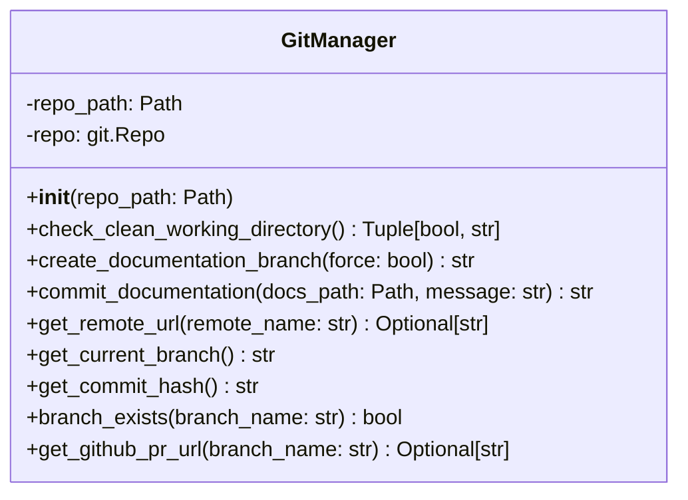
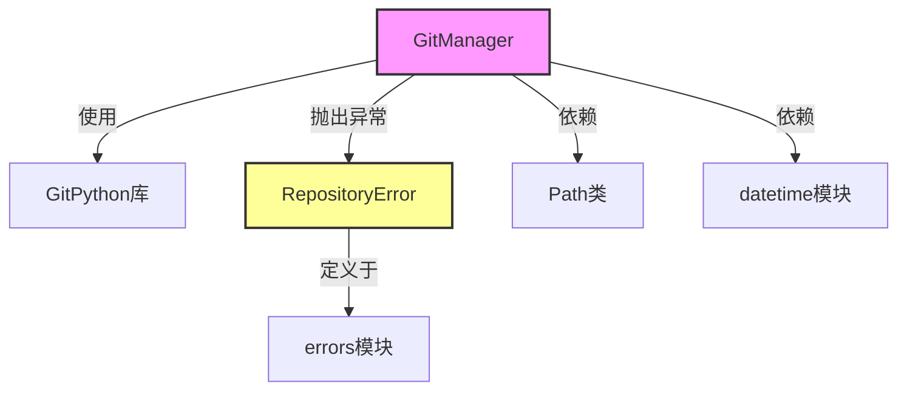
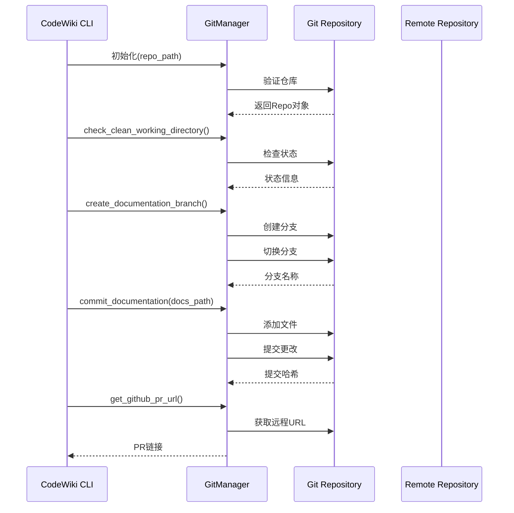
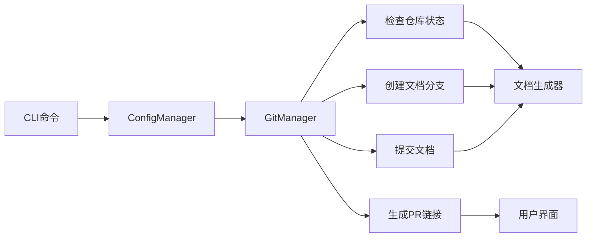

# Git Manager 模块文档

## 概述

Git Manager 模块是 CodeWiki CLI 的核心组件之一，专门负责处理与 Git 版本控制系统相关的所有操作。该模块为文档生成工作流提供了完整的 Git 集成支持，确保文档生成过程能够与现有的 Git 工作流无缝协作。

## 核心功能

Git Manager 主要提供以下功能：

- **工作目录状态检查**：验证工作目录是否干净（无未提交更改）
- **文档分支管理**：创建带时间戳的专用文档分支
- **文档提交**：将生成的文档文件提交到 Git 仓库
- **远程仓库信息获取**：获取远程仓库 URL 和分支信息
- **GitHub 集成**：生成 GitHub PR 创建链接

## 架构设计

### 组件结构



### 模块依赖关系



## 核心组件详解

### GitManager 类

`GitManager` 是模块的核心类，封装了所有 Git 操作功能。

#### 初始化

```python
def __init__(self, repo_path: Path)
```

- **参数**：`repo_path` - Git 仓库路径
- **异常**：如果不是有效的 Git 仓库，抛出 `RepositoryError`
- **功能**：初始化 Git 仓库对象，支持自动搜索父目录

#### 主要方法

##### 1. 工作目录状态检查

```python
def check_clean_working_directory() -> Tuple[bool, str]
```

检查工作目录是否干净（无未提交更改）。

**返回值**：
- `bool`：是否干净
- `str`：状态描述信息

**功能**：
- 检测修改的文件
- 检测未跟踪的文件
- 提供详细的状态报告

##### 2. 文档分支创建

```python
def create_documentation_branch(force: bool = False) -> str
```

创建带时间戳的文档分支。

**参数**：
- `force`：是否强制创建（即使工作目录不干净）

**返回值**：分支名称

**分支命名规则**：`docs/codewiki-YYYYMMDD-HHMMSS`

##### 3. 文档提交

```python
def commit_documentation(docs_path: Path, message: Optional[str] = None) -> str
```

提交生成的文档到 Git 仓库。

**参数**：
- `docs_path`：文档目录路径
- `message`：提交信息（可选）

**返回值**：提交哈希值

##### 4. 远程仓库信息

```python
def get_remote_url(remote_name: str = "origin") -> Optional[str]
def get_github_pr_url(branch_name: str) -> Optional[str]
```

获取远程仓库信息和 GitHub PR 链接。

## 数据流图

### 文档生成工作流



## 错误处理

### RepositoryError 异常

GitManager 使用自定义的 `RepositoryError` 异常来处理 Git 相关的错误情况：

- **无效仓库**：当提供的路径不是有效的 Git 仓库时
- **脏工作目录**：当尝试创建分支但工作目录有未提交更改时
- **Git 命令失败**：当 Git 操作失败时

### 错误恢复建议

模块提供了详细的错误信息和恢复建议：

```
工作目录有未提交的更改。

修改: file1.py, file2.py
未跟踪: new_file.py

无法在有未提交更改的情况下创建文档分支。
请先提交或暂存您的更改：
  git status
  git add -A && git commit -m "您的提交信息"
  # 或者
  git stash

然后重新运行: codewiki generate --create-branch
```

## 使用示例

### 基本用法

```python
from pathlib import Path
from codewiki.cli.git_manager import GitManager

# 初始化 GitManager
git_manager = GitManager(Path("/path/to/repo"))

# 检查工作目录状态
is_clean, status = git_manager.check_clean_working_directory()
if not is_clean:
    print(f"工作目录状态: {status}")

# 创建文档分支
branch_name = git_manager.create_documentation_branch()
print(f"创建文档分支: {branch_name}")

# 提交文档
docs_path = Path("docs")
commit_hash = git_manager.commit_documentation(docs_path)
print(f"文档提交成功: {commit_hash}")

# 获取 GitHub PR 链接
pr_url = git_manager.get_github_pr_url(branch_name)
if pr_url:
    print(f"PR 链接: {pr_url}")
```

### 高级用法

```python
# 强制创建分支（即使工作目录不干净）
branch_name = git_manager.create_documentation_branch(force=True)

# 自定义提交信息
commit_hash = git_manager.commit_documentation(
    docs_path, 
    message="添加 API 文档\n\n使用 CodeWiki 自动生成"
)

# 检查分支是否存在
if git_manager.branch_exists("feature/docs"):
    print("文档分支已存在")
```

## 集成关系

### 与 CLI 核心模块的关系

GitManager 是 CLI 核心工作流的重要组成部分：

- **ConfigManager**：[config_manager.md](config_manager.md) - 提供配置信息
- **CLILogger**：[cli_logging.md](cli_logging.md) - 记录操作日志
- **Configuration**：[configuration_model.md](configuration_model.md) - 存储配置数据

### 在文档生成流程中的作用



## 最佳实践

### 1. 分支管理策略

- 始终使用带时间戳的分支名称，避免冲突
- 在创建分支前检查工作目录状态
- 为不同类型的文档使用不同的分支命名约定

### 2. 错误处理

- 始终捕获 `RepositoryError` 异常
- 提供清晰的错误恢复指导
- 记录详细的错误日志

### 3. 性能优化

- 缓存 Git 仓库对象，避免重复初始化
- 批量处理文件操作
- 使用 GitPython 的高效 API

## 扩展性

GitManager 设计为可扩展的模块，支持：

- **多远程仓库**：支持除 GitHub 外的其他 Git 托管服务
- **自定义分支策略**：支持不同的分支命名和工作流
- **钩子机制**：支持在 Git 操作前后执行自定义逻辑

## 相关文档

- [CLI 核心模块](cli_core.md) - 了解 GitManager 在 CLI 中的整体作用
- [配置管理器](config_manager.md) - 配置信息的获取和管理
- [错误处理](errors.md) - 异常处理和错误恢复机制