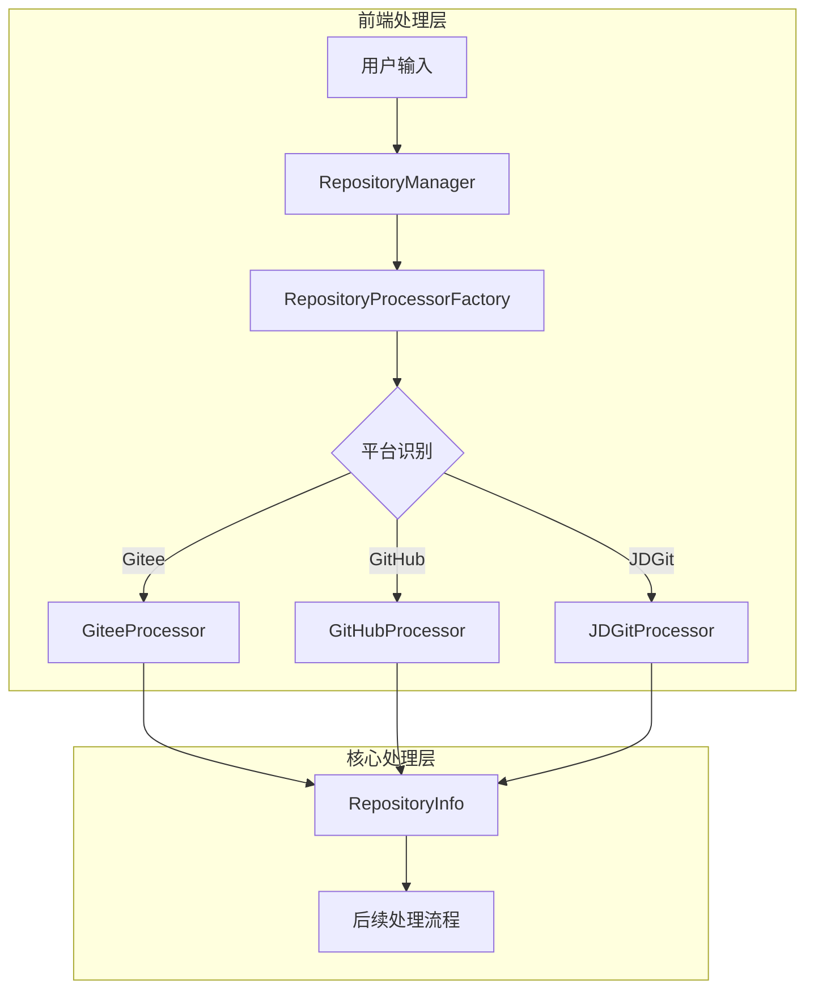
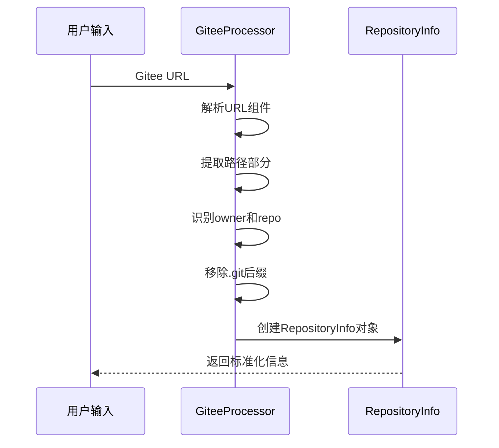
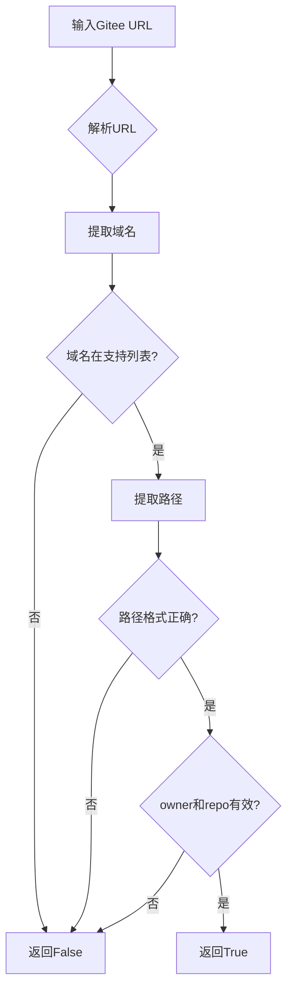
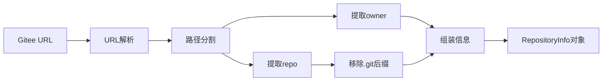
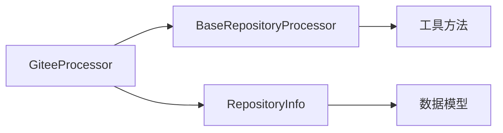
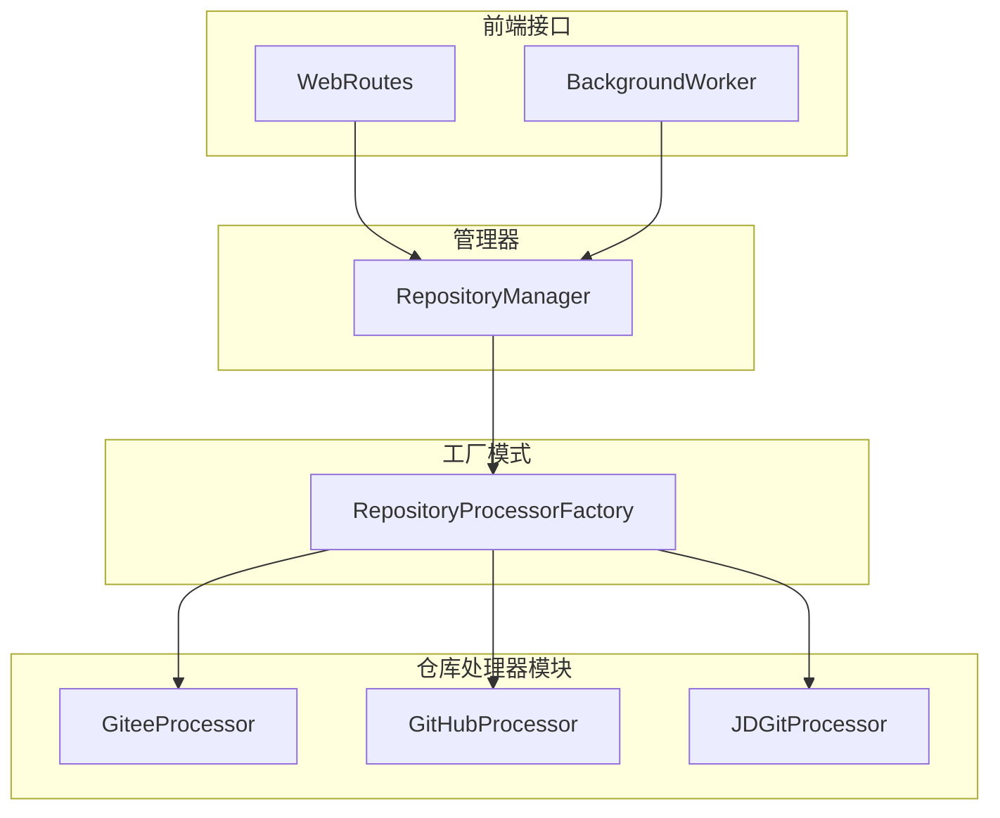

# Gitee 处理器模块文档

## 概述

Gitee 处理器模块是 CodeWiki 系统中专门用于处理 Gitee 平台仓库的核心组件。作为 [fe_repo_processors](fe_repo_processors.md) 模块的重要组成部分，它提供了对 Gitee 仓库的 URL 验证、信息提取和标准化处理功能。

## 模块定位

在 CodeWiki 的架构中，Gitee 处理器扮演着平台适配器的角色，负责将 Gitee 平台的仓库信息转换为系统内部统一的数据格式，为后续的代码分析、文档生成等功能提供标准化的输入。



## 核心组件

### GiteeProcessor 类

`GiteeProcessor` 是模块的核心类，继承自 `BaseRepositoryProcessor`，专门处理 Gitee 平台的仓库。

#### 主要属性

- **PLATFORM_NAME**: 平台名称标识，固定为 "Gitee"

#### 核心方法

##### get_supported_domains()
返回支持的 Gitee 域名列表，包括：
- `gitee.com`
- `www.gitee.com`

##### is_valid_url(url: str) -> bool
验证输入的 URL 是否为有效的 Gitee 仓库地址。

**验证逻辑：**
1. 解析 URL 组件
2. 检查域名是否在支持的域名列表中
3. 验证路径结构是否包含 owner/repo 格式
4. 确保 owner 和 repo 名称不为空

##### get_repo_info(url: str) -> RepositoryInfo
从 Gitee URL 中提取仓库信息，返回标准化的 RepositoryInfo 对象。

**信息提取过程：**


**提取的信息包括：**
- **owner**: 仓库所有者
- **repo**: 仓库名称
- **full_name**: 完整名称（owner/repo 格式）
- **clone_url**: Git 克隆地址
- **platform**: 平台名称（"Gitee"）
- **normalized_url**: 标准化 URL

##### normalize_url(url: str) -> str
将 Gitee URL 标准化为统一格式，移除冗余信息并确保一致性。

## 数据处理流程

### URL 验证流程



### 信息提取流程



## 错误处理

Gitee 处理器采用防御性编程策略，对所有可能的异常情况进行了处理：

1. **URL 解析异常**: 捕获解析错误并返回 False
2. **路径格式异常**: 验证路径组件数量，不足时抛出异常
3. **空值检查**: 确保 owner 和 repo 名称不为空

## 与其他模块的关系

### 依赖关系



### 在系统中的位置



## 使用示例

### URL 验证
```python
# 验证Gitee仓库URL
is_valid = GiteeProcessor.is_valid_url("https://gitee.com/owner/repo")
# 返回: True

is_valid = GiteeProcessor.is_valid_url("https://github.com/owner/repo")
# 返回: False
```

### 信息提取
```python
# 提取仓库信息
repo_info = GiteeProcessor.get_repo_info("https://gitee.com/openharmony/kernel_liteos_a")
# 返回RepositoryInfo对象，包含:
# owner: "openharmony"
# repo: "kernel_liteos_a"
# full_name: "openharmony/kernel_liteos_a"
# clone_url: "https://gitee.com/openharmony/kernel_liteos_a.git"
# platform: "Gitee"
# normalized_url: "https://gitee.com/openharmony/kernel_liteos_a"
```

### URL 标准化
```python
# 标准化URL
normalized = GiteeProcessor.normalize_url("https://www.gitee.com/owner/repo.git")
# 返回: "https://gitee.com/owner/repo"
```

## 扩展性设计

Gitee 处理器的设计遵循开闭原则，便于未来扩展：

1. **新增域名支持**: 只需修改 `get_supported_domains()` 方法
2. **URL 格式变更**: 可在 `get_repo_info()` 中调整解析逻辑
3. **平台特性扩展**: 可重写父类方法实现特殊处理

## 性能考虑

- **轻量级处理**: 所有方法均为类方法，无需实例化
- **快速验证**: URL 验证采用短路逻辑，快速失败
- **缓存友好**: 标准化结果可缓存，避免重复处理

## 相关文档

- [BaseRepositoryProcessor](base_processor.md) - 基础处理器类文档
- [RepositoryInfo](repository_info.md) - 仓库信息模型文档
- [RepositoryProcessorFactory](factory.md) - 处理器工厂文档
- [RepositoryManager](manager.md) - 仓库管理器文档