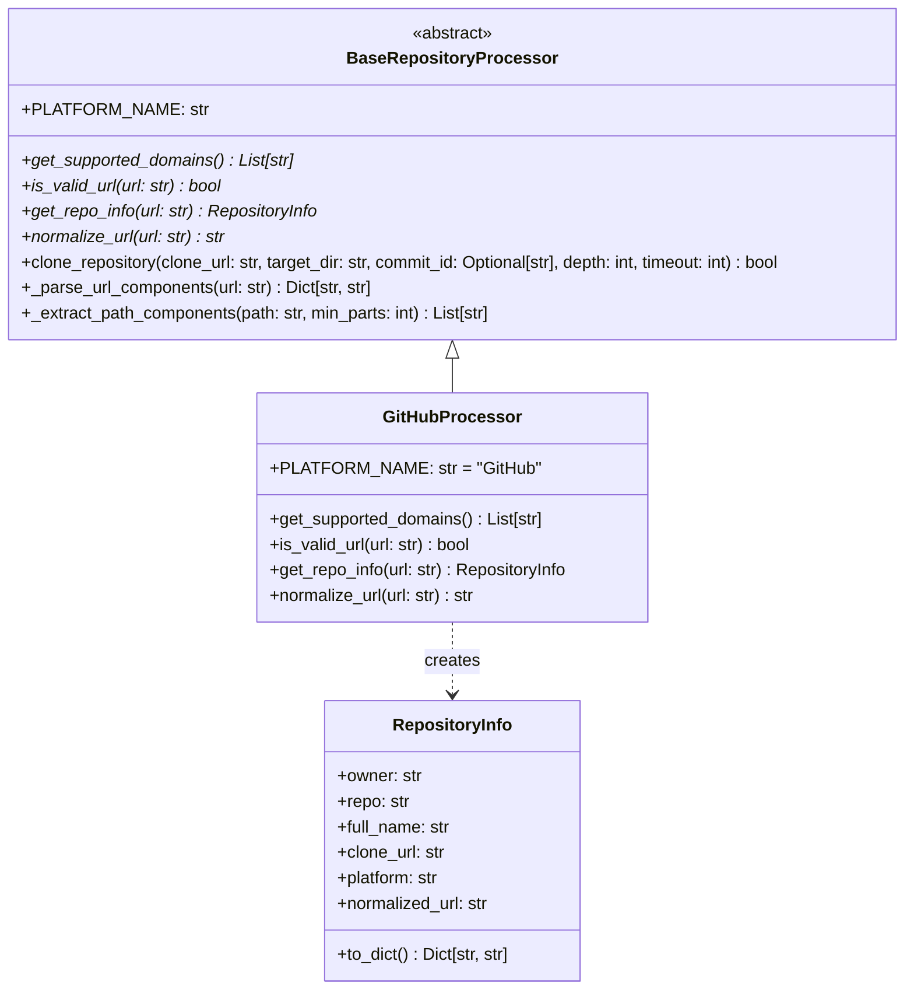
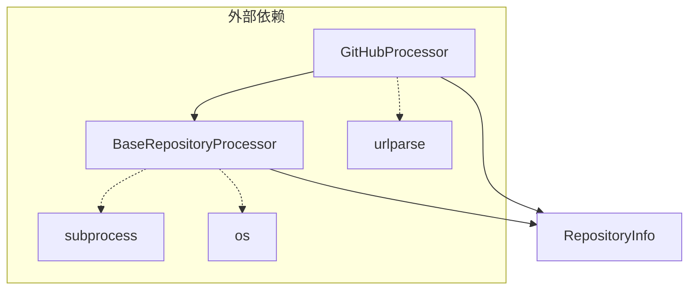
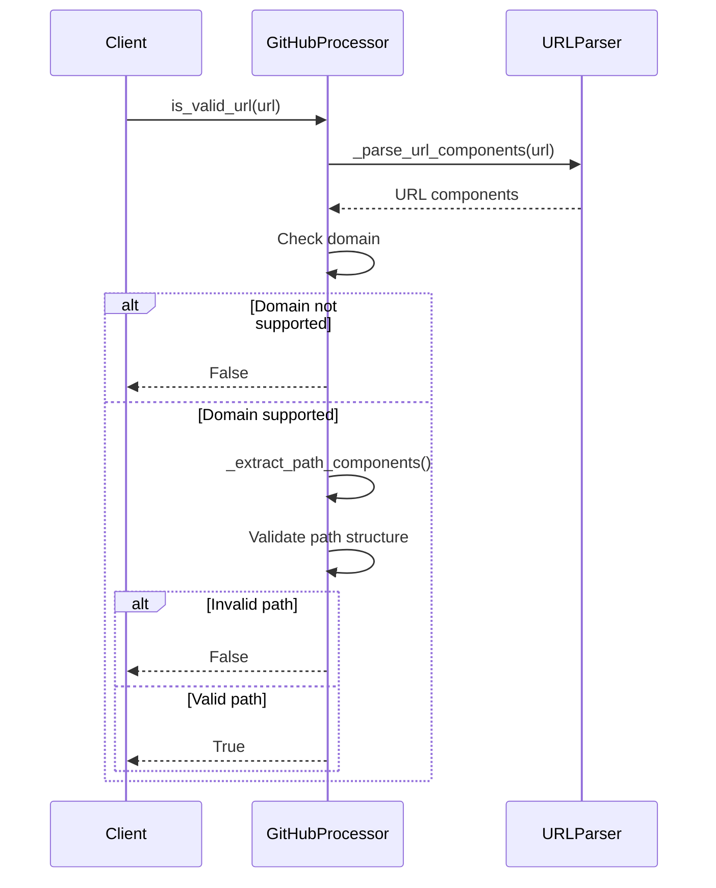
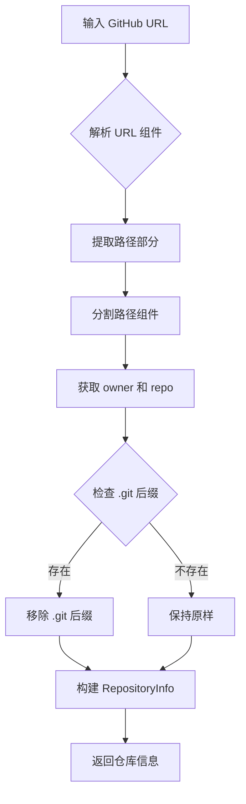
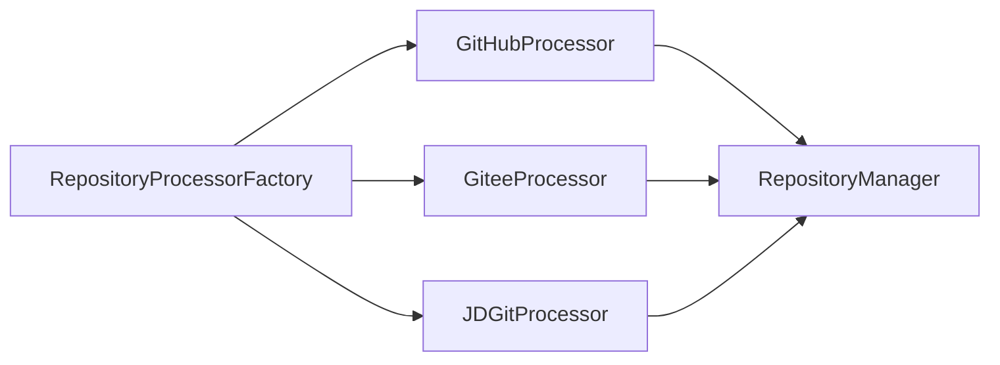

# GitHub 处理器模块

GitHub 处理器模块是 CodeWiki 前端仓库处理器系统的重要组成部分，专门负责处理 GitHub 平台的仓库 URL 解析、验证和信息提取。

## 概述

GitHub 处理器模块提供了一个专门的处理器类 `GitHubProcessor`，它继承自 `BaseRepositoryProcessor` 抽象基类，实现了针对 GitHub 仓库的特定处理逻辑。该模块能够识别、验证和解析 GitHub 仓库 URL，提取仓库的关键信息，并支持仓库克隆操作。

## 核心功能

### 1. URL 验证
- 验证 URL 是否为有效的 GitHub 仓库地址
- 检查域名是否属于 GitHub 平台
- 验证仓库路径结构是否符合 GitHub 规范

### 2. 仓库信息提取
- 从 GitHub URL 中提取仓库所有者（owner）和仓库名称（repo）
- 生成标准化的仓库信息对象
- 构建克隆 URL 和标准化 URL

### 3. URL 标准化
- 将各种格式的 GitHub URL 转换为标准格式
- 处理带有 `.git` 后缀的 URL
- 确保 URL 格式的一致性

## 架构设计

### 类继承结构



### 模块依赖关系



## 组件详解

### GitHubProcessor 类

`GitHubProcessor` 是模块的核心类，提供了 GitHub 仓库处理的具体实现：

#### 支持的域名
- `github.com`
- `www.github.com`

#### 主要方法

1. **`get_supported_domains()`**
   - 返回支持的 GitHub 域名列表
   - 用于 URL 验证和平台识别

2. **`is_valid_url(url: str)`**
   - 验证 URL 是否为有效的 GitHub 仓库地址
   - 检查域名和路径结构
   - 确保包含所有者和仓库名称

3. **`get_repo_info(url: str)`**
   - 从 GitHub URL 提取仓库信息
   - 生成 `RepositoryInfo` 对象
   - 处理 `.git` 后缀移除

4. **`normalize_url(url: str)`**
   - 标准化 GitHub URL 格式
   - 返回统一格式的仓库地址

### RepositoryInfo 数据类

`RepositoryInfo` 用于存储仓库的关键信息：

```python
{
    "owner": "仓库所有者",
    "repo": "仓库名称", 
    "full_name": "所有者/仓库名",
    "clone_url": "Git 克隆地址",
    "platform": "GitHub",
    "normalized_url": "标准化 URL"
}
```

## 处理流程

### URL 验证流程



### 仓库信息提取流程



## 使用示例

### 基本使用

```python
from codewiki.src.fe.repository_processors.github_processor import GitHubProcessor

# 验证 URL
url = "https://github.com/owner/repository"
if GitHubProcessor.is_valid_url(url):
    print("有效的 GitHub 仓库地址")

# 提取仓库信息
repo_info = GitHubProcessor.get_repo_info(url)
print(f"所有者: {repo_info.owner}")
print(f"仓库名: {repo_info.repo}")
print(f"完整名称: {repo_info.full_name}")

# 标准化 URL
normalized = GitHubProcessor.normalize_url(url)
print(f"标准化 URL: {normalized}")
```

### 支持的 URL 格式

```python
# 支持的 GitHub URL 格式
urls = [
    "https://github.com/owner/repo",
    "https://github.com/owner/repo.git",
    "https://www.github.com/owner/repo",
    "http://github.com/owner/repo"
]

for url in urls:
    if GitHubProcessor.is_valid_url(url):
        info = GitHubProcessor.get_repo_info(url)
        print(f"✓ {url} -> {info.full_name}")
```

## 错误处理

模块提供了完善的错误处理机制：

1. **URL 解析错误**：捕获 URL 解析异常，返回验证失败
2. **路径结构错误**：检查路径组件数量，确保符合 GitHub 规范
3. **空值检查**：验证所有者和仓库名称不为空

## 集成与扩展

### 与其他处理器的集成

GitHub 处理器是仓库处理器工厂模式的一部分：



### 扩展支持

如需支持新的 GitHub 域名或子域，可以通过修改 `get_supported_domains()` 方法实现：

```python
@classmethod
def get_supported_domains(cls) -> List[str]:
    return ['github.com', 'www.github.com', 'enterprise.github.com']
```

## 相关模块

- [base_processor](base_processor.md) - 仓库处理器基类
- [gitee_processor](gitee_processor.md) - Gitee 平台处理器
- [jd_git_processor](jd_git_processor.md) - 京东 Git 平台处理器
- [repository_processors](repository_processors.md) - 仓库处理器总览

## 性能考虑

- URL 解析使用标准库 `urllib.parse`，性能优异
- 路径处理采用简单的字符串操作，避免正则表达式开销
- 支持批量处理，适合大规模仓库分析场景

## 安全性

- URL 验证防止恶意输入
- 路径组件过滤避免路径遍历攻击
- 标准化的 URL 格式确保一致性