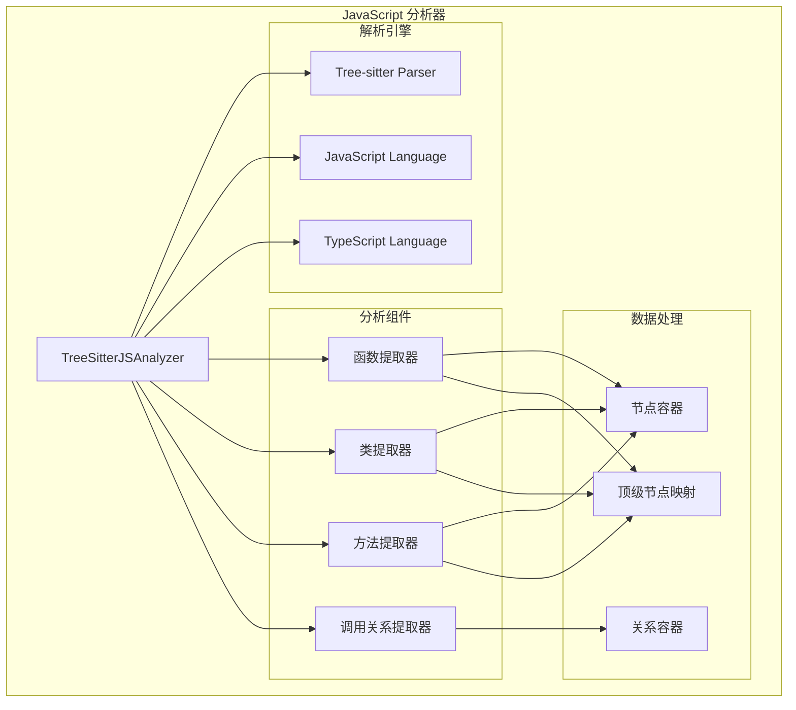
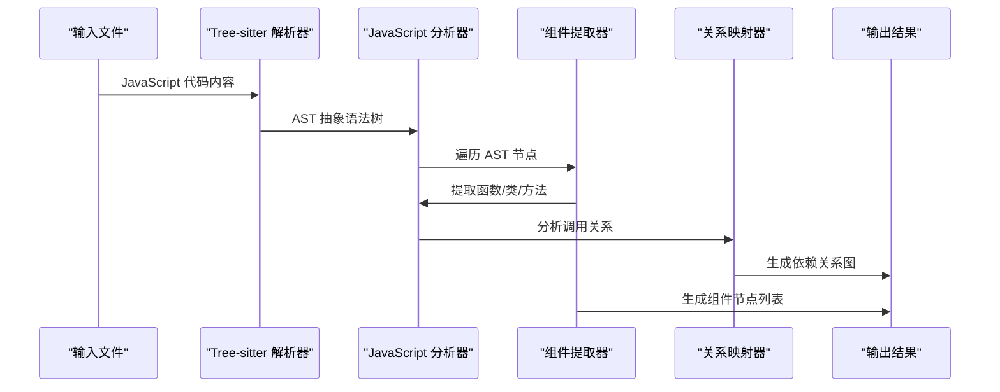
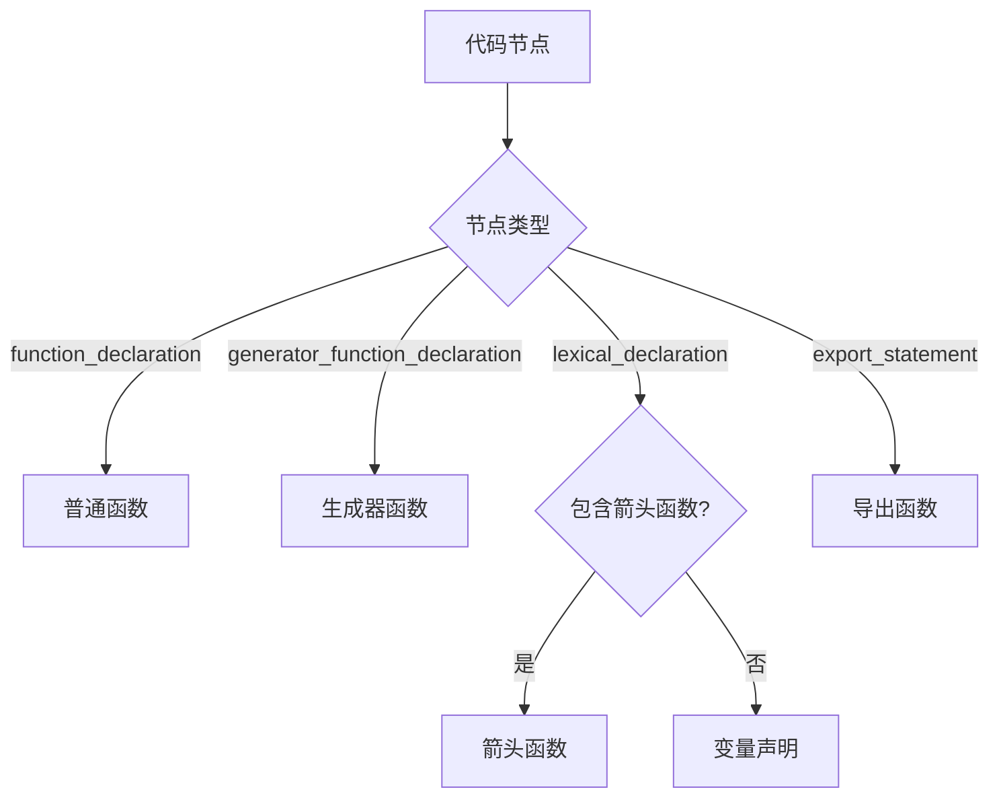
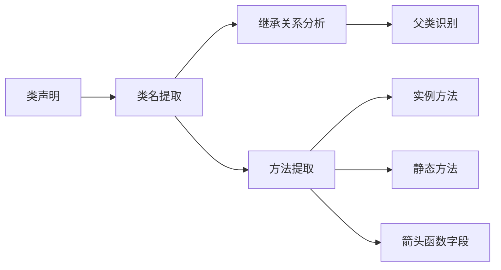
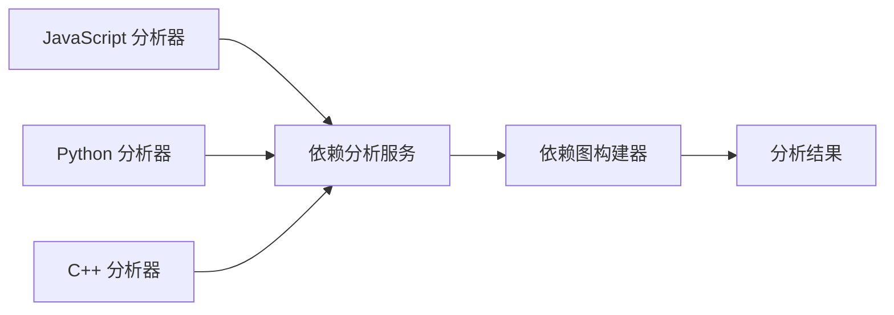

# JavaScript 分析器模块文档

## 简介

JavaScript 分析器模块（`javascript_analyzer`）是 CodeWiki 依赖分析系统中的一个核心组件，专门用于分析 JavaScript 代码文件的结构和依赖关系。该模块基于 Tree-sitter 解析器技术，能够准确识别 JavaScript 代码中的函数、类、方法以及它们之间的调用关系。

作为 `be_language_analyzers` 模块的子模块，JavaScript 分析器与 Python、C++、TypeScript 等其他语言分析器协同工作，为整个依赖分析系统提供多语言支持。

## 核心功能

### 1. 代码结构分析
- **函数识别**：提取普通函数、箭头函数、生成器函数、异步函数
- **类结构解析**：识别类声明、抽象类、接口及其继承关系
- **方法提取**：分析类中的方法定义和字段中的箭头函数
- **导出函数处理**：识别 ES6 模块导出语法

### 2. 依赖关系分析
- **函数调用关系**：追踪函数间的调用链路
- **类继承关系**：分析类之间的继承层次
- **方法调用映射**：识别类内部和跨类的方法调用
- **构造函数调用**：追踪 `new` 表达式创建的实例关系

### 3. JSDoc 类型分析
- **类型注解解析**：提取 JSDoc 中的类型信息
- **泛型类型处理**：解析复杂类型定义和泛型参数
- **联合类型识别**：处理 TypeScript 风格的联合类型
- **内置类型过滤**：排除 JavaScript 原生类型的依赖关系

## 架构设计

### 核心组件结构



### 数据流架构



## 核心组件详解

### TreeSitterJSAnalyzer 类

`TreeSitterJSAnalyzer` 是 JavaScript 分析器的核心类，负责协调整个分析流程：

#### 主要属性
- `file_path`: 待分析文件的路径
- `content`: 文件内容
- `repo_path`: 代码仓库根路径（可选）
- `nodes`: 提取的代码组件节点列表
- `call_relationships`: 调用关系列表
- `top_level_nodes`: 顶级节点映射表

#### 核心方法

##### 初始化与配置
```python
def __init__(self, file_path: str, content: str, repo_path: str = None)
```
初始化分析器，设置 Tree-sitter 解析器并加载 JavaScript 语言支持。

##### 主分析流程
```python
def analyze(self) -> None
```
执行完整的代码分析流程，包括函数提取、调用关系分析等。

##### 函数提取
```python
def _extract_functions(self, node) -> None
def _traverse_for_functions(self, node) -> None
```
递归遍历 AST 节点，提取所有函数、类和方法定义。

##### 调用关系分析
```python
def _extract_call_relationships(self, node) -> None
def _traverse_for_calls(self, node, current_top_level) -> None
```
分析代码中的函数调用、方法调用和类实例化关系。

### 组件识别策略

#### 函数类型识别


#### 类结构解析


## 依赖关系分析

### 调用关系类型

#### 1. 函数间调用
```javascript
// 分析器识别：functionA 调用 functionB
function functionA() {
    functionB(); // 创建调用关系
}

function functionB() {
    // 被调用函数
}
```

#### 2. 类继承关系
```javascript
// 分析器识别：ChildClass 继承 ParentClass
class ParentClass {
    parentMethod() {}
}

class ChildClass extends ParentClass {
    childMethod() {}
}
```

#### 3. 方法调用
```javascript
class MyClass {
    methodA() {
        this.methodB(); // 类内方法调用
    }
    
    methodB() {
        super.parentMethod(); // 父类方法调用
    }
}
```

#### 4. 构造函数调用
```javascript
class Service {
    constructor() {}
}

function createService() {
    return new Service(); // 实例化关系
}
```

### JSDoc 类型依赖

分析器能够解析 JSDoc 注释中的类型注解：

```javascript
/**
 * @param {UserService} userService - 用户服务
 * @returns {Promise<User>} 用户对象
 */
async function getUser(userService) {
    // 分析器提取 UserService 和 User 类型依赖
    return await userService.findById(1);
}
```

## 错误处理与日志

### 异常处理策略
- **解析器初始化失败**：记录错误并跳过分析
- **AST 解析错误**：捕获异常并记录详细信息
- **组件提取失败**：记录调试信息，继续分析其他组件
- **关系映射错误**：忽略无效关系，保持分析连续性

### 日志记录
```python
logger = logging.getLogger(__name__)

# 错误日志
logger.error(f"Failed to initialize JavaScript parser: {e}")

# 调试日志  
logger.debug(f"Parsed AST with root node type: {root_node.type}")

# 分析结果日志
logger.debug(f"Analysis complete: {len(self.nodes)} nodes, {len(self.call_relationships)} relationships")
```

## 性能优化

### 重复关系过滤
使用 `seen_relationships` 集合避免重复记录相同的调用关系：
```python
def _add_relationship(self, relationship: CallRelationship) -> bool:
    rel_key = (relationship.caller, relationship.callee, relationship.call_line)
    
    if rel_key not in self.seen_relationships:
        self.seen_relationships.add(rel_key)
        self.call_relationships.append(relationship)
        return True
    return False
```

### 高效节点查找
通过 `top_level_nodes` 映射表快速定位已分析的组件：
```python
self.top_level_nodes[method_key] = method_node
```

## 集成与扩展

### 与依赖分析系统集成
JavaScript 分析器作为 `be_dependency_analyzer` 模块的一部分，与其他组件协同工作：



### 多语言支持
通过统一的分析接口，支持与其他语言分析器的无缝切换：
- Python 分析器：`PythonASTAnalyzer`
- TypeScript 分析器：`TreeSitterTSAnalyzer`
- C++ 分析器：`TreeSitterCppAnalyzer`

## 使用示例

### 基本用法
```python
from codewiki.src.be.dependency_analyzer.analyzers.javascript import analyze_javascript_file_treesitter

# 分析 JavaScript 文件
nodes, relationships = analyze_javascript_file_treesitter(
    file_path="src/utils/helper.js",
    content=js_code_content,
    repo_path="/path/to/repo"
)

print(f"发现 {len(nodes)} 个代码组件")
print(f"发现 {len(relationships)} 个依赖关系")
```

### 分析结果处理
```python
# 遍历提取的节点
for node in nodes:
    print(f"组件: {node.name} ({node.component_type})")
    print(f"位置: {node.file_path}:{node.start_line}")

# 遍历调用关系
for rel in relationships:
    print(f"{rel.caller} -> {rel.callee} (行号: {rel.call_line})")
```

## 相关模块

- [依赖分析器核心模块](be_dependency_analyzer.md)：了解整体依赖分析架构
- [语言分析器集合](be_language_analyzers.md)：查看其他编程语言的分析器
- [核心数据模型](be_dependency_analyzer_models.md)：理解节点和关系的数据结构

## 总结

JavaScript 分析器模块通过 Tree-sitter 技术提供了强大而准确的 JavaScript 代码分析能力。它不仅能够识别现代 JavaScript 的各种语法特性，还能深入分析代码组件之间的复杂依赖关系。作为 CodeWiki 依赖分析系统的重要组成部分，它为开发者提供了理解和维护大型 JavaScript 代码库的有力工具。