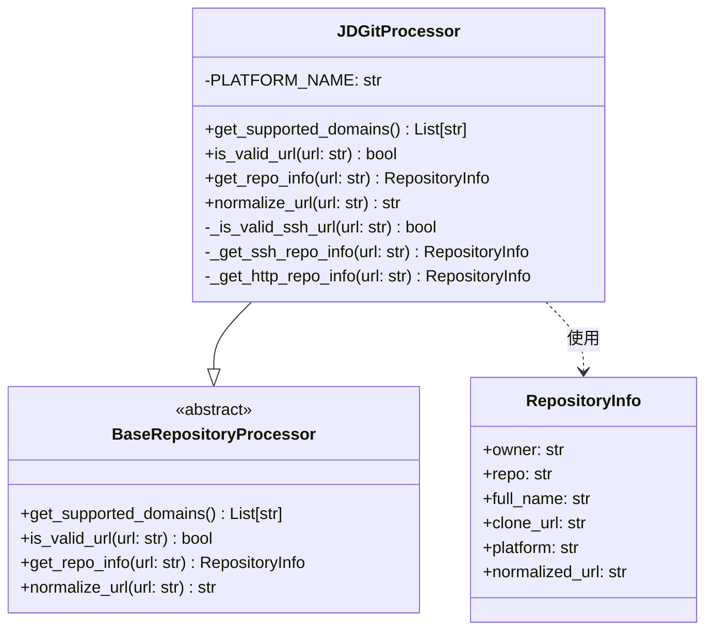
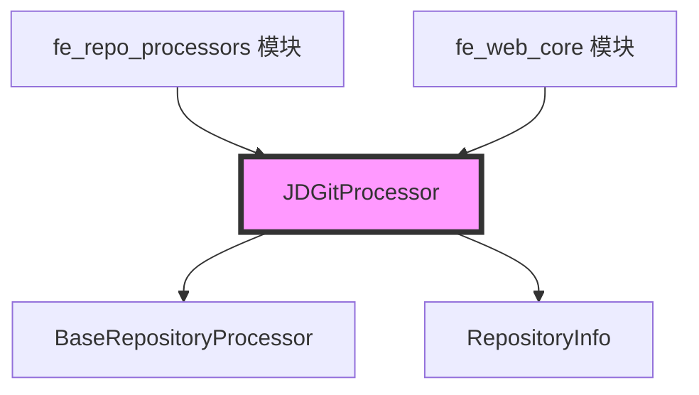
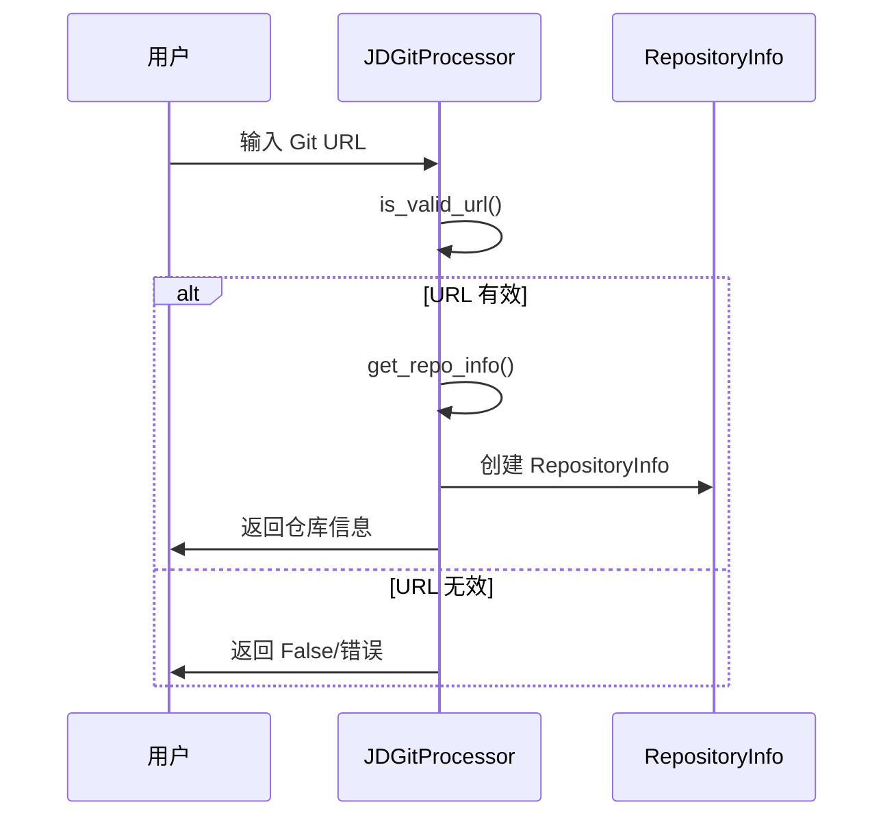

# JD Git 处理器模块文档

## 概述

JD Git 处理器模块是 CodeWiki 系统中专门用于处理京东内部 Git 仓库的核心组件。该模块提供了对京东内部多个 Git 平台（包括 coding.jd.com 和 xingyun.jd.com）的 URL 解析、验证和信息提取功能。

## 核心功能

### 主要特性
- **多平台支持**：支持京东内部多个 Git 平台域名
- **URL 格式验证**：支持 SSH 和 HTTP/HTTPS 协议的 URL 验证
- **智能 URL 解析**：自动识别不同平台的 URL 结构模式
- **标准化处理**：将不同格式的 URL 转换为统一的标准格式

### 支持的域名
- `coding.jd.com`
- `xingyun.jd.com`
- `www.xingyun.jd.com`
- `www.coding.jd.com`

## 架构设计

### 类结构



### 模块依赖关系



## 核心组件详解

### JDGitProcessor 类

#### 类定义
```python
class JDGitProcessor(BaseRepositoryProcessor):
    """Handles JD internal Git repository processing."""
    PLATFORM_NAME = "JD Internal Git"
```

#### 主要方法

##### 1. URL 验证 (is_valid_url)
- **功能**：验证给定的 URL 是否为有效的京东内部 Git 仓库地址
- **支持格式**：
  - SSH 格式：`git@coding.jd.com:owner/repo.git`
  - SSH 格式：`ssh://git@coding.jd.com/owner/repo.git`
  - HTTP/HTTPS 格式：`https://coding.jd.com/owner/repo`

##### 2. 仓库信息提取 (get_repo_info)
- **功能**：从 URL 中提取仓库的详细信息
- **返回值**：RepositoryInfo 对象，包含：
  - 所有者 (owner)
  - 仓库名 (repo)
  - 完整名称 (full_name)
  - 克隆地址 (clone_url)
  - 平台名称 (platform)
  - 标准化 URL (normalized_url)

##### 3. URL 标准化 (normalize_url)
- **功能**：将不同格式的 URL 转换为统一的标准格式
- **返回值**：标准化的 HTTP/HTTPS URL

#### 私有方法

##### _is_valid_ssh_url
专门处理 SSH URL 格式的验证，支持两种 SSH 格式：
- `git@domain:path` 格式
- `ssh://git@domain/path` 格式

##### _get_ssh_repo_info
从 SSH URL 中提取仓库信息，处理不同平台的特殊格式要求。

##### _get_http_repo_info
从 HTTP/HTTPS URL 中提取仓库信息，处理不同平台的 URL 结构差异。

## 数据流处理



## 使用示例

### URL 验证
```python
from codewiki.src.fe.repository_processors.jd_git_processor import JDGitProcessor

# 验证 URL 是否有效
url = "https://coding.jd.com/owner/repository"
is_valid = JDGitProcessor.is_valid_url(url)
print(f"URL 有效: {is_valid}")
```

### 获取仓库信息
```python
# 提取仓库信息
repo_info = JDGitProcessor.get_repo_info(url)
print(f"所有者: {repo_info.owner}")
print(f"仓库名: {repo_info.repo}")
print(f"克隆地址: {repo_info.clone_url}")
```

### URL 标准化
```python
# 标准化 URL
normalized_url = JDGitProcessor.normalize_url(url)
print(f"标准化 URL: {normalized_url}")
```

## 错误处理

模块采用防御性编程，所有公共方法都包含异常处理：
- URL 解析错误会返回 False（验证方法）或抛出 ValueError（信息提取方法）
- 不支持的域名或格式会被正确识别并拒绝
- 路径结构不符合预期的 URL 会被标记为无效

## 平台特定处理

### coding.jd.com 平台
- 标准格式：`/owner/repo`
- SSH 格式：`git@coding.jd.com:owner/repo.git`

### xingyun.jd.com 平台
- 标准格式：`/codingRoot/owner/repo`
- 简单格式：`/owner/repo`
- SSH 格式：`git@xingyun.jd.com:codingRoot/owner/repo.git`

## 相关模块

- [fe_repo_processors](fe_repo_processors.md) - 仓库处理器基类和工厂
- [fe_web_core](fe_web_core.md) - Web 前端核心功能

## 扩展性

该模块设计为可扩展的架构，可以轻松添加对新的京东内部 Git 平台的支持：
1. 在 `get_supported_domains()` 中添加新域名
2. 在 URL 验证逻辑中添加相应的处理规则
3. 在信息提取方法中添加平台特定的解析逻辑