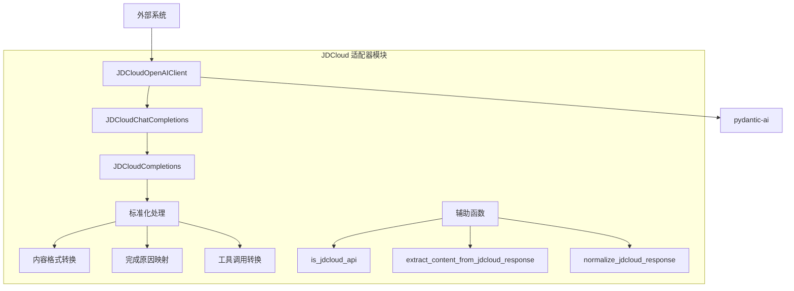
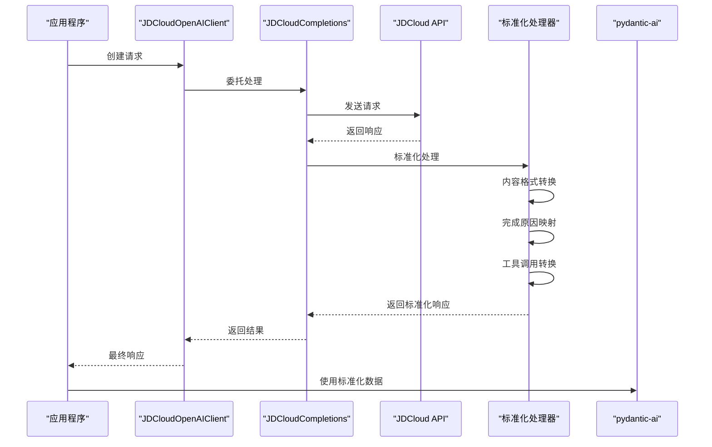
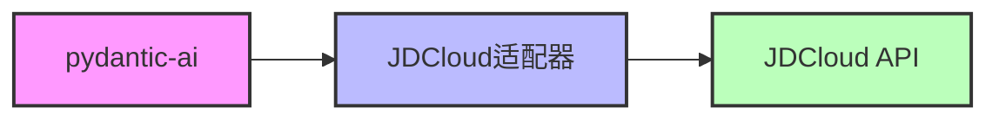

# JDCloud 适配器模块文档

## 概述

JDCloud 适配器模块是 CodeWiki 系统中用于集成京东云（JDCloud）Claude API 的核心组件。该模块的主要功能是将 JDCloud API 的响应格式转换为与 OpenAI API 兼容的格式，以便与 pydantic-ai 框架无缝集成。

## 核心功能

### 1. API 响应格式转换
- 将 JDCloud Claude API 的响应标准化为 OpenAI 格式
- 处理内容字段格式差异（列表转字符串）
- 修复完成原因字段映射（end_turn → stop，tool_use → tool_calls）
- 转换工具调用格式以符合 OpenAI 规范

### 2. 客户端封装
- 提供 JDCloudOpenAIClient 包装器类
- 实现透明的 API 调用和响应处理
- 支持错误处理和日志记录
- 保持与原始 OpenAI 客户端的接口兼容性

### 3. 智能检测
- 自动识别 JDCloud API 端点
- 支持多个京东云域名（ai-api.jdcloud.com、jdcloud.com、jd.com）
- 动态选择适配策略

## 架构设计

### 模块结构图



### 数据流图



## 核心组件详解

### JDCloudOpenAIClient

主要包装器类，提供对 OpenAI 客户端的透明封装。

**功能特点：**
- 代理所有属性访问到包装的客户端
- 提供标准化的聊天完成功能
- 保持与原始客户端的完全兼容性

**使用场景：**
```python
# 创建 JDCloud 客户端
client = JDCloudOpenAIClient(openai_client)
# 使用方式与原始客户端完全相同
response = client.chat.completions.create(**params)
```

### JDCloudCompletions

核心处理类，负责 API 调用的实际执行和响应标准化。

**处理流程：**
1. 接收并记录传入的请求参数
2. 调用原始的 JDCloud API
3. 捕获和处理各种异常情况
4. 对响应进行标准化处理
5. 返回兼容格式的响应数据

**错误处理：**
- HTTP 状态码错误处理
- 响应体解析错误处理
- 标准化过程错误处理
- 详细的日志记录机制

### 标准化函数

#### normalize_jdcloud_response

核心标准化函数，处理 JDCloud 响应与 OpenAI 格式的差异。

**主要修复内容：**

1. **内容字段修复**
   ```python
   # JDCloud 格式（列表）
   content = ["文本内容"]
   # 转换为 OpenAI 格式（字符串）
   content = "文本内容"
   ```

2. **完成原因映射**
   ```python
   # 映射关系
   end_turn → stop
   max_tokens → length  
   tool_use → tool_calls
   ```

3. **工具调用格式转换**
   ```python
   # JDCloud 格式
   {
       "type": "tool_use",
       "name": "function_name",
       "input": {"arg": "value"}
   }
   # 转换为 OpenAI 格式
   {
       "type": "function",
       "function": {
           "name": "function_name",
           "arguments": {"arg": "value"}
       }
   }
   ```

#### is_jdcloud_api

智能检测函数，通过分析基础 URL 判断是否使用 JDCloud API。

**支持的域名：**
- ai-api.jdcloud.com
- jdcloud.com
- jd.com

#### extract_content_from_jdcloud_response

内容提取函数，处理 JDCloud 响应中内容字段的多种格式。

**支持的格式：**
- 字符串格式：直接返回
- 列表格式：连接所有元素
- 空列表：返回空字符串

## 集成关系

### 与 pydantic-ai 的集成



该适配器作为中间层，使得 pydantic-ai 框架能够透明地使用 JDCloud Claude API，无需修改现有代码。

### 与系统其他模块的关系

- **[be_config](be_config.md)**：通过配置模块获取 JDCloud API 的连接参数
- **[be_agent_tools](be_agent_tools.md)**：为智能体工具提供 LLM 调用能力
- **[be_doc_generator](be_doc_generator.md)**：支持文档生成过程中的 AI 调用

## 使用示例

### 基本使用

```python
from openai import OpenAI
from codewiki.src.be.jdcloud_adapter import JDCloudOpenAIClient

# 创建 OpenAI 客户端（配置为 JDCloud 端点）
openai_client = OpenAI(
    base_url="https://ai-api.jdcloud.com/openai/v1",
    api_key="your-jdcloud-api-key"
)

# 包装为 JDCloud 适配器客户端
client = JDCloudOpenAIClient(openai_client)

# 正常使用（自动进行标准化处理）
response = client.chat.completions.create(
    model="claude-3-sonnet",
    messages=[{"role": "user", "content": "Hello!"}]
)
```

### 错误处理

```python
try:
    response = client.chat.completions.create(**params)
except Exception as e:
    # 适配器会记录详细的错误信息
    logger.error(f"API 调用失败: {e}")
    # 处理错误...
```

## 配置说明

### 环境变量

```bash
# JDCloud API 配置
JDCLOUD_API_KEY=your-api-key
JDCLOUD_BASE_URL=https://ai-api.jdcloud.com/openai/v1
JDCLOUD_MODEL=claude-3-sonnet
```

### 日志配置

适配器使用 Python 标准日志模块，可以通过以下方式配置日志级别：

```python
import logging

# 设置调试级别
logging.getLogger('codewiki.src.be.jdcloud_adapter').setLevel(logging.DEBUG)
```

## 性能优化

### 缓存策略

- 响应标准化结果可缓存
- 域名识别结果缓存
- 错误模式识别缓存

### 并发处理

- 支持异步调用模式
- 线程安全的响应处理
- 连接池复用

## 故障排除

### 常见问题

1. **响应格式错误**
   - 检查 JDCloud API 版本兼容性
   - 验证标准化函数配置
   - 查看详细日志信息

2. **工具调用失败**
   - 确认工具格式转换正确性
   - 检查 pydantic-ai 版本要求
   - 验证参数映射关系

3. **性能问题**
   - 启用响应缓存
   - 优化日志级别设置
   - 使用连接池配置

### 调试技巧

```python
# 启用详细日志记录
import logging
logging.basicConfig(level=logging.DEBUG)

# 检查原始响应
response = client.chat.completions.create(**params)
print(f"标准化前: {response.model_dump()}")

# 验证标准化结果
normalized = normalize_jdcloud_response(response)
print(f"标准化后: {normalized.model_dump()}")
```

## 扩展性

### 支持新的 API 格式

可以通过扩展标准化函数来支持新的 JDCloud API 格式：

```python
def normalize_new_format(response):
    # 添加新的标准化逻辑
    pass
```

### 自定义错误处理

可以继承现有类并重写错误处理方法：

```python
class CustomJDCloudCompletions(JDCloudCompletions):
    def handle_error(self, error):
        # 自定义错误处理逻辑
        pass
```

## 安全考虑

### API 密钥管理

- 使用环境变量存储敏感信息
- 支持密钥轮换机制
- 实现访问权限控制

### 数据传输安全

- 使用 HTTPS 协议
- 验证 SSL 证书
- 敏感数据加密存储

## 版本兼容性

### 支持的 JDCloud API 版本

- Claude 3 系列模型
- 兼容 OpenAI API v1
- 支持 pydantic-ai 最新版本

### 依赖要求

```python
openai >= 1.0.0
pydantic >= 2.0.0
```

## 总结

JDCloud 适配器模块通过精巧的设计，实现了 JDCloud Claude API 与 OpenAI 格式的无缝兼容。该模块不仅提供了完整的标准化处理流程，还具备强大的错误处理和日志记录功能，为整个 CodeWiki 系统提供了稳定可靠的 AI 调用能力。通过透明的包装器模式，使得现有代码可以在不修改的情况下直接使用 JDCloud API，大大提高了系统的可维护性和扩展性。