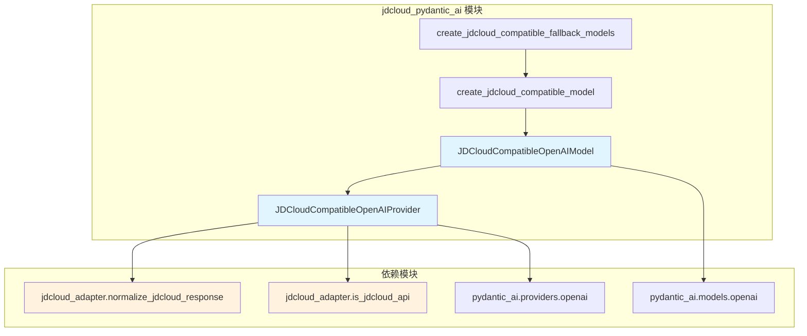
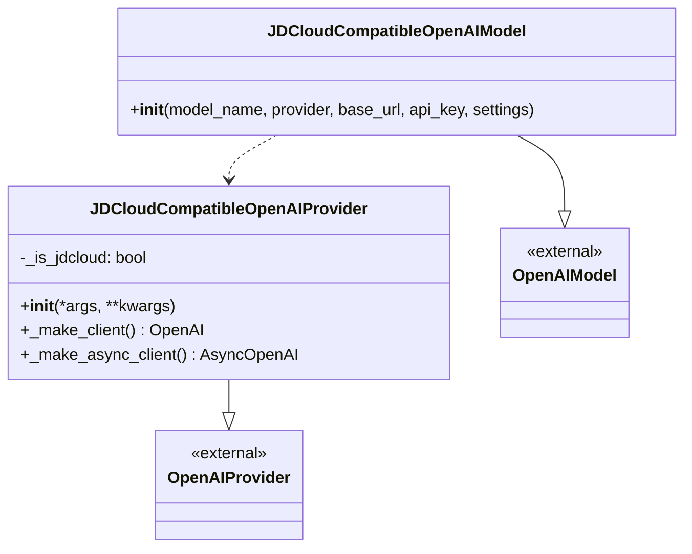
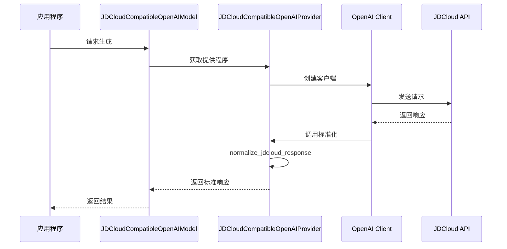
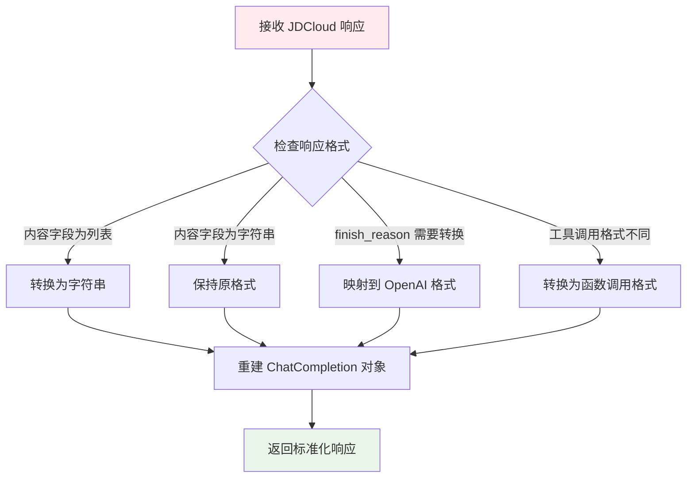
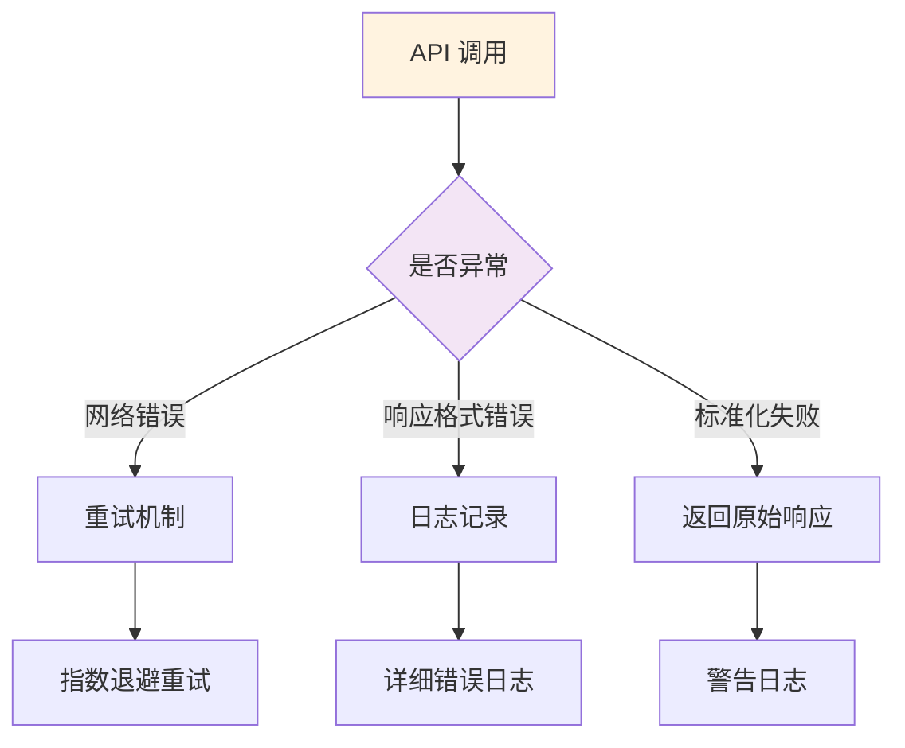

# JDCloud Pydantic-AI 兼容模块

## 概述

`jdcloud_pydantic_ai` 模块提供了与 JDCloud Claude API 兼容的 Pydantic-AI 模型和提供程序实现。该模块解决了 JDCloud API 响应格式与标准 OpenAI API 格式之间的差异问题，确保 Pydantic-AI 框架能够无缝处理 JDCloud 的响应数据。

## 核心功能

- **响应格式标准化**：将 JDCloud API 的非标准响应转换为 OpenAI 兼容格式
- **Pydantic-AI 集成**：提供兼容的模型和提供程序类
- **工具调用支持**：处理 JDCloud 特有的工具调用格式
- **回退模型支持**：构建主备模型配置以提高系统可靠性

## 架构设计

### 模块架构图



### 组件关系图



## 核心组件详解

### JDCloudCompatibleOpenAIProvider

JDCloud 兼容的 OpenAI 提供程序，通过重写客户端创建方法来拦截和标准化 API 响应。

**主要特性：**
- **智能检测**：自动识别 JDCloud API 端点
- **响应拦截**：在客户端层面拦截 API 调用
- **格式转换**：实时将 JDCloud 响应转换为 OpenAI 格式
- **调试支持**：提供详细的日志记录便于问题排查

**实现原理：**
1. 在客户端创建时检查是否为 JDCloud API
2. 对 `chat.completions.create` 方法进行补丁
3. 调用原始方法获取响应
4. 使用 `normalize_jdcloud_response` 标准化响应
5. 返回标准化后的响应数据

### JDCloudCompatibleOpenAIModel

JDCloud 兼容的 OpenAI 模型类，封装了兼容提供程序的创建逻辑。

**主要特性：**
- **自动提供程序创建**：如未提供自定义提供程序，自动创建兼容提供程序
- **参数透传**：支持所有标准 OpenAI 模型参数
- **无缝集成**：可直接替换标准 OpenAI 模型使用

### 工厂函数

#### create_jdcloud_compatible_model

创建单个 JDCloud 兼容模型的便捷函数，提供合理的默认配置。

**默认配置：**
- temperature: 0.0（确保输出一致性）
- max_tokens: 32768（支持长文本生成）

#### create_jdcloud_compatible_fallback_models

创建主备模型配置，提高系统可靠性。

**使用场景：**
- 主模型不可用时自动切换到备用模型
- 负载均衡和故障转移
- A/B 测试不同模型性能

## 数据流处理

### API 调用流程图



### 响应标准化流程



## 响应格式标准化

### 主要修复内容

1. **内容字段修复**
   - JDCloud 格式：`content: ["文本内容"]`
   - OpenAI 格式：`content: "文本内容"`
   - 转换逻辑：将列表元素连接为字符串

2. **完成原因映射**
   - `end_turn` → `stop`
   - `max_tokens` → `length`
   - `tool_use` → `tool_calls`

3. **工具调用格式转换**
   - JDCloud 格式：`{"type": "tool_use", "name": "func_name", "input": {...}}`
   - OpenAI 格式：`{"type": "function", "function": {"name": "func_name", "arguments": {...}}}`

### 标准化示例

```python
# JDCloud 原始响应
{
    "choices": [{
        "message": {
            "content": ["你好，"],
            "tool_calls": [{
                "type": "tool_use",
                "name": "get_weather",
                "input": {"location": "北京"}
            }]
        },
        "finish_reason": "end_turn"
    }]
}

# 标准化后响应
{
    "choices": [{
        "message": {
            "content": "你好，",
            "tool_calls": [{
                "type": "function",
                "function": {
                    "name": "get_weather",
                    "arguments": {"location": "北京"}
                }
            }]
        },
        "finish_reason": "stop"
    }]
}
```

## 使用示例

### 基本使用

```python
from codewiki.src.be.jdcloud_pydantic_ai import create_jdcloud_compatible_model

# 创建兼容模型
model = create_jdcloud_compatible_model(
    model_name="claude-3-sonnet",
    base_url="https://ai-api.jdcloud.com",
    api_key="your-api-key"
)

# 使用模型（与标准 Pydantic-AI 相同）
result = model.complete("请生成一段代码文档")
```

### 高级配置

```python
from codewiki.src.be.jdcloud_pydantic_ai import JDCloudCompatibleOpenAIModel
from pydantic_ai.models.openai import OpenAIModelSettings

# 自定义配置
model = JDCloudCompatibleOpenAIModel(
    model_name="claude-3-opus",
    base_url="https://ai-api.jdcloud.com",
    api_key="your-api-key",
    settings=OpenAIModelSettings(
        temperature=0.7,
        max_tokens=4096,
        top_p=0.9
    )
)
```

### 回退模型配置

```python
from codewiki.src.be.jdcloud_pydantic_ai import create_jdcloud_compatible_fallback_models

# 创建主备配置
fallback_models = create_jdcloud_compatible_fallback_models(
    main_model="claude-3-opus",
    fallback_model="claude-3-sonnet",
    base_url="https://ai-api.jdcloud.com",
    api_key="your-api-key"
)

# 使用回退模型
result = fallback_models.complete("复杂任务处理")
```

## 错误处理

### 异常处理策略



### 日志记录

模块提供详细的日志记录功能，包括：
- API 调用参数和响应类型
- 标准化前后的响应内容对比
- 错误信息和异常堆栈
- 性能指标和响应时间

## 性能优化

### 缓存策略

- **客户端复用**：避免重复创建 OpenAI 客户端
- **连接池**：使用 HTTP 连接池减少网络开销
- **响应缓存**：在应用层实现响应缓存机制

### 最佳实践

1. **模型选择**：根据任务复杂度选择合适的模型
2. **参数调优**：合理设置 temperature 和 max_tokens
3. **错误重试**：实现智能重试机制
4. **监控告警**：监控 API 调用成功率和响应时间

## 相关模块

- [jdcloud_adapter](jdcloud_adapter.md) - JDCloud API 适配器核心功能
- [be_agent_tools](be_agent_tools.md) - 代理工具集成
- [be_doc_generator](be_doc_generator.md) - 文档生成器

## 版本信息

- **当前版本**：v1.0.0
- **兼容版本**：pydantic-ai >= 0.1.0
- **支持模型**：Claude 3 系列（Sonnet、Opus、Haiku）
- **API 版本**：JDCloud AI API v1