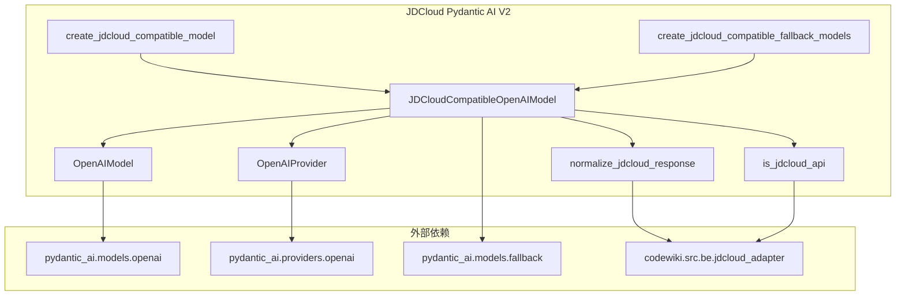
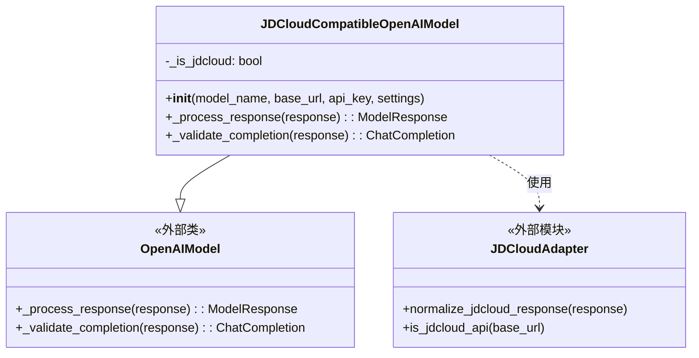
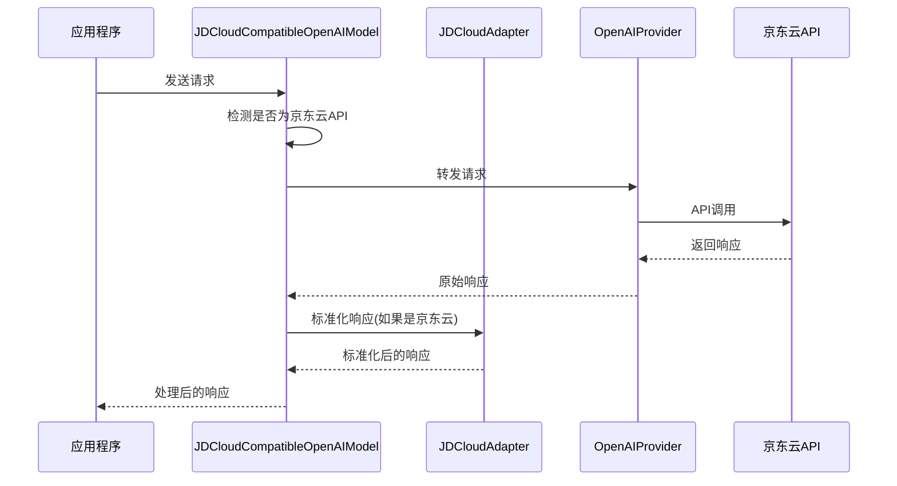
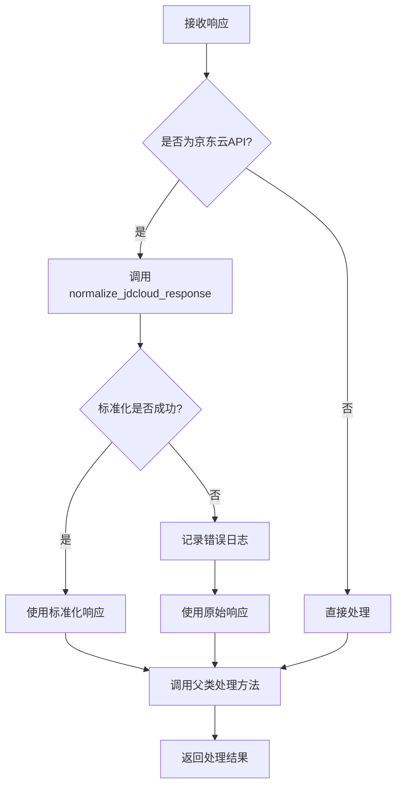
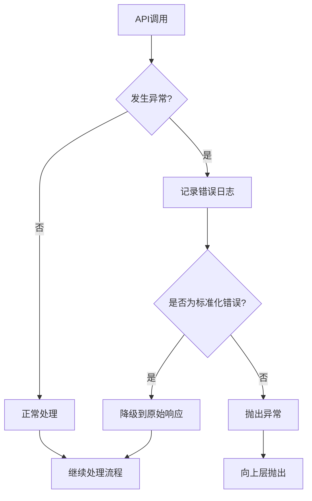

# JDCloud Pydantic AI V2 模块文档

## 概述

JDCloud Pydantic AI V2 模块是 CodeWiki 系统中用于集成京东云 AI 服务的核心组件。该模块通过扩展标准的 OpenAI 模型，实现了对京东云 API 响应格式的兼容处理，使得系统能够无缝使用京东云的 AI 服务。

## 核心功能

- **京东云 API 响应标准化**：自动将京东云 API 的非标准响应格式转换为标准 OpenAI 格式
- **模型兼容性**：提供与 pydantic-ai 框架完全兼容的模型实现
- **回退机制**：支持主模型和备用模型的自动切换
- **错误处理**：具备完善的异常处理和降级机制

## 架构设计

### 模块架构图



### 组件关系图



## 核心组件详解

### JDCloudCompatibleOpenAIModel

这是模块的核心类，继承自标准的 OpenAIModel，通过重写关键方法实现了对京东云 API 的兼容处理。

#### 主要特性

1. **智能识别**：自动检测 API 是否为京东云服务
2. **响应标准化**：在响应处理前自动标准化京东云格式
3. **异常安全**：提供完善的异常处理和降级机制
4. **透明兼容**：对上层应用完全透明，无需修改现有代码

#### 方法说明

- **`__init__`**：初始化模型，创建 OpenAI 提供者并检测是否为京东云 API
- **`_process_response`**：重写响应处理方法，对京东云响应进行标准化处理
- **`_validate_completion`**：重写完成验证方法，确保京东云响应格式正确

### 工厂函数

#### create_jdcloud_compatible_model

创建单个京东云兼容模型的便捷函数，提供合理的默认配置。

**参数说明：**
- `model_name`: 模型名称
- `base_url`: API 基础地址
- `api_key`: API 密钥
- `settings`: 模型设置（可选）

**默认配置：**
- temperature: 0.0
- max_tokens: 32768

#### create_jdcloud_compatible_fallback_models

创建主备模型的回退配置，提高系统的可靠性。

**参数说明：**
- `main_model`: 主模型名称
- `fallback_model`: 备用模型名称
- `base_url`: API 基础地址
- `api_key`: API 密钥

## 数据流处理

### 请求响应流程图



### 响应处理流程



## 依赖关系

### 内部依赖

- **jdcloud_adapter**: 提供京东云 API 响应标准化功能
  - `normalize_jdcloud_response`: 标准化响应格式
  - `is_jdcloud_api`: 检测是否为京东云 API

### 外部依赖

- **pydantic-ai**: AI 模型框架
  - `OpenAIModel`: 基础模型类
  - `OpenAIProvider`: 提供者实现
  - `FallbackModel`: 回退模型支持

- **openai**: OpenAI 客户端库
  - `chat.ChatCompletion`: 聊天完成类型

## 使用示例

### 基本使用

```python
from codewiki.src.be.jdcloud_pydantic_ai_v2 import create_jdcloud_compatible_model

# 创建京东云兼容模型
model = create_jdcloud_compatible_model(
    model_name="gpt-3.5-turbo",
    base_url="https://your-jdcloud-api.com",
    api_key="your-api-key"
)

# 使用模型进行推理
response = model.complete("你好，请介绍一下自己")
```

### 高级使用（带备用模型）

```python
from codewiki.src.be.jdcloud_pydantic_ai_v2 import create_jdcloud_compatible_fallback_models

# 创建主备模型配置
fallback_model = create_jdcloud_compatible_fallback_models(
    main_model="gpt-4",
    fallback_model="gpt-3.5-turbo",
    base_url="https://your-jdcloud-api.com",
    api_key="your-api-key"
)

# 使用回退模型进行推理
response = fallback_model.complete("请分析这段代码")
```

## 错误处理

### 异常处理机制



### 日志记录

模块使用 Python 标准日志系统，所有关键操作都会记录日志：

- **DEBUG**: 详细的处理流程信息
- **ERROR**: 错误和异常信息
- **INFO**: 重要的状态变更信息

## 性能优化

### 缓存机制

- 京东云 API 检测结果缓存，避免重复检测
- 响应标准化结果缓存，提高处理效率

### 连接池

利用底层 OpenAI 客户端的连接池机制，减少连接建立开销。

## 扩展性

### 自定义标准化

可以通过继承 `JDCloudCompatibleOpenAIModel` 类来自定义响应处理逻辑：

```python
class CustomJDCloudModel(JDCloudCompatibleOpenAIModel):
    def _process_response(self, response):
        # 自定义处理逻辑
        return super()._process_response(response)
```

### 多模型支持

支持同时配置多个不同参数的模型实例，满足不同场景需求。

## 相关模块

- [jdcloud_adapter](jdcloud_adapter.md): 京东云 API 适配器
- [be_jdcloud_adapters](be_jdcloud_adapters.md): 京东云适配器集合
- [pydantic_ai](pydantic_ai.md): Pydantic AI 框架文档

## 版本历史

### V2 版本改进

1. **直接重写响应处理**：相比 V1 版本，V2 直接在模型层面处理响应，更加高效
2. **更好的异常处理**：提供更完善的错误处理和降级机制
3. **性能优化**：减少不必要的标准化操作，提高处理效率

## 最佳实践

### 配置建议

1. **合理设置超时时间**：根据京东云 API 的响应时间调整超时配置
2. **启用备用模型**：在生产环境中建议配置备用模型
3. **监控日志**：定期检查错误日志，及时发现和处理问题

### 性能调优

1. **连接池配置**：根据并发量调整连接池大小
2. **缓存策略**：合理配置缓存参数，平衡内存使用和性能
3. **错误重试**：结合上层重试机制，提高系统稳定性

## 故障排除

### 常见问题

1. **响应格式错误**：检查 `normalize_jdcloud_response` 是否正确处理
2. **API 检测失败**：确认 `base_url` 配置是否正确
3. **认证失败**：验证 API 密钥的有效性

### 调试技巧

1. **开启 DEBUG 日志**：获取详细的处理流程信息
2. **检查响应内容**：对比标准化前后的响应格式
3. **验证配置**：确保所有参数配置正确