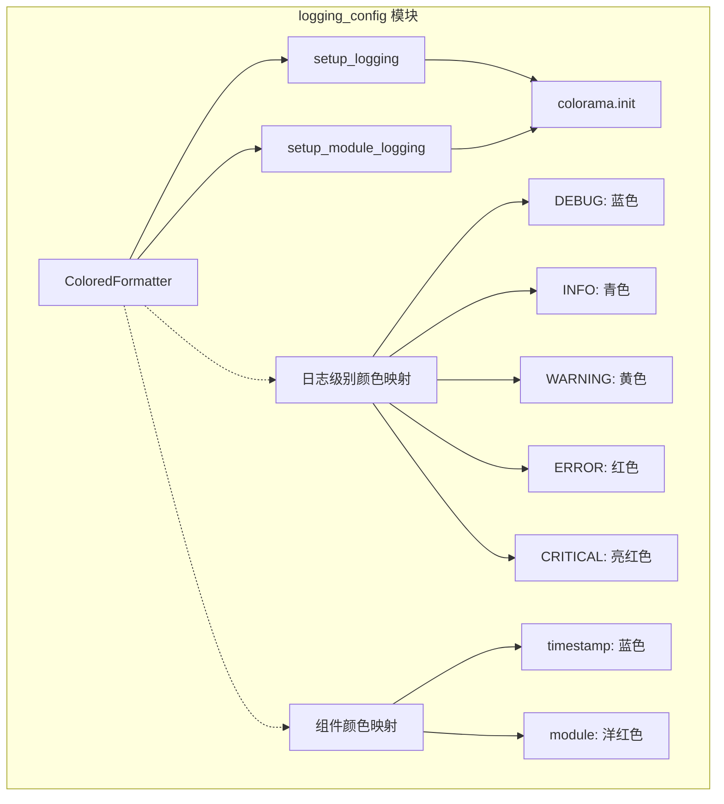
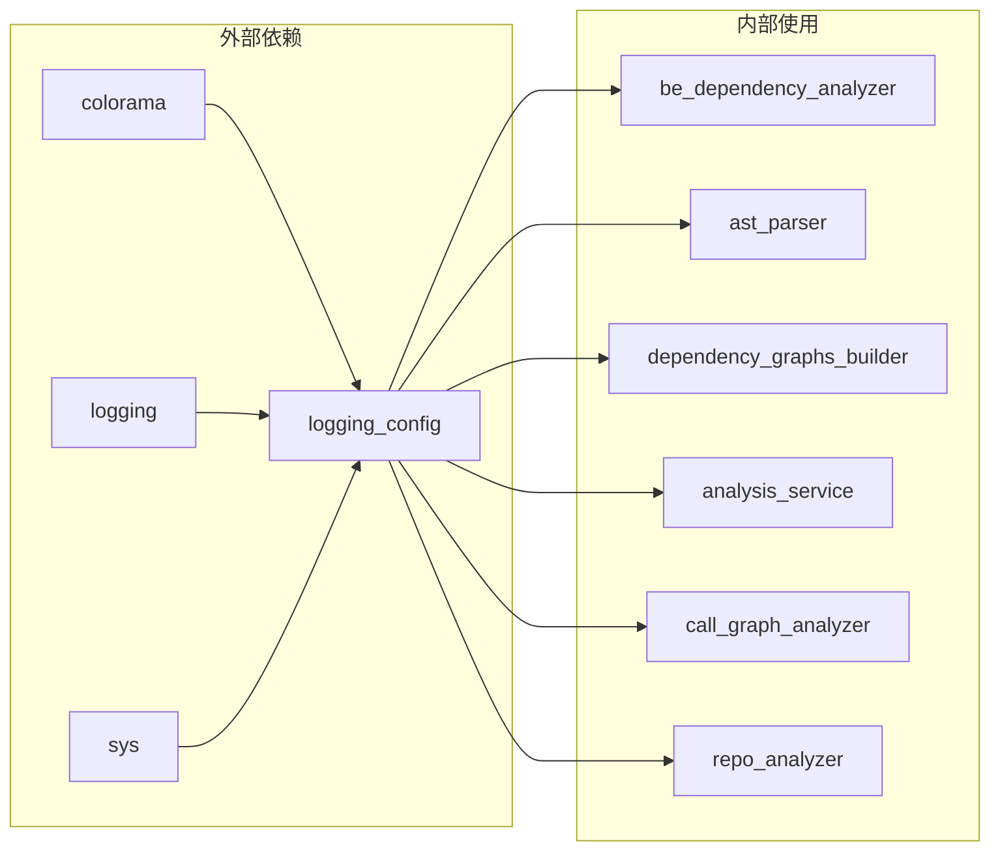

# logging_config 模块文档

## 概述

logging_config 模块是 CodeWiki 依赖分析器（be_dependency_analyzer）的日志配置子模块，专门负责为整个依赖分析系统提供彩色日志输出功能。该模块通过自定义的 ColoredFormatter 格式化器，为不同级别的日志信息添加颜色标识，显著提升日志的可读性和调试效率。

## 核心功能

### 1. 彩色日志格式化
- **多级别颜色区分**：为 DEBUG、INFO、WARNING、ERROR、CRITICAL 等不同日志级别分配特定颜色
- **组件颜色标识**：时间戳显示为蓝色，模块名称显示为洋红色
- **跨平台支持**：使用 colorama 库确保在 Windows、Linux、macOS 等平台上都能正常显示彩色日志

### 2. 灵活的日志配置
- **全局日志配置**：通过 `setup_logging()` 函数为整个应用设置统一的彩色日志
- **模块级日志配置**：通过 `setup_module_logging()` 为特定模块配置独立的日志设置
- **防止日志重复**：自动清理现有处理器，避免日志消息重复输出

### 3. 异常信息处理
- **完整的异常追踪**：自动格式化并显示异常堆栈信息
- **颜色一致性**：异常信息保持与主日志消息相同的颜色主题

## 架构设计

### 模块结构



### 依赖关系



## 核心组件详解

### ColoredFormatter 类

ColoredFormatter 是模块的核心组件，继承自 Python 标准库的 logging.Formatter，专门用于为日志记录添加颜色标识。

#### 颜色配置方案

| 日志级别 | 颜色 | 用途说明 |
|---------|------|----------|
| DEBUG | 蓝色（dim） | 开发和调试信息 |
| INFO | 青色 | 正常操作消息 |
| WARNING | 黄色 | 需要注意的警告消息 |
| ERROR | 红色 | 错误消息 |
| CRITICAL | 亮红色 | 需要立即关注的关键问题 |

#### 组件颜色标识

| 组件 | 颜色 | 说明 |
|------|------|------|
| 时间戳 | 蓝色 | 显示日志记录时间 |
| 模块名 | 洋红色 | 标识日志来源模块 |
| 重置 | 默认 | 恢复终端默认颜色 |

### 配置函数

#### setup_logging(level=logging.INFO)

设置全局彩色日志配置，适用于整个应用程序。

**参数说明：**
- `level`: 日志级别，默认为 `logging.INFO`

**功能特性：**
- 创建控制台处理器（StreamHandler）
- 应用 ColoredFormatter 格式化器
- 清理根日志器的现有处理器
- 防止日志重复输出

#### setup_module_logging(module_name: str, level=logging.INFO)

为特定模块设置独立的彩色日志配置。

**参数说明：**
- `module_name`: 模块名称
- `level`: 日志级别，默认为 `logging.INFO`

**功能特性：**
- 创建模块专用的日志器
- 独立的处理器和格式化器配置
- 禁用日志传播，避免重复
- 返回配置好的日志器实例

## 使用示例

### 基本使用

```python
from codewiki.src.be.dependency_analyzer.utils.logging_config import setup_logging
import logging

# 设置全局彩色日志
setup_logging(level=logging.INFO)

# 获取日志器并使用
logger = logging.getLogger(__name__)
logger.info("这是一个信息消息")
logger.warning("这是一个警告消息")
logger.error("这是一个错误消息")
```

### 模块级配置

```python
from codewiki.src.be.dependency_analyzer.utils.logging_config import setup_module_logging

# 为特定模块设置日志
module_logger = setup_module_logging('my_analysis_module', level=logging.DEBUG)

# 使用模块日志器
module_logger.debug("调试信息")
module_logger.info("模块运行状态")
```

### 在依赖分析器中的应用

```python
# 在 AST 解析器中使用
from codewiki.src.be.dependency_analyzer.utils.logging_config import setup_module_logging

logger = setup_module_logging('ast_parser', level=logging.DEBUG)
logger.info("开始解析 Python 文件: %s", filename)

# 在依赖图构建器中使用
graph_logger = setup_module_logging('dependency_builder')
graph_logger.info("构建依赖图，节点数: %d", node_count)
```

## 集成关系

logging_config 模块作为基础工具模块，被 be_dependency_analyzer 模块的多个子组件广泛使用：

- **[ast_parser](ast_parser.md)**：在解析源代码时使用彩色日志显示解析进度和错误
- **[dependency_graphs_builder](dependency_graphs_builder.md)**：在构建依赖图时记录节点和边的创建过程
- **[analysis_service](analysis_service.md)**：在分析服务中记录分析任务的执行状态
- **[call_graph_analyzer](call_graph_analyzer.md)**：在调用图分析中显示函数调用关系
- **[repo_analyzer](repo_analyzer.md)**：在仓库分析过程中记录分析结果

## 颜色输出示例

```
[14:30:45] INFO     开始分析仓库: example-repo
[14:30:46] DEBUG    解析文件: main.py
[14:30:47] WARNING  发现循环依赖: module_a -> module_b -> module_a
[14:30:48] ERROR    解析失败: invalid_syntax.py
[14:30:49] CRITICAL 分析任务中止: 关键文件缺失
```

## 最佳实践

### 1. 日志级别选择
- **开发阶段**：使用 DEBUG 级别获取详细的调试信息
- **生产环境**：使用 INFO 级别记录关键操作
- **错误监控**：使用 ERROR 或 CRITICAL 级别记录需要关注的问题

### 2. 模块日志配置
- 为不同的分析模块配置独立的日志器
- 根据模块的重要性调整日志级别
- 使用模块名称作为日志器名称，便于问题追踪

### 3. 性能考虑
- colorama 的初始化开销很小，适合频繁使用
- 彩色日志对性能影响极小，可以放心在生产环境使用

## 扩展性

logging_config 模块设计简洁，易于扩展：

- **自定义颜色方案**：可以通过修改 COLORS 字典来自定义颜色映射
- **添加新组件**：可以在 COMPONENT_COLORS 中添加新的组件颜色标识
- **格式化扩展**：可以通过继承 ColoredFormatter 类来添加更多格式化选项

## 总结

logging_config 模块为 CodeWiki 的依赖分析系统提供了专业级的日志可视化功能。通过彩色输出，开发人员和运维人员可以更快速地识别问题、追踪执行流程，显著提升调试效率。模块的设计遵循单一职责原则，专注于日志格式化，同时保持与 Python 标准日志系统的完全兼容性。