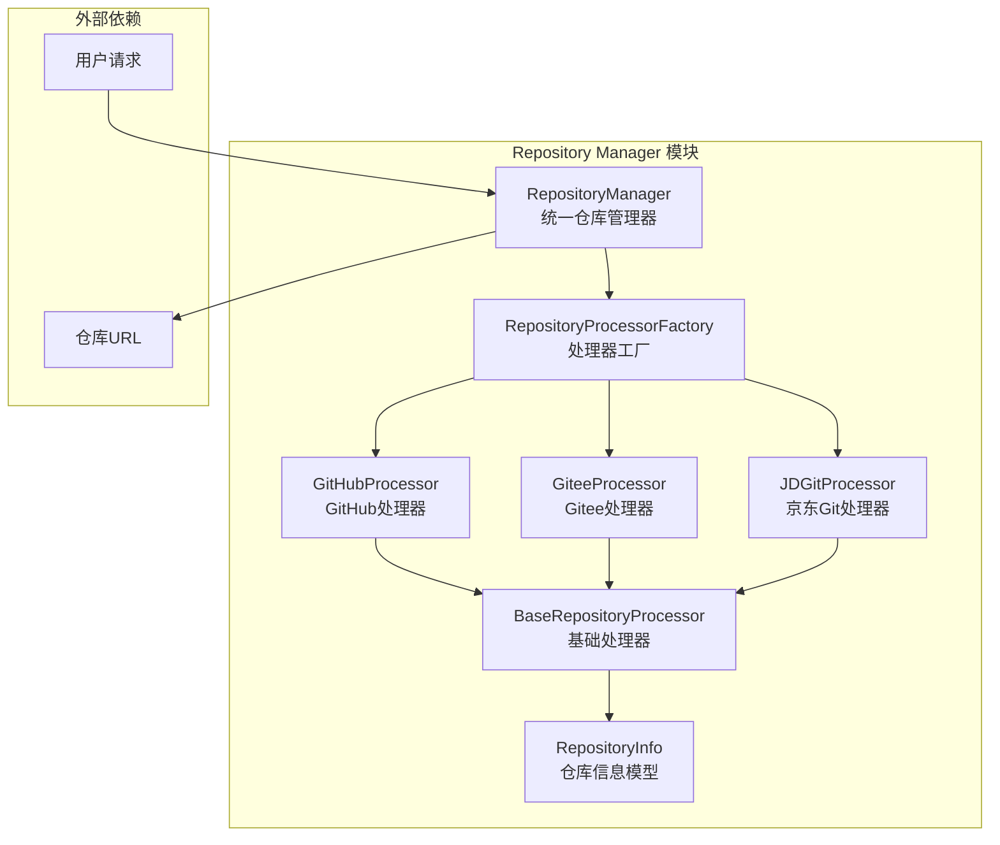
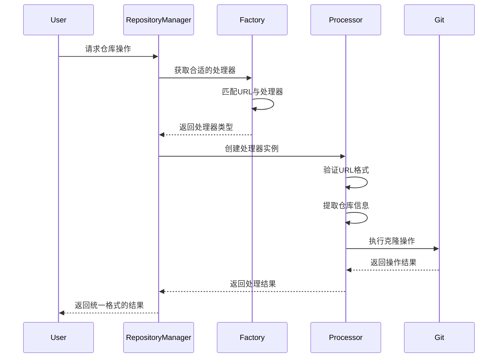

# Repository Manager 模块文档

## 概述

Repository Manager 模块是 CodeWiki 系统的前端核心组件之一，提供了统一的仓库管理接口。该模块作为多平台代码仓库操作的统一入口，支持 GitHub、Gitee、京东 Git 等主流代码托管平台，为上层应用提供一致的仓库操作API。

## 核心功能

### 主要职责
- **统一仓库接口**：为不同平台的代码仓库提供统一的操作接口
- **平台适配**：自动识别并适配不同的代码托管平台
- **仓库信息提取**：从仓库URL中提取关键信息（所有者、仓库名、克隆地址等）
- **仓库克隆**：支持指定提交点的代码克隆操作
- **URL标准化**：将不同格式的仓库URL转换为标准格式

### 支持的平台
- GitHub
- Gitee（码云）
- 京东 Git（JD Git）

## 架构设计

### 组件关系图



### 处理流程图



## 核心组件

### RepositoryManager 类

`RepositoryManager` 是模块的核心类，提供了静态方法接口，封装了所有仓库相关的操作。该类采用工厂模式，根据输入的URL自动选择合适的处理器。

#### 主要方法

| 方法 | 功能 | 参数 | 返回值 |
|------|------|------|--------|
| `is_valid_repository_url()` | 验证仓库URL有效性 | url: str | bool |
| `get_repository_info()` | 获取仓库详细信息 | url: str | RepositoryInfo \| None |
| `normalize_repository_url()` | 标准化仓库URL | url: str | str \| None |
| `clone_repository()` | 克隆仓库到本地 | url, target_dir, commit_id, depth, timeout | bool |
| `get_supported_platforms()` | 获取支持的平台列表 | - | list[str] |
| `get_supported_domains()` | 获取支持的域名列表 | - | list[str] |

#### 使用示例

```python
# 验证仓库URL
is_valid = RepositoryManager.is_valid_repository_url("https://github.com/user/repo")

# 获取仓库信息
repo_info = RepositoryManager.get_repository_info("https://github.com/user/repo")
if repo_info:
    print(f"仓库: {repo_info.full_name}")
    print(f"平台: {repo_info.platform}")
    print(f"克隆地址: {repo_info.clone_url}")

# 克隆仓库
success = RepositoryManager.clone_repository(
    url="https://github.com/user/repo",
    target_dir="/tmp/repo",
    commit_id="abc123",
    depth=1,
    timeout=300
)
```

## 依赖关系

### 内部依赖

Repository Manager 模块依赖于以下内部组件：

1. **[BaseRepositoryProcessor](base_processor.md)** - 抽象基础处理器
   - 定义了所有处理器必须实现的接口
   - 提供了通用的URL解析和仓库克隆功能

2. **[RepositoryProcessorFactory](factory.md)** - 处理器工厂
   - 负责根据URL选择合适的处理器
   - 管理所有支持的处理器注册

3. **[RepositoryInfo](base_processor.md)** - 仓库信息模型
   - 标准化的仓库信息数据结构
   - 包含所有者、仓库名、平台等关键信息

### 外部依赖

- **Git 命令行工具**：用于实际的仓库克隆操作
- **Python 标准库**：`os`, `subprocess`, `urllib.parse` 等

## 数据模型

### RepositoryInfo 结构

```python
class RepositoryInfo:
    owner: str              # 仓库所有者
    repo: str               # 仓库名称
    full_name: str          # 完整名称（owner/repo）
    clone_url: str          # 克隆地址
    platform: str           # 平台名称（github/gitee/jdgit）
    normalized_url: str     # 标准化后的URL
```

## 扩展性设计

### 添加新平台支持

要添加新的代码托管平台支持，需要：

1. 创建新的处理器类，继承自 `BaseRepositoryProcessor`
2. 实现必需的抽象方法
3. 在 `RepositoryProcessorFactory` 中注册新处理器

```python
class NewPlatformProcessor(BaseRepositoryProcessor):
    PLATFORM_NAME = "newplatform"
    
    @classmethod
    def get_supported_domains(cls) -> List[str]:
        return ["newplatform.com"]
    
    @classmethod
    def is_valid_url(cls, url: str) -> bool:
        # 实现URL验证逻辑
        pass
    
    # 实现其他必需方法...

# 在工厂中注册
RepositoryProcessorFactory.register_processor(NewPlatformProcessor)
```

## 错误处理

### 常见错误场景

1. **不支持的URL格式**
   - 返回 `None` 或 `False`
   - 记录错误日志

2. **克隆失败**
   - 网络连接问题
   - 权限不足
   - 仓库不存在

3. **超时错误**
   - 大仓库克隆超时
   - 网络延迟

### 错误处理策略

- 使用 try-except 捕获异常
- 提供详细的错误信息
- 支持重试机制
- 保持接口的一致性

## 性能优化

### 克隆优化

- **浅克隆**：默认使用 `--depth 1` 进行浅克隆
- **指定提交**：支持克隆到特定提交点
- **超时控制**：可配置的超时时间

### 缓存策略

- 处理器实例缓存
- 仓库信息缓存
- 避免重复验证相同的URL

## 安全性考虑

### URL验证

- 严格的URL格式验证
- 防止恶意URL注入
- 域名白名单机制

### 权限控制

- 克隆操作权限检查
- 敏感信息保护
- 访问日志记录

## 测试策略

### 单元测试

- URL格式验证测试
- 平台识别测试
- 仓库信息提取测试

### 集成测试

- 实际仓库克隆测试
- 多平台兼容性测试
- 性能基准测试

## 使用场景

### 典型应用场景

1. **代码分析平台**：批量处理不同平台的代码仓库
2. **CI/CD 系统**：统一处理多平台代码拉取
3. **代码审查工具**：支持多种代码托管平台
4. **文档生成系统**：从多平台仓库自动生成文档

### 最佳实践

1. **URL标准化**：始终使用标准化后的URL进行操作
2. **错误处理**：完善的错误处理和用户反馈
3. **性能监控**：监控克隆操作的性能指标
4. **日志记录**：详细的操作日志便于问题排查

## 相关文档

- [BaseRepositoryProcessor 文档](base_processor.md) - 基础处理器抽象类
- [RepositoryProcessorFactory 文档](factory.md) - 处理器工厂
- [GitHubProcessor 文档](github_processor.md) - GitHub 平台处理器
- [GiteeProcessor 文档](gitee_processor.md) - Gitee 平台处理器
- [JDGitProcessor 文档](jd_git_processor.md) - 京东 Git 平台处理器