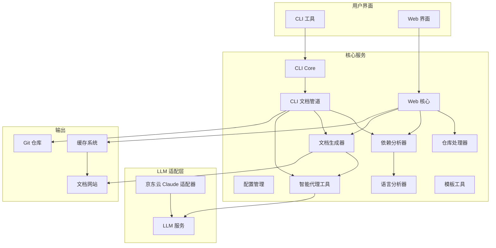

# CodeWiki 仓库概述

## 仓库目的

CodeWiki 是一个基于大语言模型（LLM）的代码文档自动生成与可视化平台。它通过分析代码仓库的依赖关系、模块结构和调用图，自动生成结构化的文档网站，支持多语言、多平台，并提供 CLI 与 Web 双模式操作。

---

## 端到端架构



---

## 核心模块速览

| 模块 | 路径 | 职责 | 关键组件 |
|------|------|------|----------|
| **CLI Core** | `codewiki/cli` | 命令行入口、配置、Git 集成、日志 | ConfigManager、GitManager、CLILogger |
| **CLI 文档管道** | `codewiki/cli` | 五阶段文档生成（依赖→聚类→生成→HTML→完成） | CLIDocumentationGenerator、ProgressTracker |
| **依赖分析器** | `codewiki/src/be/dependency_analyzer` | 多语言 AST 解析、依赖图、调用图 | DependencyParser、CallGraphAnalyzer |
| **语言分析器** | `codewiki/src/be/dependency_analyzer/analyzers` | Python/JS/TS/Java/C#/C/C++/PHP 支持 | PythonASTAnalyzer、TreeSitter*Analyzer |
| **文档生成器** | `codewiki/src/be/documentation_generator.py` | 自底向上模块文档生成、LLM 协调 | DocumentationGenerator |
| **智能代理工具** | `codewiki/src/be/agent_tools` | AI 代理编排、文件编辑、工具调用 | AgentOrchestrator、str_replace_editor |
| **京东云适配器** | `codewiki/src/be/jdcloud_*` | 京东云 Claude API → OpenAI 格式转换 | JDCloudOpenAIClient、JDCloudCompatibleOpenAIModel |
| **Web 核心** | `codewiki/src/fe` | FastAPI 服务、后台任务、缓存、多平台仓库克隆 | WebRoutes、BackgroundWorker、CacheManager |
| **仓库处理器** | `codewiki/src/fe/repository_processors` | GitHub / Gitee / 京东 Git 统一接口 | RepositoryManager、GitHubProcessor、GiteeProcessor |
| **共享工具** | `codewiki/src/utils.py` | 文件/JSON/文本 I/O 统一封装 | FileManager |

---

## 快速开始

### CLI 模式
```bash
codewiki config set --api-key <KEY> --base-url <URL>
codewiki generate --repo https://github.com/org/repo --output docs
```

### Web 模式
```bash
python -m codewiki.src.fe.main
# 访问 http://127.0.0.1:8000 上传仓库链接即可
```

---

## 更多文档

- [CLI Core 详细文档](cli_core.md)
- [CLI 文档管道](cli_doc_pipeline.md)
- [依赖分析器](be_dependency_analyzer.md)
- [语言分析器](be_language_analyzers.md)
- [文档生成器](be_doc_generator.md)
- [智能代理工具](be_agent_tools.md)
- [京东云适配器](be_jdcloud_adapters.md)
- [Web 核心](fe_web_core.md)
- [仓库处理器](fe_repo_processors.md)
- [共享工具](shared_utils.md)