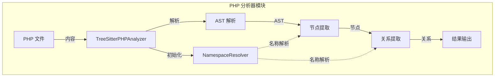
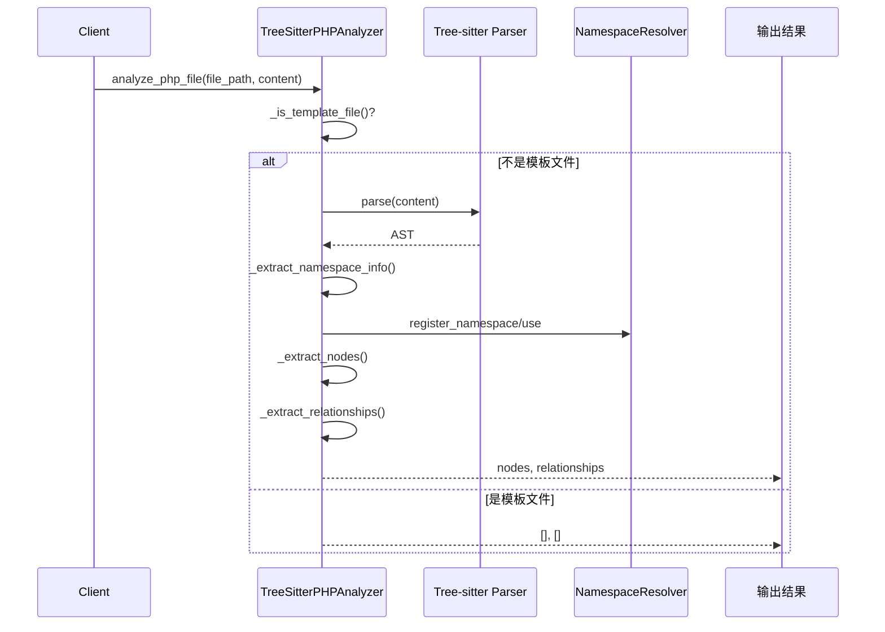
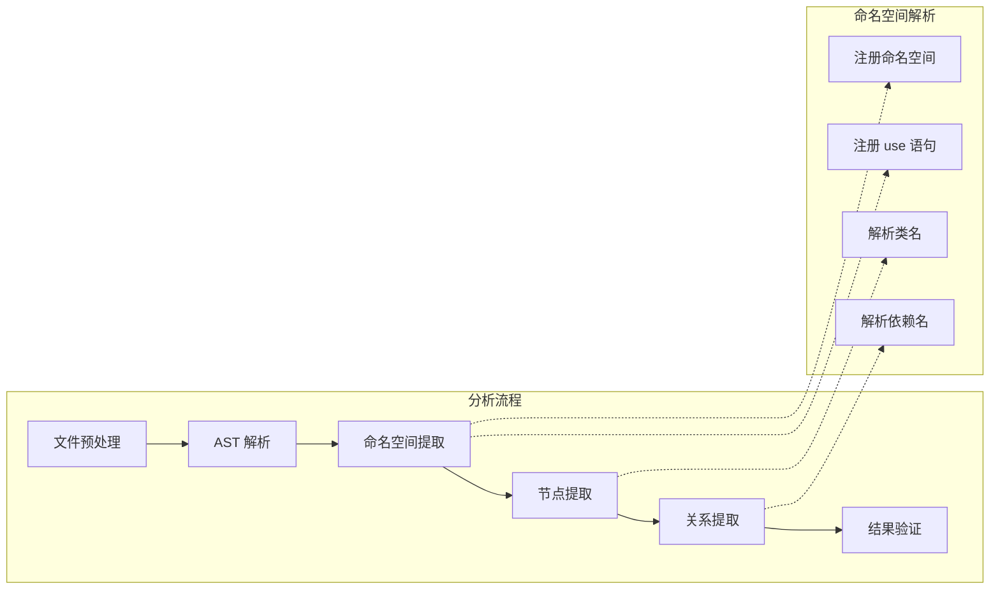
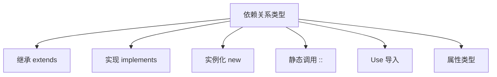
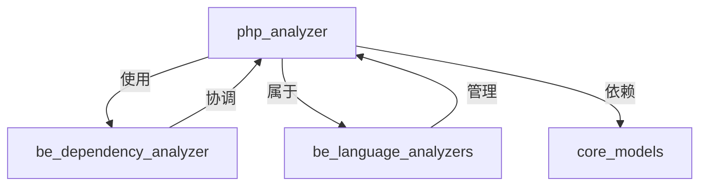

# PHP 分析器模块文档

## 概述

PHP 分析器模块是 CodeWiki 依赖分析系统中的一个重要组件，专门用于解析 PHP 文件并提取代码结构信息。该模块基于 tree-sitter-php 解析器，能够识别 PHP 文件中的类、接口、特征、枚举、函数和方法，并分析它们之间的依赖关系。

## 核心功能

### 1. 代码结构解析
- **类声明解析**：识别普通类、抽象类及其继承关系
- **接口解析**：提取接口定义及其实现关系
- **特征解析**：识别 PHP 特征（trait）及其使用
- **枚举解析**：支持 PHP 8.1+ 枚举类型
- **函数和方法解析**：提取函数定义和方法声明
- **命名空间处理**：解析命名空间声明和 use 语句

### 2. 依赖关系分析
- **继承关系**：分析类之间的继承关系（extends）
- **接口实现**：识别类对接口的实现（implements）
- **对象创建**：追踪对象实例化（new 关键字）
- **静态调用**：分析静态方法和属性的调用（:: 运算符）
- **Use 语句**：解析导入的类和命名空间
- **属性提升**：支持 PHP 8.0+ 构造函数属性提升

### 3. 智能过滤和优化
- **模板文件过滤**：自动跳过 Blade、Twig 等模板文件
- **内置类型识别**：过滤 PHP 原生类型和常用内置类
- **递归深度控制**：防止栈溢出，设置最大递归深度
- **PHPDoc 提取**：识别和提取文档注释

## 核心组件

### TreeSitterPHPAnalyzer

主要的 PHP 文件分析器，负责解析 PHP 代码并提取节点和关系。

```python
class TreeSitterPHPAnalyzer:
    """使用 tree-sitter 分析 PHP 文件，提取节点和关系。"""
    
    def __init__(self, file_path: str, content: str, repo_path: str = None):
        # 初始化分析器
        
    def _analyze(self):
        # 执行完整的分析流程
        
    def _extract_nodes(self, node, lines, depth=0, parent_class=None):
        # 提取代码节点（类、方法、函数等）
        
    def _extract_relationships(self, node, depth=0):
        # 提取依赖关系
```

#### 主要方法

- **`_analyze()`**: 执行完整的分析流程，包括解析 AST、提取节点和关系
- **`_extract_nodes()`**: 递归提取代码节点，包括类、接口、特征、枚举、函数和方法
- **`_extract_relationships()`**: 分析节点之间的依赖关系
- **`_is_template_file()`**: 判断是否为模板文件，避免分析非业务代码

### NamespaceResolver

命名空间解析器，负责处理 PHP 的命名空间和 use 语句，将类名解析为完全限定名。

```python
class NamespaceResolver:
    """使用 use 语句将 PHP 类名解析为完全限定名。"""
    
    def __init__(self):
        self.current_namespace: str = ""
        self.use_map: Dict[str, str] = {}
        
    def register_namespace(self, ns: str):
        # 注册当前命名空间
        
    def register_use(self, fqn: str, alias: str = None):
        # 注册 use 语句
        
    def resolve(self, name: str) -> str:
        # 解析类名为完全限定形式
```

#### 解析规则

1. **完全限定名**：以 `\` 开头的名称直接返回（去掉前导 `\`）
2. **Use 映射**：检查 use 语句映射表
3. **部分限定名**：检查首部分是否为 use 别名
4. **当前命名空间**： prepend 当前命名空间

## 架构设计

### 系统架构图



### 数据处理流程



### 组件交互图



## 支持的 PHP 特性

### 语言结构
- **类**：普通类、抽象类
- **接口**：接口定义和实现
- **特征**：trait 定义和使用
- **枚举**：PHP 8.1+ 枚举类型
- **函数**：全局函数和类方法
- **命名空间**：namespace 和 use 语句

### 依赖关系类型


### 过滤机制
- **文件过滤**：跳过模板文件（.blade.php, .phtml, .twig.php）
- **目录过滤**：跳过视图和模板目录
- **类型过滤**：排除 PHP 原生类型和内置类
- **深度控制**：防止递归过深导致栈溢出

## 依赖关系

### 内部依赖
- **tree-sitter**: PHP 代码解析引擎
- **tree-sitter-php**: PHP 语法定义
- **codewiki.models.core**: 核心数据模型（Node, CallRelationship）

### 外部依赖
- **pathlib**: 文件路径处理
- **logging**: 日志记录

### 模块关系


## 使用示例

### 基本用法

```python
from codewiki.src.be.dependency_analyzer.analyzers.php import analyze_php_file

# 分析 PHP 文件
file_path = "/path/to/file.php"
with open(file_path, 'r', encoding='utf-8') as f:
    content = f.read()

nodes, relationships = analyze_php_file(file_path, content, repo_path="/path/to/repo")

# 处理结果
for node in nodes:
    print(f"找到 {node.component_type}: {node.name}")
    
for rel in relationships:
    print(f"依赖: {rel.caller} -> {rel.callee}")
```

### 高级配置

```python
# 自定义 PHP 原生类型
PHP_PRIMITIVES = {
    "string", "int", "float", "bool", "array", "object",
    "callable", "iterable", "mixed", "void", "null",
    # 添加自定义类型
    "MyCustomType", "AnotherType"
}

# 自定义模板模式
TEMPLATE_PATTERNS = {
    ".blade.php", ".phtml", ".twig.php",
    ".custom.php"  # 添加自定义模板扩展名
}
```

## 错误处理

### 异常情况
- **递归深度超限**：自动截断并记录警告
- **解析错误**：记录错误日志并返回空结果
- **文件编码问题**：使用 UTF-8 编码处理
- **模板文件**：自动跳过，不进行分析

### 日志记录
```python
import logging

# 配置日志级别
logging.basicConfig(level=logging.DEBUG)
logger = logging.getLogger(__name__)

# 分析过程中的日志
logger.debug(f"跳过模板文件: {file_path}")
logger.warning(f"最大递归深度超出: {file_path}")
logger.error(f"解析 PHP 文件错误: {e}")
```

## 性能优化

### 内存管理
- **流式处理**：逐行处理大文件，避免内存溢出
- **及时清理**：分析完成后释放临时数据
- **缓存机制**：复用命名空间解析器

### 速度优化
- **提前过滤**：在解析前过滤模板文件
- **并行处理**：支持多文件并行分析
- **增量更新**：只分析变更的文件

## 扩展性

### 添加新的语言特性
1. 更新 AST 节点类型映射
2. 添加新的关系提取逻辑
3. 扩展过滤规则

### 自定义分析规则
```python
class CustomPHPAnalyzer(TreeSitterPHPAnalyzer):
    def _extract_custom_relationships(self, node):
        # 添加自定义关系提取逻辑
        pass
        
    def _is_custom_primitive(self, type_name):
        # 自定义原生类型判断
        return type_name in self.custom_primitives
```

## 相关文档

- [依赖分析器核心模块](be_dependency_analyzer.md) - 了解整体依赖分析架构
- [语言分析器概览](be_language_analyzers.md) - 查看所有支持的语言分析器
- [核心数据模型](core_models.md) - 了解 Node 和 CallRelationship 结构

## 总结

PHP 分析器模块为 CodeWiki 系统提供了强大的 PHP 代码分析能力。通过 tree-sitter 技术，它能够准确解析现代 PHP 代码的各种特性，提取完整的代码结构和依赖关系。模块设计考虑了性能、可扩展性和易用性，是进行 PHP 项目依赖分析的理想工具。

该模块不仅支持传统的 PHP 特性，还紧跟语言发展趋势，支持 PHP 8+ 的新特性如枚举、属性提升等。通过智能的过滤机制和错误处理，确保了分析过程的稳定性和准确性。