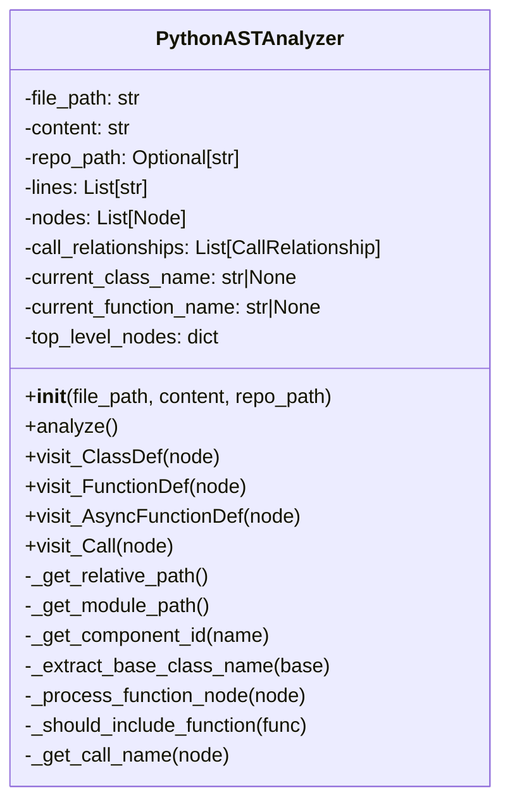
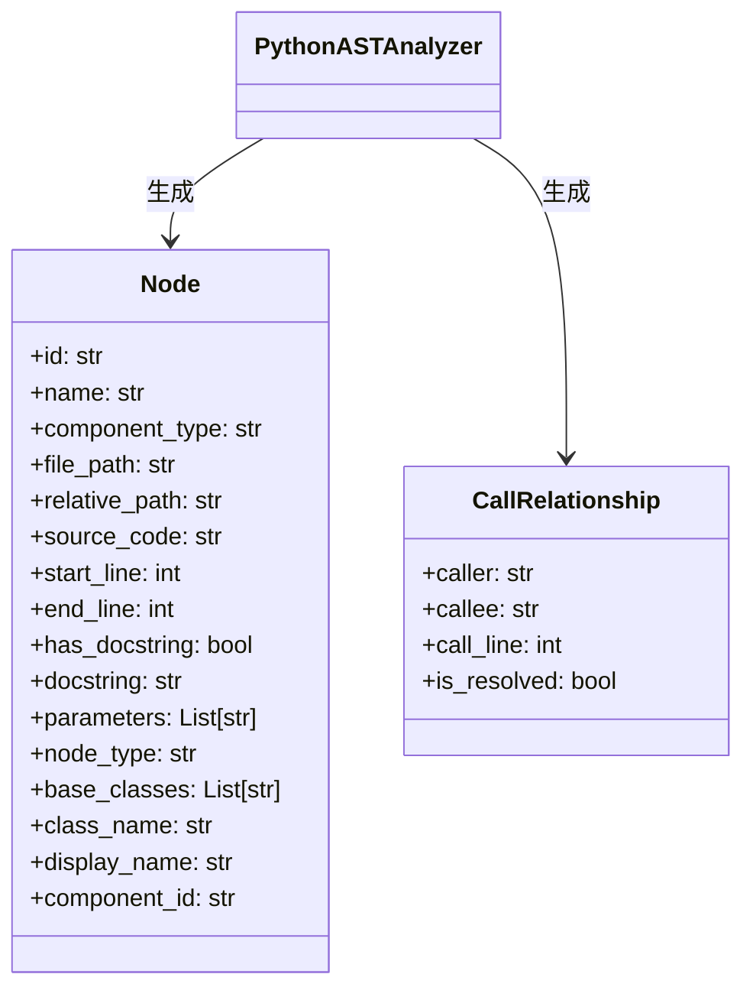
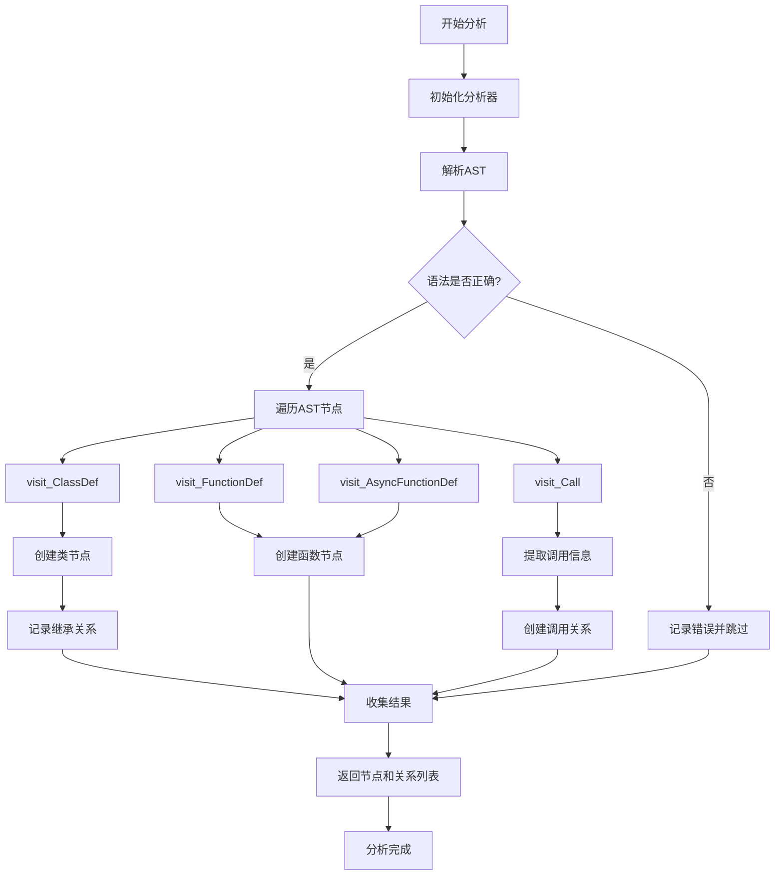
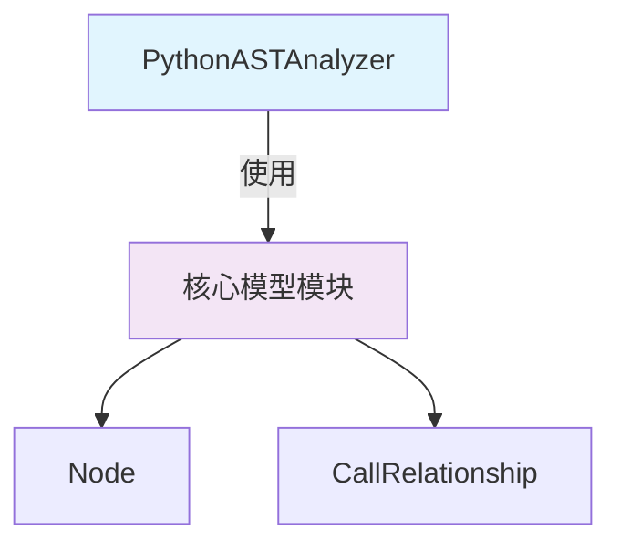
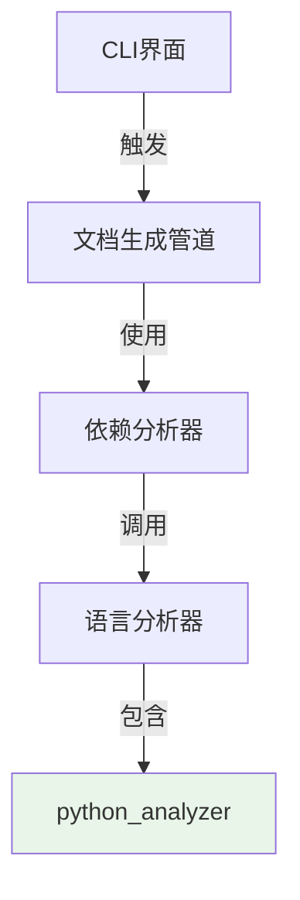

# Python 分析器模块文档

## 概述

Python 分析器模块（`python_analyzer`）是 CodeWiki 系统中负责 Python 代码静态分析的核心组件。该模块通过解析 Python 源代码的抽象语法树（AST），提取代码结构信息，包括类定义、函数定义以及它们之间的调用关系，为代码依赖分析和文档生成提供基础数据。

作为 `be_language_analyzers` 模块的子模块，Python 分析器专门处理 Python 语言的代码分析任务，是整个依赖分析系统的重要组成部分。

## 核心功能

### 1. AST 解析与遍历
- 将 Python 源代码解析为抽象语法树（AST）
- 遍历 AST 节点，提取代码结构信息
- 处理语法警告和错误，确保分析过程的稳定性

### 2. 代码组件识别
- **类定义识别**：提取类的名称、继承关系、文档字符串等信息
- **函数定义识别**：提取函数名称、参数列表、文档字符串等信息
- **方法识别**：识别类内部的方法定义

### 3. 调用关系分析
- 分析函数和类之间的调用关系
- 识别方法调用、函数调用以及继承关系
- 过滤内置函数调用，避免噪声数据

### 4. 代码元数据提取
- 提取源代码片段
- 记录代码位置信息（起始行、结束行）
- 生成组件唯一标识符
- 计算相对路径和模块路径

## 架构设计

### 核心组件结构



### 数据模型关系



### 分析流程图



## 模块依赖关系

### 内部依赖



### 在系统中的位置



## 详细实现

### 类定义处理

当分析器遇到类定义时，会执行以下操作：

1. **提取基础信息**：类名、起始行、结束行
2. **处理继承关系**：解析基类列表，提取基类名称
3. **生成节点信息**：创建包含完整元数据的 Node 对象
4. **记录继承关系**：为每个基类创建调用关系
5. **设置上下文**：更新当前类名，用于后续方法识别

### 函数定义处理

函数定义的处理逻辑：

1. **过滤测试函数**：排除以 `_test_` 开头的函数
2. **提取函数信息**：名称、参数、文档字符串
3. **创建节点**：生成函数类型的 Node 对象
4. **上下文管理**：设置当前函数名，用于调用关系分析

### 调用关系识别

调用关系分析的关键步骤：

1. **提取调用名称**：从 AST 调用节点中提取函数名
2. **过滤内置函数**：排除 Python 内置函数调用
3. **解析属性调用**：处理 `obj.method()` 形式的调用
4. **创建关系**：生成调用者和被调用者之间的关系
5. **解析状态标记**：标记调用关系是否已解析

### 错误处理

分析器包含完善的错误处理机制：

- **语法错误处理**：捕获 `SyntaxError` 并记录警告
- **通用异常处理**：捕获所有异常并记录详细错误信息
- **警告过滤**：抑制语法警告，避免分析过程中的干扰

## 使用示例

### 基本使用

```python
from codewiki.src.be.dependency_analyzer.analyzers.python import analyze_python_file

# 分析 Python 文件
file_path = "example.py"
with open(file_path, 'r', encoding='utf-8') as f:
    content = f.read()

# 执行分析
nodes, relationships = analyze_python_file(file_path, content, repo_path="/path/to/repo")

# 处理结果
for node in nodes:
    print(f"找到 {node.component_type}: {node.name}")
    
for rel in relationships:
    print(f"调用关系: {rel.caller} -> {rel.callee}")
```

### 高级用法

```python
from codewiki.src.be.dependency_analyzer.analyzers.python import PythonASTAnalyzer

# 创建分析器实例
analyzer = PythonASTAnalyzer(
    file_path="module.py",
    content=source_code,
    repo_path="/project/root"
)

# 执行分析
analyzer.analyze()

# 获取分析结果
nodes = analyzer.nodes
relationships = analyzer.call_relationships

# 过滤特定类型的节点
classes = [n for n in nodes if n.component_type == "class"]
functions = [n for n in nodes if n.component_type == "function"]
```

## 性能优化

### 内存管理
- 使用生成器模式处理大型文件
- 及时清理临时数据
- 避免重复解析相同的代码

### 处理速度
- 高效的 AST 遍历算法
- 优化的字符串处理
- 缓存机制避免重复计算

## 扩展性

### 支持新的语言特性
分析器设计考虑了 Python 语言的发展：

- 支持异步函数定义（`async def`）
- 可扩展的节点访问器模式
- 灵活的类型注解处理

### 自定义过滤规则
可以通过继承扩展过滤逻辑：

```python
class CustomPythonAnalyzer(PythonASTAnalyzer):
    def _should_include_function(self, func: Node) -> bool:
        # 自定义函数过滤逻辑
        if func.name.startswith("_private_"):
            return False
        return super()._should_include_function(func)
```

## 相关模块

- [依赖分析器](../be_dependency_analyzer.md) - 使用 Python 分析器进行依赖关系分析
- [核心模型](../be_dependency_analyzer.md#核心模型) - 定义 Node 和 CallRelationship 数据结构
- [其他语言分析器](../be_language_analyzers.md) - 支持其他编程语言的代码分析

## 维护指南

### 常见问题

1. **语法错误导致分析失败**
   - 检查源代码的语法正确性
   - 查看日志中的具体错误信息
   - 考虑使用语法兼容模式

2. **调用关系不完整**
   - 确认被调用的函数在分析范围内
   - 检查跨模块调用的处理
   - 验证模块路径计算是否正确

3. **性能问题**
   - 分析大型文件时考虑分批处理
   - 优化正则表达式和字符串操作
   - 使用缓存避免重复分析

### 更新日志

- **当前版本**：支持 Python 3.x 语法
- **计划更新**：增强类型注解支持、改进错误恢复机制

---

*本模块是 CodeWiki 代码分析系统的核心组件，为代码理解、文档生成和依赖分析提供基础能力。*