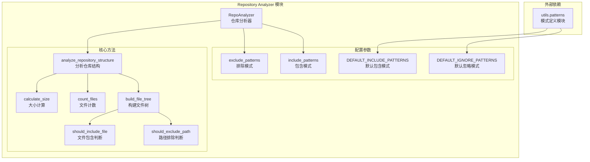
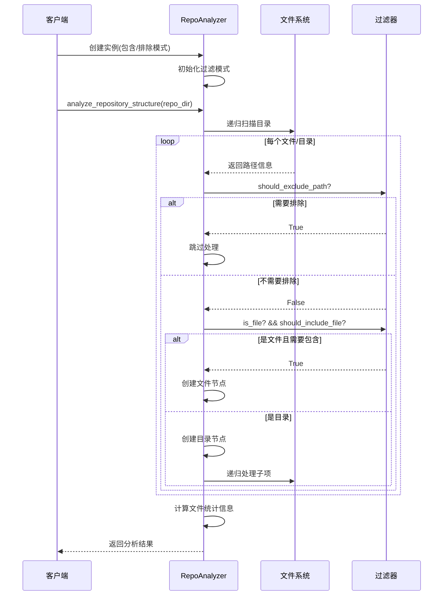
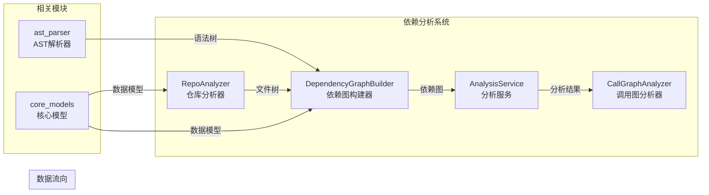

# Repository Analyzer 模块文档

## 概述

Repository Analyzer（仓库分析器）模块是 CodeWiki 后端依赖分析系统的核心组件之一，专门用于分析代码仓库结构并生成详细的文件树表示。该模块提供了强大的文件过滤功能，能够智能识别和处理各种类型的代码文件，为后续的依赖分析和文档生成提供基础数据支持。

## 核心功能

### 主要特性
- **仓库结构分析**：递归扫描整个代码仓库，构建完整的文件树结构
- **智能文件过滤**：支持包含/排除模式匹配，自动过滤无关文件
- **安全路径处理**：检测并拒绝符号链接和逃逸路径，确保系统安全
- **文件统计信息**：提供文件总数和总大小的统计信息
- **多语言支持**：通过文件扩展名识别不同类型的源代码文件

### 安全机制
- **符号链接检测**：自动识别并拒绝处理符号链接文件
- **路径逃逸防护**：防止通过符号链接访问系统外部路径
- **权限错误处理**：优雅处理无权限访问的文件和目录

## 架构设计

### 组件结构图



### 数据流图



## 核心组件详解

### RepoAnalyzer 类

`RepoAnalyzer` 是模块的核心类，负责协调整个仓库分析过程。

#### 构造函数
```python
def __init__(
    self,
    include_patterns: Optional[List[str]] = None,
    exclude_patterns: Optional[List[str]] = None
) -> None
```

**参数说明**：
- `include_patterns`：文件包含模式列表，用于指定需要分析的文件类型
- `exclude_patterns`：文件排除模式列表，用于过滤不需要分析的文件和目录

**默认行为**：
- 如果未提供 `include_patterns`，则分析所有文件类型
- 如果未提供 `exclude_patterns`，则使用预定义的默认忽略模式（如 `.git/`、`__pycache__/` 等）

#### 主要方法

##### analyze_repository_structure
```python
def analyze_repository_structure(self, repo_dir: str) -> Dict
```

**功能**：分析指定仓库的目录结构

**参数**：
- `repo_dir`：仓库根目录路径

**返回值**：包含以下字段的字典：
- `file_tree`：文件树结构（嵌套字典）
- `summary`：统计信息（文件总数、总大小）

##### _build_file_tree
```python
def _build_file_tree(self, repo_dir: str) -> Dict
```

**功能**：递归构建文件树结构（私有方法）

**处理逻辑**：
1. 符号链接检测：拒绝处理符号链接文件
2. 路径逃逸检测：确保所有路径都在仓库根目录内
3. 路径过滤：根据排除模式过滤不需要的路径
4. 文件类型判断：区分文件和目录
5. 递归处理：对目录进行递归扫描

##### _should_exclude_path
```python
def _should_exclude_path(self, path: str, filename: str) -> bool
```

**功能**：判断路径是否应该被排除

**匹配规则**：
- 通配符匹配：支持 `*` 和 `?` 通配符
- 目录匹配：模式以 `/` 结尾时匹配目录
- 路径前缀匹配：检查路径是否以指定模式开头
- 路径组件匹配：检查路径组件是否包含指定模式

##### _should_include_file
```python
def _should_include_file(self, path: str, filename: str) -> bool
```

**功能**：判断文件是否应该被包含

**处理逻辑**：
- 如果没有定义包含模式，则包含所有文件
- 根据路径和文件名进行模式匹配

## 数据模型

### 文件树节点结构

文件树中的每个节点都是一个字典，包含以下字段：

#### 文件节点
```json
{
    "type": "file",
    "name": "文件名",
    "path": "相对路径",
    "extension": ".py",
    "_size_bytes": 1024
}
```

#### 目录节点
```json
{
    "type": "directory",
    "name": "目录名",
    "path": "相对路径",
    "children": [/* 子节点列表 */]
}
```

### 分析结果结构

```json
{
    "file_tree": {/* 文件树结构 */},
    "summary": {
        "total_files": 150,
        "total_size_kb": 2048.5
    }
}
```

## 使用示例

### 基本用法

```python
from codewiki.src.be.dependency_analyzer.analysis.repo_analyzer import RepoAnalyzer

# 创建分析器实例（使用默认配置）
analyzer = RepoAnalyzer()

# 分析仓库结构
result = analyzer.analyze_repository_structure("/path/to/repo")

# 获取文件树
file_tree = result["file_tree"]

# 获取统计信息
summary = result["summary"]
print(f"总文件数: {summary['total_files']}")
print(f"总大小: {summary['total_size_kb']} KB")
```

### 自定义过滤模式

```python
# 只分析 Python 文件
analyzer = RepoAnalyzer(
    include_patterns=["*.py"]
)

# 排除测试文件和文档
analyzer = RepoAnalyzer(
    exclude_patterns=["test_*", "docs/", "*.md"]
)

# 组合使用
analyzer = RepoAnalyzer(
    include_patterns=["*.py", "*.js", "*.ts"],
    exclude_patterns=["test_", "__pycache__/", ".git/"]
)
```

## 模块依赖关系

### 内部依赖
- [utils.patterns](utils_patterns.md)：提供默认的包含和排除模式定义

### 外部依赖
- `pathlib`：现代路径处理库
- `fnmatch`：Unix shell 风格的通配符匹配
- `os`：操作系统接口
- `json`：JSON 数据处理

### 在系统中的位置



## 性能优化

### 优化策略
1. **惰性加载**：只在需要时访问文件系统
2. **早期过滤**：在路径处理早期进行过滤，减少不必要的文件访问
3. **异常处理**：优雅处理权限错误，避免程序中断
4. **缓存友好**：返回的结构化数据便于上层模块缓存

### 内存管理
- 使用生成器模式处理大型目录结构
- 及时清理不需要的中间结果
- 避免重复计算文件统计信息

## 错误处理

### 异常情况
1. **权限错误**：无权限访问文件或目录时跳过处理
2. **路径不存在**：返回空结构而不是抛出异常
3. **符号链接**：自动检测并拒绝处理
4. **路径逃逸**：防止通过符号链接访问系统外部路径

### 安全考虑
- 所有路径操作都基于 `pathlib.Path`，提供更好的安全性
- 相对路径计算确保不会泄露系统绝对路径信息
- 符号链接检测防止循环引用和路径逃逸攻击

## 扩展性

### 自定义过滤规则
可以通过继承 `RepoAnalyzer` 类并重写过滤方法来实现自定义的过滤逻辑：

```python
class CustomRepoAnalyzer(RepoAnalyzer):
    def _should_exclude_path(self, path: str, filename: str) -> bool:
        # 自定义排除逻辑
        if path.startswith("secret/"):
            return True
        return super()._should_exclude_path(path, filename)
```

### 自定义节点类型
可以通过修改 `_build_file_tree` 方法来添加自定义的节点属性：

```python
def _build_file_tree(self, repo_dir: str) -> Dict:
    # 在原有逻辑基础上添加自定义属性
    if path.is_file():
        return {
            "type": "file",
            "name": path.name,
            "path": relative_path_str,
            "extension": path.suffix,
            "_size_bytes": size,
            "_last_modified": path.stat().st_mtime,  # 添加修改时间
        }
```

## 相关文档

- [dependency_graphs_builder](dependency_graphs_builder.md)：依赖图构建器，使用 RepoAnalyzer 生成的文件树
- [analysis_service](analysis_service.md)：分析服务，协调整个分析流程
- [core_models](core_models.md)：核心数据模型定义
- [utils_patterns](utils_patterns.md)：模式定义工具模块