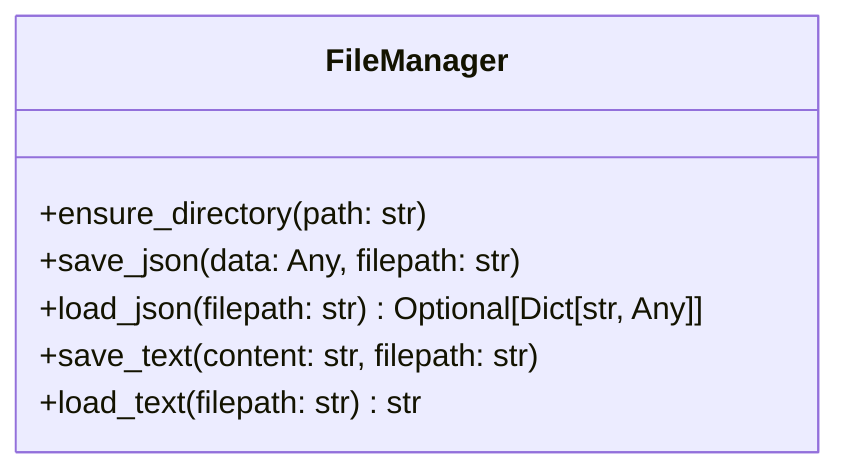
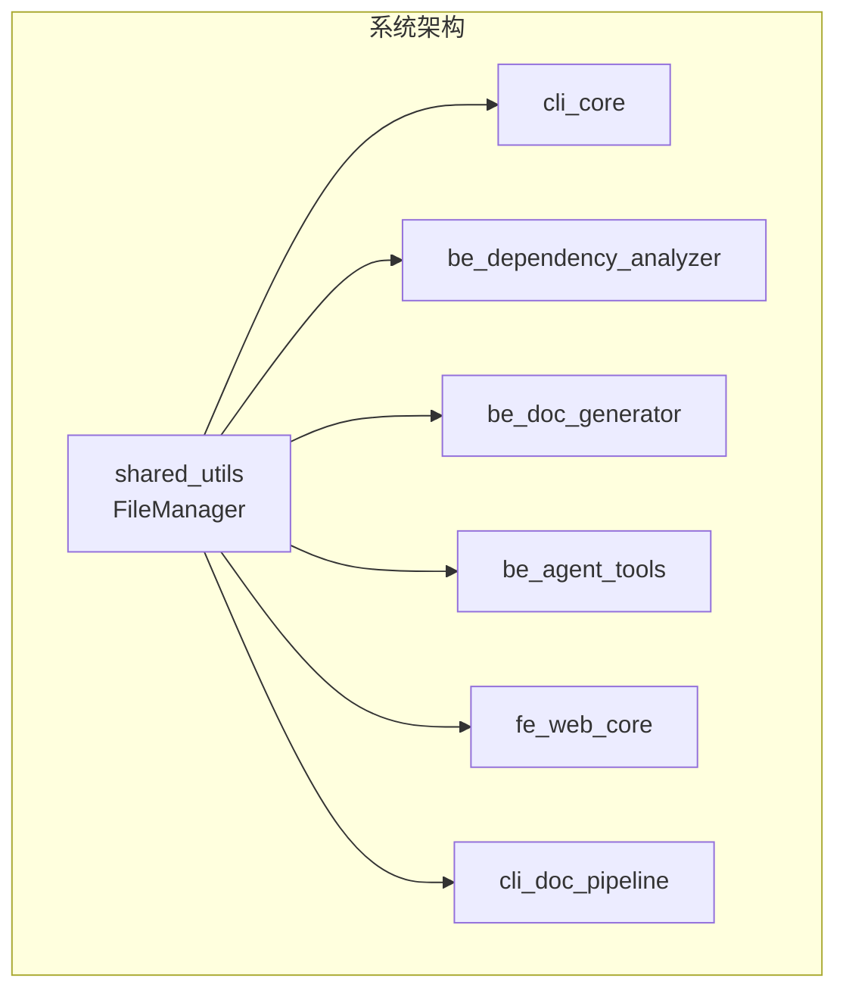
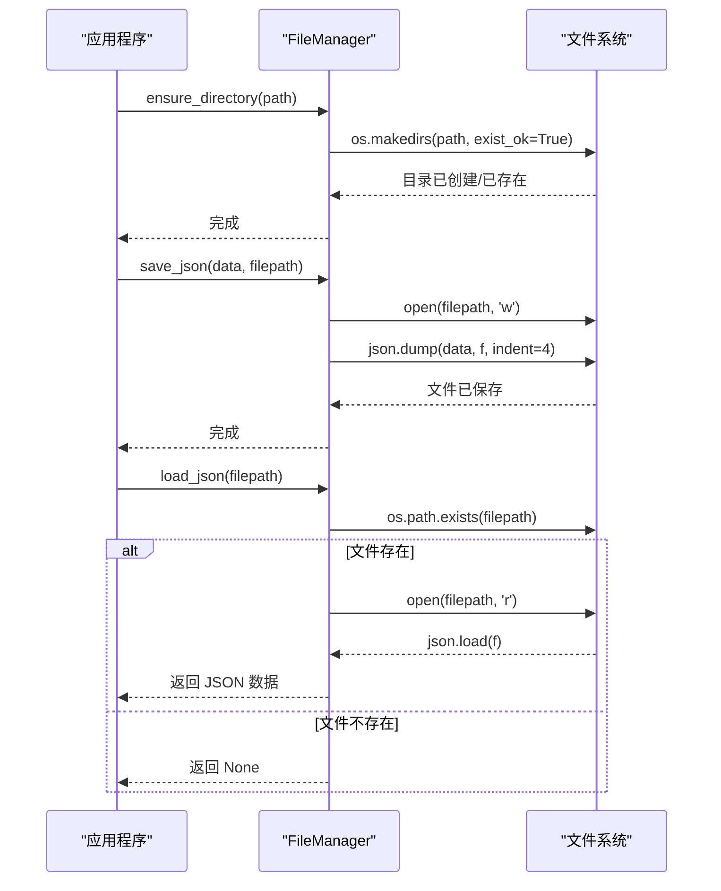

# shared_utils 模块文档

## 概述

`shared_utils` 模块是 CodeWiki 系统的核心工具模块，提供了统一的文件操作管理功能。作为整个系统的基础组件，它为其他所有模块提供了标准化的文件 I/O 操作接口，确保文件处理的一致性和可靠性。

## 核心功能

该模块主要提供以下功能：

- **文件系统操作**：目录创建、文件读写
- **JSON 数据处理**：JSON 文件的保存和加载
- **文本文件处理**：文本内容的读写操作
- **错误处理**：文件不存在时的优雅处理

## 架构设计

### 组件结构



### 模块依赖关系



## 核心组件详解

### FileManager 类

`FileManager` 是一个静态工具类，提供了文件操作的标准化接口。所有方法都是静态方法，无需实例化即可使用。

#### 主要方法

| 方法 | 功能 | 参数 | 返回值 |
|------|------|------|--------|
| `ensure_directory` | 确保目录存在 | `path: str` - 目录路径 | 无 |
| `save_json` | 保存 JSON 数据 | `data: Any` - 要保存的数据<br>`filepath: str` - 文件路径 | 无 |
| `load_json` | 加载 JSON 文件 | `filepath: str` - 文件路径 | `Optional[Dict[str, Any]]` - JSON 数据或 None |
| `save_text` | 保存文本内容 | `content: str` - 文本内容<br>`filepath: str` - 文件路径 | 无 |
| `load_text` | 加载文本文件 | `filepath: str` - 文件路径 | `str` - 文件内容 |

#### 使用示例

```python
from codewiki.src.utils import FileManager

# 创建目录
FileManager.ensure_directory("/path/to/directory")

# 保存 JSON 数据
data = {"key": "value", "number": 42}
FileManager.save_json(data, "/path/to/file.json")

# 加载 JSON 数据
loaded_data = FileManager.load_json("/path/to/file.json")
if loaded_data is not None:
    print(f"加载的数据: {loaded_data}")

# 保存文本文件
FileManager.save_text("Hello, World!", "/path/to/file.txt")

# 加载文本文件
text_content = FileManager.load_text("/path/to/file.txt")
print(f"文本内容: {text_content}")
```

## 数据流图



## 错误处理策略

`FileManager` 实现了以下错误处理机制：

1. **文件不存在处理**：`load_json` 方法在文件不存在时返回 `None`，而不是抛出异常
2. **目录创建**：`ensure_directory` 使用 `exist_ok=True` 参数，避免目录已存在时的错误
3. **文件读写**：基本的文件操作错误会抛出标准 Python 异常

## 全局实例

模块提供了一个全局的 `FileManager` 实例：

```python
file_manager = FileManager()
```

这个实例可以直接使用，但由于所有方法都是静态方法，通常直接使用类名调用方法更为常见。

## 与其他模块的集成

`shared_utils` 模块作为基础工具模块，被系统其他所有模块广泛使用：

- **[cli_core](cli_core.md)**：用于配置文件和 Git 仓库信息的持久化
- **[be_dependency_analyzer](be_dependency_analyzer.md)**：用于分析结果的保存和加载
- **[be_doc_generator](be_doc_generator.md)**：用于生成的文档文件的保存
- **[be_agent_tools](be_agent_tools.md)**：用于代理工具的文件操作
- **[fe_web_core](fe_web_core.md)**：用于 Web 应用的缓存和配置管理
- **[cli_doc_pipeline](cli_doc_pipeline.md)**：用于文档生成过程中的文件处理

## 最佳实践

1. **统一文件操作**：始终使用 `FileManager` 进行文件操作，确保一致性
2. **错误处理**：利用 `load_json` 的 None 返回值进行优雅的错误处理
3. **路径管理**：在保存文件前先使用 `ensure_directory` 确保目录存在
4. **JSON 格式化**：使用 `indent=4` 参数确保 JSON 文件的可读性

## 扩展性

`FileManager` 的设计允许轻松扩展新的文件操作功能。如果需要添加新的文件格式支持或特殊处理逻辑，可以通过添加新的静态方法来实现，而不会影响到现有的功能。

## 总结

`shared_utils` 模块虽然功能相对简单，但它是整个 CodeWiki 系统的基础支撑组件。通过提供标准化的文件操作接口，它确保了系统各模块之间的文件处理一致性，为系统的稳定运行提供了重要保障。